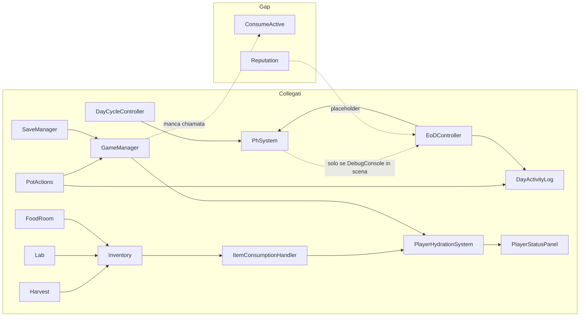

# Analisi comunicazione sistemi GAME — Main repo e DEV REPORT

Ho analizzato la repo main, i documenti di analisi (ANALISI_SISTEMI_GDD_vs_REPO, DISCREPANZE_GDD_42, ANALISI_SISTEMI_PIANTE_GDD40), i DEV REPORT (inclusi 0050 Laboratorio, 0055 EoD, 0058 Toast/ Food Panel) e il codice di integrazione. Di seguito il quadro **sistemi che si passano dati** vs **gap/placeholder**.

---

## 1. Architettura e registro servizi

- **GamePlayInstaller** ([GamePlayInstaller.cs](Assets/_Project/Scripts/Core/Installers/GamePlayInstaller.cs)) registra: `UINotification`, `DayCycleSystem`, `GoalCheckers`, `DiaryStatistics`, `DayActivityLog`, `WikiUnlockService`, `NightEventsGenerator`, `PotNotifications`, `ToastNotificationManager`, `FoundationNotificationService` (opzionale), `MissionManager`, `AssetManager`, `SaveManager`.
- **GameManager** ([GameManager.cs](Assets/_Project/Scripts/Core/GameManager.cs)) crea e (se non già presenti) registra: `ActionSystem`, `EconomySystem`, `CondensationSystem`, `DeteriorationSystem`, **PlayerHydrationSystem**, **FoodRoomSystem**, **ItemConsumptionHandler**. Si abbona a `DayCycleSystem.OnDayChanged` per `HandleDayChanged` (consumo idratazione giornaliero, modificatore azioni).
- **PhSystem** non è registrato in GamePlayInstaller; viene registrato da **PhSystemDebugConsole** (o dalla scena che ha **PhSystemAutoSetup**). I consumer usano `ServiceContainer.Instance?.Get<PhSystem>(suppressWarning: true)` e gestiscono il caso null.

---

## 2. Flussi che funzionano (dati reali)

| Da                                                    | A                                                                                               | Mezzo                                                                                         | Note                                                                                                                                                                |
| ----------------------------------------------------- | ----------------------------------------------------------------------------------------------- | --------------------------------------------------------------------------------------------- | ------------------------------------------------------------------------------------------------------------------------------------------------------------------- |
| **PotSystem / DayCycleController**                    | PhSystem                                                                                        | `RegisterPlantDrift()` a fine giorno                                                          | Drift pH da piante → pH globale ([INTEGRAZIONE_PH_SISTEMA_CRESCITA.md](Assets/Docs/REPORT/INTEGRAZIONE_PH_SISTEMA_CRESCITA.md))                                     |
| **PotActions**                                        | GameManager                                                                                     | `TrySpendAction`, `TrySpendCry`                                                               | Azioni e CRY consumati correttamente                                                                                                                                |
| **PotActions**                                        | DayActivityLog                                                                                  | `RecordWateringToggle`, `RecordHarvest`, `RecordDomeAction`                                   | Snapshot/Diario EoD hanno dati irrigazione e harvest                                                                                                                |
| **Harvest (PotSlot)**                                 | Inventory + Toast                                                                               | `Inventory.Add` + `PostAddedToInventory`                                                      | Frutti in inventario e notifica                                                                                                                                     |
| **Lab (Extractor, Catalizzatore, Fusion, Incubator)** | Inventory + Toast + DayActivityLog                                                              | Add + `PostAddedToInventory` + `RecordLabAction`                                              | Output in inventario e traccia per EoD ([DEV REPORT_0050](Assets/Docs/REPORT/DEV REPORT_0050_LABORATORIO_COMPLETO.txt))                                             |
| **FoodRoomSystem**                                    | Inventory + Toast                                                                               | Add + `PostAddedToInventory`                                                                  | Acqua/cibo in inventario. **Design intenzionale:** il player sceglie quando bere/mangiare dall’inventario; l’idratazione si aggiorna solo al consumo (Bevi/Mangia). |
| **Inventory (consumo)**                               | PlayerHydrationSystem                                                                           | `ConsumeItem` → `OnItemConsumed` → **ItemConsumptionHandler** → `RecoverFromWater/Food/Fruit` | Bevendo/mangiando dall’inventario l’idratazione sale                                                                                                                |
| **GameManager End Day**                               | PlayerHydrationSystem                                                                           | `ProcessDailyConsumption()` + `GetActionModifier()`                                           | Consumo passivo e modificatore azioni giorno successivo                                                                                                             |
| **PlayerStatusPanelController**                       | PlayerHydrationSystem                                                                           | `TryConnectHydrationSystem()` → `OnHydrationChanged`                                          | Barra idratazione usa dati reali se GameManager presente                                                                                                            |
| **SaveManager**                                       | GameManager / Inventory / Hydration                                                             | Save/Load                                                                                     | CRY, inventario, idratazione, vasi, stem cell, ecc.                                                                                                                 |
| **Condensation**                                      | GameManager                                                                                     | `CollectCondensation()` da HUDCondensation / TopBarController                                 | Reward WAT-RAW e reset condensazione                                                                                                                                |
| **EndOfDaySequenceController**                        | DayActivityLog, PhSystem, DiaryStatistics, GameManager, NightEventsGenerator, WikiUnlockService | ServiceContainer.Get                                                                          | Snapshot, Diario, Forecast, Dawn usano dati reali ([end_of_day_sequence_logic.plan.md](.cursor/plans/end_of_day_sequence_logic.plan.md))                            |

Quindi: **Dome/Pot, pH (drift), Harvest, Lab, Food Room (inventario), Inventario→Idratazione, EoD, Save/Load, Condensation, barra idratazione** sono collegati e usano dati di gioco, non placeholder generici.

---

## 3. Gap: sistemi che non si passano dati (o usano ancora placeholder)

### 3.1 Idratazione: consumo per azione non collegato

- **PlayerHydrationSystem.ConsumeActive(int actionCount)** esiste e dovrebbe decrementare l’idratazione per ogni azione usata (es. 5% per azione).
- **Nessun punto del codice chiama `ConsumeActive`.**  
`GameManager.TrySpendAction` chiama solo `_actionSystem.SpendAction(amount)`; non notifica il PlayerHydrationSystem.
- **Risultato:** l’idratazione cala solo per consumo passivo a fine giornata; le azioni spese durante il giorno non la riducono. Comportamento incoerente con il GDD (Sezione 13, DISCREPANZE_GDD_42).

**Suggerimento:** in `GameManager.TrySpendAction`, dopo `_actionSystem.SpendAction(amount)`, chiamare  
`_playerHydrationSystem?.ConsumeActive(amount)`.

---

### 3.2 PhSystem non garantito in tutte le build

- PhSystem è registrato solo da **PhSystemDebugConsole** (o da scena con PhSystemAutoSetup), non da GamePlayInstaller.
- Se la scena non ha nessuno dei due, `ServiceContainer.Get<PhSystem>()` restituisce null e tutti i consumer (TopBar, EoD, PotDetailsWidget, DayCycleController, ecc.) lavorano senza pH (valori mancanti o placeholder).
- **Risultato:** in build/scene senza debug/auto-setup il “sistema pH” non è garantito; è un gap di configurazione più che di logica.

**Suggerimento:** registrare PhSystem in **GamePlayInstaller** (o in un bootstrap di scena obbligatorio) così che sia sempre disponibile, indipendentemente dalla presenza della console pH.

---

### 3.3 Reputation

- Nei piani EoD e nei report (es. [DISCREPANZE_GDD_42](Assets/Docs/REPORT/DISCREPANZE_GDD_42_vs_MAIN_REPO_01022026.md)) è indicato che **Reputation** (Custodi, Culto Muffa, ecc.) non è implementata; in EoD si usano **placeholder** (“Reputation: —” / “pending”) dove servirebbero valori reali.
- **Risultato:** Snapshot/Forecast/Drift & Consequences mostrano testo placeholder per la reputazione; nessun sistema passa dati reputazione.

---

### 3.4 Placeholder UI (non bloccanti per i dati)

- **Icone room** in [BottomNavigation.uxml](Assets/_Project/UI/UIToolkit/HUD/BottomNavigation.uxml): classi `icon-placeholder` per visitor, storage, dome, lab, kitchen, dormitory, restricted.
- **Toast “Added to Inventory”**: fallback icona placeholder (Inspector o `Resources/icona_Placeholder`) quando l’item non ha icona ([DEV REPORT_0058](Assets/Docs/REPORT/DEV REPORT_0058.txt)).
- **PlantCardV3 terminal**: label “DETAILED ANALYSIS (TODO)” ([PlantCardV3_Terminal.uxml](Assets/_Project/UI/UIToolkit/PlantCardV3/PlantCardV3_Terminal.uxml)).
- **Food Room**: classe `.stem-cell-placeholder-icon` in USS.
- **NotificationTypeSpecDefaults**: placeholder per tipologie non ancora implementate a call-site.

Questi sono placeholder **visivi/testuali**, non gap di comunicazione tra sistemi.

---

### 3.5 Food Room → Idratazione (flusso indiretto — scelta di design)

- La raccolta di acqua/cibo in Food Room aggiunge item all’inventario e mostra il toast “Added to Inventory”.
- L’idratazione si aggiorna solo quando il giocatore **consuma** l’item dall’inventario (Bevi/Mangia) tramite ItemConsumptionHandler.
- **Scelta di design intenzionale:** il player decide quando bere/mangiare; niente consumo automatico al collect. Flusso: **Food Room → Inventario → (giocatore consuma) → ItemConsumptionHandler → PlayerHydrationSystem**. Non è un gap.

---

## 4. Riepilogo

- **Comunicano correttamente (dati reali):** Dome/Pot, crescita, pH drift, Harvest, Lab (4 macchinari), Food Room (inventario), inventario ↔ consumo ↔ idratazione (Bevi/Mangia — il player sceglie quando bere), fine giornata (idratazione + modificatore azioni), EoD (DayActivityLog, pH, statistiche, forecast), Save/Load, condensazione, barra idratazione (se GameManager presente).
- **Gap reali (dati non passati / placeholder di sistema):**
  1. **ConsumeActive mai chiamato** → le azioni spese non diminuiscono l’idratazione.
  2. **PhSystem non registrato in installer** → in scene/build senza PhSystemDebugConsole/PhSystemAutoSetup il pH può essere assente (valori/placeholder).
  3. **Reputation** → solo placeholder in EoD; nessun sistema fornisce dati reputazione.
- **Placeholder solo UI:** icone room, icona toast fallback, “DETAILED ANALYSIS (TODO)” PlantCard, stem-cell icon, tipi notifica non ancora usati.

---

## 5. Diagramma sintetico (Mermaid)

In sintesi: la maggior parte dei sistemi in GAME **si passano dati**; restano da collegare **ConsumeActive** all’uso delle azioni, **PhSystem** all’avvio garantito (installer/bootstrap), e in futuro un **sistema Reputation** per sostituire i placeholder in EoD.