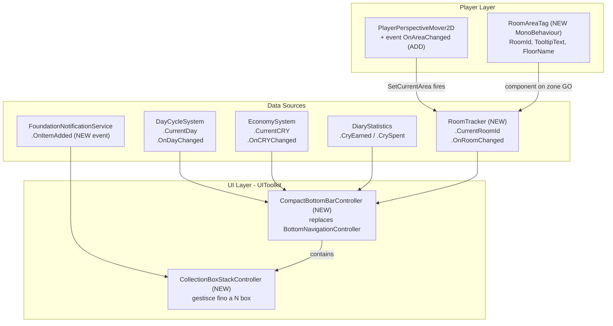

# CompactBottomBar — Piano completo

## Architettura generale




---

## File da creare


| File                                                                       | Ruolo                                       |
| -------------------------------------------------------------------------- | ------------------------------------------- |
| `Assets/_Project/UI/UIToolkit/HUD/CompactBottomBar.uxml`                   | Layout barra 42px, 3 zone                   |
| `Assets/_Project/UI/UIToolkit/HUD/CompactBottomBar.uss`                    | Stili pixel/retro, colori dal design system |
| `Assets/_Project/Scripts/UI/UIToolkit/HUD/CompactBottomBarController.cs`   | Controller principale                       |
| `Assets/_Project/Scripts/World/VaultMap/RoomAreaTag.cs`                    | MonoBehaviour su ogni zone GO               |
| `Assets/_Project/Scripts/Core/RoomTracker.cs`                              | Servizio registrato in `ServiceContainer`   |
| `Assets/_Project/UI/UIToolkit/HUD/CollectionBox.uxml/.uss`                 | Singolo box (icona + badge quantità)        |
| `Assets/_Project/UI/UIToolkit/HUD/CollectionDetail.uxml/.uss`              | Scheda dettaglio item                       |
| `Assets/_Project/Scripts/UI/UIToolkit/HUD/CollectionBoxStackController.cs` | Logica stack collection boxes               |


## File da modificare


| File                                                                                                                                                                                             | Modifica                                                                                                                           |
| ------------------------------------------------------------------------------------------------------------------------------------------------------------------------------------------------ | ---------------------------------------------------------------------------------------------------------------------------------- |
| `[Assets/_Project/UI/UIToolkit/HUD/TopBar.uxml](Assets/_Project/UI/UIToolkit/HUD/TopBar.uxml)`                                                                                                   | Rimuove blocco `cry-display` (righe 62–68)                                                                                         |
| `[Assets/_Project/Scripts/UI/UIToolkit/HUD/TopBarController.cs](Assets/_Project/Scripts/UI/UIToolkit/HUD/TopBarController.cs)`                                                                   | Rimuove `_cryValueLabel`, `UpdateCryBalance`, subscription a `OnCRYChanged`                                                        |
| `[Assets/_Project/Scripts/UI/VaultMap/HUDController.cs](Assets/_Project/Scripts/UI/VaultMap/HUDController.cs)`                                                                                   | Rimuove binding `dayText` / `cryText` TMP e relative subscription (le TMP label UGUI diventano opzionali / nullabili senza errore) |
| `[Assets/_Project/Scripts/Player/PlayerPerspectiveMover2D.cs](Assets/_Project/Scripts/Player/PlayerPerspectiveMover2D.cs)`                                                                       | Aggiunge `public event Action<PerspectiveWalkArea2D> OnAreaChanged;` in `SetCurrentArea` (riga 400)                                |
| `[Assets/_Project/Scripts/UI/UIToolkit/NotificationsFoundation/FoundationNotificationService.cs](Assets/_Project/Scripts/UI/UIToolkit/NotificationsFoundation/FoundationNotificationService.cs)` | Aggiunge `public event Action<NotificationPayload> OnItemAdded;` (fired da `PostAddedToInventory`)                                 |


---

## Task 1 — `RoomAreaTag.cs` (nuovo MonoBehaviour)

```csharp
// namespace Sporae.World.VaultMap
public class RoomAreaTag : MonoBehaviour
{
    public string RoomId;        // "dome", "lab", "kitchen", "dormitory", "visitor", "storage", "restricted1", "restricted2"
    public string DisplayName;   // "DOME"
    public string FloorName;     // "Floor -1"
    public string TooltipText;   // testo narrativo da CompactBottomBar.tsx
    public bool IsLocked;
}
```

Da aggiungere come componente sui zone GameObjects in `SCN_VaultMap` (uno per area). Compilare i campi secondo la tabella ID stanze del TS (normalizzare: `bedroom` → `dormitory` ecc.).

---

## Task 2 — `RoomTracker.cs` (nuovo servizio)

- `public string CurrentRoomId { get; private set; }`
- `public event Action<string> OnRoomChanged;`
- In `Awake`: recupera `PlayerPerspectiveMover2D` dalla scena, si iscrive a `OnAreaChanged`
- In callback: cerca `RoomAreaTag` sul GO dell'area, se trovato aggiorna `CurrentRoomId` e invoca `OnRoomChanged`
- Registrato via `ServiceContainer.Instance.Register<RoomTracker>(this)` o in un bootstrap

---

## Task 3 — `CompactBottomBar.uxml` (layout)

Struttura 3 zone, altezza **42px**, seguendo i pattern Foundation (classi `sp-`*, bordo verde `#7FFF7A`):

```
bottom-nav-compact (42px, fixed bottom)
├── pixel-corner × 4
├── scan-line-bar (linea scansione, css animation)
├── zone-left (DAY + CRY)
│   ├── day-badge   → Label "DAY-{n}"
│   └── cry-badge   → Label "{n} CRY" (+ tooltip panel nascosto)
│       └── cry-tooltip-panel (visibile on hover)
├── zone-center (8 room icons)
│   └── room-btn × 8 (28×28) + tooltip panel × 8
└── zone-right (Options | Save | Exit + collection stack)
    ├── btn-options (Settings icon)
    ├── btn-save    (Save icon)
    ├── btn-exit    (Power icon)
    └── collection-box-stack (VisualElement container)
```

Tooltip CRY — dati da bindare in controller:

- `cry-balance-value` → `EconomySystem.CurrentCRY` (real)
- `cry-earned-today` → `DiaryStatistics.CryEarned` (real)
- `cry-spent-today` → `DiaryStatistics.CrySpent` (real)
- `cry-net-today` → `CryEarned - CrySpent` (calcolato, real)
- `cry-breakdown-*` → sezioni PLH hardcoded ("–PLH CRY" come testo placeholder)
- `cry-forecast-*` → sezioni PLH hardcoded

---

## Task 4 — `CompactBottomBarController.cs` (nuovo, sostituisce `BottomNavigationController`)

Dipendenze risolte via `ServiceContainer` o `[SerializeField]`:

- `DayCycleSystem` → `ServiceContainer.Instance.Get<DayCycleSystem>()`
- `EconomySystem` → `_gameManager.EconomySystem` (pattern di `TopBarController`)
- `DiaryStatistics` → `ServiceContainer.Instance.Get<DiaryStatistics>()`
- `RoomTracker` → `ServiceContainer.Instance.Get<RoomTracker>()` (registrato in `GamePlayInstaller`)
- `AppRoot` → `[SerializeField] private AppRoot _appRoot;`
- `OptionsPopupController` → `[SerializeField] private OptionsPopupController _optionsController;` **(nullable — PLH)**

> **NOTA**: `MainMenuScreens` non esiste in `SCN_VaultMap`. Non è accessibile da in-game. Non usare `MainMenuScreens` in questo controller.

Logica principale:

- **DAY**: subscribe `OnDayChanged`, aggiorna label `day-badge`
- **CRY**: subscribe `OnCRYChanged`, aggiorna label `cry-badge` + valori tooltip
- **Room icons**: subscribe `RoomTracker.OnRoomChanged`, rimuove/aggiunge classe `room-active` sull'icona corrispondente; stato `room-locked` basato su `RoomAreaTag.IsLocked`
- **Tooltip stanze**: hover su `room-btn-{id}` mostra/nasconde tooltip (DisplayName, FloorName, TooltipText da `RoomAreaTag`)
- **Options**: se `_optionsController != null` → `_optionsController.gameObject.SetActive(true)`; altrimenti Foundation toast `"OPTIONS — PLH"`. Nessun `MainMenuScreens`.
- **Save**: `ServiceContainer.Instance.Get<SaveManager>().SaveGame("default")` — quick save diretto
- **Exit**: `_appRoot.QuitApplication()`

---

## Task 5 — Sistema Collection Boxes

### `FoundationNotificationService.cs` — modifica minima

```csharp
public event Action<NotificationPayload> OnItemAdded;

public void PostAddedToInventory(string itemTypeId, ...)
{
    // ... codice esistente ...
    OnItemAdded?.Invoke(payload);   // ← aggiungere DOPO PostToastImmediate
}
```

### `CollectionBoxData` (struct, nel file Controller)

```csharp
public struct CollectionBoxData
{
    public string ItemTypeId;
    public string ItemDisplayName;
    public int Quantity;
    public string RoomDisplayName;
    public Sprite Icon;           // risolto via NotificationItemIconResolver
    public float CollectedAt;     // Time.realtimeSinceStartup
}
```

### `CollectionBoxStackController.cs`

- Subscribe a `FoundationNotificationService.OnItemAdded` (accesso via `FoundationNotificationServiceAccessor.Get`)
- Per ogni payload ricevuto: istanzia `CollectionBox.uxml` nel container `collection-box-stack`
- Max 5 box visibili (la sesta sostituisce la più vecchia)
- Ogni box:
  - **Click sinistro** → apre `CollectionDetail` panel, lo popola con `CollectionBoxData`
  - **Click destro** → rimuove il box (dismiss)
  - Il box **non** scompare da solo (nessun timer)

### `CollectionBox.uxml/.uss`

- Dimensioni 44×44px, border viola `#B580D1` (colore Collection del TS)
- `icon-image` (background-image da `CollectionBoxData.Icon`)
- `quantity-badge` (label in basso a destra)
- PixelCorners

### `CollectionDetail.uxml/.uss`

- Panel posizionato assoluto sopra `zone-right`, width ~280px
- Campi:
  - `detail-icon` (immagine item, reale)
  - `detail-name` (ItemDisplayName, reale)
  - `detail-qty` (Quantity, reale)
  - `detail-room` (RoomDisplayName, reale)
  - `detail-typeid` (ItemTypeId, reale — visibile come codice)
  - `detail-quality` → `"PLH"` (Quality non disponibile in NotificationPayload)
  - `detail-genetics` → `"PLH"` (dati genetici non disponibili nel payload)
- Chiusura: click destro sul panel o tasto ESC

---

## Task 6 — TopBar: rimozione CRY

- `[TopBar.uxml](Assets/_Project/UI/UIToolkit/HUD/TopBar.uxml)`: elimina `<ui:VisualElement name="cry-display" ...>` (righe 62–68)
- `[TopBarController.cs](Assets/_Project/Scripts/UI/UIToolkit/HUD/TopBarController.cs)`: rimuove `_cryValueLabel` (riga 68), `UpdateCryBalance` (righe 1480–1487), subscription `_economySystem.OnCRYChanged` (riga 197)

---

## Task 7 — UGUI HUDController: rimozione DAY / CRY TMP

- `[HUDController.cs](Assets/_Project/Scripts/UI/VaultMap/HUDController.cs)`: rende `dayText` e `cryText` non obbligatori in `ValidateUIReferences` (null-guard senza errore), rimuove subscription a `OnDayChanged` per il day label TMP. Le label TMP possono restare null in scena senza che il componente si disabiliti.

---

## Task 8 — Scena `SCN_VaultMap`

- `HUD_BottomNavigation` GO: sostituire `UIDocument.SourceAsset` con `CompactBottomBar.uxml`, sostituire script component `BottomNavigationController` con `CompactBottomBarController`
- Su ogni room zone GO: aggiungere `RoomAreaTag` con i campi compilati
- Registrare `RoomTracker` in `GamePlayInstaller.Awake()` (stesso blocco di `DiaryStatistics`, riga ~56)
- Assegnare `AppRoot` (e facoltativamente `OptionsPopupController` se presente) nei campi serializzati di `CompactBottomBarController`

---

## Nota sui PLH

I seguenti dati appaiono nel tooltip CRY ma **non hanno ancora un modello dati in repo**:

- Dettaglio giornaliero per categoria (manutenzione Dome, vendite piante, acquisti reagenti, tassa Black Market) → label con suffisso `PLH`
- Previsione guadagni domani → sezione `PLH`

Quando i sistemi economici esporranno queste voci, si potrà rimuovere il suffisso PLH e bindare il dato reale senza modificare il layout.