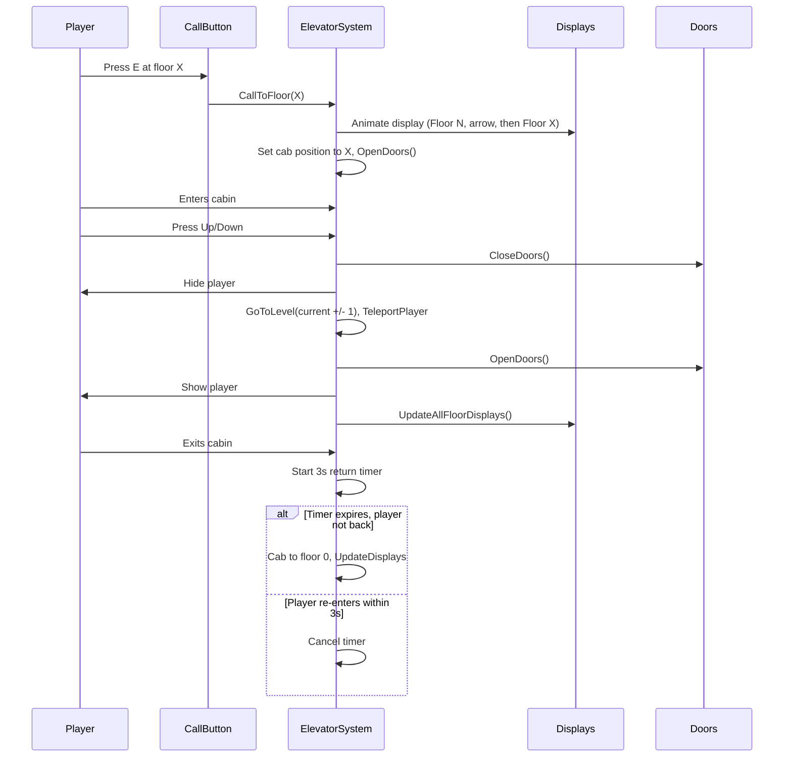

# Piano: Ascensore – Chiamata, porte, display e UX (aggiornato)

## Stato attuale (analisi)

### Architettura

- **Un solo trigger** ([ELEV_UseZone](Assets/_Project/Scenes/SCN_VaultMap.unity)): BoxCollider2D verticale (altezza ~20.88) che copre tutto lo shaft.
- **Un solo GameObject cabina** ([ElevatorRoom](Assets/_Project/Scenes/SCN_VaultMap.unity) = `elevatorSection`): un solo SpriteRenderer (sprite `Elevator.png`), nessun figlio.
- **Livelli**: ELEV_Levels con 4 Transform: LVL_+1, LVL_0, LVL_-1, LVL_-2.
- **UI**: UI_ElevatorPanel con 4 pulsanti e Su/Giù per scegliere piano → **da rimuovere**.

### Riuso vs rimozione / rifacimento (riferimento: [SceneHierarchy.txt](Assets/_Project/Docs/SceneHierarchy.txt), [ElevatorSystem.cs](Assets/_Project/Scripts/World/Elevator/ElevatorSystem.cs))

**Da riusare (mantenere e adattare)**

| Elemento | Dove | Uso nel nuovo sistema |
|---------|------|------------------------|
| **ELEV_Elevator** (root) | Scena – gerarchia sotto Canvas / world | Resta root: figli ELEV_Levels, ELEV_UseZone, ElevatorRoom. Aggiungere sotto: trigger “inside cabin”, e sotto ElevatorRoom i due portelloni. |
| **ELEV_Levels** + **LVL_+1, LVL_0, LVL_-1, LVL_-2** | Scena | Restano: sono i Transform di riferimento per le Y dei piani. `ElevatorSystem.levels[]` e `SetLevel()` continuano a usare questi. |
| **ELEV_UseZone** (BoxCollider2D + ElevatorSystem) | Scena | Resta: può servire come zona “vicino allo shaft” o solo come GameObject che tiene lo script. Il **componente ElevatorSystem** resta qui; si rimuovono i riferimenti a UI e si aggiungono display, porte, CallToFloor, timer, inside cabin. |
| **ElevatorRoom** (elevatorSection) | Scena | Resta come GameObject cabina (Transform + oggi un SpriteRenderer). **Modificare**: aggiungere figli PortelloneSx, PortelloneDx (e opz. trigger “inside cabin” come figlio). Lo SpriteRenderer attuale della cabina può restare come “interno” o essere sostituito/rimosso a seconda dell’arte. |
| **ElevatorSystem.cs** – nucleo | Script | **Riusare**: `levels[]`, `elevatorSection`, `currentLevelIndex`, `SetLevel()`, `WrapIndex()`, `ValidateConfiguration()`, riferimento `player`, `playerMover`, `gameManager` (per cryCost se si mantiene), `TeleportPlayer` (per viaggio **con** player dentro), `GoToLevel()` (solo da inside cabin, un piano per volta), `CanTeleportToLevel()` / `IsLevelUnlocked()`. |
| **SetLevel(int)** | ElevatorSystem | Resta e resta usato da [PlayerEndDayHandler](Assets/_Project/Scripts/Player/PlayerEndDayHandler.cs) (EndDay → spawn → SetLevel su [PlayerSpawnPoint](Assets/_Project/Scripts/Player/PlayerSpawnPoint.cs) elevatorLevel). Non toccare la firma pubblica. |
| **TeleportPlayer** (coroutine) | ElevatorSystem | Riusare per il **viaggio con player dentro** (cabina + player in Y, poi teleport finale). Va adattata: non usare più `ShowFloorOptions` / `DisableAllFloorOptions`; alla fine chiamare `OpenDoors()`, `UpdateAllFloorDisplays()`, mostrare player. |
| **useTargetLevelXForTeleport**, **maxTeleportXCorrection** | ElevatorSystem | Restano: utili per il teleport a destinazione. |
| **elevatorSpeed**, **teleportDelay** | ElevatorSystem | Restano per l’animazione del viaggio quando il player è dentro. |

**Da rimuovere (non più usati nel nuovo design)**

| Elemento | Dove | Motivo |
|----------|------|--------|
| **UI_ElevatorPanel** (intero GameObject) | Scena – sotto **Canvas** | Nessuna UI piani: feedback solo dai display fissi. Disattivare definitivamente o rimuovere dalla scena. |
| **Button Group** + **BTN_LVL_+1, BTN_LVL_0, BTN_LVL_-1, BTN_LVL_-2** | Figli di UI_ElevatorPanel | Sostituiti da Su/Giù dentro cabina; rimossi con il pannello. |
| **levelsButtons** (List&lt;Button&gt;) | ElevatorSystem | Riferimento ai 4 pulsanti UI; rimuovere campo e ogni uso. |
| **uiPanel** (GameObject) | ElevatorSystem | Riferimento a UI_ElevatorPanel; rimuovere campo e ogni uso. |
| **ShowFloorOptions(bool)** | ElevatorSystem | Rimuovere metodo. |
| **UpdateAvailablesFloorOptions()**, **DisableAllFloorOptions()** | ElevatorSystem | Rimuovere metodi (legati ai pulsanti UI). |
| **openMenuOnTriggerEnter**, **openMenuKey**, **showInteractAdviceWhileInside** | ElevatorSystem | Nessun menu ascensore; “Press E” solo sui call button. Rimuovere campi e logica in Update/OnTrigger che aprono menu o mostrano interact advice per l’ascensore. |
| **interactAdvice** (PlayerInteractAdvice) | ElevatorSystem | Usato solo per il prompt “Press E” nel trigger ascensore; rimuovere riferimento e usi (i call button useranno il proprio Interactable/advice). |
| **uiOpen** | ElevatorSystem | Rimuovere stato. |
| **cryCost** / **TrySpendCry** in **GoToLevel** | ElevatorSystem | Opzionale: si può mantenere il costo o rimuoverlo; se si rimuove, togliere gameManager.TrySpendCry e dipendenze UINotification/toast per “out of order”. |
| **OnTriggerEnter2D** / **OnTriggerExit2D** su ELEV_UseZone | ElevatorSystem | Va **rifatto**: non più “entra trigger → apri menu”; servono due trigger distinti: (1) “inside cabin” (figlio di cabina) per Su/Giù e timer uscita; (2) i 4 call button gestiscono la chiamata. Si può tenere un trigger “use zone” solo per rilevare player vicino allo shaft se serve, oppure rimuovere la logica attuale e gestire tutto da inside cabin + call button. |

**Da aggiungere / rifare**

| Cosa | Dove |
|------|------|
| **4 display fissi** (uno per piano) | Scena: 4 GameObjects (es. sotto ELEV_Levels o vicino a ogni LVL_*), con TextMeshPro/UI; **ElevatorSystem**: array o lista di riferimenti, metodo **UpdateAllFloorDisplays()** (Floor XX + freccia su/giù/nessuna). |
| **CallToFloor(floorIndex)** | ElevatorSystem: animazione solo display (~2 s), poi SetLevel(floorIndex), OpenDoors(); nessun movimento cabina durante la chiamata. |
| **PortelloneSx, PortelloneDx** | Scena: due figli di ElevatorRoom con SpriteRenderer; **ElevatorSystem**: riferimenti, **OpenDoors()**, **CloseDoors()** (animazione a scomparsa in X). |
| **Trigger “inside cabin”** | Scena: BoxCollider2D trigger figlio di ElevatorRoom; **ElevatorSystem**: riferimento, stato “player inside cabin”; Su/Giù attivi solo quando player in questo trigger; timer 3 s parte su OnTriggerExit2D di questo trigger. |
| **4 bottoni di chiamata** | Scena: 4 GameObjects (es. ELEV_CallButton_LVL_+1, …) con Interactable o **ElevatorCallButton**; chiamano **CallToFloor(floorIndex)**. |
| **Nascondere / mostrare player** | ElevatorSystem: quando si chiudono le porte e si parte (player inside cabin), disabilitare SpriteRenderer del player; quando si aprono le porte a destinazione, riabilitare. |
| **Timer 3 s dall’uscita** | ElevatorSystem: alla uscita dal trigger “inside cabin”, avviare timer; se scade, cabina torna a piano 0 (SetLevel(0), UpdateAllFloorDisplays); se player rientra nel trigger, cancellare timer. |
| **Adattare Update()** | ElevatorSystem: Su/Giù (W/S o frecce) hanno effetto **solo** se `playerInsideCabin` (e non più `uiOpen && playerInside`); una pressione = un piano (GoToLevel(current ± 1)). |

**Riepilogo esterno (non in ElevatorSystem)**

- **[PlayerEndDayHandler](Assets/_Project/Scripts/Player/PlayerEndDayHandler.cs)** e **[PlayerSpawnPoint](Assets/_Project/Scripts/Player/PlayerSpawnPoint.cs)** usano `ElevatorSystem.SetLevel(elevatorLevel)` dopo lo spawn: **non modificare**; SetLevel resta pubblico e con la stessa firma.

---

### Scelte confermate

- **Display**: 4 display **fissi** (uno per piano), **non** sulla cabina; non si muovono. Mostrano "Floor XX" e freccia su/giù (direzione) o nessuna freccia se l’ascensore è fermo a quel piano.
- **CallToFloor**: **Non** è un’animazione della cabina. È un’**animazione del display**: es. "Floor 0" con freccia giù, poi "Floor -1" senza freccia (arrivato). Dopo l’“arrivo” (es. ~2 s) la cabina è considerata al piano e le porte si aprono. Nessun movimento fisico della cabina quando si chiama da fuori.
- **Timer**: Quando il **player esce** dalla cabina parte un timer di **3 secondi**; scaduti i 3 s la cabina **torna al piano 0**. Se il player rientra entro 3 s, la cabina resta lì.
- **Chiamata**: **4 bottoni di chiamata in mondo** (uno per piano). Ogni bottone ha un `floorIndex` e chiama `CallToFloor(floorIndex)`.
- **Nessuna UI piani**: Rimuovere UI_ElevatorPanel. L’unico controllo è Su/Giù **dentro** la cabina (un piano per pressione). L’unico feedback è il display (Floor XX + freccia) sopra l’ascensore a ogni piano.
- **Porte**: Due sprite (portellone sinistro, portellone destro). Si aprono **a scomparsa** (scivolano lateralmente come negli ascensori reali) quando la cabina è al piano.

---

## 1. Display piano (4 display fissi, uno per piano)

**Obiettivo**: In **ogni** piano c’è un display **fisso** sopra l’ascensore (sulla parete). Non si muove con la cabina. Mostra dove sta l’ascensore e la direzione.

**Comportamento**:

- Testo: "Floor XX" (es. Floor -1, Floor 0, Floor +1).
- Freccia **su** se l’ascensore sta salendo verso quel piano o è in movimento verso l’alto.
- Freccia **giù** se sta scendendo verso quel piano o è in movimento verso il basso.
- **Nessuna freccia** se l’ascensore è **fermo a quel piano** (arrivato).

**Implementazione**:

- **4 GameObjects** in scena (uno per piano), posizionati sopra la porta dell’ascensore a quel piano (non figli della cabina). Es. `ELEV_FloorDisplay_LVL_+1`, `ELEV_FloorDisplay_LVL_0`, ecc.
- Ogni display ha un componente testo (TextMeshPro o UI) che mostra "Floor XX" + eventuale freccia. In `ElevatorSystem`: array di 4 riferimenti (uno per display) oppure un componente condiviso che riceve `floorIndex` e `currentCabFloor`, `direction` (up/down/none).
- Metodo `UpdateAllFloorDisplays()`: per ogni piano i, imposta il testo e la freccia in base a: dove è la cabina (`currentLevelIndex`), se è in movimento e in che direzione (`movingUp` / `movingDown` / nessuno).

**CallToFloor – animazione solo display**:

- Quando il player chiama dal piano -1 e la cabina è al piano 0: **non** si muove la cabina in Y. Si aggiornano i display per ~2 s: prima "Floor 0" con freccia giù (cabina “viene giù”), poi "Floor -1" senza freccia (arrivato). Trascorso il tempo, si imposta `currentLevelIndex = floorIndex`, si posiziona la cabina a quel piano (SetLevel / posizione `elevatorSection`), si aprono le porte. Nessun Lerp della cabina quando la chiamata è da fuori.

---

## 2. Bottone di chiamata (4 bottoni in mondo)

**Obiettivo**: Un bottone di chiamata **per piano** (4 punti di interazione in mondo). Premendo E (o click) si chiama l’ascensore a quel piano.

**Implementazione**:

- **4 GameObjects** (es. `ELEV_CallButton_LVL_+1`, …), ognuno con Transform alla porta del rispettivo piano.
- Ogni bottone: componente tipo `ElevatorCallButton` con `[SerializeField] int floorIndex` e riferimento a `ElevatorSystem`. OnInteract (da [Interactable](Assets/_Project/Scripts/Interactables/Interactable.cs) o trigger + E) → `elevator.CallToFloor(floorIndex)`.
- **CallToFloor(floorIndex)** in `ElevatorSystem`:
  1. Se cabina già a `floorIndex`: solo apri porte (se chiuse).
  2. Altrimenti: animare **solo i display** (es. sequenza Floor corrente → freccia verso target → Floor target senza freccia) per ~2 s; poi impostare `currentLevelIndex = floorIndex`, posizionare `elevatorSection` alla Y di `levels[floorIndex]`, chiamare `OpenDoors()`.

Nessun movimento fisico della cabina durante la chiamata; solo aggiornamento logico della posizione a fine “animazione” display.

---

## 3. Due porte (portellone sinistro e destro – a scomparsa)

**Obiettivo**: Due sprite distinti (portellone sinistro, portellone destro). Quando la cabina è al piano, le porte si aprono **a scomparsa** (scivolano lateralmente) per far entrare il player.

**Struttura**:

- **elevatorSection** (ElevatorRoom) diventa contenitore con due figli:
  - **PortelloneSx**: SpriteRenderer con sprite porta sinistra.
  - **PortelloneDx**: SpriteRenderer con sprite porta destra.
- Gli sprite vanno creati/importati (da allegato 2 o placeholder).

**Logica**:

- `OpenDoors()`: animazione a scomparsa (es. spostamento in X o slide laterale) per aprire.
- `CloseDoors()`: animazione inversa per chiudere.
- Chiamare `OpenDoors()` quando la cabina è “arrivata” al piano (dopo CallToFloor o dopo viaggio con player dentro). Chiamare `CloseDoors()` quando il player è dentro e preme Su/Giù (prima di nascondere il player e avviare il viaggio).

---

## 4. Nessuna UI piani – solo Su/Giù dentro la cabina

**Obiettivo**: **Rimuovere** l’UI con i 4 pulsanti e la scelta piano. L’unico controllo è: **dentro** la cabina, **Su** = sale di un piano, **Giù** = scende di un piano; più pressioni = più piani (es. due volte Su = due piani). L’unico feedback è il display (Floor XX + freccia) sopra l’ascensore a ogni piano.

**Modifiche**:

- Disattivare o rimuovere [UI_ElevatorPanel](Assets/_Project/Scenes/SCN_VaultMap.unity) e ogni riferimento in `ElevatorSystem` (uiPanel, levelsButtons, ShowFloorOptions, UpdateAvailablesFloorOptions, openMenuOnTriggerEnter, ecc.).
- In `Update()`: Su/Giù hanno effetto **solo** quando il player è **dentro la cabina** (trigger figlio di elevatorSection). Su → `GoToLevel(currentLevelIndex - 1)` (salire = indice minore se levels[0] è piano più alto), Giù → `GoToLevel(currentLevelIndex + 1)`. Verificare l’ordine degli indici rispetto alle Y dei piani.
- Nessun menu “Press E” per aprire UI ascensore; il “Press E” resta solo sui **bottoni di chiamata** (4 in mondo).

---

## 5. Player nascosto quando è dentro la cabina

**Obiettivo**: Quando il player è dentro la cabina (dietro i portelloni), non è visibile; riappare solo quando le porte si riaprono al piano di arrivo.

**Flusso**:

1. Cabina arriva al piano (CallToFloor o dopo viaggio), porte aperte.
2. Player entra nel trigger “inside cabin” (figlio di elevatorSection).
3. Player preme Su o Giù → `CloseDoors()`; poi **nascondere** il player (es. `player.GetComponentInChildren<SpriteRenderer>().enabled = false`).
4. Eseguire il viaggio (GoToLevel / TeleportPlayer: cabina + player in Y).
5. All’arrivo: `OpenDoors()`; **mostrare** di nuovo il player.

Trigger “inside cabin”: BoxCollider2D trigger figlio di `elevatorSection`, così si muove con la cabina.

---

## 6. Timer 3 secondi dall’uscita – cabina torna a 0

**Obiettivo**: Quando il **player esce** dalla cabina, parte un timer di **3 secondi**. Scaduti i 3 s, la cabina **torna al piano 0** (porte si chiudono, posizione cabina = levels[0], display aggiornati). Se il player **rientra** entro 3 s, la cabina resta al piano corrente.

**Implementazione**:

- In `ElevatorSystem`: variabile `float _returnToZeroTimer` (o Coroutine). Quando il player **esce** dal trigger “inside cabin” (OnTriggerExit2D del trigger cabina): avviare il timer (3 s). Se entro 3 s il player rientra nel trigger cabina, azzerare il timer. Se il timer scade: chiudere porte (se aperte), impostare `currentLevelIndex = 0`, posizionare `elevatorSection` alla Y di `levels[0]`, aggiornare tutti i display (Floor 0, nessuna freccia). Il “tornare a 0” è solo posizionamento cabina + display, senza trasportare il player.

---

## 7. Flusso completo (riepilogo)

---

## 8. File e modifiche principali

| Cosa | Dove |
|------|------|
| CallToFloor (solo display + set pos), OpenDoors/CloseDoors (a scomparsa), UpdateAllFloorDisplays (4 display fissi), stato inside cabin, nascondi/mostra player, timer 3 s dall’uscita | [ElevatorSystem.cs](Assets/_Project/Scripts/World/Elevator/ElevatorSystem.cs) |
| Rimozione UI: uiPanel, levelsButtons, ShowFloorOptions, openMenuOnTriggerEnter, ecc. | ElevatorSystem.cs + scena (disattivare/rimuovere UI_ElevatorPanel) |
| 4 display fissi (uno per piano), testo Floor XX + freccia | 4 GameObjects in scena, riferimenti in ElevatorSystem |
| 4 bottoni di chiamata | 4 GameObjects + script ElevatorCallButton (floorIndex, CallToFloor) |
| PortelloneSx/Dx sotto elevatorSection, animazione a scomparsa | Gerarchia ElevatorRoom + ElevatorSystem |
| Trigger “inside cabin” | Figlio di elevatorSection |
| Sprite porte | Creare/importare due sprite (sinistro/destro) |

---

## 9. Ordine di implementazione (logica e dipendenze)

**Analisi dipendenze**

- **CallToFloor** richiede: **UpdateAllFloorDisplays()** (animazione display) e **OpenDoors()** (a fine arrivo) → quindi devono esistere prima **display** e **porte**.
- **Rimozione UI**: se lasciata in mezzo, TeleportPlayer e Update continuano a riferirsi a ShowFloorOptions / uiOpen; conviene **togliere subito** UI e logica menu così il codice non dipende più da uiPanel e non si hanno riferimenti null. Poi ogni nuovo passo (CallToFloor, TeleportPlayer adattato) non deve più toccare quella logica.
- **Inside cabin** e **Su/Giù**: servono il trigger “inside cabin” e che Update() usi `playerInsideCabin` invece di `uiOpen && playerInside`; la vecchia logica menu deve essere già rimossa.
- **Nascondere player** e **Timer 3 s** dipendono dal trigger “inside cabin” (uscita/rientro) e dal flusso CloseDoors → viaggio → OpenDoors.

**Sequenza proposta (consequenziale)**

1. **Rimozione UI e logica menu**  
   Rimuovere da ElevatorSystem campi e metodi legati all’UI (uiPanel, levelsButtons, ShowFloorOptions, UpdateAvailablesFloorOptions, DisableAllFloorOptions, openMenuOnTriggerEnter, openMenuKey, showInteractAdviceWhileInside, interactAdvice, uiOpen). Adattare **Update()**: togliere logica “Press E” e Su/Giù legata a uiOpen. Adattare **OnTriggerEnter2D/OnTriggerExit2D**: non aprire/chiudere menu. Adattare **TeleportPlayer**: non chiamare ShowFloorOptions, DisableAllFloorOptions. In scena disattivare o rimuovere UI_ElevatorPanel.  
   *Risultato: codice pulito; SetLevel e GoToLevel/TeleportPlayer restano ma il player non apre più il menu dallo shaft; Su/Giù non attivi finché non si aggiunge “inside cabin”.*

2. **Porte**  
   PortelloneSx/Dx sotto ElevatorRoom, riferimenti in ElevatorSystem, **OpenDoors()** e **CloseDoors()** con animazione a scomparsa (slide in X).  
   *Prerequisito per CallToFloor (OpenDoors a fine) e per il flusso “dentro cabina” (CloseDoors prima del viaggio).*

3. **Display fissi**  
   4 GameObjects display (uno per piano), riferimenti in ElevatorSystem, **UpdateAllFloorDisplays()** (Floor XX + freccia su/giù/nessuna). Chiamarlo in Start/SetLevel e dove si aggiorna currentLevelIndex.  
   *Prerequisito per CallToFloor (animazione display).*

4. **CallToFloor**  
   Implementare **CallToFloor(floorIndex)**: animazione solo display (~2 s), poi SetLevel(floorIndex), OpenDoors(). Nessun movimento cabina durante la chiamata.  
   *Dipende da: display (step 3) e porte (step 2).*

5. **4 bottoni di chiamata**  
   Script ElevatorCallButton (floorIndex, riferimento ElevatorSystem), 4 GameObjects in scena; OnInteract → CallToFloor(floorIndex).  
   *Dipende da: CallToFloor (step 4).*

6. **Inside cabin**  
   Trigger “inside cabin” (BoxCollider2D) figlio di ElevatorRoom. In ElevatorSystem: riferimento al trigger, stato **playerInsideCabin** (OnTriggerEnter2D/Exit2D su un componente che rileva il player nel trigger cabina). In **Update()**: Su/Giù (W/S o frecce) hanno effetto **solo** se `playerInsideCabin`; una pressione = un piano, GoToLevel(current ± 1).  
   *Dipende da: rimozione UI (step 1), altrimenti si sovrapporrebbe la vecchia logica.*

7. **Nascondere player**  
   Nel flusso “player inside cabin preme Su/Giù”: dopo CloseDoors(), disabilitare SpriteRenderer (e eventuali altri renderer) del player; alla fine di **TeleportPlayer** (arrivo a destinazione), chiamare OpenDoors() e riabilitare il player. Adattare TeleportPlayer per non usare più ShowFloorOptions/DisableAllFloorOptions (già rimosse) e per chiamare OpenDoors() + mostrare player in uscita.  
   *Dipende da: porte (step 2), inside cabin (step 6).*

8. **Timer 3 s dall’uscita**  
   All’uscita del player dal trigger “inside cabin” (OnTriggerExit2D), avviare timer 3 s. Se il player rientra nel trigger prima dello scadere, cancellare il timer. Se il timer scade: cabina torna a piano 0 (SetLevel(0), UpdateAllFloorDisplays, eventualmente CloseDoors se aperte).  
   *Dipende da: inside cabin (step 6), display (step 3) per aggiornare i display a “Floor 0”.*

**Riepilogo ordine**

| # | Passo | Dipende da |
|---|--------|------------|
| 1 | Rimozione UI e logica menu | — |
| 2 | Porte (PortelloneSx/Dx, OpenDoors/CloseDoors) | — |
| 3 | Display fissi (4 display, UpdateAllFloorDisplays) | — |
| 4 | CallToFloor | 2, 3 |
| 5 | 4 bottoni di chiamata | 4 |
| 6 | Inside cabin (trigger, Su/Giù solo quando inside) | 1 |
| 7 | Nascondere player (in flusso CloseDoors → viaggio → OpenDoors) | 2, 6 |
| 8 | Timer 3 s dall’uscita | 3, 6 |
