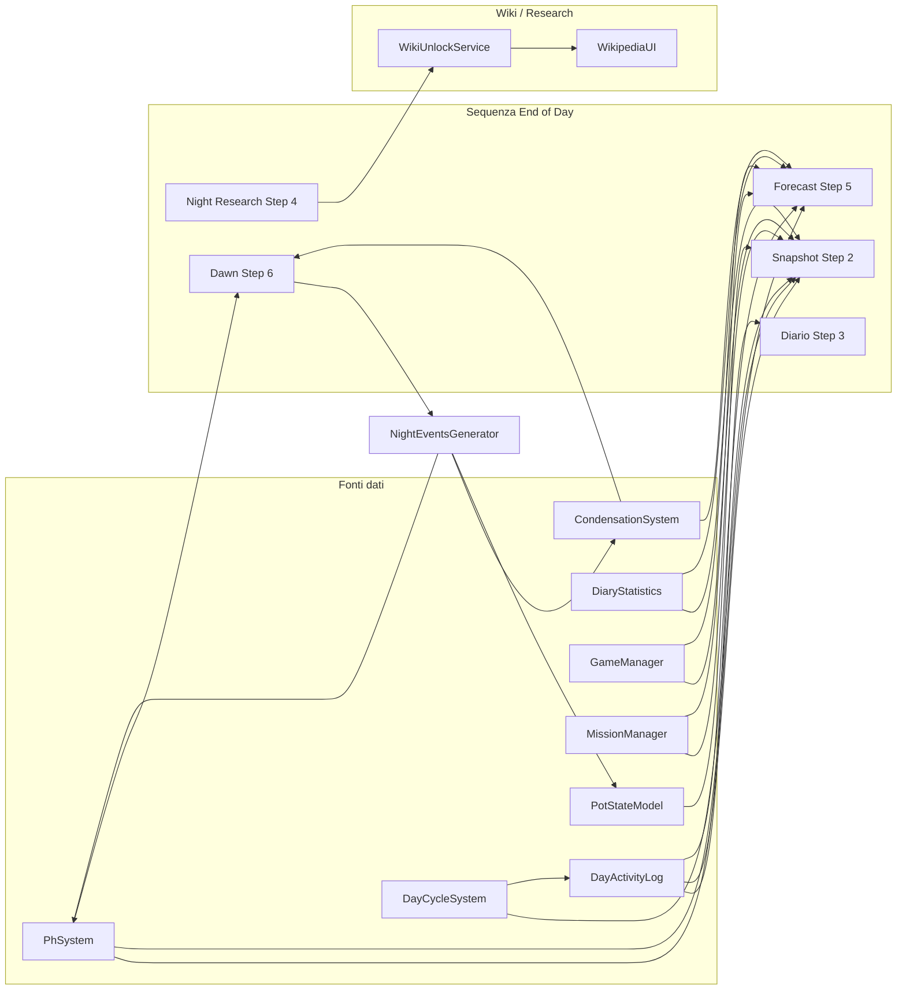

# Piano: End of Day Sequence — Logica e dati

Riferimento UI: [END_OF_DAY_UI_SEQUENCE_SPEC.md](../../Assets/_Project/Docs/END_OF_DAY_UI_SEQUENCE_SPEC.md).

---

## UI: UIToolkit + Foundation

La sequenza End of Day (tutte e 6 le schermate) va implementata con **UI Toolkit** usando la **SPORIUM UI Foundation** del progetto:

- **UXML** per ogni schermata (Conferma, Snapshot, Diario, Night Research, Forecast, Dawn), con layout e struttura come da spec.
- **USS:** import in ordine [README_FOUNDATION.md](Assets/_Project/UI/UIToolkit/Foundation/README_FOUNDATION.md): `SP-Foundation.uss` → `SP-Panel-Base.uss` → `Foundation/Components/` (SP-Button, SP-Header, ecc.) → eventuale USS locale per stile terminale/neon.
- **Stile:** design tokens `--sp-*`, classi `sp-panel`, `sp-button`, ecc. per coerenza con TopBar, Lab panels, PlayerStatusPanel. Per bordi neon e tema “terminal” si possono aggiungere varianti o USS specifici EoD senza uscire dalla Foundation come base.
- **UIDocument + Panel Settings:** stesso pattern dei pannelli Lab (es. [README_LAB_PANELS.md](Assets/_Project/UI/UIToolkit/Lab/README_LAB_PANELS.md)): un UIDocument per pannello o un UIDocument con root che mostra/nasconde le varie schermate in sequenza.

In sintesi: **sì, la UI della sequenza EoD si crea con UI Toolkit e Foundation** (non Canvas/UGUI legacy).

---

## Rimozione della vecchia UI End of Day

**Stato:** predisposto nel piano; da eseguire quando la nuova sequenza UIToolkit è attiva e agganciata al flusso.

**Vecchia UI attuale:**

- **[DiaryUI](Assets/_Project/Scripts/UI/VaultMap/Diary/DiaryUI.cs)** (MonoBehaviour, Canvas/UGUI): schermata unica con titolo "Day N - Diary", statistiche (ActionsSpent, CryEarned, CrySpent, FruitsHarvested, PlantsWatered), voce casuale, pulsante "Go to Sleep". Su Go to Sleep: se `ActionsLeft >= 1` apre **NightResearchUI**, altrimenti chiama `DayCycleSystem.EndDay()` e fa Hide().
- **Trigger:** [Bed.cs](Assets/_Project/Scripts/Interactables/Bed.cs) e [EndDayButton.cs](Assets/_Project/Scripts/UI/VaultMap/EndDayButton.cs) hanno `[SerializeField] private DiaryUI _diaryUI` e su "fine giornata" chiamano `_diaryUI.Show()`.

**Cosa fare quando la nuova sequenza EoD (UIToolkit) è pronta:**

1. **Introdurre un controller di sequenza EoD** (es. `EndOfDaySequenceController` o `EoDPanelController`) che gestisce i 6 step (Conferma → Snapshot → Diario → Night Research → Forecast → Sleep → Dawn) in UI Toolkit, con interfaccia tipo `void StartSequence()` / `void Hide()`.
2. **Sostituire il riferimento nei trigger:** in **Bed.cs** e **EndDayButton.cs** sostituire `DiaryUI _diaryUI` con il nuovo controller (o un’interfaccia comune tipo `IEndOfDaySequence`) e chiamare `StartSequence()` al posto di `_diaryUI.Show()`.
3. **Rimuovere o deprecare DiaryUI:** eliminare la classe `DiaryUI`, il prefab/Canvas associato e i riferimenti in scena. Se **NightResearchUI** è riusata come step 4 della nuova sequenza, il controller EoD la mostrerà al momento giusto; altrimenti integrarla nella nuova UI (stesso pattern degli altri step).
4. **Salvataggio / CRY:** la logica di "salva prima di EndDay" oggi in EndDayButton può restare lì (prima di avviare la sequenza) o spostarsi nello Step 1 (Conferma) della nuova sequenza, come da spec.

**Riepilogo file coinvolti nella rimozione:**

| Azione              | File / componente                                                                                                                                                                        |
| ------------------- | ---------------------------------------------------------------------------------------------------------------------------------------------------------------------------------------- |
| Sostituire trigger  | [Bed.cs](Assets/_Project/Scripts/Interactables/Bed.cs), [EndDayButton.cs](Assets/_Project/Scripts/UI/VaultMap/EndDayButton.cs) — riferimento da DiaryUI al nuovo EoD sequence controller |
| Rimuovere/deprecare | [DiaryUI.cs](Assets/_Project/Scripts/UI/VaultMap/Diary/DiaryUI.cs) e relativo GameObject/prefab in scena                                                                                 |
| Opzionale           | NightResearchUI: riuso come step 4 dalla nuova sequenza o sostituzione con schermata UIToolkit                                                                                           |

Questa sezione va eseguita **dopo** che le 6 schermate e il controller di sequenza sono implementati e testati.

---

## Checklist predisposizione dati (per le varie schermate)

Prima di (o in parallelo con) l’implementazione delle schermate, avere a disposizione:

| Cosa                                                                              | Dove / come                                                                                                         | Serve per                                              |
| --------------------------------------------------------------------------------- | ------------------------------------------------------------------------------------------------------------------- | ------------------------------------------------------ |
| DayActivityLog                                                                    | Nuovo servizio, registrato in ServiceContainer, reset su OnDayChanged                                               | Snapshot, Diario (resoconto), Forecast [TODAY]         |
| RecordWateringToggle(potId, isOn)                                                 | Chiamata in PotActions.DoWater dopo toggle                                                                          | “Watered Pot X and Y”, PlantsWatered                   |
| RecordHarvest(potId, plantCode, level, amount)                                    | Chiamata in PotSlot / harvest flow                                                                                  | “Harvested: …”                                         |
| RecordLabAction(tipo, …)                                                          | Chiamata in Extractor, Catalizzatore, Pipette, Microscope, Incubator, Fusion dopo successo                          | “Microscope: …”, “Pipette: …”, ecc.                    |
| Lettura PhSystem, GameManager, DayCycleSystem, MissionManager, CondensationSystem | Già in repo                                                                                                         | Snapshot, Forecast (pH, CRY, azioni, missioni, rischi) |
| File/loader LORE + template frasi azioni                                          | Struttura documento + loader; template per righe da DayActivityLog                                                  | Diario fragment + resoconto testuale                   |
| Scelta Night Research persistita                                                  | Salvare ramo scelto (Historical/Botanical/Vault) o Skip; leggere in Forecast                                        | Box “Research Complete”, effetto su Wiki               |
| WikiUnlockService (o equivalente)                                                 | Stato “unlocked” per voci/categorie Wiki; applicato dopo scelta Night Research                                      | Wiki aggiornata dopo research                          |
| NightEventsGenerator                                                              | Lista eventi (pH, condensazione, narrativa) da PhSystem, CondensationSystem, stato vasi; invocato dopo OnDayChanged | Dawn Summary (righe evento + “Press any key”)          |

Con questa checklist predisposta, i dati per tutte le schermate sono ottenibili; l’implementazione può procedere in ordine: prima logica e servizi (DayActivityLog + Record* + loader LORE + Wiki unlock + NightEventsGenerator), poi UI Foundation per ogni step.

---

## 1) Valorizzare i campi per “quali vasi: irrigazione accesa/spenta”

**Obiettivo:** a fine giornata poter sapere **in quali vasi** il player ha **acceso** e in quali ha **spento** il sistema di irrigazione durante il giorno.

**Stato attuale:**

- Ogni vaso ha `PotStateModel.WateringSystemOn` (e `DaysWateringSystemOn`).
- Il toggle avviene in [PotActions.DoWater](Assets/_Project/Scripts/Dome/PotActions.cs) (circa righe 856–882): dopo `TryConsumeResources()` si fa `_potState.WateringSystemOn = !_potState.WateringSystemOn`.
- `DiaryStatistics.PlantsWatered` esiste ma **non viene mai valorizzato**; non c’è traccia di “quale vaso” è stato toccato.

**Cosa valorizzare:**

- Registrare **ogni toggle** con esito positivo: **potId** + **nuovo stato** (ON = true, OFF = false).
- A fine giornata, da questa registrazione si derivano:
  - “Vasi in cui il player ha **acceso** l’irrigazione oggi” → lista potId.
  - “Vasi in cui il player ha **spento** l’irrigazione oggi” → lista potId.
- Opzionale: aggiornare anche `DiaryStatistics.PlantsWatered` come conteggio dei vasi con irrigazione **accesa** (o numero di toggle “acceso”) per coerenza con la UI attuale.

**Punti di integrazione:**

- In `PotActions.DoWater`, **dopo** il toggle riuscito (dopo `_potState.WateringSystemOn = !_potState.WateringSystemOn` e prima di `PotEvents.EmitAction`), chiamare un servizio/statistica che registri l’evento:
  - parametri: `potSlot.PotId` (o equivalente), `_potState.WateringSystemOn` (stato nuovo = “acceso” se true, “spento” se false).

**Dove tenere i dati (vedi punto 2):**

- In un **registro giornaliero** (Day Activity Log) che espone, per il giorno corrente, liste tipo:
  - `PotIdsWhereWateringTurnedOn`
  - `PotIdsWhereWateringTurnedOff`
- Reset del registro su `DayCycleSystem.OnDayChanged`.

---

## 2) Soluzione più scalabile e pulita

**Problema:** servono sia **conteggi** (azioni usate, CRY, frutti, “quanti vasi con irrigazione ON”) sia **dettaglio** per il resoconto (“Watered Pot 2 and Pot 4”, “Harvested 2 Toxic Bloom (L3)”, azioni Lab, ecc.). Aggiungere ogni nuovo tipo di azione non deve richiedere di toccare troppi posti.

**Soluzione consigliata: Day Activity Log (registro eventi del giorno)**

- **Un solo componente** (es. `DayActivityLog` o `DailyActionLog`) che:
  - riceve **eventi** durante il giorno: tipo evento + contesto (potId, plantCode, tipo lab, ecc.);
  - mantiene una lista (o strutture tipizzate) per il **giorno corrente**;
  - si resetta su `OnDayChanged`.
- **Chi fa l’azione** (PotActions, Extractor, Lab, Pipette, Microscope, vendite, ecc.) **emette un evento** dopo l’azione riuscita; il log lo registra.
- **A fine giornata** il resoconto (snapshot, diario, forecast) **legge dal log** per:
  - “Watered Pot X and Pot Y” → da eventi `WateringToggle(potId, isOn)`;
  - “Harvested: …” → da eventi `Harvest(potId, plantCode, level, amount)`;
  - “Microscope / Pipette / Lab …” → da eventi `LabAction(type, …)`.
- **DiaryStatistics** può restare per i **soli conteggi** (ActionsSpent, CryEarned, CrySpent, FruitsHarvested, PlantsWatered, SporesExtracted) e:
  - essere aggiornato come oggi (ActionSystem, EconomySystem, PotSlot, ecc.), **oppure**
  - essere derivato dal Day Activity Log (conteggi = numero di eventi per tipo), così c’è una sola fonte di verità.

**Vantaggi:**

- **Scalabile:** nuovi tipi di azione = nuovo tipo di evento + una chiamata dove si consuma l’azione; il report si estende senza modificare DiaryStatistics.
- **Pulito:** una sola responsabilità per il “cosa è successo oggi”; UI e report leggono da lì.
- **Irrigazione:** “quali vasi acceso/spento” sono semplicemente gli eventi `WateringToggle` del giorno (filtrati per `isOn == true` vs `isOn == false`).

**Implementazione sintetica:**

- Servizio/classe `DayActivityLog` (registrato in ServiceContainer o accessibile da GameManager/DiaryStatistics).
- Metodi tipo `RecordWateringToggle(string potId, bool isNowOn)`, `RecordHarvest(string potId, string plantCode, int level, int amount)`, `RecordLabAction(...)`, ecc.
- Proprietà o metodi di lettura: `IReadOnlyList<string> PotIdsWateringTurnedOnThisDay`, `PotIdsWateringTurnedOffThisDay`, `IReadOnlyList<HarvestEntry> HarvestsThisDay`, ecc.
- Sottoscrizione a `DayCycleSystem.OnDayChanged` per fare `Clear()`.
- In [PotActions.DoWater](Assets/_Project/Scripts/Dome/PotActions.cs), dopo toggle riuscito: `DayActivityLog.RecordWateringToggle(potSlot.PotId, _potState.WateringSystemOn)` (e opzionalmente aggiornare `DiaryStatistics.PlantsWatered` se si mantiene il conteggio lì).

*(Il punto 3 è coperto dal punto 2: il Day Activity Log è la struttura unica da cui derivare sia i dati irrigazione sia ogni altro dettaglio del report.)*

---

## Riepilogo file toccati (per punti 1 e 2)

| Area                   | File / componente                                                                                                                                                         |
| ---------------------- | ------------------------------------------------------------------------------------------------------------------------------------------------------------------------- |
| Registro eventi giorno | Nuovo: `DayActivityLog` (o equivalente) con eventi WateringToggle, Harvest, LabAction, reset su OnDayChanged                                                              |
| Toggle irrigazione     | [PotActions.cs](Assets/_Project/Scripts/Dome/PotActions.cs) — dopo toggle in `DoWater`, chiamare `DayActivityLog.RecordWateringToggle(potId, isOn)`                       |
| Conteggi / report      | [DiaryStatistics.cs](Assets/_Project/Scripts/Core/Diary/DiaryStatistics.cs) — opzionale: leggere da DayActivityLog o continuare a valorizzare PlantsWatered da PotActions |
| Resoconto EoD          | UI/controller End of Day che legge da DayActivityLog per “Watered Pot X and Pot Y” e altre righe dell’Activity Summary                                                    |

**Punti di integrazione espliciti per RecordHarvest e RecordLabAction** (da chiamare subito dopo consumo azione con esito positivo):

| Tipo evento                          | File                                                                                                              | Metodo / punto                                                                                              | Parametri / note                                                                  |
| ------------------------------------ | ----------------------------------------------------------------------------------------------------------------- | ----------------------------------------------------------------------------------------------------------- | --------------------------------------------------------------------------------- |
| RecordHarvest                        | [PotActions.cs](Assets/_Project/Scripts/Dome/PotActions.cs)                                                       | `DoHarvest()` — dopo `PotEvents.EmitAction(..., Harvest, potSlot)` (circa riga 1469)                        | `potSlot.PotId`, `_potState.PlantCode`, `_potState.PlantLevel`, `fruitsToHarvest` |
| RecordLabAction Extractor            | [Extractor.cs](Assets/_Project/Scripts/Interactables/Extractor.cs)                                                | `TryStartExtraction()` — dopo `gm.TrySpendAction(1)` e avvio coroutine (return true, ~riga 249)             | tipo `"Extractor"` (e opz. slot/index)                                            |
| RecordLabAction Extractor (minigame) | [LabMinigameExtractor.cs](Assets/_Project/Scripts/UI/VaultMap/LabMinigameExtractor.cs)                            | Dopo `TrySpendActionAndCry` con esito positivo (~riga 127)                                                  | tipo `"Extractor"`                                                                |
| RecordLabAction Catalizzatore        | [LabCatalizzatorePanelController.cs](Assets/_Project/Scripts/UI/UIToolkit/Lab/LabCatalizzatorePanelController.cs) | Dopo `TrySpendAction(_costAction)` con successo (~riga 412)                                                 | tipo `"Catalizzatore"`                                                            |
| RecordLabAction Pipette              | [LabPippete.cs](Assets/_Project/Scripts/UI/VaultMap/Pippete/LabPippete.cs)                                        | `HandleConfirm()` — dopo `TrySpendAction(_costAction)` e `_storage.Consume(Items.SporeGeneric)` (~riga 100) | tipo `"Pipette"`                                                                  |
| RecordLabAction Microscope           | [LabMicroscope.cs](Assets/_Project/Scripts/UI/VaultMap/MicroscopeMinigame/LabMicroscope.cs)                       | `HandleConfirm()` — dopo `TrySpendAction(_costAction)` (~riga 112)                                          | tipo `"Microscope"`                                                               |
| RecordLabAction Incubator            | [LabIncubatorPanelController.cs](Assets/_Project/Scripts/UI/UIToolkit/Lab/LabIncubatorPanelController.cs)         | Dopo `TrySpendAction(_costAction)` con successo (~riga 455)                                                 | tipo `"Incubator"`                                                                |
| RecordLabAction Fusion               | [LabFusionPanelController.cs](Assets/_Project/Scripts/UI/UIToolkit/Lab/LabFusionPanelController.cs)               | Dopo `TrySpendAction(_costAction)` con successo (~riga 360)                                                 | tipo `"Fusion"`                                                                   |

*(Vendite / “Harvested (Sold)”): se esiste un flusso di vendita che consuma azione o frutti, aggiungere un evento tipo `RecordSale(...)` e agganciarlo nel punto dove la vendita va a buon fine; il resoconto Snapshot/Diario potrà mostrare una riga dedicata.)*

Questo piano si integra con la sequenza UI (conferma → snapshot → diario → research → forecast → sleep → dawn) e con la specifica in `END_OF_DAY_UI_SEQUENCE_SPEC.md`.

---

## Coerenza con la richiesta e dati ottenibili

La sequenza End of Day (trigger BED in BEDROOM → Conferma → Snapshot → Diario → Night Research [se azioni ≥ 1] → Forecast → Sleep → Dawn) è coerente con la spec UI. Tutti i dati mostrati negli step sono **ottenibili** a patto di:

- introdurre il **Day Activity Log** (punti 1 e 2) e agganciare tutti i punti dove si consuma un’azione;
- introdurre un **generatore di eventi notturni** per la Dawn Summary (lista eventi da pH, condensazione, piante, narrativa);
- definire **fonti per** Reputation (Snapshot / Forecast): vedi sottosezione *Reputation* sotto;
- definire **Wiki / Night Research**: la scelta del ramo (Historical Archive, Botanical Database, Vault Protocols) deve applicare un effetto (es. sblocco voci Wiki); la Wiki oggi non ha stato “unlocked” — va aggiunto un servizio (es. `WikiUnlockService`) e filtrare le voci in [WikipediaUI](Assets/_Project/Scripts/UI/VaultMap/Wikipedia/WikipediaUI.cs) in base allo sblocco.

---

## Dati per step – fonti e ottenibilità

| Step             | Dati mostrati                                                     | Fonte in repo / da introdurre                                                                                                   | Ottenibile?                                 |
| ---------------- | ----------------------------------------------------------------- | ------------------------------------------------------------------------------------------------------------------------------- | ------------------------------------------- |
| 1 Conferma       | Solo YES/NO                                                       | —                                                                                                                               | Sì                                          |
| 2 Snapshot       | Day, System Date, Vault Status, Dome pH                           | DayCycleSystem, (calendar opzionale), PhSystem.CurrentPh / trend                                                                | Sì (date/status opzionali o placeholder)    |
| 2 Snapshot       | Activity Summary (azioni, CRY, harvested, watered, lab)           | DayActivityLog + DiaryStatistics (+ GameManager per CRY balance)                                                                | Sì con Day Activity Log                     |
| 2 Snapshot       | Drift & Consequences, Reputations                                 | PhSystem; Reputation: da introdurre o placeholder                                                                               | Parziale (reputation da definire)           |
| 2 Snapshot       | Active Conditions, Notes & Tags                                   | PotStateModel (mold, idratazione), MoldSystem, Inventory, MissionManager                                                        | Sì (lettura stato vasi e sistemi)           |
| 3 Diario         | Fragment narrativo + resoconto azioni                             | File LORE + DayActivityLog (template o frasi per azioni)                                                                        | Sì con struttura LORE + log                 |
| 4 Night Research | Scelta ramo, effetto                                              | NightResearchUI già presente; effetto = servizio che sblocca Wiki/lore                                                          | Sì con WikiUnlockService (o equivalente)    |
| 5 Forecast       | [TODAY] (azioni, CRY, pH, eventi, reputazioni, mutazioni)         | DayActivityLog, DiaryStatistics, PhSystem, MissionManager; mutazioni/eventi da log o DayCycleController                         | Sì con log + sistemi esistenti              |
| 5 Forecast       | [TOMORROW FORECAST] (azioni, pH previsto, rischi, missioni, mood) | GameManager (azioni/giorno), PhSystem (drift previsto), CondensationSystem/config (rischi), MissionManager, Mood placeholder    | Sì (mood/rischi eventualmente placeholder)  |
| 5 Forecast       | Research Complete                                                 | Scelta Step 4 salvata; se ramo scelto → “New lore fragment unlocked”                                                            | Sì con flag/scelta Night Research           |
| 6 Dawn           | Eventi notturni (pH, condensazione, temperatura, narrativa)       | Generatore eventi notturni (legge da PhSystem, CondensationSystem, DayCycleController, stato piante) → lista testi/icona per UI | Sì con NightEventsGenerator (da introdurre) |

---

## Architettura: sistemi che dialogano con Diario, Forecast, Wiki / Night Research

Flusso dati in modo che **Diario** (snapshot + fragment), **Forecast (new day)** e **Wiki / Night Research** abbiano una struttura chiara e scalabile.

**Ruoli:**

- **DayActivityLog:** unica fonte “cosa è successo oggi” (irrigazione, harvest, lab). Snapshot, Diario (resoconto testuale) e Forecast [TODAY] leggono da qui. Si resetta su `OnDayChanged`.
- **DiaryStatistics:** conteggi (azioni, CRY, frutti, ecc.). Snapshot e Forecast possono usarlo per numeri rapidi; opzionalmente derivabile dal Day Activity Log.
- **PhSystem:** pH corrente, trend, drift. Snapshot “Dome pH”, Forecast (oggi e domani), Dawn (eventi pH).
- **DayCycleSystem:** giorno corrente, `OnDayChanged` (reset log, avanzamento notte). Tutta la sequenza è “alla vigilia” del giorno N → dopo Sleep diventa N+1.
- **GameManager:** CRY, azioni residue / per giorno. Snapshot, Forecast (azioni disponibili domani).
- **MissionManager:** missioni attive (MissionChecker, MissionConfig). Snapshot “Active”, Forecast “Missions Active”. Esiste in repo.
- **CondensationSystem:** condensazione, WAT-RAW. Forecast “Environmental Risks”, Dawn (eventi condensazione). Esiste in repo.
- **Night Research → Wiki:** la scelta nel Step 4 (Historical Archive / Botanical Database / Vault Protocols) deve essere salvata e applicata a un **WikiUnlockService** (o equivalente): sblocca voci/categorie nella Wiki. La [WikipediaUI](Assets/_Project/Scripts/UI/VaultMap/Wikipedia/WikipediaUI.cs) oggi mostra tutte le voci da `WikipediaItemData`; va aggiunto uno stato “unlocked” (per id o categoria) e la UI deve filtrare o evidenziare in base a quello. Il Forecast Step 5 mostra “Research Complete: New lore fragment unlocked” se in Step 4 il player ha scelto un ramo (e non Skip).
- **Dawn Summary:** un **NightEventsGenerator** (o logica in DayCycleController) dopo `OnDayChanged` costruisce la lista di eventi notturni (pH drift, condensazione, mutazioni, frasi narrative) da PhSystem, CondensationSystem, stato vasi/piante; la UI Dawn riceve questa lista e la mostra una riga alla volta (0.6s) con “Press any key to continue”.

**Riepilogo:** Sì, il piano è coerente con la richiesta; i dati sono ottenibili con Day Activity Log, WikiUnlockService e NightEventsGenerator; Diario, Forecast e Wiki/Night Research dialogano tramite queste fonti e i sistemi esistenti (PhSystem, GameManager, MissionManager, CondensationSystem, DayCycleSystem) come sopra.

---

## Reputation (gap integrato)

**Stato in repo:** non esiste un sistema di reputazione per fazione (Custodians, Mold Cult, ecc.); al massimo notifiche/bottoni. Snapshot e Forecast richiedono righe tipo “↑ Custodians (+N)”, “↓ Mold Cult (-N)”.

**Per la prima release (gap chiuso nel piano):**

- **Placeholder:** in Snapshot e Forecast mostrare testo fisso o chiavi localizzate tipo “Reputation: —” / “Reputation: (pending)” oppure nascondere la sezione “Drift & Consequences / Reputations” fino a implementazione reale. La tabella “Dati per step” resta con “Parziale (reputation da definire)” ma il flusso EoD non dipende da valori reali.
- **Quando si introducono valori reali:**
  - Servizio o modello **ReputationService** (o campi in GameManager/Save) con valore per fazione (es. `int GetReputation(string factionId)` per “Custodians”, “MoldCult”, ecc.).
  - Fonti possibili: missioni (MissionManager), azioni pH (PhSystem), scelte narrative, eventi notturni. Definire dove ogni azione del giocatore modifica ±N per fazione.
  - Snapshot e Forecast leggono da questo servizio e formattano “↑ FactionName (+N)” / “↓ FactionName (-N)”.
- **File da toccare (futuro):** eventuale nuovo `ReputationService` o estensione di un sistema esistente; [WikipediaUI](Assets/_Project/Scripts/UI/VaultMap/Wikipedia/WikipediaUI.cs) o notifiche non sono la fonte — va creata una fonte dati dedicata.

In sintesi: il piano considera la Reputation **coperta** con placeholder in UI e definizione chiara di cosa aggiungere per valori reali.

---

## Applicabilità del piano

Il piano è **applicabile** in questo ordine: (1) introdurre DayActivityLog e agganciare **RecordWateringToggle** in PotActions.DoWater, **RecordHarvest** in PotActions.DoHarvest e **RecordLabAction** in tutti i punti elencati nella tabella “Punti di integrazione espliciti” (Extractor, Catalizzatore, Pipette, Microscope, Incubator, Fusion); (2) predisporre loader LORE, WikiUnlockService e NightEventsGenerator; (3) costruire le 6 schermate in UI Toolkit + Foundation e il controller di sequenza che le orchestra e legge dai servizi; (4) usare placeholder Reputation come da sezione *Reputation* e, quando pronti, introdurre ReputationService. La codebase ha già i riferimenti (PhSystem, DayCycleSystem, MissionManager, CondensationSystem, WikipediaUI, NightResearchUI); l’integrazione è chiara e il piano copre dati, fonti, architettura e **tutti i gap** (file per Record*, Reputation) necessari per procedere con l’implementazione.