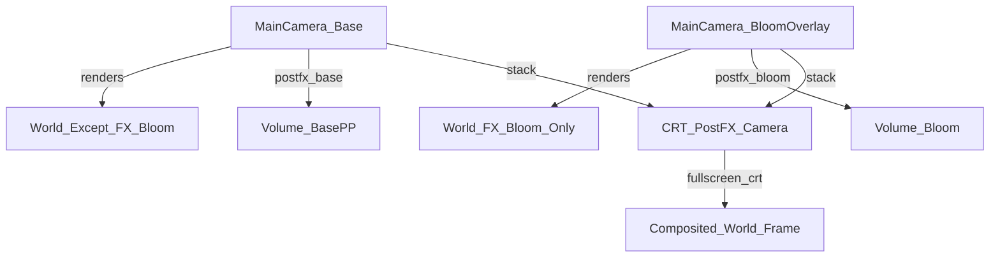

# Bloom solo su layer FX_Bloom (URP Camera Stack)

## Obiettivo

- Bloom visibile **solo** per oggetti marcati in un layer dedicato (es. `FX_Bloom`).
- La **camera base** mantiene gli altri post-processing (es. color adjustments), ma **non** applica Bloom sugli oggetti normali.
- Il player (e qualsiasi cosa non in `FX_Bloom`) non “entra” nel Bloom.

## Lezioni imparate (sessione 2026-01-12) + Guardrails (NUOVA REGOLA)

Questa sezione è qui per evitare di ripetere errori che fanno perdere tempo e token.

- **Regola #1 — Iterazione non caotica**: una modifica alla volta, con checkpoint. Niente “pacchetti” di cambi su scene + renderer + script + volumi tutti insieme.
- **Regola #2 — Intuito + prove tangibili**: ogni fix deve essere guidato da evidenza (log essenziale / inspector values / screenshot) e deve confermare o smentire un’ipotesi precisa.
- **Regola #3 — Stop condition**: se la GameView diventa **nera** o il rendering collassa, stop immediato e rollback dell’ULTIMA modifica (non si continua a “provare”).
- **Regola #4 — Non invasivo**: evitare di iniettare/auto-installare RendererFeature o script runtime che mutano pipeline/scene in modo permanente. Preferire configurazioni manuali in scena o asset dedicati e facilmente rimuovibili.
- **Regola #5 — Baseline prima di tutto**: prima di toccare qualunque cosa, salvare uno stato base (commit/tag o copia della scena/asset) e verificare Play Mode “ok”.
- **Regola #6 — Debug minimale**: massimo 3–8 log mirati, rimovibili; niente spam, niente sistemi nuovi se non strettamente necessari.
- **Regola #7 — Definizione d’uso di FX_Bloom**: il layer `FX_Bloom` non è per “spostare” oggetti base (es. Player). È per un **GlowOverlay** (child/duplicato) che bloomma sopra l’oggetto normale.

### Workflow consigliato (checkpoint)

0. **Checkpoint 0 (Baseline)**: apri Vault, verifica Bloom “com’era” e salva uno snapshot (commit o copia scene).
1. **Checkpoint 1 (Solo layer)**: aggiungi SOLO `FX_Bloom`. Non cambiare camere/volumi. Play: nessun cambiamento visivo atteso.
2. **Checkpoint 2 (Solo camera overlay)**: crea Bloom Overlay camera e mettila nello stack. Play: deve renderizzare ma non deve mai “rompere” la base. Se nero → rollback immediato.
3. **Checkpoint 3 (Solo volumi)**: separa BasePP vs BloomPP (o layer volume). Play: Bloom deve agire solo sulla Bloom cam.
4. **Checkpoint 4 (Workflow artistico)**: prova un oggetto con `GlowOverlay` in `FX_Bloom`. Player resta nel suo layer.

## Stato attuale (repo)

- La camera principale è in [`Assets/_Project/Scenes/Bootstrap/SCN_Bootstrap.unity`](Assets/_Project/Scenes/Bootstrap/SCN_Bootstrap.unity) come `Main Camera` con `CinemachineBrain`.
- La scena Vault ha una `Virtual Camera` (Cinemachine) in [`Assets/_Project/Scenes/SCN_VaultMap.unity`](Assets/_Project/Scenes/SCN_VaultMap.unity).
- Esiste un profilo bloom dedicato Vault (attuale): `[Assets/_Project/Scenes/SCN_VaultMap/VaultMap Bloom Profile.asset](Assets/_Project/Scenes/SCN_VaultMap/VaultMap Bloom Profile.asset)`.
- Esiste lo script di enforcer: [`Assets/_Project/Scripts/World/VaultMap/VaultMapPostFXRuntimeEnforcer.cs`](Assets/_Project/Scripts/World/VaultMap/VaultMapPostFXRuntimeEnforcer.cs) (serviva a garantire PP in Vault).

## Architettura proposta

- **Main Camera (Base)**: renderizza tutto **tranne** `FX_Bloom`, con PP “base” (color adjustments ecc.).
- **Bloom Camera (Overlay)**: renderizza **solo** `FX_Bloom`, con Post Processing **attivo** e Volume Bloom.
- **CRT Camera (Overlay finale)**: non renderizza geometria (culling mask Nothing), ma applica un **fullscreen pass** al frame world già compositato (Base + Bloom). La HUD resta fuori se è Screen Space Overlay.
- **Nota cruciale**: oggetti che devono essere visibili “normali + glow” vanno gestiti come **doppio renderer**:
  - **parte normale** su layer normale (es. Default)
  - **overlay glow** (sprite/mesh) su `FX_Bloom`

## Implementazione (high-level)

### 1) Layer

- Aggiungere layer `FX_Bloom`.

### 2) Camera Stack URP

- In [`Assets/_Project/Scenes/Bootstrap/SCN_Bootstrap.unity`](Assets/_Project/Scenes/Bootstrap/SCN_Bootstrap.unity):
  - Tenere `Main Camera` come **Base** con `CinemachineBrain`.
  - Creare `Bloom Camera` come **Overlay** (senza `CinemachineBrain`, senza `AudioListener`).
  - Aggiungere `Bloom Camera` nello **stack** della `Main Camera` (URP).
  - (Se usi CRT) Creare `CRT_PostFX_Camera` come **Overlay** e metterla **in fondo allo stack** (dopo Bloom).
  - `Main Camera`:
    - `Culling Mask`: **esclude** `FX_Bloom`.
    - `Post Processing`: ON (per PP base), ma **il Bloom deve essere rimosso dal profilo “base”** (vedi punto volumi).
  - `Bloom Camera`:
    - `Culling Mask`: **solo** `FX_Bloom`.
    - `Post Processing`: ON.
  - `CRT_PostFX_Camera` (solo se CRT attivo):
    - `Culling Mask`: Nothing
    - `Post Processing`: ON
    - contiene solo il fullscreen effect CRT (renderer feature/materiale dedicato)

### 3) Volumi separati (Base vs Bloom)

- Creare/riusare due profili Volume distinti:
  - **BasePP**: contiene ColorAdjustments e altri PP “globali”, **senza Bloom**.
  - **BloomPP**: contiene **solo** Bloom.
- Per evitare che Bloom tocchi la base camera:
  - Opzione preferita: usare **due layer di volume** distinti (es. `PP_Base`, `PP_Bloom`) e impostare `Volume Layer Mask` diverso per BaseCam vs BloomCam.
  - Se vuoi evitare nuovi layer volume, alternativa: mantenere BloomPP in una scena/GO dedicata e assicurarsi che la base camera non lo “veda” (ma è più fragile).

### 4) Aggiornamento del fix VaultMap

- Dopo che il sistema Camera Stack è stabile, valutare di:
  - dismettere o limitare [`Assets/_Project/Scripts/World/VaultMap/VaultMapPostFXRuntimeEnforcer.cs`](Assets/_Project/Scripts/World/VaultMap/VaultMapPostFXRuntimeEnforcer.cs) (perché il PP/Bloom sarà gestito dalla camera overlay globale, non più con workaround per scena).

### 5) Workflow artistico per “teche/pannelli”

- Per ogni oggetto che deve gloware:
  - lascia l’oggetto “base” (sprite principale) su layer normale.
  - crea un child `GlowOverlay` con SpriteRenderer/mesh dedicato su layer `FX_Bloom`.
  - usa materiale additive/colore bright sul `GlowOverlay` (così supera la soglia di Bloom in modo controllato).

## Operazioni manuali (Unity) — passo passo

1. Crea layer `FX_Bloom`.
2. Apri scena: `SCN_Bootstrap`.
3. Duplica `Main Camera` e rinominala `Bloom Camera`.
4. Su `Bloom Camera`:

   - rimuovi `AudioListener` (se presente).
   - rimuovi/disabilita `CinemachineBrain`.
   - imposta Camera `Render Type = Overlay`.
   - imposta `Culling Mask = FX_Bloom`.
   - abilita `Post Processing`.

5. Su `Main Camera`:

   - lascia `Render Type = Base`.
   - imposta `Culling Mask` togliendo `FX_Bloom`.
   - abilita `Post Processing` (per BasePP).
   - aggiungi `Bloom Camera` nel `Camera Stack`.

6. Crea due Volume globali (o un volume con profilo “base” e un volume con profilo bloom) e assegna i profili giusti.
7. (Se CRT attivo) Aggiungi `CRT_PostFX_Camera` come Overlay e posizionala **ultima** nello stack della Main Camera.
8. Metti un oggetto test (es. una teca) con un child `GlowOverlay` su layer `FX_Bloom` e verifica che:

   - glow/bloom visibile
   - player NON bloomma

## Verifica

- In Play:
  - un oggetto in `FX_Bloom` deve bloomare.
  - player e mondo normale non devono bloomare.
  - PP base (color adjustments) deve restare attivo.
  - (Se CRT attivo) l’effetto CRT deve colpire anche il glow e il world compositato, ma **non** la HUD.

## File coinvolti

- Scene Bootstrap: [`Assets/_Project/Scenes/Bootstrap/SCN_Bootstrap.unity`](Assets/_Project/Scenes/Bootstrap/SCN_Bootstrap.unity)
- Scene Vault: [`Assets/_Project/Scenes/SCN_VaultMap.unity`](Assets/_Project/Scenes/SCN_VaultMap.unity)
- Script workaround (da rivalutare dopo): [`Assets/_Project/Scripts/World/VaultMap/VaultMapPostFXRuntimeEnforcer.cs`](Assets/_Project/Scripts/World/VaultMap/VaultMapPostFXRuntimeEnforcer.cs)

## Anti-patterns (da NON rifare)

- Modificare più sottosistemi insieme (scene + URP renderer asset + script runtime + shader) senza checkpoint intermedi.
- Introdurre “auto-fix” che scrivono sugli asset del renderer o che cambiano scene a runtime.
- Continuare a provare fix dopo che la GameView è nera: si fa rollback e si riparte da baseline con ipotesi e prove.