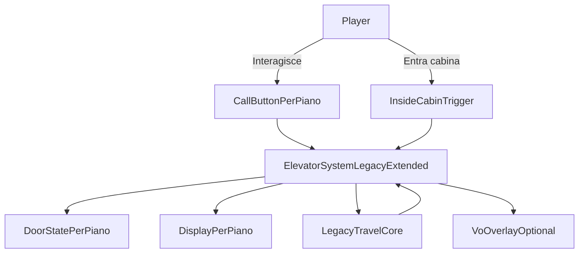

# Elevator 2.0

## Obiettivo
Partendo dalla baseline legacy già ripristinata (movimento floor-to-floor funzionante), introdurre miglioramenti UX richiesti in modo incrementale:
- porte sinistra/destra per piano (chiuse di default, apertura all'arrivo, chiusura alla partenza),
- display per piano con stato e direzione,
- mantenimento completo della navigazione tra piani senza regressioni.

## Cosa non ha funzionato (know-how da mantenere)
- Refactor troppo ampio in un unico ciclo: logica viaggio, porte, display, trigger, input e VO modificati insieme.
- Coupling alto tra runtime e authoring scena: posizionamenti auto-generati senza controllo artistico hanno creato mismatch visivi.
- Doppio binario logico (legacy + nuovo) non isolato: regressioni su input/interazione (`E` e call button) difficili da prevedere.
- Binding scena critici fragili: array livelli/door/display e riferimenti null hanno bloccato flussi validi.

## Stato tecnico di partenza (post-revert atteso)
Dopo il tuo revert, la base da considerare “fonte di verità” sarà:
- script elevator legacy in [`d:/Sporae_Build_Beta/Assets/_Project/Scripts/World/Elevator/ElevatorSystem.cs`](d:/Sporae_Build_Beta/Assets/_Project/Scripts/World/Elevator/ElevatorSystem.cs),
- scena elevator in [`d:/Sporae_Build_Beta/Assets/_Project/Scenes/SCN_VaultMap.unity`](d:/Sporae_Build_Beta/Assets/_Project/Scenes/SCN_VaultMap.unity),
- gerarchia documentata in [`d:/Sporae_Build_Beta/Assets/_Project/Docs/SceneHierarchy.txt`](d:/Sporae_Build_Beta/Assets/_Project/Docs/SceneHierarchy.txt).

## Strategia di implementazione (incrementale)

### Fase 1 — Benchmark su un solo piano (+1)
- Introdurre porte dx/sx solo sul piano `+1` senza toccare il resto dei piani.
- Porte chiuse quando cabina assente, apertura quando cabina presente al piano, chiusura alla selezione piano in cabina.
- Nessun cambio a `levels[]`, `GoToLevel`, `TeleportPlayer` se non strettamente necessario.
- Definire 5 smoke test manuali invarianti (chiamata, viaggio, arrivo, input, nessun softlock) e usarli come gate per le fasi successive.

### Fase 2 — Estensione porte a tutti i piani
- Portare lo stesso pattern di Fase 1 su `0`, `-1`, `-2`.
- Gestione stato porte per piano con configurazione manuale in scena (no auto-placement).
- Verificare che la sequenza “chiuse -> apertura arrivo -> chiusura partenza” sia identica su tutti i livelli.

### Fase 3 — Display per piano (stato + direzione)
- Aggiungere display statico per piano, authoring manuale in scena.
- Stato display:
  - cabina lontana: spento,
  - cabina al piano: mostra piano,
  - cabina in movimento con player dentro: mostra target + direzione (su/giu) sul piano attivo secondo UX definita.
- Conservare fallback sicuro se un display non è bindato (non rompere il viaggio).

### Fase 4 — VO e UX guidance
- Trigger VO all'ingresso cabina: “seleziona il piano desiderato con freccia su o giu”.
- Guardrail anti-spam VO (una sola volta per ingresso/contesto).
- Nessuna dipendenza bloccante dal VO: se servizio assente, gameplay invariato.

### Fase 5 — Hardening e pulizia
- Rimuovere rami temporanei e toggles non più necessari.
- Verificare coerenza tra gerarchia scena e codice.
- Aggiornare `SceneHierarchy`/documentazione elevator e checklist binding.

## Architettura target (alto livello)

## Regole operative per evitare regressioni
- Non sostituire il core legacy finché la fase corrente non passa i test.
- Una sola feature per fase (porte, poi display, poi VO).
- Authoring scena manuale per porte/display; niente posizionamento automatico.
- Ogni fase deve essere deployabile e giocabile anche senza la successiva.

## Criteri di accettazione finali
- Il player può sempre muoversi tra tutti i floor come nel legacy.
- Su ogni piano: porte chiuse senza cabina, porte aperte con cabina presente.
- Alla selezione piano in cabina: porte chiudono, viaggio, arrivo, porte riaprono.
- Display per piano coerente con stato e direzione definiti.
- Nessun blocco input o conflitto `E`/frecce.
- VO non blocca il gameplay e compare nel momento UX corretto.