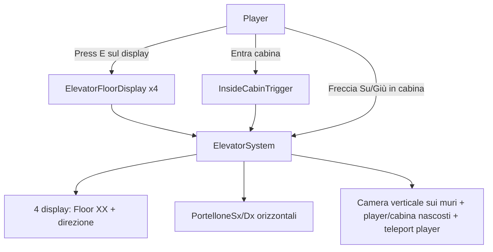
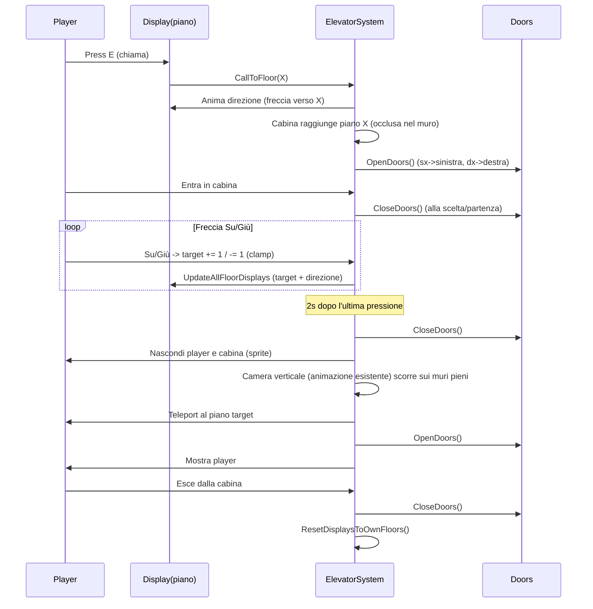

# Elevator 3.0 — piano unico

> Fonde `elevator_ux_doors_display` (il **cosa**) + `elevator_2.0` (il **come**, rollout incrementale).
> Allineato alle **schermate concettuali** fornite dall'autore (game view full picture, zoom su un piano, loop completo).

## Decisioni confermate (fonte di verità)

- **Porte: 4 set PER PIANO** (sempre presenti, chiuse di default), a due metà, apertura orizzontale: metà sinistra (`PortelloneSx`) scivola verso sinistra, metà destra (`PortelloneDx`) verso destra; aperte scompaiono lateralmente. Occupano l'intera area porta del piano (zona evidenziata nei mockup). Si aprono quando la cabina logica è a quel piano. **Nessun interno cabina dedicato**: a porte chiuse si vedono solo le porte (il player è nascosto dietro).
- **Cabina = concetto logico**: `elevatorSection`/`ElevatorRoom` non è più un oggetto visibile che viaggia, ma il marcatore logico della posizione (`currentLevelIndex`) e il **target invisibile** che la camera segue durante il viaggio. `SetLevel` continua a riposizionarlo (EndDay invariato).
- **Anchor di uscita per piano**: 4 punti "davanti alle porte", ciascuno dentro la `PerspectiveWalkArea2D` corretta; il player viene teletrasportato lì all'arrivo (non sulle Y grezze di `levels[]`).
- **Blocco input corretto**: durante viaggio e selezione piano si usa `GameplayUiModalLock.SetBlockWorldInput(true)`; le frecce Su/Giù sono lette **solo** dall'elevator (altrimenti muoverebbero il player via "Vertical").
- **Display laterale = indicatore + interagibile** (uno per piano, fisso, accanto alle porte): mostra `Floor XX` + **nome breve del piano** + freccia su/giù/nessuna **ed è** l'oggetto con cui il player chiama l'ascensore. **Niente call button separati, niente UI piani.**
- **Selezione piano solo da dentro la cabina** con **Freccia Su/Giù**: ogni pressione sposta il **target** di un piano (accumulabile, es. -1 + due Su = target +1), clampato ai piani validi; il display mostra il target e la direzione; **partenza ~1.2s dopo l'ultima pressione**.
- **Player sempre teletrasportato** (non cammina mai tra i piani; l'ascensore è l'unico trasporto verticale). Durante il **viaggio in cabina** si **mantiene l'animazione di camera verticale già presente** (serve a comunicare "sei in viaggio verso il piano scelto"), ma **non** si mostra più il player/cabina che traslano: durante lo scorrimento si vedono i **muri pieni** dello shaft; **player e cabina non visibili in transito**; alla fine teleport esatto a destinazione e reveal. *(Nessun trucco di occlusione di una cabina in movimento: in transito non c'è nulla in movimento da mostrare, solo i muri e la camera che scorre.)*
- **Chiamata da fuori**: il player resta fermo al suo piano; animazione direzione sul display, la cabina arriva al piano, porte aperte. Il player non viene mosso dalla chiamata.
- **Costo CRY rimosso** del tutto.
- **Metodo**: rollout incrementale per fasi, una feature per fase, ogni fase giocabile senza regressioni.

## Riferimenti UX (mockup autore)

- **Game view (full picture)**: shaft verticale che attraversa i piani; il player si muove in verticale solo via ascensore; muro pieno tra i piani.
- **Zoom su un piano**: due ante porta (metà 1 sx / metà 2 dx) nella cornice porta; display laterale (lato destro delle porte) come indicatore+interagibile.
- **Loop completo**: chiama da display → cabina arriva → porte aprono → entra → porte chiudono → Su/Giù (target, display aggiornato) → 2s → parte → camera segue, player nascosto, cabina non visibile nel muro di passaggio → teleport a destinazione → porte aprono → esce.

## Cosa NON ha funzionato prima (vincoli ereditati)

- Refactor troppo ampio in un unico ciclo (viaggio + porte + display + trigger + input insieme).
- Coupling alto runtime↔scena con **auto-placement** → mismatch visivi. **Regola: authoring manuale** per porte, display, trigger.
- Doppio binario logico (legacy + nuovo) non isolato → regressioni input. **Regola: rimuovere prima la vecchia logica menu**, poi costruire.
- Binding scena fragili (array, null ref) → flussi bloccati. **Regola: ogni riferimento opzionale ha fallback non bloccante.**

## Stato tecnico di partenza (baseline legacy attuale)

- Script: `Assets/_Project/Scripts/World/Elevator/ElevatorSystem.cs` (legacy + patch `DEBUG_SAFE_FIX`).
- Scena: `Assets/_Project/Scenes/SCN_VaultMap.unity`.
- Gerarchia (da `Assets/_Project/Docs/SceneHierarchy.txt`):
  - `ELEV_Elevator`
    - `ELEV_Levels` → `LVL_+1`, `LVL_0`, `LVL_-1`, `LVL_-2`
    - `ELEV_UseZone` (BoxCollider2D verticale + `ElevatorSystem`)
    - `ElevatorRoom` (1 `SpriteRenderer`, nessun figlio)
  - `UI_ElevatorPanel` (sotto Canvas, 4 bottoni piano) → **da rimuovere**.
- **Non esistono** display interagibili, porte a due metà, trigger inside-cabin.

## Vincolo esterno da preservare (NON rompere)

- `ElevatorSystem.SetLevel(int)` deve restare **pubblico, stessa firma**: usato da `PlayerEndDayHandler` e `PlayerSpawnPoint` per posizionare la cabina dopo lo spawn EndDay. Tutte le fasi devono mantenerlo funzionante.

## Riuso vs rimozione (sintesi)

**Riusare e adattare**
- `levels[]`, `startingLevelIndex`, `currentLevelIndex`, `WrapIndex()`, `ValidateConfiguration()`, `SetLevel()`, `elevatorSection` (ElevatorRoom), `player`, `playerMover`, dipendenze runtime via `ServiceContainer`.
- `TeleportPlayer` → **adattare**: traslazione verticale visiva (camera segue) con player nascosto e cabina occlusa, poi teleport esatto; niente più `ShowFloorOptions`/`DisableAllFloorOptions`.
- `IsLevelUnlocked()`/`CanTeleportToLevel()` → mantenere gating di sblocco piani, **senza** gating CRY.
- `elevatorSpeed`, `teleportDelay`, `useTargetLevelXForTeleport`, `maxTeleportXCorrection` → restano utili per viaggio/teleport.

**Rimuovere**
- `levelsButtons`, `uiPanel`, `ShowFloorOptions`, `UpdateAvailablesFloorOptions`, `DisableAllFloorOptions`.
- `openMenuOnTriggerEnter`, `openMenuKey`, `showInteractAdviceWhileInside`, `interactAdvice`, `uiOpen`.
- `cryCost`, `SetCryCost`, `CurrentCryCost`, `TrySpendCry` e toast "out of order" da CRY.
- Logica `OnTriggerEnter2D`/`OnTriggerExit2D` su `ELEV_UseZone` che apre/chiude il menu.

**Aggiungere**
- **4 set di porte per piano** (`PortelloneSx`/`PortelloneDx` per piano) + `OpenDoors(floor)`/`CloseDoors(floor)` orizzontali.
- 4 display laterali fissi (indicatore + interagibile) + `UpdateAllFloorDisplays()`.
- `ElevatorFloorDisplay` (componente: `floorIndex`, ref `ElevatorSystem`, basato su `Interactable` con `OnInteract → CallToFloor`, API per aggiornare testo/freccia).
- `CallToFloor(int floorIndex)` (chiamata da fuori).
- **4 anchor di uscita per piano** (Transform dentro la walk area corretta) + mappatura piano→anchor.
- **4 zone ascensore per piano** (trigger) per definire `playerInsideZone` al piano corrente.
- Logica TARGET multi-piano + debounce 2s + lettura frecce esclusiva (input mondo bloccato).
- Blocco input via `GameplayUiModalLock.SetBlockWorldInput`.
- Camera: target invisibile (`elevatorSection`) mosso lungo lo shaft + retarget temporaneo della camera, poi ripristino su player.
- Nascondi/mostra player robusto (Animator + renderer + collider/rb).

## Architettura target

## Flusso completo

## Fasi (ordine consequenziale, dipendenze esplicite)

> **Convenzione (obbligatoria per ogni step):** ogni fase dichiara esplicitamente
> - 🔧 **Manuale in Unity** — cosa l'autore/agente deve fare a mano in scena/Editor (creare GameObject, assegnare riferimenti, importare sprite, ecc.);
> - ✅ **Da verificare** — cosa controllare in Play prima di considerare la fase chiusa.
> Se una fase non ha azioni manuali, va scritto esplicitamente "🔧 Manuale: nessuno".

### Fase 0 — Smoke test baseline (gate)
5 test manuali invarianti da rieseguire dopo ogni fase:
1. Si raggiunge ogni piano. 2. Nessun softlock movimento. 3. Input `E`/frecce senza conflitti. 4. `SetLevel` (EndDay → spawn) posiziona la cabina. 5. Nessuna eccezione null nel flusso completo.
- 🔧 **Manuale in Unity:** aprire `SCN_VaultMap`, entrare in Play ed eseguire i 5 test sull'ascensore legacy; annotare il comportamento attuale come baseline.
- ✅ **Da verificare:** che la baseline passi i 5 test PRIMA di modificare codice (così ogni regressione successiva è attribuibile).

### Fase 1 — Rimozione UI e logica menu + fix blocco input *(dipende da: —)*
Rimuovere campi/metodi UI e menu da `ElevatorSystem`; adattare `Update()`/`OnTrigger*`; disattivare/rimuovere `UI_ElevatorPanel`. `SetLevel`/`GoToLevel` restano. **Sostituire** il blocco movimento via `PlayerClickMover2D` (che il `PlayerMoverRouter2D` tiene già sospeso → non è il mover attivo) con `GameplayUiModalLock.SetBlockWorldInput(true/false)`, che è ciò che `PlayerPerspectiveMover2D` realmente rispetta.
- 🔧 **Manuale in Unity:** in `SCN_VaultMap` disattivare/rimuovere `UI_ElevatorPanel` (sotto Canvas) e i suoi bottoni; sull'`ElevatorSystem` (su `ELEV_UseZone`) verificare che i campi rimossi non lascino riferimenti rotti nell'Inspector.
- ✅ **Da verificare:** il movimento del player NON si attiva più aprendo "menu"; EndDay/spawn (`SetLevel`) continua a posizionare la cabina; nessun `NullReference` da riferimenti UI rimossi.

### Fase 1b — Rimozione costo CRY *(dipende da: 1)*
Rimuovere `cryCost`/`TrySpendCry`/`SetCryCost`/`CurrentCryCost` e il toast "out of order" da CRY. Mantenere `IsLevelUnlocked` (serve per il gating del piano -2 = Out of Service, senza spesa risorse).
- 🔧 **Manuale in Unity:** nessuno (solo codice). Se l'Inspector mostrava `cryCost`, sparirà.
- ✅ **Da verificare:** nessun altro script/UI usa `CurrentCryCost`/`SetCryCost` (cercare riferimenti); l'ascensore funziona senza spendere CRY; il piano -2 resta non raggiungibile.

### Fase 2 — Porte per piano (4 set) *(dipende da: —)*
4 set `PortelloneSx`/`PortelloneDx` (uno per piano), authoring manuale nell'area porta di ogni piano. `OpenDoors(floor)` = slide orizzontale (sx verso sinistra, dx verso destra) fino a scomparsa; `CloseDoors(floor)` = inversa. `ElevatorSystem` tiene la mappa piano→porte. Fallback: se un set è null, il flusso non si blocca.
- 🔧 **Manuale in Unity:** creare per ogni piano 2 GameObject porta (`PortelloneSx`/`PortelloneDx`) con `SpriteRenderer` (sprite **placeholder**), posizionarli nell'area porta (zona blu del mockup), impostare il sorting così da coprire il player; assegnare i 4 set all'`ElevatorSystem` (array/serialized). Salvare le posizioni "chiuso"/"aperto" o l'offset di slide.
- ✅ **Da verificare:** chiamando `OpenDoors/CloseDoors` da un test, le due ante scorrono correttamente su ogni piano; sorting corretto (porte davanti al player); nessuna regressione ai 5 smoke test.

### Fase 3 — Display laterali interagibili *(dipende da: —)*
4 GameObject display (uno per piano), authoring manuale accanto alle porte (lato destro). Componente `ElevatorFloorDisplay` basato su `Interactable` (`floorIndex`, ref `ElevatorSystem`, `OnInteract → CallToFloor`, prompt "Press E"). `UpdateAllFloorDisplays()` imposta su **tutti** i display lo **stesso** contenuto (Floor X + suffisso ambienti + freccia su/giù/nessuna) in base a `currentLevelIndex`/target/direzione. Etichette dalla mappa piani; piano -2 = `Floor -2 · Out of Service`. Fallback se un display non è bindato.
- 🔧 **Manuale in Unity:** creare 4 GameObject display (a destra delle porte di ogni piano) con sfondo placeholder + `TextMeshPro` + `Collider2D` per l'interazione; aggiungere `ElevatorFloorDisplay` (impostare `floorIndex` 0..3 e ref `ElevatorSystem`); assegnare i 4 display all'`ElevatorSystem`.
- ✅ **Da verificare:** avvicinandosi compare il prompt "Press E"; il testo iniziale mostra l'etichetta corretta per piano; piano -2 mostra `Out of Service`; il click/E sul display non avvia il movimento del player (gestito da `Interactable`).

### Fase 4 — CallToFloor (chiamata da fuori) *(dipende da: 2, 3)*
`CallToFloor(int floorIndex)`: se `!IsLevelUnlocked(floorIndex)` (es. -2) → mostra `Out of Service` sui display e **non** viaggia; se già al piano → `OpenDoors(floorIndex)`; altrimenti anima la direzione sui display, aggiorna `currentLevelIndex = floorIndex` (riposiziona `elevatorSection`), poi `OpenDoors(floorIndex)`. Il player non viene mosso. (La cabina logica "arriva" senza traslazione visibile; il player è già al piano chiamante.)
- 🔧 **Manuale in Unity:** nessuno (usa porte e display già creati). Eventuale tuning del ritardo "arrivo" come campo serializzato.
- ✅ **Da verificare:** chiamando da ogni piano giocabile le porte di quel piano si aprono; i display animano la direzione e poi mostrano il piano; chiamando -2 compare `Out of Service` e non accade altro.

### Fase 5 — Zona ascensore + TARGET multi-piano + debounce *(dipende da: 1)*
4 trigger "zona ascensore" (uno per piano) o equivalente; stato `playerInsideZone` + piano corrente del player. Quando `playerInsideZone`: **bloccare input mondo** (`GameplayUiModalLock.SetBlockWorldInput(true)`) e leggere Su/Giù **solo** nell'elevator; ogni pressione aggiorna un **target** (`targetIndex += 1` Su / `-= 1` Giù, clamp al range `levels[]`), aggiorna i display. Se `targetIndex` cade su un piano bloccato (-2): il display mostra `Out of Service` e alla scadenza del timer **non** si parte (resta al piano). Altrimenti un timer di **2s** dall'ultima pressione fa partire il viaggio verso `targetIndex`. All'uscita senza viaggio, ripristinare input.
- 🔧 **Manuale in Unity:** creare per ogni piano un trigger "zona ascensore" (`BoxCollider2D` isTrigger) nello spazio davanti/dentro le porte; assegnarli all'`ElevatorSystem` (con il relativo `floorIndex`). Verificare il layer (deve essere fra i trigger non-bloccanti del mover).
- ✅ **Da verificare:** Su/Giù NON muovono il player quando si è nella zona (input bloccato); fuori dalla zona Su/Giù tornano a muovere normalmente; il display riflette il target; target -2 = `Out of Service` senza partenza.

### Fase 6 — Viaggio: camera (target invisibile) + nascondi player *(dipende da: 2, 5)*
Alla partenza: `CloseDoors(floorSorgente)` → nascondi player (Animator + renderer + collider/rb) → muovere un **target invisibile** (`elevatorSection`) lungo lo shaft dal piano sorgente al target, con la **camera che lo segue** (riusa la camera-follow attuale: o si retargetta temporaneamente la camera su `elevatorSection`, oppure si muove il player nascosto e la camera lo segue come ora) → si vedono i **muri pieni** in transito → teleport del player all'**anchor di uscita** del piano target → `OpenDoors(floorTarget)` → mostra player → ripristina camera-follow su player e sblocca input → `UpdateAllFloorDisplays()`.
- 🔧 **Manuale in Unity:** creare 4 **anchor di uscita** (Transform vuoti) davanti alle porte di ogni piano, ciascuno **dentro** la `PerspectiveWalkArea2D` corretta; assegnarli all'`ElevatorSystem`. Verificare il riferimento della camera (Cinemachine vCam / `CameraFollow2D`) per il retarget temporaneo. Verificare la struttura del player (Animator/SpriteRenderer) per nasconderlo in modo pulito.
- ✅ **Da verificare:** il movimento del target, lo scroll camera e la scomparsa/comparsa del player sono **sincronizzati** (stessa coroutine); il player riappare esattamente sull'anchor, dentro la walk area giusta (niente scatto/UV fallback); il confiner camera non blocca il pan verticale; nessun softlock se il viaggio è verso un piano adiacente o lontano.

### Fase 7 — Hardening e pulizia *(dipende da: tutte)*
Rimuovere rami temporanei/debug morti, verificare coerenza scena↔codice e sorting, aggiornare `SceneHierarchy.txt` e documentazione elevator. *(Nota: il timer 3s di ritorno automatico al piano 0 è stato escluso dal design — la cabina resta al piano corrente finché il player non la richiama o viaggia di nuovo.)*
- 🔧 **Manuale in Unity:** rigenerare/aggiornare `Assets/_Project/Docs/SceneHierarchy.txt` con la nuova gerarchia ascensore (porte, display, zone, anchor); verificare che tutti i riferimenti serializzati siano assegnati; eliminare `UI_ElevatorPanel` dalla scena se ancora presente.
- ✅ **Da verificare:** ripetere i 5 smoke test + il flusso completo (chiamata, ingresso, scelta, viaggio, uscita) su tutti i piani giocabili; nessun riferimento null; nessun log/debug temporaneo residuo.

## Regole operative (anti-regressione)

- Una sola feature per fase; ogni fase deve restare giocabile.
- Authoring **manuale** in scena per porte, display, trigger: niente auto-placement.
- Ogni riferimento di scena opzionale ha fallback non bloccante.
- Non rompere mai `SetLevel(int)` (firma pubblica, EndDay/spawn).
- Il **player** è sempre teletrasportato; nessuna camminata tra piani. La **cabina** può traslare visivamente solo per il viaggio in cabina (camera segue), restando occlusa nel muro tra i piani.

## Criteri di accettazione finali

- Chiamata da ogni display (Press E) → freccia direzione → cabina al piano → porte aperte (sx→sinistra, dx→destra), senza muovere il player.
- Dentro la cabina: Su/Giù accumulano un target multi-piano, il display lo riflette, partenza 2s dopo l'ultima pressione.
- Durante il viaggio: l'animazione di camera verticale esistente scorre sui muri pieni (player e cabina non visibili in transito); arrivo con porte aperte e player visibile e teletrasportato a destinazione.
- 4 display coerenti con piano/target/direzione (Floor XX + freccia/none).
- Nessuna UI piani; nessun costo CRY.
- Uscita dalla cabina: porte si chiudono, display tornano a riposo, input sbloccato; la cabina **non** torna automaticamente al piano 0.
- `SetLevel` (EndDay/spawn) ancora corretto; nessun softlock input o null ref.

## Scelte risolte (da schermate/risposte autore)

- **Porte**: **4 set per piano**, sempre presenti/chiuse, due metà ad apertura orizzontale.
- **Cabina**: concetto logico (no oggetto visibile in viaggio); `elevatorSection` = marcatore posizione + target camera.
- **Interno cabina**: **nessuno** dedicato — a porte chiuse si vedono solo le porte (player nascosto dietro).
- **Uscita per piano**: **anchor di uscita** davanti alle porte, dentro la walk area corretta (4 punti in scena).
- **Camera in viaggio**: **target invisibile** lungo lo shaft, riusando la camera-follow attuale.
- **Blocco input**: `GameplayUiModalLock.SetBlockWorldInput` (non `PlayerClickMover2D`); frecce lette solo dall'elevator.
- **Etichette display**: `Floor X` + **suffisso dei due ambienti** del piano. Mappa definitiva:

  | Index `levels[]` | Piano | Etichetta display | Stato |
  |---|---|---|---|
  | 0 | +1 | `Floor +1 · Visitor Room & Seed Storage` | giocabile |
  | 1 | 0 | `Floor 0 · Serra & Lab` | giocabile |
  | 2 | -1 | `Floor -1 · BedRoom & Kitchen` | giocabile |
  | 3 | -2 | `Floor -2 · Out of Service` | **bloccato** |

  *(Nota: `IsLevelUnlocked` già ritorna `levelIndex < 3`, quindi l'indice 3 = -2 è coerentemente bloccato.)*
- **Piano -2 = Out of Service**: se selezionato/chiamato, il display mostra "Out of Service" e l'ascensore **non** viaggia (nessun toast separato; il feedback è sul display).
- **Tutti i display mostrano la stessa cosa** durante chiamata/viaggio (stesso target + direzione su tutti i piani), non solo quello coinvolto.
- **Posizione display**: lato destro delle porte per tutti i piani (placeholder, fine-tuning dopo).
- **Tempi**: debounce selezione cabina **1.2s** (fine-tuned da 2s); eventuale ritocco ulteriore dopo test Editor.
- **Ritorno automatico cabina al piano 0**: **escluso** dal design (decisione autore 2026-06-03).
- **Asset porte/display**: **placeholder** iniziali; sprite definitivi sostituiti più avanti.
- **Viaggio/camera**: mantenere l'animazione di camera esistente; nessuna occlusione speciale — in transito si vedono i muri pieni, player/cabina nascosti.

## Rischi tecnici e nodi aperti (da analisi codice — evidenze)

1. **Blocco movimento: l'elevator sospende il mover SBAGLIATO.**
   - Evidence: `PlayerMoverRouter2D` rende attivo `PlayerPerspectiveMover2D` e **sospende** `PlayerClickMover2D`. `ElevatorSystem` però risolve e sospende `PlayerClickMover2D` (`SuspendMovement`/`StopMovement`), che è già sospeso e non è il mover reale. → Durante il viaggio il movimento vero (`PlayerPerspectiveMover2D`) **non è bloccato** dall'elevator.
   - `PlayerPerspectiveMover2D` si ferma solo se `GameplayUiModalLock.BlocksWorldInput == true`. → Il blocco corretto è `GameplayUiModalLock.SetBlockWorldInput(true)` (o `SetMachineModalState`), non il click mover.

2. **Conflitto input frecce Su/Giù.**
   - Evidence: `PlayerPerspectiveMover2D` legge `Input.GetAxisRaw("Vertical")` per il movimento; le **frecce Su/Giù** sono mappate su "Vertical". Premere Su/Giù in cabina muoverebbe anche il player in UV. → Serve bloccare l'input mondo mentre si è "inside cabin"/si seleziona il piano, e far leggere le frecce solo all'elevator.

3. **Camera in viaggio: l'animazione attuale è un EFFETTO del Lerp del player.**
   - Evidence: camera Cinemachine (`VaultCameraRuntimeBootstrap` + `CinemachineVirtualCamera`; esiste anche `CameraFollow2D` legacy che fa SmoothDamp sul target player). Oggi lo scroll verticale avviene perché `TeleportPlayer` muove `player.position` in Y e la camera segue. Se teletrasportiamo e basta, **la camera salta** e si perde l'animazione.
   - Opzioni: (A) muovere comunque un target invisibile (player nascosto o cabina) lungo lo shaft così la camera lo segue, poi teleport finale; (B) animare direttamente la camera. Inoltre `CinemachineConfiner2D` è disabilitato a runtime (`_disableConfinerAtRuntime=true`) ma esistono "Room Camera Bounds" in scena: verificare che il pan verticale tra piani non sia clampato.

4. **Teleport 2.5D: l'arrivo deve cadere dentro la walk area giusta.**
   - Evidence: `TeleportToWorld(pickAreaByPoint:true)` sceglie l'area dal punto mondo; se il punto non è in un'area valida, UV → fallback `(0.5, 0)` (scatto). Le aree attorno all'ascensore **si sovrappongono** ed è un punto critico noto (`guardAreaSwitchByProjectionError`, `FindAreaByWorldPoint` sceglie l'area a errore minimo).
   - → Servono **anchor di uscita per piano** (punti "davanti alle porte" dentro la `PerspectiveWalkArea2D` corretta), non solo le Y di `levels[]`.

5. **Porte: un solo set sulla cabina o 4 set per piano? (decisione design)**
   - Evidence: oggi `ElevatorRoom` è UN GameObject che si riposiziona in Y via `SetLevel`. Il mockup mostra però porte (chiuse) **a ogni piano** come elemento permanente. Se le porte sono figlie della cabina, agli altri piani non si vedrebbero. → Probabile necessità di **4 set di porte per piano** + display per piano; la "cabina" diventa concetto logico (posizione + interno mostrato quando dentro).

6. **Definizione di "inside cabin" senza cabina che viaggia.**
   - Se non c'è una cabina fisica in movimento, "dentro la cabina" = "player nello spazio porte del piano corrente con porte chiuse". Serve una **zona ascensore per piano** (trigger) e, dopo il teleport al piano target, il player deve trovarsi dentro quella zona (porte aperte) per uscire.

7. **Nascondere il player in modo robusto.**
   - Struttura renderer/animazione del player da verificare (Animator + uno o più SpriteRenderer). Disabilitare solo lo sprite root potrebbe non bastare se l'Animator lo riattiva. Gestire anche collider/rigidbody durante il transito.

8. **EndDay / spawn — coerenza porte.**
   - Evidence: `PlayerEndDayHandler` chiama `SetLevel(targetLevel)` poi teletrasporta il player allo spawn. Con porte per-piano, definire stato porte allo spawn (chiuse?) e comportamento display al riposizionamento cabina via `SetLevel`.

9. **Display come Interactable: vincolo di distanza.**
   - Evidence: `Interactable` interagisce entro `interactDistance` (2m) e mostra prompt entro `promptDistance` (1.5m), via E o click, rispettando `GameplayUiModalLock`. Va bene come call-object, ma il player deve essere **vicino** al display per chiamare (coerente col layout dei mockup).

## Da confermare con l'autore prima di codificare

Tutti i punti di design principali sono risolti (vedi "Scelte risolte"). Restano solo dettagli di **fine-tuning** non bloccanti:
- Eventuale wrapping/abbreviazione dell'etichetta lunga sul display piccolo (es. due righe).
- Ritocco posizione/altezza display e tempi (debounce/slide/scroll) dopo i primi test in Editor.

---

## Chiusura piano (2026-06-03)

**Stato:** ✅ **CHIUSO**

### Deliverable

- Codice: `ElevatorSystem`, `ElevatorDoorPair`, `ElevatorFloorDisplay`, `ElevatorCabinZone`
- Scena: `SCN_VaultMap` — porte/display/zone cabina su +1/0/-1, exit anchor su tutti i piani
- Doc: `Assets/_Project/Docs/ELEVATOR_3_0.md`, `SceneHierarchy.txt` (sezione ascensore aggiornata)
- Report: `DEV_REPORT_0112_ELEVATOR_3_0_CORE_VIAGGIO_BUGFIX_2026-06-03.md`
- Editor: `Tools → Sporae → Elevator → Remove Legacy UI_ElevatorPanel`

### Note di chiusura

| Voce | Esito |
|------|--------|
| Timer 3s ritorno a piano 0 | **Escluso** dal design (decisione autore) |
| Piano -2 (Out of Service) | Porte/display/zona cabina **non** in scena; `floorDoors[3]` null; gating via `IsLevelUnlocked` |
| UI_ElevatorPanel legacy | Disattivato in scena; rimozione definitiva via menu Editor (vedi sopra) |
| Smoke test | Validati in Play Mode durante iterazioni debug; checklist in `ELEVATOR_3_0.md` |

### Fine-tuning futuro (non bloccante)

- Sprite definitivi porte/display
- Asset opzionali piano -2 se serve presenza visiva Out of Service
- Abbreviazione etichette display su schermo piccolo
- Rigenerare `SceneHierarchy.txt` completo da Unity (`Tools → Export Scene Hierarchy to TXT`) dopo rimozione UI legacy
