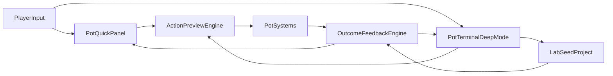

# FUN IMPROVEMENTS v.01

## Obiettivo
Rendere il gameplay più comprensibile e umano per chi entra nella nicchia, mantenendo la profondità per i giocatori hardcore tramite un design a livelli (quick actions, spiegazione causale, dettaglio avanzato).

## Scope concordato
- Workstream A: Terminal Pot ibrido (focus operativo per singolo pot + terminale profondo).
- Workstream B: Chiarezza Condizione pianta (stato, driver, conseguenze, azioni consigliate).
- Workstream C: Chiarezza pH/additivi/fertilizzanti (target vs attuale, warning, compatibilità).
- Workstream D: Lab come loop scientifico concatenato ("Progetto Seme").
- Workstream E: Analisi combinazioni + intento progetto consigliato (Replica / Ibrido / Nuovo Profilo, senza vincoli).

## Vincolo trasversale (obbligatorio)
- Non creare nuovi sistemi gameplay/runtime.
- Lavorare per collegare e orchestrare sistemi/HUD già esistenti.
- Unica eccezione ammessa: introduzione del concetto/flow `LOOP NUOVO SEME` come regia UX del percorso lab (senza nuova simulazione sottostante).

## Architettura funzionale (target)

## Workstream A — Terminal Pot (priorità 1)
### A.1 Contratto azioni
- Definire matrice unica: azioni da quick buttons vs azioni solo terminale (`PLANT`, `UPROOT`, `HARVEST`, `STATUS`, `NOTE`, `CRYO`).
- Evitare duplicazioni ambigue tra pannello rapido e terminale.

### A.2 Pot Focus Panel (sinistra)
- Stato sintetico sempre visibile: condizione corrente, rischio principale, opportunità principale.
- 6 quick actions con anteprima outcome prima della conferma.
- Set quick actions confermato:
  - `WATERING ON/OFF`
  - `LED BLUE ON/OFF`
  - `LED RED ON/OFF`
  - `FERTILIZE`
  - `SPRAY` (additivi pH)
  - `PRUNE`
- Comportamento confermato per bottoni con scelta tipo:
  - `FERTILIZE`: apre mini-selettore tipo fertilizzante (Standard/Pure/Prohibited) con preview impatto.
  - `SPRAY`: apre mini-selettore additivo con preview delta pH e impatto atteso.

### A.3 Preview + feedback causale
- Standard pre-click: costo (Azioni/CRY/item), impatto atteso, rischio.
- Standard post-click: "Hai fatto X -> effetto Y -> motivo Z".
- Vincolo UX: nessun automatismo opaco su `FERTILIZE`/`SPRAY`; il player sceglie sempre la variante nel mini-selettore.

### A.4 Integrazione con terminale destro
- Mantenere il terminale come layer profondo con comandi avanzati, info complete e gestione Cryo.
- Garantire terminologia identica tra pannello rapido, output terminale e toast.

### A.5 Specifica operativa dei 6 quick buttons
- `WATERING ON/OFF`
  - `Enabled` quando il pot ha pianta, player in range, e risorse minime (allineato a `CanWater()` / `GetWaterFailureReason()`).
  - Preview: stato corrente `ON/OFF`, costo azione, costo CRY giornaliero implicito se `ON`, impatto previsto su idratazione a fine giorno.
  - Esito: conferma cambio stato + reminder conseguenze economiche giornaliere.
- `LED BLUE ON/OFF`
  - `Enabled` quando il pot ha pianta, player in range, risorse minime (allineato a `CanLight()` / `GetLightFailureReason()`).
  - Preview: stato LED attuale, costo azione, costo CRY notturno stimato, impatto atteso su pH/stress.
  - Warning: evidenziare incompatibilità famiglia LED e rischio stress da uso prolungato.
  - Esito: stato LED aggiornato + variazione prevista su stress/luci.
- `LED RED ON/OFF`
  - Stesse regole del BLUE con copy specifico RED.
  - Preview differenziata su costo notturno stimato e rischio burn più aggressivo.
- `FERTILIZE`
  - `Enabled` quando il pot ha pianta, player in range, risorse minime (allineato a `CanFertilize()` / `GetFertilizeFailureReason()`).
  - Apertura mini-selettore: `Standard`, `Pure`, `Prohibited`.
  - Preview selezione: costo, delta fertilizzante, compatibilità famiglia, impatto stadio (es. Resting -> Flowering), rischio letale.
  - Warning bloccante visivo in caso incompatibile: richiedere conferma esplicita.
  - Esito: applicazione fertilizzante o esito critico coerente con regole runtime.
- `SPRAY` (additivi pH)
  - `Enabled` quando il pot ha pianta, player in range, risorse minime e additivo disponibile (allineato a `CanApplyAdditive()` / `GetApplyAdditiveFailureReason()`).
  - Apertura mini-selettore additivo con preview: delta pH atteso, costo, impatto su range target.
  - Esito: additivo applicato + nuovo orientamento pH (verso/contro target).
- `PRUNE`
  - `Enabled` quando il pot ha pianta, player in range, risorse minime (allineato a `CanPruning()` / `GetPruningFailureReason()`).
  - Preview: costo, probabilità qualitativa successo, impatto atteso su infestazione/resa.
  - Esito: successo/fallimento con motivazione e conseguenze.

### A.6 Regole UX trasversali per quick buttons
- Ogni bottone usa lo stesso schema: `Preview -> Conferma -> Esito causale`.
- Stati bottone previsti: `Enabled`, `Disabled` (con reason tooltip), `Risk` (accento warning), `Critical` (conferma forte).
- Messaggi di errore sempre mappati a reason runtime esistente (`Get*FailureReason`) per evitare divergenze.
- Azioni solo terminale da mantenere: `PLANT`, `UPROOT`, `HARVEST`, `STATUS`, `NOTE`, comandi `CRYO`.
- Convenzione cromatica obbligatoria (come mock allegato):
  - Stato sistema `ON` -> bottone verde.
  - Stato sistema `OFF` -> bottone rosso.
  - Regola da applicare in modo coerente almeno a `WATERING`, `LED BLUE`, `LED RED` (toggle di stato).
  - Il colore comunica lo stato corrente del sistema, non la disponibilità click.

### A.7 Microcopy operativo quick buttons (ITA)
#### Template comune
- Titolo preview: `Azione: <NOME_AZIONE>`
- Blocco costo: `Costo: <N> Azione | <N> CRY | <item se richiesto>`
- Blocco impatto: `Impatto atteso: <effetto breve>`
- Blocco rischio: `Rischio: <nessuno/moderato/alto/critico>`
- Esito standard: `Hai eseguito <azione>. <effetto>. Motivo: <causa principale>.`

#### WATERING ON/OFF
- Normale (preview): `Attiverai il sistema irrigazione su questo vaso. A fine giornata: idratazione più stabile, costo operativo giornaliero attivo.`
- Warning: `Irrigazione ON senza controllo può aumentare rischio muffa nel tempo.`
- Blocco: `Impossibile cambiare irrigazione: {reasonRuntime}.`
- Esito ON: `Irrigazione attivata. Questo vaso riceverà supporto idrico a fine giornata.`
- Esito OFF: `Irrigazione disattivata. Riduci costi, ma aumenta il rischio di idratazione insufficiente.`

#### LED BLUE ON/OFF
- Normale (preview): `Imposterai LED BLUE. Effetto atteso: controllo più stabile, impatto su pH e stress nel tempo.`
- Warning: `Uso prolungato LED aumenta stress luminoso e costi notturni.`
- Risk compatibilità: `LED BLUE non ideale per questa famiglia: efficacia ridotta / rischio aumentato.`
- Blocco: `Impossibile cambiare LED BLUE: {reasonRuntime}.`
- Esito ON: `LED BLUE attivo. Monitorare stress luminoso e costo notturno.`
- Esito OFF: `LED BLUE spento. Stress luminoso in progressivo rientro.`

#### LED RED ON/OFF
- Normale (preview): `Imposterai LED RED. Effetto atteso: spinta più aggressiva su crescita/produzione, con costo e rischio maggiori.`
- Warning: `LED RED prolungato aumenta rapidamente stress burn e costi.`
- Risk compatibilità: `LED RED non ideale per questa famiglia: rischio operativo elevato.`
- Blocco: `Impossibile cambiare LED RED: {reasonRuntime}.`
- Esito ON: `LED RED attivo. Benefici immediati possibili, ma rischio burn in aumento.`
- Esito OFF: `LED RED spento. Ridotta pressione luminosa sul vaso.`

#### FERTILIZE (mini-selettore Standard/Pure/Prohibited)
- Header selettore: `Seleziona fertilizzante`
- Riga opzione: `<Tipo> | Costo: <CRY> | Impatto: +<valore>% fertilità | Compatibilità: <OK/CRITICO>`
- Normale (preview): `Applicherai <tipo>. Possibile avanzamento ciclo (es. Resting -> Flowering) se requisiti rispettati.`
- Warning compatibilità: `Compatibilità incerta: verifica famiglia della pianta prima di confermare.`
- Critical incompatibile: `Pericolo critico: fertilizzante incompatibile. Esito possibile: morte immediata della pianta.`
- Conferma critica: `Confermi applicazione non compatibile? Questa scelta può uccidere la pianta.`
- Blocco: `Impossibile fertilizzare: {reasonRuntime}.`
- Esito successo: `Fertilizzante applicato: <tipo>. Fertilità aggiornata e ciclo rivalutato.`
- Esito critico: `Fertilizzante incompatibile applicato. Pianta persa. Motivo: incompatibilità genetica.`

#### SPRAY (additivi pH, mini-selettore)
- Header selettore: `Seleziona additivo pH`
- Riga opzione: `<Additivo> | Delta pH stimato: <+/-X> | Costo: <N Azione/CRY>`
- Normale (preview): `Applicherai <additivo>. pH previsto: <valore stimato> (direzione: verso target / fuori target).`
- Warning: `Correzione eccessiva può spingere il pH fuori banda utile.`
- Blocco item: `Additivo non disponibile in inventario.`
- Blocco generale: `Impossibile applicare additivo: {reasonRuntime}.`
- Esito: `Additivo applicato. pH orientato <verso/acontro> il range target della pianta.`

#### PRUNE
- Normale (preview): `Eseguirai potatura. Effetto atteso: contenimento rischio infestazione e possibile miglior resa del ciclo.`
- Warning: `La potatura non garantisce successo pieno in ogni condizione.`
- Blocco: `Impossibile potare: {reasonRuntime}.`
- Esito successo: `Potatura riuscita. Stato sanitario migliorato e ciclo ottimizzato.`
- Esito parziale/fallimento: `Potatura eseguita senza beneficio pieno. Motivo: condizioni correnti non favorevoli.`

#### Dizionario reasonRuntime -> copy leggibile
- `Vaso vuoto` -> `Nessuna pianta presente nel vaso selezionato.`
- `Troppo lontano` -> `Avvicinati al vaso per eseguire l'azione.`
- `Azioni insufficienti` -> `Azioni giornaliere insufficienti.`
- `Azioni o CRY insufficienti` -> `Risorse insufficienti (Azioni/CRY).`
- `Additivo non disponibile` -> `Additivo non presente in inventario.`
- `Stato vaso non valido` -> `Stato vaso non disponibile. Riprova dopo aggiornamento.`
- `Azione non permessa` -> `Azione non disponibile nello stato attuale del vaso.`

### A.8 Layout concreto Quick Panel (sinistra)
- Conferma struttura target nella colonna sinistra del Terminal Pot:
  1. `Specimen / Pot identity` (header pianta, famiglia, livello, stage).
  2. `Vital Parameters` (blocchi già presenti: condizione, mold risk, hydration, fertilizer, light stress).
  3. `Quick Actions` (NUOVA area dedicata sotto i vitals con 6 bottoni).
- Decisione di posizionamento: inserire area `Quick Actions` nella parte bassa di `pcv3-left`, subito sotto i due blocchi vitali esistenti.
- Vincolo UI: non comprimere i vital attuali; aggiungere altezza/layout della colonna sinistra per ospitare i bottoni in modo stabile.

### A.9 Modello Quick Panel suggerimenti (come previsto dal piano)
- Il Quick Panel non è un altro HUD globale: è una sezione contestuale dentro il Terminal Pot, legata al pot selezionato.
- Struttura suggerita:
  - Riga 1: `STATO ORA` -> `<CONDIZIONE> <TREND ↑/→/↓>`
  - Riga 2: `DRIVER` -> 2-3 cause principali (es. `Hydration bassa`, `Light stress alto`, `Fertilizer fuori range`)
  - Riga 3: `SUGGERIMENTO RAPIDO` -> frase breve operativa (es. `Correggi prima idratazione, poi LED`)
  - Riga 4: `DETTAGLIO` -> CTA testuale: `Apri STATUS per spiegazione completa`
- Logica d’uso:
  - Nel pannello sinistro: consiglio breve, orientato all’azione immediata.
  - Nel terminale `STATUS`: spiegazione estesa e motivazioni complete.
- Obiettivo UX:
  - Il player capisce in 2-3 secondi cosa fare adesso.
  - La profondità hardcore resta disponibile nel layer terminale.

### A.10 Vincolo implementativo A9 (no nuove logiche)
- A9 va creato come gruppo UI interno a `PlantCardV3` (UXML/USS del terminale), così da poter essere riposizionato manualmente in editor per match con background.
- Vincolo tecnico: nessun nuovo sistema gameplay, nessun nuovo calcolo persistente, nessuna nuova metrica inventata.
- Approccio: solo binding/aggregazione di dati già presenti e già funzionanti.

### A.11 Parametri A9 da mostrare (solo dati esistenti)
- `STATO ORA`
  - `Condizione`: da `PotStateModel.ConditionLabel` (con fallback/normalizzazione già usata nel terminale via helper condizione).
  - `Trend`: da `PotStateModel.ForecastDirection` (`↑ / → / ↓`).
- `DRIVER` (max 3, sintetici)
  - `Hydration`: da `PotStateModel.Hydration` -> percentuale tramite `PlantCardCalculators.CalculateHydrationPercent(...)`.
  - `Fertilizer`: da `PotStateModel.FertilizerLevel`.
  - `Light stress`: da giorni LED consecutivi (`GetConsecutiveLedDays()`) + `MaxDaysForFullStress`.
  - `Mold risk`: da `PotStateModel.MoldRiskLevel`.
  - Regola: i 3 driver mostrati sono selezionati tra questi indicatori già presenti in UI/STATUS.
- `AZIONE CONSIGLIATA` (testo breve)
  - Derivata dalle stesse regole già usate in `STATUS` (range stage requirements + stato corrente), senza nuove formule.
- `APPROFONDISCI`
  - CTA fissa: rimando a comando `STATUS` esistente.

### A.12 Collegamenti necessari (wiring)
- UXML:
  - aggiungere gruppo `A9` nella colonna sinistra (tra vital e quick actions), con id dedicati per: stato, trend, driver, actionHint, statusCta.
- USS:
  - stile compatto coerente con terminale CRT; nessuna nuova palette custom fuori linee guida già in uso.
- Controller:
  - aggiornare `PlantCardV3TerminalController` in `Refresh` del pot selezionato per valorizzare i campi A9 con i dati sopra.
  - riuso funzioni/helper esistenti già utilizzate da `RefreshVitalBlocks` e `STATUS` (no duplicazione algoritmica).
- Eventi update:
  - A9 si aggiorna sugli stessi trigger già usati dal terminale quando cambia il pot selezionato o quando arrivano `PotEvents` di update stato.

### A.5 File principali da usare
- [Assets/_Project/Scripts/UI/UIToolkit/PlantCardV3/PlantCardV3TerminalController.cs](Assets/_Project/Scripts/UI/UIToolkit/PlantCardV3/PlantCardV3TerminalController.cs)
- [Assets/_Project/UI/UIToolkit/PlantCardV3/PlantCardV3_Terminal.uxml](Assets/_Project/UI/UIToolkit/PlantCardV3/PlantCardV3_Terminal.uxml)
- [Assets/_Project/UI/UIToolkit/PlantCardV3/PlantCardV3_Terminal.uss](Assets/_Project/UI/UIToolkit/PlantCardV3/PlantCardV3_Terminal.uss)
- [Assets/_Project/Scripts/Dome/PotActions.cs](Assets/_Project/Scripts/Dome/PotActions.cs)

## Workstream B — Condition Clarity (priorità 2)
### B.1 Dizionario stati condizione
- Formalizzare per ogni condizione: definizione breve, trigger principali, effetti gameplay reali.

### B.2 Driver in tempo reale
- Mostrare i 3 driver più impattanti che stanno spingendo la condizione (su/giù).
- Decisione confermata: modello visualizzazione `state_plus_delta`:
  - stato principale (es. `SANA`, `STRESSATA`, `APPASSITA`);
  - trend sintetico `↑ / → / ↓`;
  - 3 driver principali;
  - niente punteggio numerico nel pannello rapido.

### B.3 Suggerimenti azionabili
- Per ogni stato: massimo 2 azioni consigliate ad alto impatto.
- Decisione confermata: stile `terminal_linked`:
  - nel pannello rapido solo suggerimento breve e prioritario;
  - spiegazione estesa e motivazioni complete nel terminale `STATUS`.

### B.4 File principali da usare
- [Assets/_Project/Scripts/Dome/PotSystem/Condition/PlantConditionSystem.cs](Assets/_Project/Scripts/Dome/PotSystem/Condition/PlantConditionSystem.cs)
- [Assets/_Project/Scripts/Dome/PotSystem/Growth/ConditionGrowthModifier.cs](Assets/_Project/Scripts/Dome/PotSystem/Growth/ConditionGrowthModifier.cs)
- [Assets/_Project/Scripts/UI/UIToolkit/DomeStatusHUD/DomeStatusHUDController.cs](Assets/_Project/Scripts/UI/UIToolkit/DomeStatusHUD/DomeStatusHUDController.cs)

## Workstream C — pH, Additivi, Fertilizzanti (priorità 3)
### C.1 pH target vs pH corrente
- Introdurre visualizzazione distanza dal target utile per il pot selezionato.
- Decisione default (in assenza di override): `direction_plus_distance`.
  - Mostrare: `ALZA` / `ABBASSA` / `OK` + distanza qualitativa `VICINO` / `MEDIO` / `LONTANO`.
  - Nessun nuovo calcolo persistente: derivare da dati già usati in TopBar/PhSystem e PlantData del pot selezionato.

### C.2 Guida contestuale additivi
- Suggerire quando correggere il pH e con quale direzione (senza bloccare il layer hardcore).
- Mini-selettore `SPRAY` usa solo varianti esistenti:
  - `AdditiveBasic` (drift +5),
  - `AdditiveAcid` (drift -5).
- Preview per opzione:
  - direzione pH risultante rispetto al target del pot,
  - costo azione/risorse già previste,
  - impatto secondario muffa (già implementato in runtime).
- Nessun nuovo comportamento gameplay: solo esposizione chiara degli effetti già presenti in `DoApplyAdditive()`.

### C.3 Compatibilità fertilizzanti e fail-safe UX
- Esporre matrice compatibilità in UI contestuale.
- Rafforzare warning e conferma su azioni letali.
- Policy default (in assenza di override): incompatibile consentito ma con `double_confirm_allow`.
  - Step 1: warning critico rosso con esito atteso (`morte immediata`).
  - Step 2: conferma finale esplicita prima di invio comando.
- Matrice compatibilità da mostrare (solo da `FertilizerSystem.IsFertilizerCompatible`):
  - `Standard plant` -> solo `Standard`;
  - `Pure plant` -> `Pure` o `Standard`;
  - `Evil plant` -> `Prohibited` o `Standard`.
- Nessuna logica nuova: il risultato resta quello runtime già esistente in `DoFertilize()`.

### C.4 Parametri UI C da collegare (esistente)
- Sorgenti dati:
  - pH corrente/banda/drift: `PhSystem` (+ tooltip TopBar già operativo),
  - affinità target pianta: `PlantData` (range ottimale),
  - additivi disponibili: `Inventory` (`Items.AdditiveBasic`, `Items.AdditiveAcid`),
  - fertilizzante e compatibilità: `FertilizerSystem` + `PotActions.DoFertilize`.
- Output quick panel:
  - stato pH sintetico (`ALZA/ABBASSA/OK + VICINO/MEDIO/LONTANO`),
  - CTA `SPRAY` con mini-selettore e preview,
  - CTA `FERTILIZE` con mini-selettore, compatibilità e doppia conferma se rischio critico.
- Output terminale:
  - `STATUS` resta fonte dettagliata (range, valori, motivazioni complete).

### C.5 Allineamento tooltip TopBar (obbligatorio)
- Aggiornare i tooltip TopBar (a partire dal pH) per coerenza con il modello Quick Panel:
  - prima messaggio decisionale sintetico (azione consigliata),
  - poi dettaglio tecnico già presente (modificatori, drift, breakdown).
- Vincoli:
  - nessuna nuova formula o nuovo sistema dati;
  - solo riordino/normalizzazione copy e wiring su dati già esistenti in `TopBarController` / `PhSystem`.
- Obiettivo:
  - stesso linguaggio operativo tra TopBar, DomeStatusHUD e PlantCardV3.

### C.4 File principali da usare
- [Assets/_Project/Scripts/Core/PhSystem.cs](Assets/_Project/Scripts/Core/PhSystem.cs)
- [Assets/_Project/Scripts/UI/UIToolkit/HUD/TopBarController.cs](Assets/_Project/Scripts/UI/UIToolkit/HUD/TopBarController.cs)
- [Assets/_Project/Scripts/Dome/PotSystem/Fertilizer/FertilizerSystem.cs](Assets/_Project/Scripts/Dome/PotSystem/Fertilizer/FertilizerSystem.cs)
- [Assets/_Project/Scripts/Dome/PotActions.cs](Assets/_Project/Scripts/Dome/PotActions.cs)

## Workstream D — Lab come progetto concatenato (priorità 4)
### D.1 Introduzione entità "Progetto Seme"
- Tracciare obiettivo del ciclo (stabilità/resa/adattamento) e progresso cross-step.
- Decisione prodotto confermata:
  - modalità duale Lab:
    - `Uso singolo macchinario` (come ora): il player può entrare in un solo pannello e fare una sola operazione.
    - `Crea Nuovo Seme` (flow guidato): avvio esplicito da interfaccia centrale Lab che orchestra l'intero loop.
  - nuovo `Terminale Lab` (interfaccia operativa dei sistemi Lab) distinto dal terminale Pot:
    - mostra panoramica macchinari/pannelli,
    - espone CTA principale `CREA NUOVO SEME`,
    - consente accesso diretto ai singoli macchinari senza forzare il loop completo.
  - nessuna nuova simulazione: solo orchestrazione UX dello stato già presente.
  - vincolo esplicito: usare e collegare solo i pannelli/macchinari/HUD già esistenti.
  - flow utente confermato:
    - se il player vuole usare un solo macchinario: entra nel pannello panoramico Lab e apre il singolo macchinario desiderato;
    - se il player vuole creare un nuovo seme: avvia `CREA NUOVO SEME`, segue step guidati e lavagna aggiornata.

### D.2 Pipeline unica visibile
- Unificare in un solo flusso: Frutto -> Spora -> Maturazione -> Fusione -> Pre-seme -> Incubazione.
- Stato step (solo dati esistenti):
  - `Da fare`
  - `In corso`
  - `Completato`
  - `Bloccato` (manca input/risorsa)
- Regola: lo stato step viene derivato dai controller/payload esistenti (no nuovi sistemi runtime).
- La pipeline guidata si attiva solo nel contesto `CREA NUOVO SEME`; non deve bloccare l'uso standalone dei macchinari.

### D.3 Feedback di progettualità
- Dopo ogni step mostrare avanzamento verso obiettivo, trade-off e rischio accumulato.
- Decisione obiettivo progetto (allineata al gameplay reale):
  - obiettivo manuale selezionabile solo tra:
    - `SEME STABILE`
    - `SEME INSTABILE`
    - `SEME FIXED`
  - non introdurre categorie extra (`resa`, `adattamento`, ecc.) finché non mappate 1:1 in sistemi runtime.
- Feedback a ogni step:
  - mostrare se il progetto si sta allineando o allontanando dall’obiettivo scelto usando metadati già presenti (`GeneticType`, tratti, reagente, famiglia).
  - copy breve nel pannello step; dettaglio esteso nella Lavagna Digitale.
- Quando il player usa un solo macchinario (no progetto attivo):
  - niente forzatura del flusso completo,
  - feedback locale tramite elementi di stato/progresso macchina (coerente con display in-game già integrato).

### D.4 Specifica UX Lavagna Digitale (overview)
- Scopo:
  - dare al player percezione di loop scientifico continuo e non frammentato.
- Regola di attivazione:
  - la `Lavagna Digitale` si attiva solo quando esiste un progetto `CREA NUOVO SEME` in corso.
  - in uso standalone di un macchinario, la lavagna resta nascosta/non protagonista.
- Contenuto minimo:
  - intestazione progetto attivo (`Target: STABILE/INSTABILE/FIXED`),
  - timeline step `Frutto -> Spora -> Maturazione -> Fusione -> Pre-seme -> Incubazione`,
  - stato corrente per ogni step (`Da fare/In corso/Completato/Bloccato`),
  - blocco `Motivo blocco` quando manca input,
  - blocco `Ultimo output` con provenienza/metadati essenziali.
- Vincoli:
  - nessuna nuova regola di crafting o probabilità;
  - solo aggregazione delle informazioni già presenti nei pannelli Lab e in `Item` metadata.

### D.5 UX macchinario standalone (no progetto attivo)
- Ogni macchinario mantiene il comportamento operativo attuale.
- In ogni pannello macchina, mostrare stato locale sintetico:
  - `Idle / InProgress / Completed`,
  - input/output correnti,
  - progresso della lavorazione quando disponibile.
- Usare pattern già presenti (tooltip output, progress text, notification toast, display in-game) senza introdurre nuovi sistemi paralleli.
- Vincolo UI Builder:
  - i pannelli dei singoli macchinari devono restare quelli esistenti (UI Builder attuali);
  - non ricreare pannelli duplicati per il flow guidato;
  - il flow `CREA NUOVO SEME` deve orchestrare gli stessi pannelli già in uso.

### D.4 File principali da usare
- [Assets/_Project/Scripts/Interactables/Extractor.cs](Assets/_Project/Scripts/Interactables/Extractor.cs)
- [Assets/_Project/Scripts/UI/UIToolkit/Lab/LabExtractorPanelController.cs](Assets/_Project/Scripts/UI/UIToolkit/Lab/LabExtractorPanelController.cs)
- [Assets/_Project/Scripts/UI/UIToolkit/Lab/LabCatalizzatorePanelController.cs](Assets/_Project/Scripts/UI/UIToolkit/Lab/LabCatalizzatorePanelController.cs)
- [Assets/_Project/Scripts/UI/UIToolkit/Lab/LabFusionPanelController.cs](Assets/_Project/Scripts/UI/UIToolkit/Lab/LabFusionPanelController.cs)
- [Assets/_Project/Scripts/UI/UIToolkit/Lab/LabIncubatorPanelController.cs](Assets/_Project/Scripts/UI/UIToolkit/Lab/LabIncubatorPanelController.cs)
- [Assets/_Project/Scripts/Core/ItemsSystem/ItemFabric.cs](Assets/_Project/Scripts/Core/ItemsSystem/ItemFabric.cs)

## Workstream E — Analisi risorse + tipologia progetto (priorità 5)
### E.1 Analisi iniziale al click "CREA NUOVO SEME"
- Avviare una breve fase di analisi con progress bar nel `LabTerminalPanel`.
- Leggere disponibilità frutti da inventario player + `SeedStorage`.
- Leggere disponibilità reagenti X/Y da inventario player + `SeedStorage`.
- Nessuna nuova simulazione: solo lettura dati già disponibili.

### E.2 Tipologia "intent" (non vincolante)
- Mostrare tre intenti: `Replica`, `Ibrido`, `Nuovo Profilo`.
- Ogni intento espone:
  - stato disponibilità "ora" (disponibile/non disponibile),
  - consiglio operativo sintetico,
  - possibilità di cambio in qualsiasi momento durante il progetto.
- Regola UX: "Il sistema consiglia, il player decide".

### E.3 Reminder dinamici per step Lab
- Per ogni step (`Extractor`, `Catalizzatore`, `Fusion`, `Incubator`) mostrare reminder allineato all'intento selezionato.
- Mostrare avviso non punitivo in caso di cambio direzione in corso.
- Nessun lock su pannelli/macchinari esistenti e nessun vincolo extra oltre a quelli runtime già presenti.

## Sequenza esecutiva
1. Eseguire Workstream A end-to-end e validare in playtest rapido.
2. Integrare Workstream B sulla stessa superficie UI del Pot.
3. Inserire Workstream C con warning/suggerimenti contestuali.
4. Aggiornare i tooltip TopBar per allineamento UX/copy ai nuovi pattern (senza nuove logiche).
5. Costruire Workstream D come esperienza di loop di progetto.
6. Passata finale di coerenza copy/terminologia e bilanciamento.

## Sequenza task implementativi (fine-grained)
### Fase 1 — Pot Terminal (A + B + C, solo wiring)
1. Aggiornare layout `PlantCardV3_Terminal`:
   - aggiunta area A9 (suggestion) e area `Quick Actions` sotto i vitals.
2. Collegare i 6 bottoni rapidi ai metodi esistenti in `PotActions`:
   - `WATERING`, `LED BLUE`, `LED RED`, `FERTILIZE` (picker), `SPRAY` (picker), `PRUNE`.
3. Implementare preview/esito con reason runtime esistenti (`Get*FailureReason`).
4. Collegare A9 ai dati già presenti (`ConditionLabel`, `ForecastDirection`, Hydration%, FertilizerLevel, MoldRisk, stress LED).
5. Integrare Workstream C nel quick panel:
   - stato pH sintetico (direzione + distanza),
   - preview additivi/fertilizzanti con warning critico e doppia conferma su incompatibilità.

### Fase 2 — Lab modalità duale (D, solo orchestrazione UI)
1. Introdurre `Terminale Lab` come pannello panoramico operativo (routing, non nuova simulazione).
2. Collegare accesso ai pannelli esistenti:
   - `LabExtractorPanelController`,
   - `LabCatalizzatorePanelController`,
   - `LabFusionPanelController`,
   - `LabIncubatorPanelController`.
3. Aggiungere CTA `CREA NUOVO SEME` che attiva il flow guidato tra gli stessi pannelli.
4. Attivare `Lavagna Digitale` solo con progetto attivo; in standalone resta nascosta/non primaria.
5. Collegare stato step (`Da fare/In corso/Completato/Bloccato`) da dati già presenti nei controller/item metadata.

### Fase 3 — Coerenza e polish
1. Unificare copy e codici esito tra quick panel, terminale, toast.
2. Verificare mapping colori stato ON/OFF su toggle.
3. Allineare comportamento tooltip e status dettagliato senza duplicare regole.

## Definition of Done per iterazione
- Comprensione esito azione aumentata (test qualitativo guidato).
- Nessuna regressione del layer hardcore (info avanzate sempre disponibili).
- Copy e segnali visivi coerenti tra quick panel, terminale, toast e HUD.

## QA checklist (manuale, basata su setup test esistente)
### QA-A Pot quick panel
- Verificare per ogni bottone rapido:
  - stato `ON` verde / `OFF` rosso (dove applicabile),
  - preview coerente con costo/effetto reale,
  - reason di blocco coerente con runtime (`Get*FailureReason`),
  - esito causale mostrato dopo azione.
- Verificare A9:
  - stato+trend coerenti al pot selezionato,
  - driver aggiornati dopo azioni e fine giornata,
  - CTA `STATUS` sempre disponibile.

### QA-C pH/additivi/fertilizzanti
- `SPRAY`:
  - `AdditiveBasic` mostra effetto verso `+5`,
  - `AdditiveAcid` mostra effetto verso `-5`,
  - fallback errori inventario/risorse corretto.
- `FERTILIZE`:
  - compatibile -> applicazione normale,
  - incompatibile -> warning critico + doppia conferma,
  - esito runtime invariato (incompatibile letale) e feedback coerente.
- pH quick status:
  - direzione (`ALZA/ABBASSA/OK`) e distanza qualitativa coerenti ai dati correnti.

### QA-D Lab dual mode
- Modalità standalone:
  - apertura singolo macchinario dal pannello panoramico senza avvio progetto.
  - stato locale macchina visibile (`Idle/InProgress/Completed`).
- Modalità `CREA NUOVO SEME`:
  - avvio flow guidato,
  - progressione step su pannelli esistenti,
  - lavagna attiva solo con progetto in corso.
- Verificare che i pannelli UI Builder esistenti siano riusati (nessun duplicato funzionale).

### QA regressione progetto (riuso test già presenti)
- Seguire setup e smoke test in:
  - [Assets/_Project/Docs/SETUP_UNITY_PRIMA_DEI_TEST.md](Assets/_Project/Docs/SETUP_UNITY_PRIMA_DEI_TEST.md)
  - [Assets/_Project/Docs/SAVE_LOAD_TEST.md](Assets/_Project/Docs/SAVE_LOAD_TEST.md)
- Validare save/load dopo modifiche UI flow:
  - nessuna perdita stato su inventory, pot state, lab output/progress.

## KPI di verifica (qualitativi + operativi)
- `KPI-01 Comprensione esito azione`:
  - target: player sa spiegare cosa è successo e perché dopo un click quick action.
- `KPI-02 Riduzione errori inconsapevoli`:
  - target: meno casi di fertilizzazione incompatibile senza comprensione del rischio.
- `KPI-03 Accesso duale Lab`:
  - target: completare sia task singolo macchinario sia loop `CREA NUOVO SEME` senza confusione.
- `KPI-04 Profondità preservata`:
  - target: tutte le info avanzate restano disponibili via `STATUS`/pannelli dettagliati.

## Pre-dev audit completato (stato codice attuale)
### Regole Cursor verificate e recepite
- `ui-hud-foundation-ui-builder-parity`: nessun binario parallelo builder/runtime; editing su stessi elementi runtime; evitare duplicati `sample/preview` non necessari.
- `architecture-runtime-services` + `gameplay-runtime-patterns`: no nuovi `FindObjectOfType` runtime, usare `ServiceContainer`/registry, non spostare logica gameplay nei controller UI.
- `new-feature-extension-paths`: `PotActions` resta facade, `DayCycleController` resta orchestratore; le estensioni devono delegare/riusare servizi esistenti.

### Sistemi analizzati (copertura)
- Notifiche:
  - Foundation (`FoundationNotificationService`, runner, watchers, mutation watcher, lore scheduler),
  - stack legacy/fallback (`ToastNotificationManager`, `HUDNotificationFeedManager2.0`, `UINotification`),
  - punti emissione Dome/Lab principali.
- DomeStatusHUD e tooltip:
  - data flow da `DomePotRegistry`, `PotStateModel`, `PlantData`, `PhSystem`, `BotanicalPowerFacade`,
  - comportamento hover/cursor e tooltip host.
- PlantCardV3 terminal:
  - struttura UXML/USS attuale (no quick buttons nativi),
  - wiring `PotActions`/queue/automation esistente.
- Lab panels:
  - Extractor/Catalizzatore/Fusion/Incubator standalone,
  - progress state, metadata propagation, toasts.

### Rischi reali identificati (da gestire in sviluppo)
- Doppie notifiche se si mescolano Foundation e fallback nello stesso evento.
- Divergenza numerica possibile tra superfici UI (es. alcune metriche pH/tooltip se non si riusa la stessa funzione di “shown value”).
- In Lab, stato processo eterogeneo tra macchine (alcuni step gestiti nei panel controller): il Terminale Lab deve orchestrare senza duplicare state machine.

### Guardrail anti-rottura / anti-duplicato (vincolanti)
- Ogni quick action deve passare dai metodi esistenti (`PotActions` + validator/reason già presenti).
- Nessuna nuova formula gameplay per condizioni/pH/fertilizzanti/lab: solo esposizione e linking.
- Nessuna duplicazione pannelli Lab: riuso dei pannelli UI Builder attuali.
- Nessun nuovo canale notifiche parallelo: priorità Foundation, fallback solo dove già previsto.
- QA regressione obbligatoria su setup Unity + save/load + cicli lab/pot prima del merge.