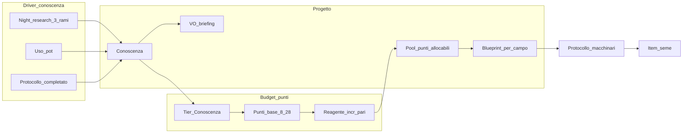

# Laboratorio Sporae — visione unificata e aggancio al repo (LAB 4.0)

**LAB 4.0** è il nome del **pacchetto UX/UI** Blueprint Lab in questo piano: sequenza terminale + esecuzione + **due chiusure possibili** (outcome positivo / negativo), con mockup canonici `LAB40_*.png` in [`Assets/Docs/Design/`](../../Assets/Docs/Design/). **Ingresso in scena:** interazione con un **GameObject** del laboratorio che apre il flusso LAB 4.0 (terminale / pannello dedicato — implementazione su `UIDocument` o bridge esistente). Le **regole** economiche (punti, Conoscenza, reagenti pari, slot unico, ecc.) restano nel documento sotto. Altri **GameObject** già presenti nel lab continuano ad aprire i **singoli macchinari** per uso **spot** quando **non** c’è un protocollo blueprint attivo. Dove i vecchi `MOCKUP_BLUEPRINT_*` coincidono con Schermata 1–2, il **riferimento primario** resta ai **LAB40_***.

## LAB 4.0 — Sequenza schermate (ordine giocatore)

| Fase | Contenuto | Mockup / asset |
|------|------------|----------------|
| **Schermata 1** | Protocollo — onboarding | [`LAB40_SCHERMATA1_PROTOCOLLO_GENOSCRITTORE.png`](../../Assets/Docs/Design/LAB40_SCHERMATA1_PROTOCOLLO_GENOSCRITTORE.png) |
| **Gate materiale** | Check esistente → **inventario** → scelta **frutto XOR spora** | — (UI inventario già in gioco + overlay terminale se serve) |
| **Schermata 2** | Progettazione seme — **SIGILLA PROTOCOLLO** | [`LAB40_SCHERMATA2_PROGETTAZIONE_SEME.png`](../../Assets/Docs/Design/LAB40_SCHERMATA2_PROGETTAZIONE_SEME.png) |
| **Schermata 3** | **ESECUZIONE PROTOCOLLO** — 4 step + **CONFERMA** a ogni step completato | [`LAB40_SCHERMATA3_ESECUZIONE_PROTOCOLLO.png`](../../Assets/Docs/Design/LAB40_SCHERMATA3_ESECUZIONE_PROTOCOLLO.png) |
| **Outcome positivo** | **PROTOCOLLO COMPLETATO** — **Ritira Seme**, **CHIUDI**; **Diario + archivio esperimento** al **ritiro**, non all’apertura schermata | [`LAB40_SCHERMATA4_PROTOCOLLO_COMPLETATO.png`](../../Assets/Docs/Design/LAB40_SCHERMATA4_PROTOCOLLO_COMPLETATO.png) |
| **Outcome negativo** | **PROTOCOLLO CONCLUSO** — stesso schema (**Ritira Seme** ovunque per ora), **CHIUDI**; **Diario + archivio** al **ritiro** | [`LAB40_SCHERMATA4_OUTCOME_NEGATIVO.png`](../../Assets/Docs/Design/LAB40_SCHERMATA4_OUTCOME_NEGATIVO.png) |

La **lavagna 3D** in scena ([`REF_LAB_LAVAGNA_PROCESSO_SCENICO.png`](../../Assets/Docs/Design/REF_LAB_LAVAGNA_PROCESSO_SCENICO.png)) resta il **ancora ambientale** (sprite/anim); i dati devono coincidere con **Schermata 3** (single source of truth in `SeedProject` / servizio protocollo).

## Accordi di design (brainstorming concordato, tono discorsivo)

### Il “clima” che il giocatore deve sentire

Non si tratta di “hai sbloccato +20% di successo”. Si tratta di **capire sempre meglio cosa si sta rischiando**: all’inizio il sistema parla per allusioni e punti interrogativi grossi; con il tempo **stessa incertezza di fondo può restare**, ma il briefing diventa **più onesto e più stretto** su dove sta il rischio e dove no. Il giocatore **non compra il risultato**: impara a **leggere** l’esperimento. La randomicità può essere la stessa in due momenti diversi; cambia **quanto ti senti illuso vs informato**.

**Esempio narrativo concordato:** stesso incrocio “azzardato”, biologo inesperto → *“potrebbe essere interessante o un casino, non ho dati”*; biologo esperto → *“qui mutazione alta, compatibilità media, rischio instabilità alto; se vuoi stabilità, sposta l’asse X”* — senza promettere il seme perfetto.

**Tamagotchi / vasi:** curare e osservare piante **alimenta** il fantasy del sapere (non solo numeri astratti): più hai *visto* comportamenti in vaso, più il laboratorio può riflettere familiarità in briefing e previsioni, quando il design lo collegherà ai driver di Conoscenza.

**Fallimenti “ricchi”:** non solo spazzatura — **il mondo risponde** e quel riscontro può diventare progressione (log, semi instabili interessanti, dati per il passo dopo), coerente con l’idea che **anche senza buco nella ciambella** resti qualcosa da mettere nel quaderno.

### Da cosa nasce il valore “Conoscenza” (TopBar)

**Concordato:** il valore sotto la label **CONOSCIENZA** nella TopBar è alimentato da:

- **Ricerca notturna:** i **tre rami dell’albero** contribuiscono **alla pari** alla Conoscenza (stesso peso percepito dal giocatore; eventuali differenze future possono restare su *premi narrativi/wiki*, non sull’incremento base se si vuole evitare meta di un solo ramo).
- **Statistiche di utilizzo dei Pot** (osservazione/cura/gioco tamagotchi nel dome).
- **Statistiche di utilizzo del Lab / macchinari.**

**Protocollo portato a output** fino al **ritiro:** **+Conoscenza** (o equivalente) quando il giocatore preme **Ritira Seme** e il protocollo viene **archiviato** come esperimento passato; l’ammontare è **maggiore** se l’outcome è **successo** e **minore** se **fallimento / instabile** (taratura GDD). **Abbandono** o interruzione **senza** esito / senza ritiro finale coerente → nessun reward su quella leva.

**Progetto non portato a termine:** **nessun accumulo** su “protocollo completato” se **abbandono esplicito** senza arrivare a outcome+ritiro, o interruzione senza esito finale. **Consumo a SIGILLA:** dopo il sigillo i materiali di partenza sono **già scalati**; l’abbandono in corso d’opera **non** li restituisce. **Prima del SIGILLA** non vige quel consumo. (Uso lab **senza** progetto attivo: macchinari spot.) *Se non chiudi il cerchio con ritiro/archiviazione come da spec, non conta come esperienza completata su quel percorso.*

**Nota di guardrail (GDD):** eventuale **floor minimo** (passi che consumano risorse significative) per evitare loop di protocolli vuoti — dettaglio anti-abuso, **opzionale** alla v1.

### Fase progettazione seme: focus, metadati e “carta” (discorsivo + tecnico)

**Fantasia centrale:** il biologo **non riempie un form sterile**: compone un **progetto** — come su carta da laboratorio — che poi la catena macchinari mette in esecuzione. Si vuole **innamorare gli smanettoni** che cercano creazioni **personali** da mostrare o condividere con la **community** (screenshot, ricette, storie di semi): la UI deve evocare **making** e **progettazione**, non solo elenchi.

**Spostamento verso l’alto (rispetto a oggi):** molte scelte che oggi vivono soprattutto nell’**incubatore** (famiglia, poteri, profilo cure, nome, ecc.) si portano nella **fase progetto / lavagna**: lì il giocatore **seleziona i target** coerenti con ciò che la pipeline **frutto → spora → pre-seed → seme** già esprime come metadati (`Item`, [`ItemFabric`](../../Assets/_Project/Scripts/Core/ItemsSystem/ItemFabric.cs), [`LabIncubatorPanelController`](../../Assets/_Project/Scripts/UI/UIToolkit/Lab/LabIncubatorPanelController.cs)). L’incubatore resta **esecuzione** del protocollo; il **blueprint** nasce prima.

### Dalla Lavagna digitale al **Blueprint genetico** — scansione e **scelta giocatore**

**LAB 4.0:** **rimuovere** dal flusso terminale LAB 4.0 la UI e il percorso obbligatorio **Replica / Hybrid / NewProfile** (`SeedProjectType` in [`LabTerminalPanelController`](../../Assets/_Project/Scripts/UI/UIToolkit/Lab/LabTerminalPanelController.cs)). **È il giocatore** che decide sulla **Progettazione seme**. Il **check** post-**SCANSIONA** deve risolversi in “**materiale idoneo disponibile?**” + **inventario** (frutto XOR spora); se il giocatore **chiude l’inventario senza selezionare**, **nessun avanzamento**: il protocollo **non è processabile** finché non c’è una scelta valida. `BuildProjectTypeAnalysis` va **smontato o rimpiazzato** da questo gate senza reintrodurre i tre tipi come scelta esplicita.

**Collegamento al nuovo sistema:**
- **Dopo SCANSIONA INVENTARIO:** **check** → se OK → **inventario**; **chiusura senza selezione** = **stop** (nessun avanzamento). Scelta **frutto XOR spora** → **Schermata 2**.
- **Dopo “Sigilla”:** **consumo** ingressi + reagente impegnato (vedi Schermata 2); regola **blocco step** se manca materiale a runtime resta separata; gate iniziale **anticipa** ma **non** sostituisce i controlli a runtime.
- **Naming in UI:** esperienza **Blueprint genetico**; **scansione** = atto narrativo (“il terminale campiona i tuoi materiali”).

**Macro-scelte e random voluto:** il **mockup Progettazione seme (Schermata 2)** — riferimento primario [`LAB40_SCHERMATA2_PROGETTAZIONE_SEME.png`](../../Assets/Docs/Design/LAB40_SCHERMATA2_PROGETTAZIONE_SEME.png); copia legacy [`MOCKUP_BLUEPRINT_LAB_PROGETTAZIONE_SEME.png`](../../Assets/Docs/Design/MOCKUP_BLUEPRINT_LAB_PROGETTAZIONE_SEME.png). L’**implementazione UXML** deve replicare gerarchia e classi di quel layout (parità UI Builder ↔ Play); dettaglio zone e righe blueprint v1 nella sezione dedicata sotto.

**Semantica concordata dei punti (contratto giocatore):**

- **Più punti** su un campo → **maggiore probabilità** che l’outcome rispetti il target scelto per quel campo (**meno vittima del caso** su quell’asse).
- **Meno punti** → più spread / incertezza su quel campo.
- **Zero punti** su quel campo → quel blocco è **totalmente randomico** rispetto alla preferenza del giocatore: non c’è “ancora” progettuale; è **scelta esplicita** di lasciare decidere la genetica / il sistema (sperimentazione veloce, “surprise me”, o focus solo su altri assi).

**Esempio narrativo/tecnico concordato:** mix di spore da **due famiglie** ma si desidera un esito **PURE**: si sceglie il target **PURE** sulla riga eredità e si mettono **molti punti** su quella riga. Non è garanzia deterministica: resta possibile deviazione, ma la **distribuzione** è spostata verso l’intento.

**Tensioni tra campi (narrativa e VO):** se il player spinge al massimo **un asse** (es. eredità) e lascia **zero punti** su un altro (es. poteri), il sistema può e deve poterlo dire — *“Stai forzando la linea; i poteri restano lotteria”* — così i risultati “strani ma coerenti” sono **spiegabili** e non feel di bug.

**Persistenza slot unico (v1 — concordato):** esiste **un solo progetto blueprint** per partita (o per giocatore). Lo stato è **persistito nel save** finché il progetto non è **completato** (protocollo con **esito finale** registrato) o **abbandonato** esplicitamente dal giocatore. Niente multi-progetto parallelo alla v1 salvo revisione GDD.

**“Abbandona progetto” (durante il protocollo):** conferma modale; **si torna al mondo**. **Dopo il SIGILLA**, **frutto/spora/reagente** sono **già stati consumati** (vedi sopra): l’abbandono **non** li restituisce. **Prima del SIGILLA** (bozza): nessun consumo da sigillo; nessuna “perdita” dei tre materiali oltre a lasciare la bozza (come da implementazione). Oltre, eventuali **regole su intermedi/output** non ritirati restano in codice/GDD. **Non** si intende mai la perdita dell’**intero inventario**.

**Inventario vs progetto (risposta questionario):** se mancano i prerequisiti o i materiali previsti dal piano — **blocco** dell’avanzamento (step / azioni pertinenti disabilitati o errore chiaro) finché il giocatore **non ripristina** le condizioni (non si prosegue “in negativo” senza correggere).

**Macchinari con progetto attivo (v1 — concordato):** con un **progetto botanico in corso** (dopo conferma progetto, vedi sotto), i macchinari **non** sono usabili in **modalità spot / libera**. L’interazione lab avviene tramite il **flusso del progetto**: in **esecuzione**, il feedback principale è la **Schermata 3 — Esecuzione protocollo** (fullscreen) **sincronizzata** con la **lavagna scenica** in-world (vedi sezione *Esecuzione protocollo*); non richiedere al player di operare ogni macchina manualmente salvo GDD. Senza progetto attivo resta l’**uso singolo** dei macchinari come oggi.

**Inizio blocco macchinari (risposta questionario — 1A):** il vincolo “no macchine libere” **non** vale durante la bozza sulla lavagna prima della conferma; entra in vigore **solo dopo** che il giocatore conferma **“Crea / avvia progetto”** (etichetta finale in UI da definire). Copy/UI/VO devono spiegare il vincolo. Uscita dal progetto impegnato: solo **protocollo completato con esito** o **Abbandona** (con conferma).

### Esecuzione protocollo (post-sigillo) — **Schermata 3** + lavagna sincronizzata

**Riferimento UI canonico (LAB 4.0):** [`LAB40_SCHERMATA3_ESECUZIONE_PROTOCOLLO.png`](../../Assets/Docs/Design/LAB40_SCHERMATA3_ESECUZIONE_PROTOCOLLO.png). **Riferimento layout ambientale:** [`REF_LAB_LAVAGNA_PROCESSO_SCENICO.png`](../../Assets/Docs/Design/REF_LAB_LAVAGNA_PROCESSO_SCENICO.png) (concept 3D/world-space da allineare alla scena).

**Pipeline numerata (ordine mockup LAB 4.0, = ordine di riferimento anche per asset scena):** **01 Extractor** → **02 Catalizzatore** → **03 Fusion** → **04 Incubator**. In [`LabTerminalPanelController`](../../Assets/_Project/Scripts/UI/UIToolkit/Lab/LabTerminalPanelController.cs) / `_projectBoard` eventuali nomi/ordine legacy vanno **migrati** a questa sequenza. **Nota:** non è richiesto un riallineamento 3D costoso se la disposizione fisica differisce: conta la **coerenza dati** e UI/lavagna.

**Principio:** dopo il sigillo **non** micro-gestione continua dei macchinari; l’esecuzione avanza per **step** e il giocatore **conferma** per sbloccare il successivo quando l’output dello step corrente è pronto.

- **Superficie primaria (fullscreen / terminale):** la **Schermata 3 — Esecuzione protocollo** è il **monitor unico** dello stato: titolo + ref protocollo (es. codice / linea / reagente), indicatori **STATO**, **ALIMENTAZIONE LAB**, **AZIONI OGGI**; quattro pannelli step con stato (**COMPLETATO**, **IN CORSO** con %, **IN ATTESA**); collegamenti visivi tra step; pannello confronto **PROTOCOLLO SIGILLATO** (target bloccanti) vs **PROIEZIONE ATTUALE** (live con semafori deviazioni); barra **PROGRESSO PROTOCOLLO** complessivo, **TEMPO STIMATO RESIDUO** dove serve; **CONFERMA** come CTA per accettare l’output dello step attivo e far avanzare alla f successiva (copy tipo *«Conferma per continuare allo step successivo»*).
- **Single source of truth:** `SeedProject` (o servizio protocollo dedicato) espone **step corrente**, **percentuali**, **snapshot sigillato** e **proiezione aggiornata**; sia la Schermata 3 sia eventuali overlay step-specifici **leggono gli stessi dati**.
- **Lavagna in scena:** **sincronizzata** con quello stato (sprite/anim per lo step attivo, stessa numerazione 01–04). **Tap/interazione lavagna** può **riaprire o focalizzare** la Schermata 3 se il pannello non è in primo piano — **non** una seconda “verità” parallela.
- **Punto di ingresso materiale (frutto e spora):** **entrambi** item validi come partenza. Da **frutto**: step **01 Extractor** operativo. Da **spora**: **01 già COMPLETATO** (skip estrazione); la UI mostra 01 completato e il focus operativo parte da **02**, coerente col mockup scenario “Extractor già fatto”.
- **Parità UI Builder:** intera Schermata 3 in **UXML/USS** (nessun albero solo codice); `.cursor/rules/ui-hud-foundation-ui-builder-parity.mdc`.
- **Terminal / Genoscrittore:** resta hub per **Protocollo, Progettazione, Sigillo**; durante esecuzione il loop principale è **Schermata 3 + lavagna**, salvo eccezioni GDD.

### Budget punti da Conoscenza (scala tier — bozza v1 bilanciabile)

**Concordato:** il **numero di punti disponibili** nella fase progetto dipende dal **livello / tier di Conoscenza**. I reagenti **non** sostituiscono la Conoscenza come leva principale; **allargano il budget** come step opzionale (vedi sotto).

**Tabella di lavoro (valori da tarare in playtest):**

| Tier | Label es. (oppure allineare a stringhe TopBar) | Punti progetto (base) |
|------|-----------------------------------------------|------------------------|
| 1 | Neofita | **8** |
| 2 | Praticante | **12** |
| 3 | Ricercatore | **16** |
| 4 | Botanico | **20** |
| 5 | Senior | **24** |
| 6 | Maestro | **28** |

Curva **leggermente più ripida all’inizio** e **più piatta in alto** (reward early, evitare troppe manopole al massimo progressione).

**Mapping Conoscenza (risposta questionario — 4A):** al giocatore si presentano **solo label / bande** coerenti con la **TopBar CONOSCIENZA** (es. come oggi testuale); **nessun numero raw obbligatorio** in UI per il tier. Sotto il cofano esiste il mapping label/tier → punti base (tabella); i numeri interni restano implementativi.

**Regola di presentazione numerica (concordata):** **budget punti progetto** e **punti base per tier** restano **sempre interi pari** (tabella già tutta pari). **Reagenti (punto 5 — revisione):** non si usano moltiplicatori **1,10 / 1,25** sul totale (potevano dare budget **dispari**). Si usano **incrementi additivi interi, sempre pari**, così `budget = base + incremento` resta **sempre pari** senza regole di arrotondamento ambigue:
- **Reagente X:** `incrementoX` = **minimo intero pari ≥ 10% del base** (nel senso numerico: `2 × ceil((base × 0,10) / 2)`; in implementazione con interi si traduce in modo equivalente e deterministico).
- **Reagente Y:** `incrementoY` = **minimo intero pari ≥ 25% del base** (`2 × ceil((base × 0,25) / 2)`).
Esempi: base **20** → X → **2** (10% esatti); Y → **6** (25% = 5 → prossimo pari 6). base **8** → X → **2** (10% = 0,8); Y → **2** (25% = 2). Il **tetto concettuale** “intorno al +10% / +25%” resta; la forma è **solo incrementi pari**.

**Verifica rapida tier (design, formula sopra):**

| base | incr X | incr Y |
|------|--------|--------|
| 8 | 2 | 2 |
| 12 | 2 | 4 |
| 16 | 2 | 4 |
| 20 | 2 | 6 |
| 24 | 4 | 6 |
| 28 | 4 | 8 |

### Reagenti X e Y: incrementi pari sul budget (v1)

**Concordato:** i reagenti **non** usano più moltiplicatori sul totale; applicano **solo incrementi additivi pari** al **budget base** (vedi paragrafo sopra). **Concettualmente** restano due livelli di potenza (**~10% / ~25%** del base come ordine di grandezza), con **Y** più costoso in risorse di gioco come oggi.

- **Reagente X:** **incrementoX** (pari, definito dalla formula minimo pari ≥ 10% base).
- **Reagente Y:** **incrementoY** (pari, definito dalla formula minimo pari ≥ 25% base).

**Niente oltre queste due forme** per i reagenti sul budget in **v1** — niente terzo moltiplicatore. Il reagente **Y** resta **più costoso** in risorse / opportunità nel gameplay.

**Ordine di calcolo (tecnico):**  
`base = TabellaTier(Conoscenza)` (sempre pari) → `budget = base` oppure `budget = base + incrementoX` oppure `budget = base + incrementoY` (incrementi sempre pari) → **budget finale sempre pari**. **Metabolismo / moduli upgrade** non entrano nel calcolo in **v1** (piano dedicato futuro).

### VO in fase progetto (stile PlantCard / briefing)

**Concordato:** più **Conoscenza** e uso sensato dei **punti** → VO più **calibrato**: non profezia infallibile, ma **intervalli e rischi** più chiari. A Conoscenza bassa: più *“non ho dati / potrebbe”*. Il RNG resta; il VO **non illude**. (Leve aggiuntive fuori scope v1 vedi sopra.)

Coerente con **PlantCardV3** come tono di guida per la “voce” che accompagna il giocatore maker.

### Altri fattori oltre a Conoscenza e punti

**Metabolismo (frutti speciali) e upgrade macchinari (risposta questionario — 9):** **fuori scope** per il **pacchetto lab blueprint v1**; verrà trattato in **piano / milestone dedicata**. Nel design attuale non contano come leve obbligatorie né nel budget UI iniziale.

### Distinzione utile da mantenere

**Mutation Index (TopBar)** = stress / variabilità **ambientale** nel dome. **Conoscenza** = maturità del **biologo**. Assi distinti; possono interagire sul protocollo senza fondersi in testa al giocatore.

### Rarità Item Comune / Raro / Epico (fuori scope v1)

**Decisione:** **non** introdurre in questa fase una **rarità dichiarata sugli Item** (semi o altri stack: Comune, Raro, Epico, ecc.) come sistema di inventario o tooltip obbligatorio. La cosa resta **aperta per sviluppi futuri** se servirà più profondità gameplay o chiarezza “collezionistico / community”. Restano invariati:

- In repo **`PlantData`** espone già **`PlantRarity`** per il **contenuto pianta** — non implica che il **semenon** debba mostrare subito un tier Comune/Raro/Epico.
- La **ambizione** nel blueprint continua a valere come **scommessa sul protocollo** (rischio, costo, instabilità, shape del rullo): **senza** obbligo di etichetta rarità sull’oggetto finché il team non riapre il tema.

---

## Nucleo della visione (arco sintetico)

Il laboratorio resta concettualmente **due modi d’uso**: (A) **flusso LAB 4.0** dal **GameObject terminale** (progetto su carta → protocollo → macchinari in catena, UI Schermate 1–3 + outcome); (B) **uso spot dei macchinari** tramite i **GameObject già esistenti** sulle singole macchine **solo quando non c’è un progetto botanico attivo** (slot blueprint vuoto o concluso/abbandonato) — vedi [`fun_improvements_v.01`](fun_improvements_v.01_77d00442.plan.md), [`DEV_REPORT_0084`](../../Assets/Docs/REPORT/DEV_REPORT_0084_FUN_IMPROVEMENTS_WORKSTREAM_A_E_2026-04-17.md).

Passaggio da “menu crafting” a **ipotesi su carta** → **protocollo** → **macchinari**; **ambizione** nel senso di **soglia di scommessa** (costo, rischio, instabilità, leve sul rullo), **non** “bottone crea epico” e **senza** per ora tier Comune/Raro/Epico come proprietà Item (vedi paragrafo “Rarità Item” sotto).

---

## Flusso giocatore — LAB 4.0 (Schermate 1–3 + **selezione inventario** + **due outcome**)

**Trigger:** interazione con il **GameObject** del laboratorio che espone il flusso **LAB 4.0** (stesso layer UI Foundation / parità Builder) → **Schermata 1 — Protocollo LAB – Genoscrittore**.

**Dopo SCANSIONA INVENTARIO:** il sistema esegue il **check** (servizio derivato / erede della logica oggi in [`LabTerminalPanelController`](../../Assets/_Project/Scripts/UI/UIToolkit/Lab/LabTerminalPanelController.cs), **senza** percorsi Replica/Hybrid/NewProfile). **Se le condizioni sono soddisfatte**, si apre l’**inventario di gioco**: il giocatore **deve** confermare **un frutto XOR una spora**. **Se chiude l’inventario senza selezionare**, **non** si avanza: il protocollo **non è processabile** e si resta sul flusso precedente (es. Schermata 1) senza consumi. Con selezione confermata → **Schermata 2 — Progettazione seme**. Eventuale **loading / overlay** tra check e inventario resta authorabile in UXML (parità Builder).

- **Tipo materiale** determina l’esecuzione: da **frutto** lo step **01 Extractor** è da svolgere; da **spora** è **già COMPLETATO** (pipeline riparte da **02**).
- **Se il check fallisce** (nessun frutto/spora ammissibile) → messaggio chiaro; **non** si apre Progettazione; nessun mockup aggiuntivo richiesto oltre al layer terminale.

### Schermata 1 — Protocollo LAB – Genoscrittore (onboarding)

**Riferimento visivo primario:** [`LAB40_SCHERMATA1_PROTOCOLLO_GENOSCRITTORE.png`](../../Assets/Docs/Design/LAB40_SCHERMATA1_PROTOCOLLO_GENOSCRITTORE.png). Legacy: [`MOCKUP_BLUEPRINT_LAB_PROTOCOLLO_GENOSCRITTORE.png`](../../Assets/Docs/Design/MOCKUP_BLUEPRINT_LAB_PROTOCOLLO_GENOSCRITTORE.png).

- **Comportamento:** schermata **solo informativa** — **nessun** lock macchine, **nessun** consumo; **non** è conferma progetto. Messaggio chiave: **pressioni** sul sistema, non ordini deterministici.
- **CTA primaria:** **SCANSIONA INVENTARIO** → avvia **check** + flusso **inventario** per scelta **frutto o spora** (vedi tabella sequenza), poi **Progettazione**. **Nota asset:** il mockup PNG della Schermata 1 può ancora mostrare etichetta legacy — aggiornare grafica / localizzazione.
- **VO:** fascia in basso (es. *«Il protocollo definisce pressioni. Il seme tenterà di seguirle.»*) — localizzazione e calibrazione Conoscenza come da piano VO.
- **Parità UI Builder ↔ Play** (UXML/USS; nessun albero parallelo solo codice).

#### Mockup — zone UI (Schermata 1)

| Zona | Elementi | Note |
|------|-----------|------|
| Header | **PROTOCOLLO LAB - GENOSCRITTORE**, sottotitolo *Orientamento biologico preliminare*, icona germoglio | Stringhe localizzabili. |
| Colonna sinistra | **MODULO GENOSCRITTORE**, icona esagono + germoglio (es. **VAULT-SEED 7A** come placeholder grafico), barra segmenti **Conoscenza** (mockup 7/10), elica DNA | Legare a progressione reale o a **indicatore leggibile** coerente con TopBar; evitare numeri raw se il GDD impone solo **label** tier. |
| | **Registro Protocolli** **ATTIVO** | Stato UX; opz. collegamento a save/progetto attivo in implementazione. |
| Pannello centrale | Pilastri **INTENZIONE**, **PUNTI**, **POTERI**, **FORECAST** (+ citazioni) | Allineati a: macro-righe blueprint; semantica punti; poteri attivo+passivo; forecast non contratto. |
| | Legenda *punti = vincolo*, *zero punti = deriva*, *forecast = lettura* | Rinforzo contratto giocatore. |
| | Timbro **PROTOCOLLO NON DETERMINISTICO** | Grafica statica / USS. |
| Sidebar destra | **SEQUENZA OPERATIVA:** **PROTOCOLLO** → **PROGETTAZIONE SEME** → **SIGILLA PROTOCOLLO** | Tra Protocollo e Progettazione: **check + scelta in inventario** (frutto/spora); può restare implicito nel breadcrumb o avere micro-copy sul terminale. **SIGILLA** = CTA Schermata 2. |
| Footer | VO + **SCANSIONA INVENTARIO** | Avvia gate inventario. |

### Schermata 2 — Progettazione seme (Blueprint Lab)

**Riferimento visivo primario:** [`LAB40_SCHERMATA2_PROGETTAZIONE_SEME.png`](../../Assets/Docs/Design/LAB40_SCHERMATA2_PROGETTAZIONE_SEME.png) (legacy [`MOCKUP_BLUEPRINT_LAB_PROGETTAZIONE_SEME.png`](../../Assets/Docs/Design/MOCKUP_BLUEPRINT_LAB_PROGETTAZIONE_SEME.png)).

- Schermata **principale** del blueprint: **carta progetto**, allocazione **punti**, macro-campi dal mockup, fino a conferma — CTA **SIGILLA PROTOCOLLO**. **Al momento del SIGILLA:** gli **item di ingresso** (**frutto** e/o **spora** già scelti) e il **reagente** se **impegnato nel progetto** si intendono **consumati** (rimossi dall’inventario o marcati come spesi) — **non** al primo step macchina né solo in abbandono con la stessa semantica.
- **Caso d’uso mostrato nel mockup:** configurazione compilata per replicare un profilo tipo **Arctic Mask** (linea, famiglia PURE, mutazione stabile, pH drift, poteri attivo/passivo): massima ambizione di **copia / allineamento** ai target di riferimento, con pool punti totalmente allocati (24/24 nell’esempio).
- **Dopo la conferma** (`SIGILLA PROTOCOLLO`): il **primo macchinario della catena** entra in lavorazione; il giocatore usa **Schermata 3** durante l’**in progress**, premendo la **CTA di conferma** ogni volta che uno **step è completato**, fino al risultato finale. Poi vede **uno** dei due **pannelli outcome** (positivo o negativo), costruiti in **UI Toolkit / Foundation** con **parità UI Builder** (`.cursor/rules/ui-hud-foundation-ui-builder-parity.mdc`) e workflow **SVILUPPA** quando si implementa.
- Restano valide: **blocco macchinari “spot”** con progetto attivo, **slot unico** persistito, **blocchi inventario** se manca materiale a uno step.

#### Mockup — zone UI e macro-righe v1 (da mappare su `Item` / incubatore)

| # | Blocco UI (mockup) | Controlli | Note implementazione |
|---|--------------------|-----------|----------------------|
| Header | Titolo schermata **PROGETTAZIONE SEME** — modulo **Genoscrittore** | statico / localizzabile | Riga branding; non sostituisce conferma progetto. |
| L1 | **LINEA** | Dropdown/selezione target + descrizione + **costo punti** (es. 06) + scala **5 tacche** ± | Macro-riga “genetic line” / soglia eredità; vincola RNG su asse coerente con `Item`/famiglia. |
| L2 | **FAMIGLIA** | Stesso pattern (es. “Piante Pure”, 04 pt, 4/5) | Allineare a famiglia / alcalinità testuale in metadati esistenti. |
| L3 | **MUTAZIONE GENETICA** | Stesso pattern (es. “Stabile”, 05 pt, 5/5) | Noise / variabilità controllata; tensione con altri assi (VO). |
| L4 | **pH DRIFT** | Stesso pattern (es. “+2 daily”, 03 pt, 2/5) | Coerente con sistema pH / drift già in design tech; binding a dati cura o tratti. |
| Centro | **Elica DNA** + linee verso nodi | Illustrazione + eventuale highlight segmento | Feedback **puramente visivo** in v1 se non esiste ancora animazione dati; stesse classi USS in Builder. |
| R top | **POOL PUNTI** | Budget, **Allocati**, **Liberi** + griglia indicatori (es. 12+12) | `budget = base + reagente` (sempre pari); aggiornare su ogni ± punto sulle righe. |
| R top | **REAGENTE** | Slot flacone **REAG-X** (o Y) + copy effetto | In piano tecnico l’effetto è **incremento additivo pari** sul base; in UI si può mostrare copy amichevole tipo “+10% base” **solo se** numerically equivale al delta reale per quel tier (evitare mismatch col mockup: tarare stringhe o mostrare “+2 punti” ecc.). |
| R mid | **POTERI** — **ATTIVO** e **PASSIVO** | Due sotto-blocchi stesso pattern righe (dropdown, costo, 5 tacche) | Due macro-righe dedicate (non collassare in una sola): poteri testuali / `Item`. |
| R mid | **EFFETTI PREVISTI** | Chip/tag (es. `pH+`, `PURE`, `STABILIZZAZIONE`, `TENSIONE`) | Derivati da selezione corrente (riassunto leggibile); aggiornamento live. |
| Bottom L | **VO** | Ritratto + testo sintesi configurazione | Testo generato/heuristic da controller; calibrazione Conoscenza come da piano. |
| Bottom C | **FORECAST RISULTANTE** | % potenza tratti, nota “Deriva da: …”, barra segmenti, ref codice (es. SPM-24.65-A) | Preview non deterministico: comunicare incertezza; numeri esemplificativi nel mockup. |
| Bottom R | **SIGILLA PROTOCOLLO** | CTA primaria: **consumo** frutto/spora (+ reagente se applicabile) **in questo momento**; avvio progetto impegnato + persistenza slot. |

**Pattern ripetuto:** ogni macro-riga (4 tratti + 2 poteri = **6** blocchi allocazione) condivide lo stesso **template** UXML (classe condivisa + `name` distinti per binding), così l’autore tweakka una volta in UI Builder.

**Nota numerica mockup:** esempio 24 con REAG-X e copy “+10% base” da **22** — coerente col tier **Senior (base 24)** solo se il mockup è stato generico; in implementazione usare **tabella tier + incrementoX** reale e aggiornare asset/testi di riferimento così Pool e chip restano **veritieri**.

### Schermata 3 — Esecuzione protocollo (monitor post-sigillo)

**Riferimento visivo:** [`LAB40_SCHERMATA3_ESECUZIONE_PROTOCOLLO.png`](../../Assets/Docs/Design/LAB40_SCHERMATA3_ESECUZIONE_PROTOCOLLO.png).

- **Quando:** dal **primo step operativo** dopo sigillo finché il protocollo non è terminato (successo o fallimento gestito da GDD). Se l’ingresso è **spora**, **01 Extractor** è già **COMPLETATO** e lo **step attivo** iniziale è **02 Catalizzatore** (salvo edge case inventario).
- **Percentuale e CONFERMA:** la **%** sullo step **in corso** segue la **durata di processo** del macchinario (come oggi in lab). Il giocatore usa **CONFERMA** **a ogni step completato** per accettare l’output e far proseguire la catena (testo *step N → N+1*).
- **Dati dinamici:** **PROIEZIONE ATTUALE** può divergere dal **SIGILLATO** (es. pH drift, potere passivo, assorbimento reagente) con indicatori di allerta/copy; **forecast** può scendere rispetto alla previsione carta.
- **Footer metadata:** es. LAB ID, versione build lab, sessione, stato sistema, temperatura — da allineare a stringhe localizzabili o telemetria light in-game.

#### Mockup — zone UI (Schermata 3)

| Zona | Elementi | Note |
|------|-----------|------|
| Header | **ESECUZIONE PROTOCOLLO**, sottotitolo con ref protocollo (codice / linea / reagente) | Allineare a `SeedProject` / snapshot sigillo. |
| Header dx | **STATO** (es. IN CORSO), **ALIMENTAZIONE LAB**, **AZIONI OGGI** | Legare a energia lab / limite azioni giornaliere se esistono in gameplay. |
| Centro | **Quattro pannelli** 01–04 (Extractor, Catalizzatore, Fusion, Incubator): illustrazione step, stato testuale, **%** su step attivo (= avanzamento **durata processo** macchina, logica già in repo), bullet stato | Ordine **canonico LAB 4.0**; linee/nodi come mockup. |
| Destra | Due colonne **PROTOCOLLO SIGILLATO** vs **PROIEZIONE ATTUALE** (linea, famiglia, mutazione, pH drift, poteri, reagente, forecast) | Righe bindabili 1:1; semafori deviazione in Proiezione. |
| Footer | **STEP ATTUALE** + copy narrativo step; **COSTO AZIONE**; **ENERGIA LAB**; **PROGRESSO PROTOCOLLO** (barra + *N / 4 STEP*); **TEMPO STIMATO RESIDUO**; **CONFERMA** | Tutto authorabile USS; valori da servizio protocollo. |

### Outcome finale — **due pannelli** (positivo / negativo, **da zero in UXML**)

Dopo l’ultimo step (Incubator **04**), **uno** dei due pannelli outcome. **Al momento di Ritira Seme:** si concede l’**Item** creato, il protocollo è **archiviato** come **esperimento passato** e si aggiunge / aggiorna la **voce nel Diario SPORAE** (scheda + VO). **CHIUDI** chiude solo il pannello: **nessun** Diario **né** archiviazione definitiva finché non si **ritira**; stato **pending** in save. Footer utente: **Ritira Seme** + **CHIUDI** (stessa **Ritira Seme** su positivo e negativo per ora).

#### Outcome positivo — **PROTOCOLLO COMPLETATO**

**Riferimento visivo:** [`LAB40_SCHERMATA4_PROTOCOLLO_COMPLETATO.png`](../../Assets/Docs/Design/LAB40_SCHERMATA4_PROTOCOLLO_COMPLETATO.png).

**Ruolo:** chiusura con **esito favorevole** — seme stable, confronto **SIGILLATO vs OUTCOME FINALE**, reward **Conoscenza** al **ritiro** (vedi sopra).

- **Trigger:** stato **completato_ok** (naming codice).
- **Ritira Seme:** consegna **Item**, **archivia** protocollo (esperimento passato), **scrive Diario**; libera slot / pending.
- **CHIUDI:** chiude UI; **stato pending** finché non **Ritira Seme**; alla riapertura LAB 4.0 stessa schermata outcome.

#### Mockup — zone UI (outcome positivo)

| Zona | Elementi | Note |
|------|-----------|------|
| Header | **PROTOCOLLO COMPLETATO**, ref protocollo | |
| Header dx | **STATO: COMPLETATO**, **OUTPUT: DISPONIBILE**, **AZIONI OGGI** | |
| Sinistra | **OUTPUT FINALE — SEME GENERATO**, ID, visual, **100% COMPLETATO** | |
| Centro | Quattro step **COMPLETATO** (01–04) | Stesse etichette della Schermata 3. |
| Destra | **PROTOCOLLO SIGILLATO** vs **OUTCOME FINALE** | Esito forecast vs reale (es. 65% → riuscito 68%). |
| Footer sx | Conoscenza **+N**, protocollo archiviato, output pronto incubatore/inventario | |
| Footer | **Ritira Seme**, **CHIUDI** | Voce Diario + archivio **solo** al **Ritira**. Mockup PNG legacy da aggiornare. |

#### Outcome negativo — **PROTOCOLLO CONCLUSO** (fallito / instabile)

**Riferimento visivo:** [`LAB40_SCHERMATA4_OUTCOME_NEGATIVO.png`](../../Assets/Docs/Design/LAB40_SCHERMATA4_OUTCOME_NEGATIVO.png).

**Ruolo:** esito **negativo** / instabile; **Ritira Seme** + **CHIUDI**; **Diario + archivia esperimento passato** **solo al ritiro** (come il positivo).

- **Trigger:** **completato_ko** / instabilità finale.
- **Ritira Seme:** consegna item, archivia, Diario; libera pending.
- **CHIUDI:** pending; nessun Diario/archivio finché non si ritira.
- **Conoscenza:** al **ritiro**, ammontare **minore** che per successo.

#### Mockup — zone UI (outcome negativo)

| Zona | Elementi | Note |
|------|-----------|------|
| Header | **PROTOCOLLO CONCLUSO** (titolo in **rosso** copy), ref protocollo | Distinto dal “COMPLETATO”. |
| Header dx | **STATO: FALLITO**, **OUTPUT: INSTABILE**, **AZIONI OGGI** | Colori stato da USS (`:failure`). |
| Sinistra | **OUTPUT FINALE — SEME INSTABILE**, ID, visual dark, gauge **INSTABILE** + warning | |
| Centro | Step 01–03 **COMPLETATO**, step **04 INCUBATOR → INSTABILE** | Mockup: warning su 04. |
| Destra | **SIGILLATO** (target verde) vs **OUTCOME FINALE** (testi deviati, arancio/rosso, `!`) | Righe bindabili come Schermata 3. |
| Footer sx | Conoscenza **+N**, archiviato **SI**, output stabile **NO**, dati utili **SI** | Testi coerenti **dopo** il ritiro; in **pending** (solo CHIUDI) adattare copy in implementazione. |
| Footer | **Ritira Seme**, **CHIUDI** | Stesso bottone del positivo. Mockup PNG da aggiornare. |

**Persistenza:** stato `outcome_pending` finché non **Ritira Seme**; integrazione [`DiaryUI.cs`](../../Assets/_Project/Scripts/UI/VaultMap/Diary/DiaryUI.cs) **sul ritiro**. **Implementazione:** rispettare **AGENTS.md**, **ui-hud-foundation-ui-builder-parity**, **architecture-runtime-services**, **SVILUPPA** (Fasi 1–11, font **≥10px**, HUD/modali) quando si tocca UI Toolkit.

**Nota implementativa — fase terminale:** **pre-sigillo:** Schermata **1** → gate **check + inventario (frutto XOR spora)** → Schermata **2**. **Post-sigillo:** Schermata **3** (CONFERMA ogni step) → **pannello outcome** (positivo **o** negativo). Readiness/check da [`BuildProjectTypeAnalysis`](../../Assets/_Project/Scripts/UI/UIToolkit/Lab/LabTerminalPanelController.cs) o **servizio** dedicato (todo `lab-readiness-service`).

---

## Cosa c’è già in repo (evidenza)

**Hub lab / LAB 4.0:** **`GameObject`** in scena collegato al terminale LAB 4.0 (UIDocument + controller); oggi punto codice di riferimento [`LabTerminalPanelController.cs`](../../Assets/_Project/Scripts/UI/UIToolkit/Lab/LabTerminalPanelController.cs) — `_projectBoard`, step macchinari. Flusso completo: **Schermate 1–2** + **gate inventario**, **Schermata 3**, **due outcome**. **Macchinari spot:** altri **GameObject** esistenti aprono i singoli macchinari **fuori** protocollo quando consentito.

**`SeedProject` nel piano vs repo (chiarezza B):** nel documento, **`SeedProject`** indica il **contenitore di design** dello stato del protocollo blueprint (slot unico, snapshot sigillato, step, outcome) — **obiettivo serializzazione** v1. **In repo oggi** **non** esiste una classe C# chiamata `SeedProject` dedicata al save; la logica vive in [`LabTerminalPanelController`](../../Assets/_Project/Scripts/UI/UIToolkit/Lab/LabTerminalPanelController.cs) (es. `_projectBoard`, analisi, progressi). C’è un **`SeedProjectType`** (enum **Replica / Hybrid / NewProfile**) usato dalla **UI legacy** — in LAB 4.0 va **rimosso** dal flusso; lo **stato** unificato convergerà nel contenitore serializzabile previsto dal piano. **Decisione:** **nessun input aggiuntivo** richiesto al team su “come chiamare” il tipo in C#: l’implementazione definisce il nome (es. `LabBlueprintState` / `SeedProjectData`) coerente col save esistente.

**Metadati pipeline:** [`Item.cs`](../../Assets/_Project/Scripts/Core/ItemsSystem/Item.cs) — `GeneticTypeValue`, famiglie, tratti, poteri testuali, `LabCareProfileMetadata`, `ResolvedPlantCodeMetadata`, ecc.

**Incubatore:** [`LabIncubatorPanelController`](../../Assets/_Project/Scripts/UI/UIToolkit/Lab/LabIncubatorPanelController.cs), UXML Lab — oggi punto UI per scelte che il blueprint absorberà in parte.

**TopBar:** [`TopBar.uxml`](../../Assets/_Project/UI/UIToolkit/HUD/TopBar.uxml), [`TopBarController`](../../Assets/_Project/Scripts/UI/UIToolkit/HUD/TopBarController.cs) — modulo CONOSCIENZA da collegare al servizio progression.

**Notte ricerca:** [`WikiUnlockService`](../../Assets/_Project/Scripts/Core/WikiUnlockService.cs).

**Parità UI Builder:** [`.cursor/rules/ui-hud-foundation-ui-builder-parity.mdc`](../../.cursor/rules/ui-hud-foundation-ui-builder-parity.mdc).

---

## Riassunto driver → effetto (tabella di sintesi)

| Fonte | Effetto atteso (design) |
|--------|-------------------------|
| 3 rami ricerca notturna (pari) | ↑ Conoscenza |
| Uso / osservazione Pot | ↑ Conoscenza |
| Protocollo lab portato a **output** (schermata positiva o negativa) | ↑ uso lab → ↑ Conoscenza **sempre**; **più** se esito **successo**, **meno** se esito **negativo/instabile** |
| Tier Conoscenza | **Punti progetto base** (tabella 8–28) |
| Reagente X / Y (opzionale) | **Incrementi additivi sempre pari**: min pari ≥ 10% / ≥ 25% del base |
| Punti spesi per campo | ↑ P(rispetta target su quel campo); **0 punti** = RNG pieno su quel campo |
| Conoscenza + allocazione | VO/previsioni più calibrate; tensioni tra campi esplicabili |
| Metabolismo / upgrade macchinari | **Fuori scope lab blueprint v1** — piano dedicato futuro |

---

## UI fase progetto (linee guida maker / community)

- **Blueprint / lavagna (terminale):** layout da **progetto scientifico** nella fase **Genoscrittore** (macro-sezioni, annotazioni), non solo form compatto.
- **Lavagna scenica (post-sigillo):** schermo in-world nel Lab — stato processo + animazioni step **allineate alla Schermata 3**; **due pannelli outcome** (positivo/negativo) in UXML dedicati (parità Builder), vedi sezione *Outcome finale*.
- **Per ogni macro-scelta:** controllo **target** + controllo **punti** + feedback **certezza** (nitido ↔ sfocato / “?”) allineato ai punti e alla Conoscenza.
- **Pool punti** sempre visibile (base + eventuale riga reagente con **+incremento pari** mostrato in chiaro).
- **Riepilogo scheda** (anche v2): blocco dedicato per **screenshot puliti** e futuro **share testuale** (community); non duplicare alberi UI “solo preview”.
- **Esito progetto (risposta questionario — 8):** **Diario** + voce “esperimento passato” **al momento di Ritira Seme** (positivo o negativo), con **scheda** (**dettagli** + **VO**). **CHIUDI** **non** scrive il Diario finché non si ritira.
- Stessi elementi runtime che si editano in UI Builder dove possibile (parità authoring).

---

## Cosa manca o va esteso (implementazione futura)

1. **Wizard LAB 4.0 (pre-sigillo):** **Schermata 1** CTA **SCANSIONA INVENTARIO** → **check** → **inventario** (scelta **frutto XOR spora**) → **Schermata 2**; ref [`LAB40_SCHERMATA1`](../../Assets/Docs/Design/LAB40_SCHERMATA1_PROTOCOLLO_GENOSCRITTORE.png) / [`LAB40_SCHERMATA2`](../../Assets/Docs/Design/LAB40_SCHERMATA2_PROGETTAZIONE_SEME.png); [`LabTerminalPanelController`](../../Assets/_Project/Scripts/UI/UIToolkit/Lab/LabTerminalPanelController.cs).
2. **Stato protocollo serializzabile** (nel piano: **`SeedProject`** — nome design): slot unico, target, punti, reagente, snapshot, tipo ingresso frutto/spora, step; **oggi** da estrarre / introdurre rispetto a logica concentrata in `LabTerminalPanelController`; **non** confondere con enum `SeedProjectType` legacy (Replica/Hybrid/NewProfile).
3. **Servizio Conoscenza** + mapping tier → punti base + hook TopBar.
4. **Risoluzione RNG per campo** da punti + metadati esistenti `Item`; vincoli “0 punti = nessun bias”.
5. **Incubatore** legge blueprint (ridurre duplicazione scelte) mantenendo compatibilità salvataggi.
6. **GDD / mockup:** campi blueprint **da mockup** (allineare metadati `Item` e incubatore).
7. **VO** script/heuristic per tensioni e soglie Conoscenza.
8. **Rarità Item (Comune/Raro/Epico su `Item`):** **rimandato** — rivalutare quando si vorrà profondità extra; intanto **`PlantData.PlantRarity`** resta dato pianta in repo senza obbligare inventario semi tiered.
9. **Metabolismo / upgrade macchinari:** **fuori scope** blueprint v1 — **piano aggiuntivo** separato.
10. **Readiness + gate inventario:** servizio o refactor (`BuildProjectTypeAnalysis`); dopo **SCANSIONA** esito **OK** → UI **inventario** per **un** materiale (**frutto** **o** **spora**); **KO** → messaggio (**nessun mockup pagina** aggiuntiva).
11. **Schermata 3 + lavagna:** binding `SeedProject` → **Schermata 3** (4 pannelli ordine 01–04: Extractor → Catalizzatore → Fusion → Incubator) + sincronizzazione lavagna in-scena; **CONFERMA** per avanzamento step; ref [`LAB40_SCHERMATA3_ESECUZIONE_PROTOCOLLO.png`](../../Assets/Docs/Design/LAB40_SCHERMATA3_ESECUZIONE_PROTOCOLLO.png) e [`REF_LAB_LAVAGNA_PROCESSO_SCENICO.png`](../../Assets/Docs/Design/REF_LAB_LAVAGNA_PROCESSO_SCENICO.png); migrazione ordine step in `LabTerminalPanelController` se diverso.
12. **Outcome finale:** due pannelli UXML/stati; **Ritira Seme** + **CHIUDI**; **Diario + archivia “esperimento passato”** **solo al ritiro** [`DiaryUI.cs`](../../Assets/_Project/Scripts/UI/VaultMap/Diary/DiaryUI.cs); pending senza Diario se solo CHIUDI; **consumo frutto/spora/reagente al SIGILLA**; PNG mockup da allineare.

## Risposte questionario design (riepilogo operativo)

| # | Argomento | Decisione |
|---|-----------|-----------|
| 1 | Inizio blocco macchinari liberi | **Dopo** conferma “Crea/avvia progetto”; bozza lavagna **non** blocca |
| 2 | Abbandona progetto (in corso) | **Conferma modale** → **ritorno al mondo**. **Dopo SIGILLA** frutto/spora/reagente sono **già consumati** (vedi consumo a sigillo); **prima del SIGILLA** nessun consumo da protocollo. **Non** si perde “tutto” l’inventario. Dettaglio intermedi/output non ritirati: codice/GDD. |
| 3 | Inventario insufficiente | **Blocco** avanzamento finché non si ripristinano le condizioni |
| 4 | Tier Conoscenza in UI | **Solo label** (stile TopBar); numeri interni nascosti |
| 5 | Budget con reagente | **Incrementi X/Y sempre pari** (min pari ≥ 10% / 25% del base); `budget = base + incremento` |
| 6 | Esperienza / Conoscenza da progetto | Al **Ritira Seme** (archiviazione + Diario): **sempre** reward se si completa così; **più** se successo, **meno** se negativo/instabile; **no** se abbandono senza arrivarci / senza ritiro |
| 7 | Macro-righe blueprint v1 | **Ref primario** [`LAB40_SCHERMATA2_PROGETTAZIONE_SEME.png`](../../Assets/Docs/Design/LAB40_SCHERMATA2_PROGETTAZIONE_SEME.png) — 4 tratti + 2 poteri + pool + reagente + forecast + VO; mappare su metadati `Item` / incubatore |
| 8 | Post-esito | **Scheda** nel **Diario SPORAE** (**dettagli** + **VO**) + archivia come esperimento passato **al Ritira Seme** (positivo o negativo); **CHIUDI** non scrive Diario |
| 9 | Metabolismo / upgrade | **Fuori scope** v1 — piano dedicato |
| 10 | Flusso LAB 4.0 (UX) | **GameObject** terminale → **Schermata 1** → **SCANSIONA** → check → **inventario** (frutto XOR spora; chiusura senza scelta = stop) → **Schermata 2** **SIGILLA** (consumo ingressi + reagente) → **Schermata 3**; **outcome** → **Ritira Seme** / **CHIUDI** |
| 11 | Esecuzione post-sigillo | **Schermata 3** mostra 4 step + **CONFERMA**; **lavagna** sincronizzata (tap può riaprire/focus); stesso stato in `SeedProject`; ref [`LAB40_SCHERMATA3_ESECUZIONE_PROTOCOLLO.png`](../../Assets/Docs/Design/LAB40_SCHERMATA3_ESECUZIONE_PROTOCOLLO.png); niente micro-gestione macchine |
| 12 | Chiusura esito | **Ritira Seme** + **CHIUDI**; Diario + archivio **solo al ritiro**; pending se solo CHIUDI; stessa label bottone positivo/negativo |

---

## Flusso logico end-to-end

**Nota (“dubbio I”):** il blocco **mermaid** sotto è un **diagramma sintetico** dei **driver di Conoscenza → budget → blueprint → seme**; **non** elenca tutte le schermate LAB 4.0 (inventario, Schermata 3, due outcome). Resta utile per il **core progressione**, non come mappa UI completa.

---

## Prossimi passi operativi

- Glossario aggiornato (macro-scelta, pool, tetto reagenti).
- GDD: **incrementi reagente** tabella verifica per ogni `base` (8…28) oppure unit test della formula min-pari; budget sempre pari.
- Elenco campi progettabili v1 → colonne `Item`.
- **LAB 4.0 — UXML:** **Schermata 3** + **due outcome** ([`LAB40_SCHERMATA3`](../../Assets/Docs/Design/LAB40_SCHERMATA3_ESECUZIONE_PROTOCOLLO.png), [`COMPLETATO`](../../Assets/Docs/Design/LAB40_SCHERMATA4_PROTOCOLLO_COMPLETATO.png), [`OUTCOME_NEGATIVO`](../../Assets/Docs/Design/LAB40_SCHERMATA4_OUTCOME_NEGATIVO.png)); lavagna [`REF_LAB_LAVAGNA_PROCESSO_SCENICO.png`](../../Assets/Docs/Design/REF_LAB_LAVAGNA_PROCESSO_SCENICO.png) sincronizzata.
- Spec UI carta + **template macro-riga** (6 allocazioni) + forecast/VO; [`LabTerminalPanel.uxml`](../../Assets/_Project/UI/UIToolkit/Lab/LabTerminalPanel.uxml) o pannello dedicato; ref [`LAB40_SCHERMATA2_PROGETTAZIONE_SEME.png`](../../Assets/Docs/Design/LAB40_SCHERMATA2_PROGETTAZIONE_SEME.png).
