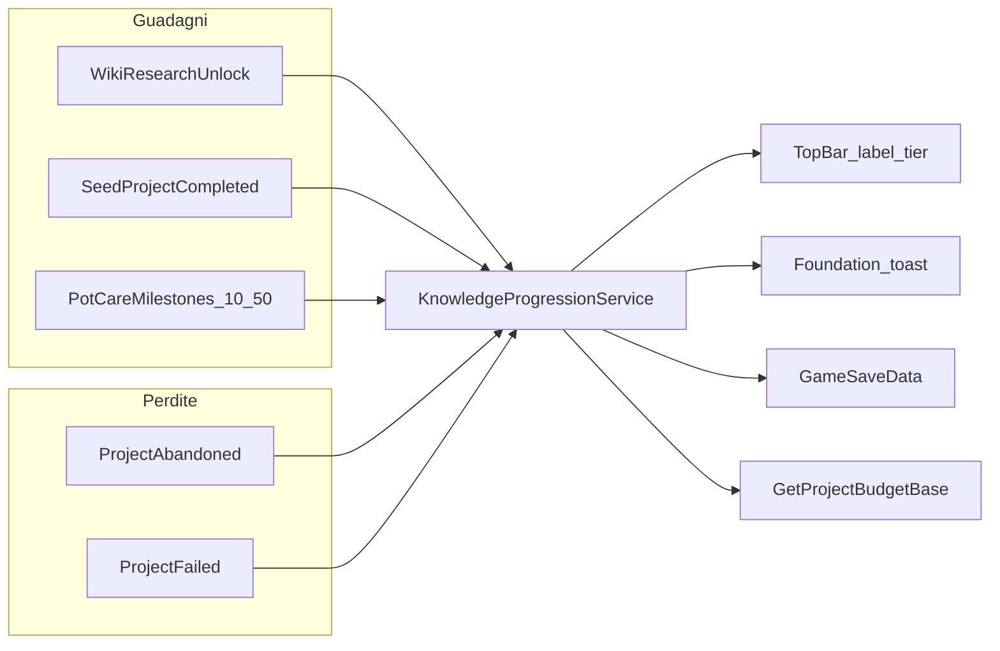

# Piano — Motore Conoscenza (Knowledge Engine v1)

## Contesto e vincoli

- **Fonte design:** tier e budget punti progetto restano allineati a [laboratorio_visione_e_repo_a60fd394.plan.md](d:/Sporae_Build_Beta/.cursor/plans/laboratorio_visione_e_repo_a60fd394.plan.md) (6 tier, base 8–28, **solo label** in UI).
- **Semplificazione rispetto al piano Lab (accordata):** niente punti da “notti di ricerca” né da statistiche aggregate pot/lab; niente reward differenziato successo/fallimento al Ritira Seme come nel vecchio testo — al posto delle regole sotto.
- **Repo oggi:** la TopBar mostra già `CONOSCENZA` ma il valore è legacy `UpdateGrate(int)` → testo `+{n}` ([TopBarController.cs](d:/Sporae_Build_Beta/Assets/_Project/Scripts/UI/UIToolkit/HUD/TopBarController.cs), [TopBar.uxml](d:/Sporae_Build_Beta/Assets/_Project/UI/UIToolkit/HUD/TopBar.uxml) placeholder `SCARSA`). [`WikiUnlockService`](d:/Sporae_Build_Beta/Assets/_Project/Scripts/Core/WikiUnlockService.cs) gestisce solo `Unlock` / `UnlockCategory` (EOD sblocca `Historical`/`Botanical`/`Vault`). **Non** esiste un albero wiki/ricerca granulare né un servizio Conoscenza. Toast Foundation pronti (`PostToast`, spec `WIKI-UNLOCK` esiste; codici `KNW-*` da aggiungere).

---

## Decisioni confermate (non bloccanti per partire)

| Tema | Scelta |
|------|--------|
| Milestone vaso 10–50 | **`DaysConsecutiveOptimal`** per `potId` (già in DayCycle) |
| Penalità “progetto fallito” v1 | Outcome **Seme instabile** (`GeneticType.Unstable` sul prodotto finale al completamento progetto) |
| Completamento progetto | **+punti** sia stabile sia instabile (idempotente per progetto); instabile può applicare **anche** penalità separata (netto configurabile in SO) |
| Abbandono | Penalità dedicata (cancel / modale futuro) |
| Numeri (soglie tier, +/- punti) | **Tuning in `KnowledgeProgressionConfig`** — bozza nel piano, playtest dopo |
| Wiki albero UI | v1 = **catalogo nodi + hook**; UI albero completa in iterazione successiva |
| Score minimo | **Floor 0** (tier non scende sotto Neofita) |
| Toast cambio tier | **Obbligatorio** a ogni salita **e** discesa di tier (label vecchia → nuova); separato dai toast +/- punti |

---

## 1. Modello dati e servizio core

### `KnowledgeProgressionService` (registrato in [`GamePlayInstaller.cs`](d:/Sporae_Build_Beta/Assets/_Project/Scripts/Core/Installers/GamePlayInstaller.cs))

Responsabilità:

| API | Ruolo |
|-----|--------|
| `int TotalScore { get; }` | Punteggio cumulativo (può scendere sotto 0? **v1: floor 0** per evitare tier negativi) |
| `KnowledgeTier CurrentTier` | Tier derivato da soglie |
| `string GetTierLabelLocalized()` | Label per TopBar / Lab |
| `int GetProjectBudgetBase()` | Punti base tabella tier (8–28) per futura Schermata 2 |
| `ApplyDelta(int delta, KnowledgeDeltaReason reason, string contextId)` | Unico ingresso per +/- punti; idempotenza dove serve |
| event `OnKnowledgeChanged(int oldScore, int newScore, KnowledgeTier oldTier, KnowledgeTier newTier)` | UI + toast |

**Config ScriptableObject** `KnowledgeProgressionConfig` in `Resources/Configs/`:

- **TierDefinition[]:** `tierId`, `minScore`, `labelKeyIt/En` (o chiavi `knowledge.tier.*`), `projectBudgetBase` (8,12,16,20,24,28).
- **RewardRules:** punti per tipo evento (valori iniziali **bozza bilanciabile** in Editor, non hardcoded sparsi).
- **PenaltyRules:** abbandono / fallimento progetto.

### Tier — label e soglie (proposta v1 da tarare in playtest)

Allineamento label al piano Lab (sostituisce placeholder `SCARSA`):

| Tier | Label IT (EN) | Soglia `minScore` (bozza) | Budget progetto base |
|------|---------------|---------------------------|----------------------|
| 1 | Neofita | **0** | 8 |
| 2 | Praticante | **8** | 12 |
| 3 | Ricercatore | **18** | 16 |
| 4 | Botanico | **32** | 20 |
| 5 | Senior | **50** | 24 |
| 6 | Maestro | **72** | 28 |

Curva: salita più rapida nei primi tier, più piatta verso Maestro (coerente con piano Lab). I numeri sono **tuning Editor** sul SO, non magic numbers in C#.

**Regola tier:** `CurrentTier = max(tier dove minScore <= TotalScore)`; se `oldTier != newTier` dopo `ApplyDelta` / `TryGrantOnce` → evento dedicato per toast tier (vedi §4).

### Persistenza — [`SaveManager.cs`](d:/Sporae_Build_Beta/Assets/_Project/Scripts/Core/SaveManager.cs)

Aggiungere a `GameSaveData`:

- `int knowledgeTotalScore`
- `List<string> knowledgeGrantedEventKeys` — chiavi idempotenti (`wiki:node_id`, `lab:project:{guid}`, `pot:{potId}:days:10`, …)

Su load: ripristinare score + set granted; **non** ricalcolare da zero (evita doppi toast). Opzionale migrazione save vecchi: score 0, set vuoto.

---

## 2. Fonti di guadagno (come da tua specifica)

### A) Ricerche / albero wiki sbloccate

**Stato repo:** solo `UnlockCategory(branch)` da EOD; nessun albero nodi.

**Piano implementazione:**

1. Estendere modello unlock con **ID nodo** stabili (es. `wiki.hist.001`) — può restare in `WikiUnlockService` o wrapper `WikiResearchService` che delega a `Unlock(id)` e notifica Conoscenza.
2. **Catalogo** `WikiResearchNodeDefinition` (SO o JSON in Resources): `nodeId`, `parentId`, `branch`, `knowledgePoints`, `prerequisiteIds[]`.
3. UI albero wiki/ricerca (scope minimo v1): sufficiente **API + primi nodi dati** collegati agli sblocchi già possibili (es. le 3 categorie EOD come nodi foglia con punti configurabili) finché l’UI albero non è disegnata; l’unlock può avvenire da EOD / Bedroom PC / script di test.
4. Hook: alla prima `Unlock(nodeId)` → `KnowledgeProgressionService.TryGrantOnce("wiki:"+nodeId, +points)`.

**Nota:** la **notte** non dà punti; conta solo lo **sblocco nodo** (anche se lo sblocco avviene come effetto narrativo post-ricerca).

### B) Progetti seme completati nel Lab

**Stato repo:** flusso legacy in [`LabTerminalPanelController`](d:/Sporae_Build_Beta/Assets/_Project/Scripts/UI/UIToolkit/Lab/LabTerminalPanelController.cs) (`IsProjectFlowCompleted`); LAB 4.0 non ancora presente.

**Piano:**

- Introdurre `SeedProjectLifecycle` (eventi/service) con: `Completed`, `Abandoned`, `CompletedUnstablePenalty`.
- **v1 legacy:** quando `IsProjectFlowCompleted` → lettura esito sul seme/item incubato (`GeneticType` / metadata equivalente):
  - `TryGrantOnce("lab:complete:"+projectId, +labProjectCompletePoints)` — **sempre** al completamento (stabile o instabile).
  - Se **instabile:** `ApplyDelta(-labUnstablePenalty, …)` con chiave idempotente `lab:unstable:"+projectId` (penalità “Seme instabile”, non bloccata dall’assenza di stato Failed generico).
- **v1 penalità abbandono:** `btn-cancel-project` / conferma → `-penaltyAbandon` (nessun grant completamento).
- **Futuro LAB 4.0:** stessi hook su Ritira Seme / outcome; instabile = stessa penalità configurata.

Punti bozza in config: **+6** completamento, **-4** abbandono, **-3** seme instabile (tarabili; netto instabile es. +3 se si mantiene la bozza).

### C) Giorni consecutivi di cura ottimale per singolo Pot → +1 per soglia

**Confermato:** usa **`DaysConsecutiveOptimal`** (giorno in cui cura idratazione/luce/fertilizzante raggiunge soglia “ottimale” in DayCycle — non una nuova metrica “qualsiasi azione”).

**Stato repo:** [`PotStateModel.DaysConsecutiveOptimal`](d:/Sporae_Build_Beta/Assets/_Project/Scripts/Dome/PotStateModel.cs) aggiornato in [`SPOR-BLK-01-03A-DayCycleController`](d:/Sporae_Build_Beta/Assets/_Project/Scripts/Dome/SPOR-BLK-01-03A-DayCycleController.cs).

**Piano:**

- Subito dopo l’aggiornamento giornaliero di `DaysConsecutiveOptimal`, controllare soglie **10, 20, 30, 40, 50** per quel `potId`.
- Per ogni soglia: `TryGrantOnce("pot:"+potId+":optimal:"+threshold, +1)` — **esattamente +1 punto** per milestone per vaso (come da tua regola).
- Se il contatore si resetta e poi risale, le chiavi già in `knowledgeGrantedEventKeys` evitano doppio accredito.

---

## 3. Perdite Conoscenza

| Evento | Trigger v1 | Punti (bozza config) |
|--------|------------|----------------------|
| Abbandono progetto | `LabTerminalPanelController` cancel / conferma abbandono (e futuro modale LAB 4.0) | negativo configurabile |
| **Seme instabile** (completamento con outcome instabile) | Al completamento progetto, se prodotto finale `GeneticType.Unstable` (o flag equivalente) | negativo configurabile, idempotente per progetto |
| Protocollo “fallito” generico LAB 4.0 | Outcome negativo schermata esito (futuro) | stessa famiglia penalità o codice dedicato in config |

**Non** penalizzare errori macchina spot (`LAB-*-FAIL` non emessi) in v1.

---

## 4. Toast Foundation

Aggiungere in [`NotificationTypeSpecDefaults.cs`](d:/Sporae_Build_Beta/Assets/_Project/Scripts/UI/UIToolkit/NotificationsFoundation/NotificationTypeSpecDefaults.cs) + chiavi in [`LocalizationManager.cs`](d:/Sporae_Build_Beta/Assets/_Project/Scripts/Core/Localization/LocalizationManager.cs):

### Toast su variazione punteggio (ogni `ApplyDelta` con delta ≠ 0)

- `KNW-GAIN` — Success — es. IT: “Conoscenza +{delta}” / EN; payload opz. `{reason}` corto (wiki, lab, vaso…).
- `KNW-LOSS` — Warning — es. IT: “Conoscenza {delta}” (delta negativo nel testo) / EN.

### Toast su cambio tier — **obbligatorio v1** (richiesta esplicita)

**Un toast per ogni evento di salita o discesa di livello tier**, indipendentemente dal toast +/- punti dello stesso frame (se entrambi accadono, il giocatore può vedere **due** toast in sequenza o stessa coda: prima delta punti, poi tier — ordine fisso consigliato: **prima KNW-GAIN/LOSS, poi KNW-TIER-*** ).

| Codice | Severità | Quando |
|--------|----------|--------|
| `KNW-TIER-UP` | Success | `newTier.rank > oldTier.rank` |
| `KNW-TIER-DOWN` | Warning | `newTier.rank < oldTier.rank` |

**Copy (localizzato, placeholder):**

- UP: “Livello Conoscenza: {oldLabel} → {newLabel}” — opz. seconda riga opzionale: “Budget progetto: {oldBase} → {newBase}” (numeri pool ammessi **solo** nel toast tier, non in TopBar).
- DOWN: stessa struttura, tono Warning.

**Payload:** `old_label`, `new_label`, `old_budget`, `new_budget` (stringhe già localizzate).

**Implementazione:**

- `KnowledgeProgressionService.OnKnowledgeChanged` espone `oldTier` / `newTier`; se diversi, `KnowledgeToastBridge` emette il toast tier **dopo** quello delta punti.
- **Suppress all’avvio:** come `PlayerStatToastBridge`, ~2s dopo load scene / apply save — niente toast tier al ripristino save (solo su delta reali in sessione).
- **Load save:** ricalcolo tier senza notifiche; `knowledgeGrantedEventKeys` già evita re-grant punti.

Bridge: [`KnowledgeToastBridge`](d:/Sporae_Build_Beta/Assets/_Project/Scripts/Core/Knowledge/KnowledgeToastBridge.cs) (MonoBehaviour in scena HUD o registrato da installer); `PostToast` / `PostToastImmediate` se `FoundationNotificationService.Enabled`, fallback `ToastNotificationManager` con messaggio hardcoded localizzato.

---

## 5. TopBar — solo label tier

- Rinominare API interne: `UpdateGrate` → `UpdateKnowledgeTierLabel(string localizedLabel)` (mantenere overload obsoleto deprecato se serve per EOD fino a migrazione copy).
- [`TopBar.uxml`](d:/Sporae_Build_Beta/Assets/_Project/UI/UIToolkit/HUD/TopBar.uxml): placeholder allineato a **Neofita** (non `SCARSA`); `name="grate-value"` può diventare `knowledge-tier-label` (o mantenere name per non rompere scene).
- Aggiungere `topbar.metric.knowledge` per la label metrica “CONOSCENZA”.
- `TopBarController`: in `OnEnable`/`Start`, subscribe a `KnowledgeProgressionService.OnKnowledgeChanged` e refresh iniziale da servizio (non `_grateValue` serializzato).
- **EOD Dawn:** aggiornare righe che usano `GetGrateValue()` / copy “G-rate” ([`EndOfDaySequenceController`](d:/Sporae_Build_Beta/Assets/_Project/Scripts/UI/UIToolkit/EndOfDay/EndOfDaySequenceController.cs), chiavi `eod.dawn_grate`) → testo tier Conoscenza o nascondere riga finché non serve.

**Parità UI Builder:** nessun `style=""` nuovo sul campione; tier color eventualmente solo override funzionale documentato in controller.

---

## 6. File principali (deliverable)

| Azione | Path |
|--------|------|
| Nuovo | `Assets/_Project/Scripts/Core/Knowledge/KnowledgeProgressionService.cs` |
| Nuovo | `Assets/_Project/Scripts/Core/Knowledge/KnowledgeProgressionConfig.cs` (+ asset `Resources/Configs/KnowledgeProgressionConfig.asset`) |
| Nuovo | `Assets/_Project/Scripts/Core/Knowledge/KnowledgeDeltaReason.cs` |
| Nuovo | `Assets/_Project/Scripts/Core/Wiki/WikiResearchNodeCatalog.cs` (o estensione Wiki) |
| Nuovo | `Assets/_Project/Scripts/Core/Knowledge/KnowledgeToastBridge.cs` |
| Nuovo | `Assets/_Project/Scripts/Core/Knowledge/PotCareKnowledgeWatcher.cs` (MonoBehaviour runner o hook in DayCycle) |
| Modifica | `GamePlayInstaller.cs`, `SaveManager.cs`, `TopBarController.cs`, `TopBar.uxml`, `LocalizationManager.cs`, `NotificationTypeSpecDefaults.cs` |
| Modifica | `EndOfDaySequenceController.cs` (unlock nodo wiki con punti), `LabTerminalPanelController.cs` (complete/abandon/fail) |
| Asset dati | Primi nodi wiki + valori punti in config |

---

## 7. Ordine di implementazione (fasi)

1. **Core + save + config tier** — servizio, SO soglie/budget, persistenza, API `GetProjectBudgetBase()`.
2. **TopBar + localizzazione tier** — label live da servizio.
3. **Toast +/- e tier UP/DOWN** — spec `KNW-GAIN`, `KNW-LOSS`, `KNW-TIER-UP`, `KNW-TIER-DOWN` + bridge (suppress on load).
4. **Pot milestones** — watcher su `DaysConsecutiveOptimal` 10–50.
5. **Lab lifecycle** — grant completamento, penalità abbandono/fallimento (legacy terminal).
6. **Wiki nodi** — catalogo minimo + hook unlock (estensione albero UI può essere iterazione successiva con stessi ID).
7. **Smoke test manuale** — nuova partita / load save: verificare tier, toast, idempotenza, budget API.

---

## 8. Fuori scope v1 (ma preparato)

- Schermata 1–2 LAB 4.0 (consumano `GetProjectBudgetBase()` — **dopo** questo motore).
- Driver vecchio piano: pot stats aggregate, uso macchinari spot, reward differenziato Ritira successo/instabile.
- Penalità errori macchina singola (`LAB-INC-FAIL` ecc.).
- UI albero wiki completa (solo dati + hook; UI foglia in milestone dedicata).

---

## 9. Aggiornamento piano Lab

Marcare in [laboratorio_visione_e_repo_a60fd394.plan.md](d:/Sporae_Build_Beta/.cursor/plans/laboratorio_visione_e_repo_a60fd394.plan.md) il todo `knowledge-drivers-spec` come **sostituito** da questo motore (achievement-style: wiki node, lab project, pot streak; penalità abbandono/fallimento).

---

## Verifica accettazione

- TopBar mostra **solo** label tier localizzata (es. Praticante), non `+12`.
- Ogni sblocco wiki nodo / completamento progetto / soglia 10–50 giorni per vaso: **+punti** una sola volta + toast gain.
- Abbandono/fallimento progetto: **-punti** + toast loss.
- **Ogni cambio tier** (salita o discesa): toast dedicato `KNW-TIER-UP` / `KNW-TIER-DOWN` con label vecchia → nuova (e opz. budget progetto nel messaggio).
- Save/load conserva score e chiavi granted.
- `GetProjectBudgetBase()` restituisce 8–28 coerente con tier corrente.
