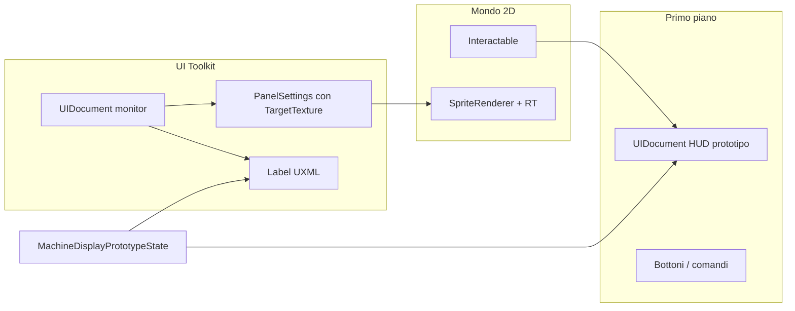

# Piano: prototipo monitor in-mondo (UI Toolkit + Render Texture)

## Cosa stiamo creando (in parole semplici)

Stiamo creando un **piccolo terminale finto** nel mondo di gioco: **sullo sprite del macchinario** non c’è più solo un’immagine fissa dello schermo, ma un **rettangolo** che mostra ciò che disegna Unity sulla **Render Texture**. Quel disegno viene dall’**UI Toolkit** (stessi file UXML/USS che puoi aprire in UI Builder): testo e layout aggiornati **da codice**. Il giocatore **non clicca** sullo schermo 3D/2D: usa il solito **Interactable** (tasto E o click vicino al macchinario) e si apre una **HUD in primo piano** (altro UXML) con pulsanti o comandi di prova; quando cambia lo stato lì, **cambia anche** quello che si vede sul monitor nel mondo. In sintesi: **un monitor animato nel livello + una finestra comandi sopra**, collegati allo stesso stato.

## Contesto tecnico in repo

- **Unity** [ProjectSettings/ProjectVersion.txt](ProjectSettings/ProjectVersion.txt): `2022.3.62f3` — `PanelSettings` supporta **Target Texture** (campo `m_TargetTexture` già presente negli asset tipo [Assets/_Project/UI/UIToolkit/PlayerStatusPanelSettings.asset](Assets/_Project/UI/UIToolkit/PlayerStatusPanelSettings.asset)).
- **Interazione**: [Assets/_Project/Scripts/Interactables/Interactable.cs](Assets/_Project/Scripts/Interactables/Interactable.cs) espone `OnInteract`; pattern già usato in [Assets/_Project/Scripts/Interactables/CryoMachineOpener.cs](Assets/_Project/Scripts/Interactables/CryoMachineOpener.cs) (`OnInteract` → `Show()` su un controller HUD).
- **Obiettivo prototipo**: solo **display animato** sul mesh; input **solo** tramite `Interactable` + **HUD overlay** (nessun picking sulla RT).

## Architettura

- Un **solo script stato** (o struct serializzabile) aggiornato dalla HUD; lo stesso stato **ridisegna** le label del monitor (così display e HUD restano allineati).
- Il `UIDocument` del monitor usa **PanelSettings dedicato** con `Target Texture` = un asset **Render Texture** (es. 256×128 o 512×256 da tarare sul pixel art); il GameObject può restare in scena ma **non è** la HUD giocatore — non serve Canvas figlio.

## Istruzioni Unity Editor (per attuare il piano)

Ordine consigliato dopo che gli asset e gli script esistono in progetto.

### A. Render Texture

1. **Project**: tasto destro → **Create → Render Texture**.
2. Seleziona l’asset: **Size** (es. 512×256) coerente con proporzioni area schermo sul macchinario; **Depth Stencil** = **No depth buffer** se non serve.
3. **Anti-aliasing** = None per look pixelato; **Filter Mode** = **Point** se vuoi bordi netti (taratura con il materiale sullo sprite).

### B. Panel Settings dedicato al monitor

1. Duplica un `Panel Settings` esistente in `Assets/_Project/UI/UIToolkit/` (rinomina es. `MachineDisplayPanelSettings`) oppure **Create → UI Toolkit → Panel Settings Asset**.
2. Nel Inspector: **Target Texture** = la Render Texture creata al passo A (obbligatorio per disegnare sulla RT invece che sullo schermo).
3. **Theme Style Sheet** / theme: allinea al progetto (stesso theme degli altri panel se serve coerenza font).
4. **Scale Mode**: tipicamente **Constant Physical Size** o **Constant Pixel Size** — regola finché il contenuto UXML riempie la RT senza essere microscopico (accoppia **Reference Resolution** alle dimensioni logiche del pannello, es. 512×256 se è l’area “virtuale” del monitor).
5. **Clear Color**: attiva clear su colore se serve sfondo pieno (verde/nero CRT) e imposta **Color Clear Value**; evita alpha 0 su tutto il pannello se vedi alone strano ai bordi.

### C. UIDocument “solo monitor” (output sulla RT)

1. Crea un GameObject vuoto (es. `PROT_MachineDisplay_UI`), posizione irrilevante per il rendering su RT.
2. **Add Component → UI Document**.
3. **Source Asset** = `MachineDisplayPrototype.uxml` (quando esiste).
4. **Panel Settings** = `MachineDisplayPanelSettings` del passo B (quello con Target Texture).
5. **Sort Order** sul Panel Settings o sul document: valore basso/alto conta per l’ordine tra pannelli che condividono la stessa RT (di solito un solo document punta a quella RT).
6. In **Play Mode**: il pannello **non** deve apparire come overlay fullscreen se Target Texture è impostata correttamente — l’output va sulla RT.

### D. Schermo nel mondo (SpriteRenderer + materiale)

1. Sotto il macchinario prototipo: **Create Empty** figlio, nome es. `Screen_RT`.
2. **Add Component → Sprite Renderer** (2D). Assegna uno **Sprite** rettangolare (anche quello Unity bianco 1×1 o sprite dedicato) e scala **Transform** finché copre l’area “vetro” del macchinario nell’arte.
3. Crea materiale **Unlit** (URP: *Universal Render Pipeline/Lit* no — usa **Unlit** o **Sprite-Unlit** a seconda del template progetto): assegna la **stessa Render Texture** del passo A alla proprietà texture principale (in URP spesso `_BaseMap` o **Base Map** sull’Unlit).
4. **Sorting Layer** e **Order in Layer** allineati al corpo del macchinario (stesso layer o order sopra il frame se serve).
5. Verifica in Scene view: senza Play, vedi la RT eventualmente nera/ultimo frame; in Play, vedi il contenuto UI aggiornarsi.

### E. HUD primo piano (comandi)

1. Crea GameObject con **UIDocument** sotto **Canvas** (o come gli altri panel Lab nella gerarchia — vedi [Assets/_Project/Docs/GUIDA_LAB_MACCHINARIO_PER_MACCHINARIO.md](Assets/_Project/Docs/GUIDA_LAB_MACCHINARIO_PER_MACCHINARIO.md)): **non** usare il Panel Settings del monitor; usa un Panel Settings **normale** (schermo) già in uso o duplicato per sorting.
2. **Source Asset** = `MachineHudPrototype.uxml`. Collega il controller che fa **Show/Hide** e aggiorna lo stato condiviso.
3. All’inizio la HUD può essere **nascosta** (`display: none` sul root o `SetEnabled(false)` sul document — come fanno gli altri pannelli nel progetto).

### F. Interazione

1. Sul root del macchinario (o sul collider): **Interactable** + collider 2D adeguato; distanza e raggio click come gli altri oggetti.
2. Aggiungi **MachinePrototypeOpener** (o equivalente): campo **Panel Controller** / **Screen Controller** assegnati da Inspector al controller HUD e al controller del monitor.
3. **Enter Play Mode**: avvicinati, **E** o **click** → si apre HUD; azioni sulla HUD aggiornano testo sul monitor via script condiviso.

### G. UI Builder (opzionale ma consigliato per authoring)

1. **Window → UI Toolkit → UI Builder**.
2. Apri `MachineDisplayPrototype.uxml` e `MachineHudPrototype.uxml` per ritoccare layout/classi USS; salva: a Play le modifiche si riflettono sul monitor (RT) e sulla HUD secondo i rispettivi Panel Settings.

## Implementazione (passi di contenuto, non sostituiscono le istruzioni sopra)

### 1. Asset grafici e pannello RT

- Creare **RenderTexture** in Project (vedi sezione A).
- Creare **PanelSettings** dedicato (vedi sezione B).

### 2. UXML/USS minimi per il monitor

- Nuovi file sotto `Assets/_Project/UI/UIToolkit/Prototype/`: `MachineDisplayPrototype.uxml` + `MachineDisplayPrototype.uss`.
- Contenuto: `VisualElement` root a schermo intero nella RT, **label** con `name` stabili (titolo, 2–3 righe stato), stile monospace/CRT; **classi USS** per il look ([`.cursor/rules/ui-hud-foundation-ui-builder-parity.mdc`](.cursor/rules/ui-hud-foundation-ui-builder-parity.mdc) per estensioni future).

### 3. Script lato monitor

- **Componente** `MachineDisplayPrototypeScreenController` su `PROT_MachineDisplay_UI`:
  - `UIDocument` con Source Asset e **Panel Settings** RT.
  - Cache dei `Label` in `OnEnable`; metodi pubblici tipo `SetTitle`, `SetLine(int, string)` o `Bind(MachineDisplayPrototypeState)`.
  - **Animazione demo**: `IEnumerator` o `schedule.Execute` per testo che cambia — validazione pipeline RT.
- **Schermo nel mondo**: come sezione D.

### 4. Interactable + HUD primo piano

- **HUD stub**: `MachineHudPrototype.uxml` + controller Show/Hide + bottoni che aggiornano stato.
- **MachinePrototypeOpener**: `[RequireComponent(typeof(Interactable))]`; `OnInteract` → `Show()` HUD; riferimenti serializzati a screen controller + HUD controller.
- Nessun `FindObjectOfType` nel nuovo codice: **solo Inspector** / `ServiceContainer` se già previsto ([`.cursor/rules/architecture-runtime-services.mdc`](.cursor/rules/architecture-runtime-services.mdc)).

### 5. Scena e test

- Prefab/GO `PROT_Terminal` con collider 2D, `Interactable`, opener, sprite macchinario + figlio `Screen_RT`.
- Verifiche: in Play, RT si aggiorna da codice; HUD con E/click; nessuna interazione richiesta sulla mesh RT.

## Rischi / note

- **Risoluzione RT vs pixel art**: tarare PPU dello `SpriteRenderer` e dimensioni RT; **Filter Mode Point** su RT e/o materiale se serve nitidezza.
- **Due PanelSettings**: non riusare il Panel Settings fullscreen del gioco per il monitor — reference resolution e target texture sono diversi.
- **Performance**: un terminale in prototipo è leggero; più RT attive = più pass di rendering.

## File previsti (nuovi, indicativi)

| Path | Ruolo |
|------|--------|
| `Assets/_Project/UI/UIToolkit/Prototype/MachineDisplayPrototype.uxml` | Layout monitor |
| `Assets/_Project/UI/UIToolkit/Prototype/MachineDisplayPrototype.uss` | Stili CRT/minimal |
| `Assets/_Project/UI/UIToolkit/Prototype/MachineHudPrototype.uxml` | HUD comandi stub |
| `Assets/_Project/Scripts/.../MachineDisplayPrototypeScreenController.cs` | Bind + demo animazione testo |
| `Assets/_Project/Scripts/.../MachinePrototypeHudController.cs` | Show/Hide + bottoni che aggiornano stato |
| `Assets/_Project/Scripts/.../MachinePrototypeOpener.cs` | `Interactable` → apre HUD |
| Asset: `MachineDisplayRT`, `MachineDisplayPanelSettings` | RT + PanelSettings |

(Nomi adattabili alla convenzione namespace `Sporae.*` già usata nei controller UIToolkit.)
