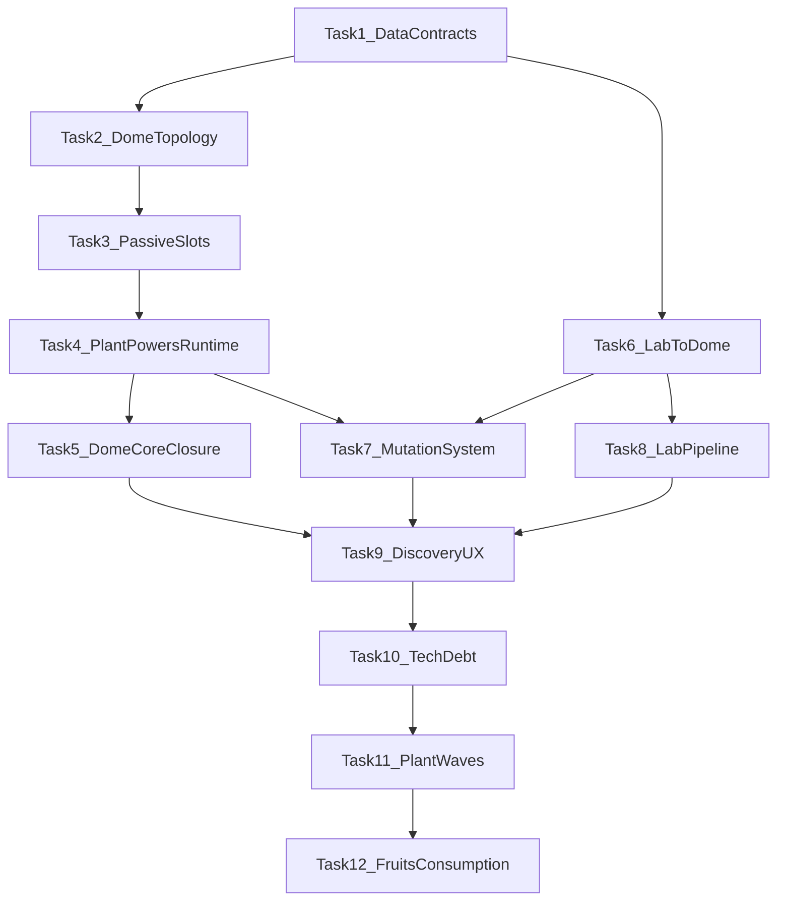

# Roadmap Dome + Lab verso il 100%

## Obiettivo

Portare `Dome + Lab` a uno stato **core-complete** seguendo una sequenza di task dipendenti, non una scansione a calendario.

L'ordine e' questo:

- prima chiudere contratti runtime, save/load e passaggio dati;
- poi completare i sistemi realmente mancanti nel gameplay;
- infine chiudere UX, discovery e rifiniture di lettura.

Il target resta coerente con la scelta fatta: **core gameplay prima, rifiniture dopo**, con avanzamento **bilanciato** e checkpoint tecnici chiari.

## Principio guida

Non partire da mutazioni, slot passivi o ibridi “visibili” finche' il gioco non sa:

- salvarli;
- ripristinarli;
- passarli davvero dal Lab alla Dome;
- esporli in terminale/HUD senza workaround.

## Convenzione UI

Per tutto il perimetro di questo piano, ogni UI nuova o aggiornata deve seguire queste regole:

- usare sempre `UIToolkit` come layer UI principale;
- usare `Foundation` come sistema standard per notifiche e toast gameplay;
- evitare nuove UI legacy, overlay paralleli o sistemi toast alternativi;
- far passare i feedback di gameplay importanti tramite `Foundation`, in particolare:
  - mutazioni;
  - level up e level down pianta;
  - attivazione o perdita di poteri attivi/passivi;
  - trasferimento in slot passivo;
  - blocchi critici, sterilità, burn, infestazione, regressione;
  - output o warning rilevanti del ciclo Dome/Lab.

File Foundation/UI chiave di riferimento:

- [Assets/_Project/Scripts/UI/UIToolkit/NotificationsFoundation/NotificationTypeSpecDefaults.cs](D:/Sporae_Build_Beta/Assets/_Project/Scripts/UI/UIToolkit/NotificationsFoundation/NotificationTypeSpecDefaults.cs)
- [Assets/_Project/Scripts/UI/UIToolkit/NotificationsFoundation/FoundationNotificationsPanelController.cs](D:/Sporae_Build_Beta/Assets/_Project/Scripts/UI/UIToolkit/NotificationsFoundation/FoundationNotificationsPanelController.cs)
- [Assets/_Project/Scripts/UI/UIToolkit/NotificationsFoundation/NotificationPayload.cs](D:/Sporae_Build_Beta/Assets/_Project/Scripts/UI/UIToolkit/NotificationsFoundation/NotificationPayload.cs)
- [Assets/_Project/Scripts/UI/UIToolkit/HUD/TopBarController.cs](D:/Sporae_Build_Beta/Assets/_Project/Scripts/UI/UIToolkit/HUD/TopBarController.cs)
- [Assets/_Project/Scripts/UI/UIToolkit/PlantCardV3/PlantCardV3TerminalController.cs](D:/Sporae_Build_Beta/Assets/_Project/Scripts/UI/UIToolkit/PlantCardV3/PlantCardV3TerminalController.cs)

## Sequenza consigliata

## Task 1 — Contratti dati, save/load e unlock meta

Obiettivo: rendere `PotStateModel`, save/load e item Lab abbastanza solidi da sostenere tutto il resto.

Subtask:

- Definire il payload canonico del seme runtime: famiglia, genetica, tratti, reagente usato, provenienza Lab, eventuale stato ibrido/mutato.
- Allineare [PotStateModel](D:/Sporae_Build_Beta/Assets/_Project/Scripts/Dome/PotStateModel.cs) a quel payload e ai futuri stati `attivo/passivo`, `mutato`, `ibrido`.
- Estendere [SaveManager](D:/Sporae_Build_Beta/Assets/_Project/Scripts/Core/SaveManager.cs) per serializzare lo stato completo pianta/Dome/Lab che oggi rischia di vivere solo in memoria o in metadata parziali.
- Verificare il passaggio item -> pianta in [Item](D:/Sporae_Build_Beta/Assets/_Project/Scripts/Core/ItemsSystem/Item.cs), [ItemFabric](D:/Sporae_Build_Beta/Assets/_Project/Scripts/Core/ItemsSystem/ItemFabric.cs), [Inventory](D:/Sporae_Build_Beta/Assets/_Project/Scripts/Core/ItemsSystem/Inventory.cs) e [PotActions](D:/Sporae_Build_Beta/Assets/_Project/Scripts/Dome/PotActions.cs), cosi' il seme incubato non perda genetica, famiglia e tratti quando entra in Dome.
- Spostare gli unlock meta non affidabili fuori da `PlayerPrefs` e dentro il save di partita, a partire da [PlantDatabase](D:/Sporae_Build_Beta/Assets/_Project/Scripts/Dome/PotSystem/Growth/PlantDatabase.cs) e [WikiUnlockService](D:/Sporae_Build_Beta/Assets/_Project/Scripts/Core/WikiUnlockService.cs).

File principali:

- [Assets/_Project/Scripts/Dome/PotStateModel.cs](D:/Sporae_Build_Beta/Assets/_Project/Scripts/Dome/PotStateModel.cs)
- [Assets/_Project/Scripts/Core/SaveManager.cs](D:/Sporae_Build_Beta/Assets/_Project/Scripts/Core/SaveManager.cs)
- [Assets/_Project/Scripts/Core/ItemsSystem/Item.cs](D:/Sporae_Build_Beta/Assets/_Project/Scripts/Core/ItemsSystem/Item.cs)
- [Assets/_Project/Scripts/Core/ItemsSystem/ItemFabric.cs](D:/Sporae_Build_Beta/Assets/_Project/Scripts/Core/ItemsSystem/ItemFabric.cs)
- [Assets/_Project/Scripts/Dome/PotSystem/Growth/PlantDatabase.cs](D:/Sporae_Build_Beta/Assets/_Project/Scripts/Dome/PotSystem/Growth/PlantDatabase.cs)

Passi in Unity:

- Aprire una scena gameplay completa con Dome, Lab e save/load attivo.
- Preparare un profilo di test con inventario minimo che consenta di creare almeno un output Lab reale.
- Verificare in Inspector o debug view che i nuovi campi serializzati del seed e della pianta siano valorizzati prima del salvataggio.
- Eseguire salvataggio, reload scena o ritorno al menu e controllo dei campi dopo il caricamento.
- Controllare che discovery, unlock e stato pianta non dipendano piu' da cache temporanee o `PlayerPrefs`.

Rischio:

- Alto. Se questo task resta incompleto, tutto cio' che segue puo' sembrare funzionare ma rompersi al reload o perdere metadati critici.

Test da fare prima di passare oltre:

- Creare un seed nel Lab, salvarlo, chiudere e ricaricare.
- Piantare quel seed, salvare, chiudere e ricaricare.
- Verificare che genetica, famiglia, tratti e stato discovery siano identici prima e dopo il reload.

Sequenza di testing:

1. Generare un output Lab con metadata non banali.
2. Salvare subito prima della piantumazione e ricaricare.
3. Piantare il seed e controllare i campi runtime della pianta.
4. Salvare di nuovo, ricaricare e verificare che i campi coincidano.
5. Sbloccare una voce discovery o wiki, salvare, ricaricare e confermare che resti sbloccata.

Output atteso:

- Un seed prodotto nel Lab conserva integralmente i suoi metadati tra inventario, piantumazione, save/load e discovery.
- Il sistema di conoscenza non perde piu' stato al reload e non dipende da memorie laterali non controllate.

Done quando:

- un seed creato nel Lab mantiene i suoi metadata dopo save/load;
- una pianta derivata da quel seed ripristina lo stesso stato dopo reload;
- non esistono piu' dati critici Dome/Lab salvati in modo implicito o fuori slot.

**Completato il: 2026-03-18 — DEV_REPORT_0070**

## Task 2 — Topologia reale della Dome

> Piano di dettaglio: [task_2_implementation_complete_f485810e](.cursor/plans/task_2_implementation_complete_f485810e.plan.md)

I 3 slot passivi sono nella **Cryo Machine** (struttura separata). Piante Lvl 5 in cryo: PassivePower attivo, ActivePower disattivato. Possono essere restituite a un pot attivo, estratte verso lo storage o vendute.

Obiettivo: trasformare la Dome da sistema “generico a 10 pots” a sistema coerente col GDD per il core.

Subtask:

- Definire una rappresentazione unica dei 7 slot: `4 active`, `3 passive`.
- Aggiornare [PotSystemConfig](D:/Sporae_Build_Beta/Assets/_Project/Scripts/Dome/PotSystemConfig.cs) e [RoomDomePotsBootstrap](D:/Sporae_Build_Beta/Assets/_Project/Scripts/Dome/RoomDomePotsBootstrap.cs) per creare o riconoscere la topologia corretta.
- Distinguere a livello runtime e registry i vasi attivi dagli slot passivi in [DomePotRegistry](D:/Sporae_Build_Beta/Assets/_Project/Scripts/Dome/DomePotRegistry.cs) e [PotSlot](D:/Sporae_Build_Beta/Assets/_Project/Scripts/Interactables/PotSlot.cs).
- Aggiornare i flussi che enumerano i pots, in particolare [DayCycleController](D:/Sporae_Build_Beta/Assets/_Project/Scripts/Dome/SPOR-BLK-01-03A-DayCycleController.cs) e [PlantCardV3TerminalController](D:/Sporae_Build_Beta/Assets/_Project/Scripts/UI/UIToolkit/PlantCardV3/PlantCardV3TerminalController.cs), cosi' non trattino tutti gli slot come equivalenti.

File principali:

- [Assets/_Project/Scripts/Dome/PotSystemConfig.cs](D:/Sporae_Build_Beta/Assets/_Project/Scripts/Dome/PotSystemConfig.cs)
- [Assets/_Project/Scripts/Dome/RoomDomePotsBootstrap.cs](D:/Sporae_Build_Beta/Assets/_Project/Scripts/Dome/RoomDomePotsBootstrap.cs)
- [Assets/_Project/Scripts/Dome/DomePotRegistry.cs](D:/Sporae_Build_Beta/Assets/_Project/Scripts/Dome/DomePotRegistry.cs)
- [Assets/_Project/Scripts/Interactables/PotSlot.cs](D:/Sporae_Build_Beta/Assets/_Project/Scripts/Interactables/PotSlot.cs)

Passi in Unity:

- Aprire la scena Dome di riferimento e identificare fisicamente dove vivono i 4 slot attivi e i 3 slot passivi.
- Verificare prefab, hierarchy e bootstrap dei pots per evitare duplicazioni o slot orfani.
- Allineare marker, nomi oggetto, componenti `PotSlot` e riferimenti visuali o interaction per distinguere attivi da passivi.
- Eseguire Play Mode e verificare che registry e terminale leggano la topologia reale senza fallback impropri.

Rischio:

- Medio-alto. Tocca scene, bootstrap e enumerazione pots; facile creare regressioni se qualche sistema continua a ragionare su “tutti i pots uguali”.

Test da fare prima di passare oltre:

- Aprire la Dome e verificare che i 7 slot siano riconosciuti correttamente.
- Verificare che terminale e day cycle distinguano attivi e passivi senza errori o null.
- Controllare che il loop base dei vasi attivi non cambi comportamento.

Sequenza di testing:

1. Entrare in scena e verificare visivamente la presenza dei 7 slot previsti.
2. Aprire terminale o pannello stato e controllare che attivi e passivi siano separati.
3. Far partire almeno un tick giornaliero e verificare che solo gli slot attivi seguano il loop produttivo base.
4. Verificare che nessun sistema legacy consideri ancora tutti gli slot come identici.

Output atteso:

- La Dome espone chiaramente una struttura `4 active + 3 passive`.
- Registry, terminale e sistemi di ciclo trattano attivi e passivi come categorie reali e non come semplice etichetta UI.

Done quando:

- la scena/registry conosce attivi e passivi come categorie vere;
- il terminale risponde a `PASSIVE` mostrando lo stato dei 3 CryoSlot;
- la Dome non dipende piu' da un limite generico `MAX_POTS_PER_ROOM = 10` per il core flow;
- il trasferimento Pot -> Cryo, Cryo -> Pot e Cryo -> Storage funzionano senza perdere metadata;
- un `WholePlant` item Lvl 5 estratto da cryo conserva livello e genetica ed e' vendibile;
- `DayCycleController` non processa mai i CryoSlot nel loop produttivo;
- lo stato dei CryoSlot sopravvive a save/load.

**Completato il: 2026-03-19 — DEV_REPORT_0071**

## Task 3 — Slot passivi reali

Obiettivo: rendere gli slot passivi una meccanica di gameplay, non solo un check `Lvl 5`.

Subtask:

- Estendere [PlantLevelSystem](D:/Sporae_Build_Beta/Assets/_Project/Scripts/Dome/PotSystem/Level/PlantLevelSystem.cs) oltre `CanMoveToPassiveSlot()` per supportare trasferimento, validazione e stato persistente.
- Aggiungere in [PlantData](D:/Sporae_Build_Beta/Assets/_Project/Scripts/Dome/PotSystem/Growth/PlantData.cs) i dati authoring necessari per `PassivePower`, intensita', cap e regole specie-specifiche.
- Applicare il cap pH dei passivi e gli effetti metagame in [PhSystem](D:/Sporae_Build_Beta/Assets/_Project/Scripts/Core/PhSystem.cs), [DayCycleController](D:/Sporae_Build_Beta/Assets/_Project/Scripts/Dome/SPOR-BLK-01-03A-DayCycleController.cs) e [PotActions](D:/Sporae_Build_Beta/Assets/_Project/Scripts/Dome/PotActions.cs).
- Esporre il trasferimento e lo stato passivo nel terminale e HUD: [PlantCardV3TerminalController](D:/Sporae_Build_Beta/Assets/_Project/Scripts/UI/UIToolkit/PlantCardV3/PlantCardV3TerminalController.cs) e [AlwaysVisiblePotHUD](D:/Sporae_Build_Beta/Assets/_Project/Scripts/UI/VaultMap/AlwaysVisiblePotHUD.cs).

File principali:

- [Assets/_Project/Scripts/Dome/PotSystem/Level/PlantLevelSystem.cs](D:/Sporae_Build_Beta/Assets/_Project/Scripts/Dome/PotSystem/Level/PlantLevelSystem.cs)
- [Assets/_Project/Scripts/Dome/PotSystem/Growth/PlantData.cs](D:/Sporae_Build_Beta/Assets/_Project/Scripts/Dome/PotSystem/Growth/PlantData.cs)
- [Assets/_Project/Scripts/Core/PhSystem.cs](D:/Sporae_Build_Beta/Assets/_Project/Scripts/Core/PhSystem.cs)
- [Assets/_Project/Scripts/UI/UIToolkit/PlantCardV3/PlantCardV3TerminalController.cs](D:/Sporae_Build_Beta/Assets/_Project/Scripts/UI/UIToolkit/PlantCardV3/PlantCardV3TerminalController.cs)

Passi in Unity:

- Preparare una pianta a `Lvl 5` tramite save di test, debug o run accelerata.
- Configurare in `PlantData` almeno un `PassivePower` reale e verificabile.
- Verificare nel layout Dome dove e come avviene il trasferimento verso gli slot passivi.
- Controllare in Play Mode che la UI differenzi chiaramente una pianta attiva da una pianta passiva.
- Osservare l'effetto dei passivi su pH o bonus sistemici in tempo reale o al tick successivo.

Rischio:

- Medio. Il pericolo qui e' implementare il trasferimento ma lasciare i bonus passivi solo testuali o non persistenti.

Test da fare prima di passare oltre:

- Portare una pianta a `Lvl 5` e spostarla in passivo.
- Verificare che non produca piu' come attiva.
- Verificare che i bonus passivi e il cap pH siano applicati davvero e sopravvivano al save/load.

Sequenza di testing:

1. Preparare una pianta `Lvl 5`.
2. Eseguire il trasferimento in slot passivo.
3. Fare un ciclo giornaliero e verificare assenza di produzione attiva.
4. Controllare bonus passivo e contributo pH cappato.
5. Salvare, ricaricare e verificare che stato passivo e bonus restino identici.

Output atteso:

- Una pianta `Lvl 5` puo' essere archiviata come passiva in modo persistente.
- Gli slot passivi smettono di essere un concetto teorico e diventano una leva strategica reale sul metagame della Dome.

Done quando:

- una pianta `Lvl 5` puo' essere spostata davvero in passivo;
- non produce come attiva ma applica bonus latenti;
- il suo contributo pH e' cappato correttamente;
- save/load e UI rispettano quello stato.

**Completato il: 2026-03-19 — DEV_REPORT_0072**

## Task 4 — Poteri Attivi e Passivi runtime

Obiettivo: trasformare i poteri botanici da testo di HUD/terminale a effetti gameplay veri, scalati dal livello e preparati per essere alterati dalle mutazioni.

Subtask:

- Leggere dal GDD Notion delle tre famiglie le caratteristiche `Active Bonus` e `Passive Bonus` di ogni specie e usarle come sorgente design canonica per l'authoring runtime.
- Introdurre in [PlantData](D:/Sporae_Build_Beta/Assets/_Project/Scripts/Dome/PotSystem/Growth/PlantData.cs) una rappresentazione strutturata dei poteri, non solo stringhe descrittive, distinguendo almeno: tipo effetto, target, intensità base, frequenza, condizioni e cap.
- Portare a runtime almeno i poteri delle piante gia' esistenti in game e allineare le descrizioni UI al comportamento vero.
- Definire una curva di scaling per livello per `ActivePower` e `PassivePower`: **i valori GDD/Notion attuali sono baseline Livello 1**; Livelli 2-5 applicano moltiplicatori crescenti (vedi sotto), con **cap per categoria** oltre la moltiplicazione pura.
- Fare in modo che gli slot passivi usino il corrispettivo `PassivePower` con cap e regole dedicate, senza riciclare in modo grezzo il potere attivo.
- Usare come primi riferimenti canonici anche i casi gia' noti dalle famiglie Notion: `PLT-STD-001 Ferric Fern`, `PLT-PURE-001 Arctic Hask`, `PLT-EVIL-001 Glasscap Fungus`.
- Convogliare in `Foundation` i feedback gameplay generati dai poteri runtime quando diventano rilevanti o cambiano stato.
- **TopBar — tooltip pH / drift:** il [TopBarController](D:/Sporae_Build_Beta/Assets/_Project/Scripts/UI/UIToolkit/HUD/TopBarController.cs) ha gia' UI per modificatori giornalieri (piante attive → drift) e lista **Cryo / slot passivi** (`GetCryoPassiveModifiers`, label potere passivo + drift/g e cap). Task 4 deve **allineare `PhSystem` + payload tooltip** ai poteri runtime cosi' numeri e testi riflettono livello, scaling e cap 20% Sezione 3. Inoltre il tooltip deve mostrare in modo leggibile gli **effetti attivi/passivi che influenzano la Dome** (almeno pH drift, mold risk globale, IM globale e altri modificatori dome-level introdotti), separando se utile le sezioni `Per-Pot` e `Global Dome`.
- **TerminalPot — comando `STATUS` + Zona 2 `pcv3-center`:** per ogni vaso selezionato in STATUS, il giocatore deve poter leggere in modo esplicito **quali altre piante (attive o in Cryo/slot passivo)** stanno applicando effetti **su quel vaso** o sul contesto Dome rilevante per quel vaso (es. drift pH aggregato da altri vasi, modifica rischio muffa, contributo IM globale che tocca la mutazione, tensione roster Arctic Hask / sterilita', ecc.). Implementazione: una **sorgente dati unica** (snapshot o query su registry/servizio poteri dopo il tick) che alimenta (1) le righe aggiuntive nel flusso testuale STATUS in [PlantCardV3TerminalController](D:/Sporae_Build_Beta/Assets/_Project/Scripts/UI/UIToolkit/PlantCardV3/PlantCardV3TerminalController.cs) (`PrintStatusPotSections` e affini) e (2) il pannello centrale [PlantCardV3_Terminal.uxml](D:/Sporae_Build_Beta/Assets/_Project/UI/UIToolkit/PlantCardV3/PlantCardV3_Terminal.uxml) (`pcv3-center` / `pcv3-hud-preview-group`), con etichette dedicate o lista sintetica **per-pianta** (nome/codice sorgente, attivo vs passivo, magnitudine numerica dove esiste). Evitare duplicazione della logica di calcolo: riusare gli stessi contributi che il gameplay applica gia' in `DayCycleController` / `PhSystem` / `MoldSystem` ecc., esposti tramite API di lettura o DTO. Rispettare [architecture-runtime-services](D:/Sporae_Build_Beta/.cursor/rules/architecture-runtime-services.mdc): niente `FindObjectOfType` per risolvere roster vasi; usare `ServiceContainer` / registry gia' previsti.
- **DomeStatusHUD — tooltip hover singola pianta:** quando il cursore passa sopra una pianta in [DomeStatusHUDController.cs](D:/Sporae_Build_Beta/Assets/_Project/Scripts/UI/UIToolkit/DomeStatusHUD/DomeStatusHUDController.cs), il tooltip deve mostrare in modo leggibile: (a) **effetti attivi/passivi emessi dalla pianta** e (b) **effetti subiti dalla pianta** da altre piante/slot passivi/effetti globali, con sorgente, tipo (attivo/passivo/globale) e valore numerico dove disponibile.

File principali:

- [Assets/_Project/Scripts/Dome/PotSystem/Growth/PlantData.cs](D:/Sporae_Build_Beta/Assets/_Project/Scripts/Dome/PotSystem/Growth/PlantData.cs)
- [Assets/_Project/Scripts/Dome/PotActions.cs](D:/Sporae_Build_Beta/Assets/_Project/Scripts/Dome/PotActions.cs)
- [Assets/_Project/Scripts/Dome/SPOR-BLK-01-03A-DayCycleController.cs](D:/Sporae_Build_Beta/Assets/_Project/Scripts/Dome/SPOR-BLK-01-03A-DayCycleController.cs)
- [Assets/_Project/Scripts/Core/PhSystem.cs](D:/Sporae_Build_Beta/Assets/_Project/Scripts/Core/PhSystem.cs)
- [Assets/_Project/Scripts/UI/UIToolkit/HUD/TopBarController.cs](D:/Sporae_Build_Beta/Assets/_Project/Scripts/UI/UIToolkit/HUD/TopBarController.cs)
- [Assets/_Project/Scripts/UI/UIToolkit/PlantCardV3/PlantCardV3TerminalController.cs](D:/Sporae_Build_Beta/Assets/_Project/Scripts/UI/UIToolkit/PlantCardV3/PlantCardV3TerminalController.cs)
- [Assets/_Project/UI/UIToolkit/PlantCardV3/PlantCardV3_Terminal.uxml](D:/Sporae_Build_Beta/Assets/_Project/UI/UIToolkit/PlantCardV3/PlantCardV3_Terminal.uxml) (Zona 2 `pcv3-center`)
- [Assets/_Project/Scripts/UI/UIToolkit/DomeStatusHUD/DomeStatusHUDController.cs](D:/Sporae_Build_Beta/Assets/_Project/Scripts/UI/UIToolkit/DomeStatusHUD/DomeStatusHUDController.cs)
- [Assets/_Project/Scripts/UI/UIToolkit/NotificationsFoundation/NotificationTypeSpecDefaults.cs](D:/Sporae_Build_Beta/Assets/_Project/Scripts/UI/UIToolkit/NotificationsFoundation/NotificationTypeSpecDefaults.cs)

Passi in Unity:

- Aprire i `PlantData` delle specie gia' presenti in build e verificare cosa e' solo descrittivo e cosa invece serve come effetto runtime.
- Creare o aggiornare i campi authoring per rappresentare `Active Bonus` e `Passive Bonus` in forma eseguibile.
- Preparare test su piante di livello diverso per vedere se lo scaling livello produce intensita' differenti ma leggibili.
- Verificare in Play Mode che il terminale mostri lo stesso potere che la pianta sta davvero applicando in scena.
- Con almeno due vasi attivi e uno o piu' slot passivi popolati, aprire `STATUS` su un vaso e controllare la sezione **effetti da altre piante**: stessi numeri/testi del runtime; ripetere guardando la Zona 2 `pcv3-center` (anteprima HUD) aggiornata per lo stesso vaso.
- Aprire il **tooltip pH** sulla TopBar: controllare che le righe **Active modifiers** (drift per pianta in vaso) e **Passive / Cryo** (drift cappato + etichetta potere) coincidano con i valori calcolati dopo il tick e con lo scaling per livello; verificare anche la sezione effetti **dome-level** (globali) allineata al runtime.
- In `DomeStatusHUD`, passare con il mouse sulla singola pianta e verificare che il tooltip elenchi sia **effetti emessi** sia **effetti subiti** (con sorgente e valore), coerenti con STATUS / `pcv3-center`.
- Verificare che i cambi di stato rilevanti dei poteri vengano notificati via toast `Foundation` e non da canali UI secondari.

Rischio:

- Alto. Se i poteri restano stringhe di flavor, anche mutazioni e slot passivi rischiano di produrre solo feedback cosmetico.

Test da fare prima di passare oltre:

- Verificare che almeno le piante base attualmente in build applichino davvero il loro `ActivePower`.
- Verificare che il `PassivePower` degli slot passivi abbia effetto reale e non solo display.
- Verificare che una stessa pianta a livello diverso esprima intensita' diverse del medesimo potere.
- Verificare che l'attivazione, il blocco o la perdita di un potere importante generino il toast `Foundation` corretto.
- Verificare che il **tooltip pH della TopBar** mostri drift e contributi cryo/passivi coerenti con `PhSystem` dopo il cambio giornata (e con livello pianta dove il drift dipende dal livello).
- Verificare che **STATUS** e **`pcv3-center`** elenchino per il vaso corrente tutti i contributi incrociati rilevanti (nessun effetto “silenzioso” che esiste solo nel tick interno).
- Verificare che il tooltip hover della pianta in **DomeStatusHUD** mostri in modo coerente effetti attivi/passivi della pianta ed effetti subiti da altre piante.

Sequenza di testing:

1. Scegliere una pianta Standard, una Pure e una Evil gia' presenti in build.
2. Attivare scenari dove il loro potere sia misurabile.
3. Testare Lvl 1, Lvl 3 e Lvl 5 della stessa pianta.
4. Confrontare valore atteso, valore osservato e testo UI.
5. Ripetere in slot passivo per verificare la versione latente del potere.

Output atteso:

- I poteri botanici diventano finalmente una parte del gameplay reale della Dome.
- Il livello non modifica solo resa e qualita', ma anche la forza sistemica della pianta.
- Le mutazioni possono in seguito intervenire su una base gia' viva e significativa.

Done quando:

- almeno le piante base della build hanno `ActivePower` e `PassivePower` runtime reali;
- il livello scala i poteri in modo leggibile e bilanciabile;
- UI e gameplay descrivono lo stesso comportamento;
- il comando **STATUS** del TerminalPot e la Zona 2 **`pcv3-center`** mostrano in modo leggibile gli **effetti delle altre piante** sul vaso in esame (allineati ai calcoli runtime, senza seconda logica parallela).
- il tooltip hover della singola pianta in **DomeStatusHUD** mostra **effetti emessi** ed **effetti subiti** coerenti con gli stessi dati runtime;
- il tooltip **Ph Drift** della TopBar include gli effetti **attivi/passivi dome-level** (non solo il drift per-pianta) con sezioni e numeri leggibili.

### Canonica numerica e scala Lv1-Lv5 (ipotesi di bilanciamento Task 4)

Sorgente testi poteri: **GDD 42 v.31/01/2026**, Sezione 3, pagine overview **Piante STANDARD / PURE / EVIL** su Notion.

- **Baseline:** ogni percentuale o intensita' indicata nelle tabelle Notion e' il valore a **Livello 1** della specie.
- **Moltiplicatori per livello (solo sui valori scalabili percentuali / intensita' analoghe):**

| Livello | Moltiplicatore |
| --- | --- |
| 1 | 1.00x |
| 2 | 1.18x |
| 3 | 1.40x |
| 4 | 1.68x |
| 5 | 2.00x |

- **Formula:** `scaledValue = baseLvl1 * mult[level]` (arrotondamento e clamp definiti in codice).
- **Non moltiplicare alla cieca:** effetti a **frequenza fissa** (es. ogni 3 o 5 giorni) possono scalare piu' l'intensita' che la frequenza; **drift pH** da slot passivi resta sotto il **cap 20%** gia' definito in Sezione 3; effetti gia' con **cap esplicito nel GDD** (es. `cap +40%`, `cap +30%`) restano validi come **tetto** dopo scaling.
- **Cap di sicurezza suggeriti (tuning in implementazione):** rischi/edifici globali ~30-35%; mutazione chance ~25-30%; resa/growth ~40-45%; debuff efficienza azioni player ~15-20% (salvo specie high-risk documentate).

### Catalogo Active / Passive da Notion (testo canonico per authoring)

Valori tra parentesi sono quelli **Lvl1** (baseline GDD). Implementazione: mappare ciascuno a tipo effetto, target, tick e cap in `PlantData`.

**STANDARD**

| Codice | Nome | Active (vaso attivo) | Passive (slot passivo) |
| --- | --- | --- | --- |
| PLT-STD-001 | Ferric Fern | Purificatrice: -10% rischio muffe Dome; **drift pH 0** in vaso attivo | **Cryo:** drift pH **+1/giorno** (stabilizzante basico) |
| PLT-STD-002 | Saltbloom Succulent | Idratante: -10% consumo idrico piante Dome | Stabilizzante: +1 Basic/die |
| PLT-STD-003 | Blue Sedge | Isolante: -15% rischio Burn Stress piante vicine | Rigenerante: +5% chance semi extra a Harvest |
| PLT-STD-004 | Lantern Moss | Autosufficiente: -15% costi CRY giornalieri Dome | Purificante: -5% rischio muffe globale |
| PLT-STD-005 | Ironroot Shrub | Fertilizzante Naturale: +20% efficacia concimi altre piante (cap +40%) | Radicante: riduce oscillazioni pH +-5% |
| PLT-STD-006 | Verdant Clover | Feromone Armonico: +10% successo Azioni Dome (cap +20%) | Fortunato: +5% item bonus Lab se score >=90% |
| PLT-STD-007 | Ambergrain Reed | Produttiva: +15% resa frutti (cap +30%) | Energetica: -10% consumo idrico tutte le piante |
| PLT-STD-008/009 | Sunroot Ivy | Fotofusione: +10 Light Exposure tutte le piante all'alba (cap zona ottimale) | Diffusore Solare: -10% rischio Burn Stress globale |

**PURE**

| Codice | Nome | Active (vaso attivo) | Passive (slot passivo) |
| --- | --- | --- | --- |
| PLT-PURE-001 | Arctic Hask | Arctic Purification: **+5 pH/giorno** e **-1 MoldRiskLevel** su **ogni** pianta attiva **ogni 2 giorni** | Passive Cryo: **tensione roster** — vedi *Spec tre piante* (trigger `>=2` Hask attivi+cryo; sterilita'/blocco frutti con formula numerica lock; niente duplicazione pulizia muffe dal passive) |
| PLT-PURE-002 | Night-Bloom Iris | Illuminante notturna: +5% crescita piante vicine in fase buia | Equilibrante lunare: riduce oscillazioni pH +-5 a fine giornata |
| PLT-PURE-003 | Dawn Orchid | Rinascente: cura Condizione Stressata piante vicine | Aurorale: a inizio giorno avvicina ogni pianta all'idratazione ideale del 20% |
| PLT-PURE-004 | Ferric Purifier | Depurante metallico: -15% muffe + riduce malus acqua stagnante | Ossigenante globale: +5% crescita totale se pH neutro o basic |
| PLT-PURE-005 | Hallowed Lotus | Purificante spirituale: rimuove Infestata da una pianta casuale ogni 5 giorni | Equilibrio Divino: -10% probabilita' eventi negativi + stabilizzazione pH |
| PLT-PURE-006 | Celestial Vine | Energizzante celeste: +10% crescita piante Pure vicine | Armonizzante cosmico: +5% efficienza Azioni globali se pH > +30 |

**EVIL**

| Codice | Nome | Active (vaso attivo) | Passive (slot passivo) |
| --- | --- | --- | --- |
| PLT-EVIL-001 | Glasscap Fungus | Allucinogeno: **+10% IM globale a Lv1, scalato col livello** (additivo su IM 0–1, clamp finale) | Propagatore fungino: +15% rischio muffe (hook simmetrico al -10% Fern sul calcolo mold) |
| PLT-EVIL-002 | Red Tangle Vine | Aggressiva: -10% crescita Pure vicine, +10% resa Evil | Corrosiva: -10% pH globale giornaliero (+15% resa Evil) |
| PLT-EVIL-003 | Fleshblossom Carnivore | Digestiva: rimuove Infestata ma -10% level pianta | Predatrice: +10% evoluzioni spontanee Evil vicine |
| PLT-EVIL-004 | Crystal Bloom | Mutagenica: +10% mutazioni casuali Dome; Pure -10% crescita | Instabile: +10% mutazioni casuali ogni 3 giorni |
| PLT-EVIL-005 | Vitis Sanguinea | Emostatica: -10% danno muffe, -5% crescita globale | Vampirica: assorbe +5% idratazione da piante vicine/giorno |
| PLT-EVIL-006 | Umbral Orchid | Ipnotica: ogni 3 giorni -5% efficienza azioni player, +25% resa frutti Evil | Oscurante: -5% efficienza azioni globali player, +15% crescita piante tossiche |

Nota: il roster completo va creato in asset/repo con **wave successive** — vedi **Task 11**; Task 4 implementa prima il **modello dati + runtime** e le **tre piante gia' in build**, usando questo catalogo come matrice di authoring.

### Spec dettagliata — prime tre piante (GDD aggiornato + mapping runtime)

Integra il piano operativo per authoring e codice; allinea Notion/GDD alle meccaniche reali del repo.

#### Contesto codice (evidenza)

- **Mold per vaso:** `PotStateModel.MoldRiskLevel` intero **0–3**, ricalcolato a fine giornata in [SPOR-BLK-01-03A-DayCycleController.cs](D:/Sporae_Build_Beta/Assets/_Project/Scripts/Dome/SPOR-BLK-01-03A-DayCycleController.cs) con `MoldSystem.GetMoldRiskLevel` → `CalculateMoldRisk` su giorni oltre `MoldConfig.overwateringDaysThreshold` e `DaysOverwateringConsecutive` (inclusi giorni virtuali da condensazione). Non esiste un “10% rischio muffa” come stat separato: il **−10% / +15%** va definito come **modifica a questo pipeline** (vedi sotto).
- **Indice mutazione:** in [TopBarController.cs](D:/Sporae_Build_Beta/Assets/_Project/Scripts/UI/UIToolkit/HUD/TopBarController.cs) `_mutationIndex` e’ float **0–1** (serializzato in editor); Task 7 introdurra’ sorgente runtime unica — finche’ non c’e’, applicare modificatori Glasscap nel punto che **calcola** l’IM mostrato (TopBar / End of Day) senza doppi conteggi.

#### 1. Ferric Fern (`PLT-STD-001`)

- **pH (GDD aggiornato):** drift **0** vaso attivo, **+1/giorno** in Cryo (passivo).
- **Implementazione:** [PlantData](D:/Sporae_Build_Beta/Assets/_Project/Scripts/Dome/PotSystem/Growth/PlantData.cs) `dailyPhDrift` = 0, `passivePhDrift` = +1; verificare [PhSystem](D:/Sporae_Build_Beta/Assets/_Project/Scripts/Core/PhSystem.cs) e tooltip TopBar.
- **Purificatrice −10% rischio muffe (decisione lock):** agisce sul **MoldRiskLevel (0–3)** dei **vasi attivi** e indirettamente su **Infestata** (livello 3 + giorni consecutivi), con formula confermata:
  - `daysOverThreshold = max(0, DaysOverwateringConsecutive - threshold)`
  - `effectiveExcess = floor(daysOverThreshold * 0.9)`
  - il livello muffa usa `effectiveExcess` al posto del valore base.

#### 2. Arctic Hask (`PLT-PURE-001`)

- **Active (GDD aggiornato):** “Arctic Purification: **+5 pH al giorno** e **riduce di 1 livello Mold** di **ogni pianta** ogni **2 giorni**.”
  - **+5 pH/giorno:** verificare scala globale PhSystem (−100..+100) e stacking con altri drift.
  - **−1 mold ogni 2 giorni su tutte:** usare [MoldSystem.ReduceMoldRiskLevel](D:/Sporae_Build_Beta/Assets/_Project/Scripts/Dome/PotSystem/Mold/MoldSystem.cs) su ogni pot attivo; **fissare regola temporale** (giorni di calendario globali vs giorni dalla piantumazione). Nota bilanciamento: con Fern che **rallenta** l’aumento muffa e Hask che **pulisce**, la Dome diventa molto difensiva — accettabile se voluto.
- **Passive Cryo (decisione lock):** modello **tensione roster**.
  - **Trigger:** un solo esemplare Arctic Hask (solo attivo **o** solo Cryo) **non** attiva la tensione. Con **>=2** esemplari `PLT-PURE-001` complessivi tra **vasi attivi + slot passivi (Cryo)**, si attiva il rischio **sterilita’/blocco frutti** finche’ la Dome non rientra in **banda neutra pH** (stessa condizione di mitigazione gia’ citata nel piano).
  - **Intensita’ (proposta numerica lock):** contributo giornaliero aggregato = somma, su **ogni** esemplare Hask che conta per lo stack, di `10% * mult[level]` (tabella moltiplicatori Lv1–5 Task 4), poi **`min(somma, 35%)`** come tetto globale; arrotondamento/clamp nel codice. Target: effetto sulle **altre** piante in vaso attivo (le Hask stesse escluse dalla penalita’ o secondo regola unica documentata in implementazione).
  - Non duplicare la pulizia muffe del potere attivo (niente ulteriore riduzione mold globale dal passive).
  - **Leggibilita’:** stato tensione, conteggio Hask e contributo % devono comparire in **STATUS** e in **`pcv3-center`** per il vaso selezionato (oltre a Foundation quando cambia stato), coerenti con la sorgente dati unica degli effetti incrociati.

#### 3. Glasscap Fungus (`PLT-EVIL-001`)

- **Active (GDD aggiornato + decisione lock):** “Allucinogeno: **+10%** all’indice di mutazione **globale**, scalato col livello**.”
  - IM su scala 0–1: contributo additivo base `+0.10` a Lv1.
  - Scaling confermato con curva globale Task 4: Lv1 `1.00x`, Lv2 `1.18x`, Lv3 `1.40x`, Lv4 `1.68x`, Lv5 `2.00x`.
  - Formula: `imBonus = 0.10 * mult[level]`, poi clamp del valore finale IM.
  - Allineare [EndOfDaySequenceController](D:/Sporae_Build_Beta/Assets/_Project/Scripts/UI/UIToolkit/EndOfDay/EndOfDaySequenceController.cs) e `TopBarController` alla stessa sorgente runtime (ponte verso Task 7).
- **Passive:** “Propagatore fungino: +15% rischio muffe” — stesso **tipo di hook** del −10% Fern (es. excess ×1.15 o soglia −1 virtuale), coerente col codice mold.

#### Checklist implementazione (tre piante)

1. Tipi effetto in `PlantData` (o tabella poteri): drift pH attivo/passivo, modifica mold (`effectiveExcess * 0.9` con floor per Fern), modifica IM additiva scalata per livello (Glasscap).
2. Ordine nel tick giornaliero (processor / [DayCycleController](D:/Sporae_Build_Beta/Assets/_Project/Scripts/Dome/SPOR-BLK-01-03A-DayCycleController.cs)): calcolo mold base → modificatori piante (Fern, Glasscap) → eventuale burst Hask ogni 2 giorni → pH.
3. Aggiornare asset `PLT-STD-001` / `PLT-PURE-001` / `PLT-EVIL-001` e stringhe UI (TopBar, Dome HUD, terminale) alle definizioni finali.
4. Esporre snapshot **effetti incrociati per vaso** (lettura) e collegarlo a `PrintStatusPotSections` + binding `pcv3-center` (sostituire placeholder tipo `GetPassivePowerForDisplay` vuoto finche’ non allineato ai dati runtime).

Riferimento piano dedicato (duplicato qui per tracciabilita’): `.cursor/plans/task4_three_plants_gdd_specs_68b031f0.plan.md`.

## Task 5 — Chiusura del core Dome

Obiettivo: togliere le ultime ambiguita' dal loop acqua/luce/pH/mold/fertilizer/condition.

Subtask:

- Chiudere i casi estremi ancora parziali in [PotActions](D:/Sporae_Build_Beta/Assets/_Project/Scripts/Dome/PotActions.cs), [FertilizerSystem](D:/Sporae_Build_Beta/Assets/_Project/Scripts/Dome/PotSystem/Fertilizer/FertilizerSystem.cs), [PhGrowthModifier](D:/Sporae_Build_Beta/Assets/_Project/Scripts/Dome/PotSystem/Growth/PhGrowthModifier.cs) e [MoldSystem](D:/Sporae_Build_Beta/Assets/_Project/Scripts/Dome/PotSystem/Mold/MoldSystem.cs).
- Promuovere a stati gameplay first-class cio' che oggi e' compresso in score o tooltip: `Burned`, `Sterile`, `Infested`, eventualmente `InPassiveSlot`, lavorando in [PlantCondition](D:/Sporae_Build_Beta/Assets/_Project/Scripts/Dome/PotSystem/Condition/PlantCondition.cs) e [PlantConditionSystem](D:/Sporae_Build_Beta/Assets/_Project/Scripts/Dome/PotSystem/Condition/PlantConditionSystem.cs).
- Uniformare come il `DayCycleController` applica tick, regressioni, blocchi, morte e recupero, cosi' tutte le condizioni severe abbiano esito chiaro e consistente.
- Ripulire i feedback terminal/HUD per far emergere le condizioni severe come eventi gameplay, non come soli numeri.
- Standardizzare i feedback gameplay critici tramite `Foundation`, in particolare per `level up`, `level down`, `burn`, `sterile`, `infested`, `death`, `recovery`.

File principali:

- [Assets/_Project/Scripts/Dome/PotActions.cs](D:/Sporae_Build_Beta/Assets/_Project/Scripts/Dome/PotActions.cs)
- [Assets/_Project/Scripts/Dome/SPOR-BLK-01-03A-DayCycleController.cs](D:/Sporae_Build_Beta/Assets/_Project/Scripts/Dome/SPOR-BLK-01-03A-DayCycleController.cs)
- [Assets/_Project/Scripts/Dome/PotSystem/Condition/PlantCondition.cs](D:/Sporae_Build_Beta/Assets/_Project/Scripts/Dome/PotSystem/Condition/PlantCondition.cs)
- [Assets/_Project/Scripts/Dome/PotSystem/Condition/PlantConditionSystem.cs](D:/Sporae_Build_Beta/Assets/_Project/Scripts/Dome/PotSystem/Condition/PlantConditionSystem.cs)
- [Assets/_Project/Scripts/UI/UIToolkit/NotificationsFoundation/NotificationTypeSpecDefaults.cs](D:/Sporae_Build_Beta/Assets/_Project/Scripts/UI/UIToolkit/NotificationsFoundation/NotificationTypeSpecDefaults.cs)

Passi in Unity:

- Predisporre una scena o save di test con piante in stati critici controllabili: overwatering, pH estremo, LED abusato, mold alto, fertilizzante incompatibile.
- Verificare i feedback in HUD, terminale, toast e visual del vaso, non solo nei log.
- Assicurarsi che i nuovi stati abbiano un mapping visuale e testuale coerente in tutte le UI principali.
- Validare che il day cycle applichi regressione, blocco, morte o recupero nel punto giusto del tick.
- Verificare che `level up` e `level down` siano notificati con toast `Foundation` coerenti con l'evento gameplay.

Rischio:

- Alto. Questo task tocca il cuore del loop giornaliero e puo' rompere crescita, regressioni o notifiche se affrontato in modo troppo trasversale.

Test da fare prima di passare oltre:

- Simulare casi estremi: pH opposto, burn stress, mold level alto, fertilizzante incompatibile.
- Verificare che ogni caso produca stato, blocco, regressione o morte coerente.
- Verificare che il player capisca la causa dall’interfaccia senza bisogno dei log.
- Verificare che gli eventi critici producano i toast `Foundation` attesi e non duplicati.

Sequenza di testing:

1. Forzare un caso estremo per volta.
2. Eseguire un tick o l'azione necessaria a generare la condizione.
3. Verificare stato runtime, feedback UI e conseguenza gameplay.
4. Ripetere per ogni caso critico senza riutilizzare lo stesso scenario sporco.
5. Fare una run normale finale per verificare che il loop base non sia stato degradato.

Output atteso:

- Le condizioni estreme della pianta hanno esiti leggibili, persistenti e coerenti.
- Il player capisce dal gioco cosa sta andando male e cosa deve correggere, senza dover interpretare solo score interni o log.

Done quando:

- il player puo' capire perche' una pianta e' bloccata, sterile, bruciata o infestata senza leggere log tecnici;
- i sistemi estremi producono effetti persistenti, non solo calcoli interni.

## Task 6 — Handoff Lab -> Dome e ibridi runtime

**Stato: COMPLETATO (2026-03-30).** Implementazione e verifica end-to-end documentate in **`Assets/Docs/REPORT/DEV_REPORT_0079_LAB_IBRIDI_METADATI_UI_PH_UPROOT_2026-03-30.md`** (focus Task 6: payload seme/pianta, `ResolvedPlantCodeMetadata`, mano singola Lab→Dome→UI, modificatori ibridi su drift/cure/pH, save, UPROOT come WholePlant con metadati).

Obiettivo: fare in modo che il Lab cambi davvero cosa cresce nella Dome.

Subtask:

- Rendere canonico il passaggio `PreSeed -> Seed -> Plant runtime` in [LabFusionPanelController](D:/Sporae_Build_Beta/Assets/_Project/Scripts/UI/UIToolkit/Lab/LabFusionPanelController.cs), [LabIncubatorPanelController](D:/Sporae_Build_Beta/Assets/_Project/Scripts/UI/UIToolkit/Lab/LabIncubatorPanelController.cs), [ItemFabric](D:/Sporae_Build_Beta/Assets/_Project/Scripts/Core/ItemsSystem/ItemFabric.cs) e [PotActions](D:/Sporae_Build_Beta/Assets/_Project/Scripts/Dome/PotActions.cs).
- Scegliere e fissare una sola strategia runtime per gli ibridi: `PlantData` dedicati oppure profilo parametrico generato da metadata. La roadmap suggerisce: partire con un **profilo parametrico ibrido** sopra [PlantDatabase](D:/Sporae_Build_Beta/Assets/_Project/Scripts/Dome/PotSystem/Growth/PlantDatabase.cs) e [PlantData](D:/Sporae_Build_Beta/Assets/_Project/Scripts/Dome/PotSystem/Growth/PlantData.cs), poi decidere se trasformarlo in asset authorati.
- Far si' che famiglia, tratti selezionati e reagente usato influenzino davvero drift, LED compatibility, resa e rischi nella Dome.
- Definire un criterio minimo per dire “ibrido reale”: non basta un metadata, deve cambiare almeno tre aspetti del comportamento pianta.
- **Scope vs Task 11:** chiudere il Gate “ibrido reale” con **due output Lab distinti** piantati in Dome su **specie gia' presenti** (coerente con Wave 1 / tre piante base). Il **completamento del Task 11** (rollout massimo delle specie GDD) **non** e' prerequisito del Task 6.
- **Reuse delle primitive effetti:** dove possibile, i comportamenti distintivi dell'ibrido devono mappare su **effetti e hook gia' usati** dal runtime botanico ([DayCycleController](D:/Sporae_Build_Beta/Assets/_Project/Scripts/Dome/SPOR-BLK-01-03A-DayCycleController.cs), [PhSystem](D:/Sporae_Build_Beta/Assets/_Project/Scripts/Core/PhSystem.cs), [MoldSystem](D:/Sporae_Build_Beta/Assets/_Project/Scripts/Dome/PotSystem/Mold/MoldSystem.cs), poteri in [PlantData](D:/Sporae_Build_Beta/Assets/_Project/Scripts/Dome/PotSystem/Growth/PlantData.cs)), tramite **parametri e metadata** sul seme/pianta — evitando N implementazioni ad hoc per ogni riga di flavor GDD.
- **Forward compatibility:** il payload canonico seme/pianta deve restare **estendibile** per tratti mutazionali e regole di stacking definite nel Task 7 (senza implementarne il dettaglio nel Task 6).

File principali:

- [Assets/_Project/Scripts/UI/UIToolkit/Lab/LabFusionPanelController.cs](D:/Sporae_Build_Beta/Assets/_Project/Scripts/UI/UIToolkit/Lab/LabFusionPanelController.cs)
- [Assets/_Project/Scripts/UI/UIToolkit/Lab/LabIncubatorPanelController.cs](D:/Sporae_Build_Beta/Assets/_Project/Scripts/UI/UIToolkit/Lab/LabIncubatorPanelController.cs)
- [Assets/_Project/Scripts/Core/ItemsSystem/ItemFabric.cs](D:/Sporae_Build_Beta/Assets/_Project/Scripts/Core/ItemsSystem/ItemFabric.cs)
- [Assets/_Project/Scripts/Dome/PotActions.cs](D:/Sporae_Build_Beta/Assets/_Project/Scripts/Dome/PotActions.cs)
- [Assets/_Project/Scripts/Dome/PotSystem/Growth/PlantDatabase.cs](D:/Sporae_Build_Beta/Assets/_Project/Scripts/Dome/PotSystem/Growth/PlantDatabase.cs)

Passi in Unity:

- Preparare due semi o spore con metadata diversi che permettano un confronto reale.
- Verificare nelle UI del Lab che i metadata siano leggibili prima dell'uscita dal processo.
- Piantare gli output ottenuti in due slot comparabili della Dome.
- Osservare in Play Mode differenze reali di comportamento, non solo di testo o nome.
- Controllare che il profilo runtime ibrido sia leggibile da terminale, HUD e sistemi di crescita.

Rischio:

- Alto. Questo task richiede una decisione di modello dati; se la scelta e' debole, ibridi e mutazioni resteranno di nuovo solo cosmetici.

Test da fare prima di passare oltre:

- Creare due semi diversi dal Lab e piantarli.
- Verificare che in Dome producano comportamenti diversi su drift, LED o resa.
- Salvare e ricaricare per confermare che il profilo ibrido resti intatto.

Sequenza di testing:

1. Completare due varianti di output Lab.
2. Piantare entrambe in condizioni comparabili.
3. Eseguire uno o piu' tick giornalieri.
4. Confrontare drift, compatibilita' LED, resa, rischio o altri parametri scelti come distintivi.
5. Salvare, ricaricare e confermare che le differenze restino.

Output atteso:

- Il Lab smette di produrre item “annotati” e inizia a produrre semi che cambiano davvero il comportamento delle piante.
- Gli ibridi esistono come profili runtime reali e non solo come testo o metadata.

Done quando:

- due semi diversi generati dal Lab possono dare due piante con comportamento realmente diverso in Dome;
- un ibrido non e' solo una stringa nei metadata dell'item.

**Done raggiunto (2026-03-30):** criteriali sopra soddisfatti in codice e in run di integrazione (ibrido con drift/cure/poteri coerenti, UI allineata, save/load del PlantCode risolto, piantagione da metadati seme). Eventuali affinamenti futuri (es. più specie Wave / Task 11) estendono il rollout senza bloccare il Gate Task 6.

## Task 7 — Sistema mutazioni reale

Obiettivo: trasformare l’Indice di Mutazione da contesto UI a meccanica gameplay, includendo la possibilita' di assegnare tratti non nativi della pianta per aumentare l'imprevedibilita' del sistema. **Nello stesso Task 7** si integra l’estrazione **frutto → spore** (1 o 2 item, variante `GeneticType`, UI frutto, pesi famiglia) per **longevità e ricerca**. Il player deve **capire perche'** i numeri e i comportamenti cambiano (ibrido da Lab **e** mutazione runtime) e percepire che **una pianta ibrida o che muta da sola non e' sempre “affidabile”** — potenza e rischio coesistono; la Dome resta un sistema da **gestire**, non solo da ottimizzare alla cieca.

Subtask:

- Introdurre un `MutationSystem` o `MutationRuntimeService` come **sorgente autoritativa unica** dell'indice mutazione Dome.
- Introdurre un `Mutation runtime layer` leggero, agganciato a [DayCycleController](D:/Sporae_Build_Beta/Assets/_Project/Scripts/Dome/SPOR-BLK-01-03A-DayCycleController.cs), [PotStateModel](D:/Sporae_Build_Beta/Assets/_Project/Scripts/Dome/PotStateModel.cs), [PhSystem](D:/Sporae_Build_Beta/Assets/_Project/Scripts/Core/PhSystem.cs) e [MoldSystem](D:/Sporae_Build_Beta/Assets/_Project/Scripts/Dome/PotSystem/Mold/MoldSystem.cs).
- Definire trigger minimi e leggibili: finestra di livello consentita, pressione pH, sinergia muffe, genetica `Fixed/Stable/Unstable`, reagenti/lab se previsti.
- Agganciare gli effetti a stati o modificatori reali, non solo a percentuali mostrate in HUD.
- Definire due strati di mutazione:
  - mutazione che amplifica o deforma i poteri nativi della specie;
  - mutazione che puo' assegnare **tratti extra casuali non nativi** presi da un pool controllato delle tre famiglie.
- Costruire un pool di tratti mutabili partendo dai `Active Bonus` e `Passive Bonus` delle specie lette su Notion, con regole di rarita', compatibilita' e peso per famiglia.
- **Modello dati del tratto:** ogni voce del pool deve essere **data-driven** (es. `traitId` → tipo effetto gia' supportato dal gameplay, intensita', cap, condizioni), **non** una nuova classe di simulazione dedicata per ogni riga del catalogo Notion. Il **comportamento** riusa le **stesse primitive** dei poteri gia' applicati in Dome (coerente con Task 4 e con il handoff Lab del Task 6).
- **Stacking e deduplicazione:** definire regole esplicite quando un tratto extra si sovrappone a poteri nativi o ad altri tratti (somma, massimo, sostituzione, esclusione per categoria) per evitare doppi conteggi su una stessa leva (es. IM globale, muffa).
- Evitare random puro incontrollato: i tratti extra devono essere casuali ma filtrati da tipo mutazione, pH, famiglia origine e livello della pianta. **Evitare distribuzione uniforme su tutto il pool** salvo test o debug — il sorteggio deve essere **pesato** (rarita', compatibilita', peso per famiglia).
- **Linee guida fantasy (pesi):** i filtri di peso possono usare assi narrativi per famiglia (es. Standard = stewardship / efficienza Dome; Pure = mitigazione / equilibrio; Evil = pressione / corruzione) come input al peso, **senza** sostituire il catalogo tecnico dei tratti.
- Collegare esplicitamente [TopBarController](D:/Sporae_Build_Beta/Assets/_Project/Scripts/UI/UIToolkit/HUD/TopBarController.cs), [MutationOrbitUI](D:/Sporae_Build_Beta/Assets/_Project/Scripts/UI/UIToolkit/HUD/Components/MutationOrbitUI.cs) e [EndOfDaySequenceController](D:/Sporae_Build_Beta/Assets/_Project/Scripts/UI/UIToolkit/EndOfDay/EndOfDaySequenceController.cs) a quel sistema, cosi' leggano tutti lo stesso valore runtime e non un dato UI separato.
- **Tooltip “MUTATION INDEX” su hover (Foundation / UI Builder):** il tooltip visibile al **passaggio del mouse** sulla voce / blocco **Mutation** della Top Bar deve essere **authorato in UI Builder** ([TopBar.uxml](D:/Sporae_Build_Beta/Assets/_Project/UI/UIToolkit/HUD/TopBar.uxml) + USS condivisi), rispettando **parità Builder ↔ runtime** (`.cursor/rules/ui-hud-foundation-ui-builder-parity.mdc`): **un solo** albero runtime visibile in Builder, classi USS per skin (viola / scanline / box bordato verde per meccaniche), **nessun** tooltip “campione” duplicato che il gioco non mostri. Struttura di contenuto come da design Foundation:
  - **Header:** titolo “MUTATION INDEX” + icona (es. DNA);
  - **Current level:** riga **CURRENT LEVEL** con valore **aggiornato dal runtime** (`MutationSystem` / stessa fonte della Top Bar — percentuale + etichetta di banda testuale es. *Balanced*, soglie da GDD);
  - **Corpo descrittivo:** tre blocchi di copy che spiegano cosa misura l’IM (attività evolutiva/genetic della Dome), significato **basso / medio / alto** (stabilità e piante pure, equilibrio biologico, probabilità di mutazioni spontanee e tratti inediti) — testi e colorazione funzionale (verde/giallo/viola) in **USS**, non hardcoded come unico canale;
  - **Box meccaniche:** sotto-contenitore con bordo (es. verde) e due righe **Decreases** / **Increases** (icone + copy: pH stabile, evitare spore instabili, idratazione / eventi estremi, esperimenti genetici, uso spore instabili);
  - **Footer:** tip narrativo (es. “Not always a risk – opportunity for evolution”) come da prodotto.
  Il **controller** ([TopBarController](D:/Sporae_Build_Beta/Assets/_Project/Scripts/UI/UIToolkit/HUD/TopBarController.cs)) aggiorna **solo** campi dinamici (percentuale, label banda, eventuale show/hide) e registra **MouseEnter/MouseLeave** sul target Mutation; non spostare identità visiva in C# oltre quanto richiesto per dati. **Riferimento visivo:** mock Foundation “MUTATION INDEX” (header DNA, CURRENT LEVEL, copy a paragrafi, box Decreases/Increases, footer tip).
- Rimuovere la dipendenza concettuale dal `_mutationIndex` serializzato della top bar come fonte primaria del dato, lasciandolo eventualmente solo come fallback editor/debug.
- Gestire ogni notifica mutazionale rilevante via **Toast `Foundation`** (stesso stack usato per raccolta / eventi critici), con tipi e severità definiti in codice (es. [NotificationTypeSpecDefaults](D:/Sporae_Build_Beta/Assets/_Project/Scripts/UI/UIToolkit/NotificationsFoundation/NotificationTypeSpecDefaults.cs), pipeline di invio dal `MutationSystem` / giornata):
  - **Mutazione avvenuta** — il player **deve** essere avvisato con un toast che spiega **in cosa** la pianta è cambiata (tratti acquisiti/persi/sostituiti, riepilogo leggibile, **identità vaso** `PotId` e/o **nome pianta**), non un messaggio generico.
  - **IM (Indice Mutazione) in salita / imminenza** — quando l’IM **sale** o attraversa **soglie** definite nel GDD, o quando una mutazione è **imminente** (pre-trigger), mostrare toast o notifica equivalente **di preavviso**, così la pressione mutazionale non arriva solo al botto finale; definire anti-spam (soglie, debounce, o riepilogo end-of-day se l’IM oscilla ogni tick).
  - **Resoconto “come è mutata”** — il testo (e payload Foundation: titolo, corpo, eventuale riferimento a pianta/pot) deve essere **allineato** ai dati runtime (stessi tratti/numeri che vedrà in HUD/Terminal), per rafforzare fiducia nel sistema e il fantasy “capisco cosa è successo”.
  - Continuare a coprire: mutazione non riuscita ma **rischio alto**, fallimenti rilevanti, e notifiche coerenti con il tono **non sempre di fiducia** (ibrido/mutazione come opportunità + incertezza).
- **Leggibilità causale (ibrido Lab + mutazione):** dove il gameplay gia' mostra **totali** (es. drift pH/giorno effettivo su card HUD, modificatori globali), aggiungere **spiegazione strutturata** in tooltip o pannelli di dettaglio — **breakdown o riepilogo** che colleghi ogni leva significativa a **origine**: drift base specie, bonus potere attivo (es. Arctic), **moltiplicatori/tag ibridi** da Task 6 ([LabHybridGameplayModifiers](D:/Sporae_Build_Beta/Assets/_Project/Scripts/Dome/PotSystem/Growth/LabHybridGameplayModifiers.cs), `SelectedTraitsCsv`, `TraitPowerPercent`, profilo cure), **e**, con il `MutationSystem`, le voci **mutazionali** (tratti extra, stacking). Il giocatore deve poter rispondere a: *“perche' questo drift / questa resa / questo rischio?”* senza aprire log tecnici.
- **Fiducia vs incertezza (UX/copy):** definire segnali UI coerenti con il GDD che **non idolatrano** ibride e mutanti: etichette o stati che suggeriscono **stabilità vs instabilità**, copy nelle notifiche **Foundation** che enfatizzano *cambio comportamento* o *effetto non garantito*, e coerenza tra **causa** (condizioni Dome / trigger mutazione) ed **effetto** (numeri mostrati nel breakdown). Obiettivo di fantasy: **non tutto cio' che esce dal Lab o muta in cupola e' “di fiducia” al 100%** — imprevedibilità **leggibile** alimenta scenari di gestione (monitoraggio, potatura, spostamento slot, Cryo, ecc.) senza frustrare per magia nera.
- **Allineamento superfici:** stesso dizionario numerico e stesse origini tra [DomeStatusHUDController](D:/Sporae_Build_Beta/Assets/_Project/Scripts/UI/UIToolkit/DomeStatusHUD/DomeStatusHUDController.cs) (tooltip pot, riga pH), [PlantCardV3TerminalController](D:/Sporae_Build_Beta/Assets/_Project/Scripts/UI/UIToolkit/PlantCardV3/PlantCardV3TerminalController.cs) (STATUS, note ricerca, dettaglio), [TopBarController](D:/Sporae_Build_Beta/Assets/_Project/Scripts/UI/UIToolkit/HUD/TopBarController.cs) (tooltip drift / modificatori), e [BotanicalPowerFacade](D:/Sporae_Build_Beta/Assets/_Project/Scripts/Dome/PotSystem/Botanical/BotanicalPowerFacade.cs) ove servono righe di contesto — **una sola fonte di verità** dal runtime, testi derivati.
- **Estrazione frutto → spore (longevità / ricerca), inclusa nel Task 7:** al momento dell’estrazione, introdurre variabilità controllata per alimentare il loop di **ricerca** di spore con mutabilità desiderata, senza anticipare l’esito in modo scontato.
  - **Output quantità:** a ogni estrazione, **1 oppure 2 spore** (probabilità definite nel GDD; opzionale pesatura per **famiglia**, es. Evil con tendenza a esiti più “scombinati” — più doppie estrazioni e/o pesi `Unstable` più alti).
  - **Stesso `TypeId`, due `Item` distinti:** in caso di **due** spore, creare **due istanze item** con lo **stesso type id** spora ma **metadata diverso** dove serve (in particolare `GeneticTypeValue` / % di mutare da [ExtractorTooltipTexts](D:/Sporae_Build_Beta/Assets/_Project/Scripts/UI/UIToolkit/Lab/ExtractorTooltipTexts.cs)); il resto dei metadati (madre, codice pianta, livello, ecc.) resta **allineato alla madre** salvo dove la regola sotto impone il delta.
  - **Regola genetica:** se l’estrazione produce **una sola spora**, essa ha **`GeneticType` identico al frutto / alla madre** (nessun rimescolamento). Se produce **due spore**, la **prima** replica **integralmente** la genetica (e i metadati coerenti) della madre; la **seconda** è identica alla madre su tutto **tranne** `GeneticType`: sorteggiare **uniformemente** tra le **altre due** categorie rispetto a quella della madre (es. madre Stable → seconda Fixed **o** Unstable a parità, salvo pesatura per famiglia che moduli quella sorte). Obiettivo gameplay: **non** è garantito che ogni frutto ridia la stessa linea mutazionale — incentiva re-estrazioni e scelte Lab.
  - **Frutto in inventario:** garantire che ogni **frutto** porti **metadati della madre** inclusa **mutabilità** (`GeneticType` / % mostrata). In **UI inventario** (`PlayerInventoryPanelController` / tooltip), vicino alla riga **% di mutare** mostrare anche **Tratti: Fissi | Stabili | Instabili** (nomenclatura allineata agli altri punti Lab). Aggiungere **copy breve** (fantasy) che l’estrazione può **nascondere sorprese** sulle spore, in parallelo al fatto che **gli effetti da ingestione** restano sconosciuti finché il player non consuma — coerenza narrativa “non tutto è leggibile a priori”.
  - **Pesature famiglia:** le piante **Evil** (e categorie affini definite nel GDD) devono avere **bias verso Instabile** (e regimi di estrazione più volatili) rispetto a Standard/Pure; tabella pesi centralizzata (dati o `MutationSystem` / helper comune) così UI e gameplay restano allineate.
  - **Toast Foundation (estrazione):** quando escono **due** spore o quando la seconda diverge in `GeneticType`, valutare un toast o riga Collection che comunichi **esito** senza spoilerare il meta intero (compatibile con le regole toast del Task 7).

File principali:

- [Assets/_Project/Scripts/Dome/SPOR-BLK-01-03A-DayCycleController.cs](D:/Sporae_Build_Beta/Assets/_Project/Scripts/Dome/SPOR-BLK-01-03A-DayCycleController.cs)
- [Assets/_Project/Scripts/Dome/PotStateModel.cs](D:/Sporae_Build_Beta/Assets/_Project/Scripts/Dome/PotStateModel.cs)
- [Assets/_Project/Scripts/Core/PhSystem.cs](D:/Sporae_Build_Beta/Assets/_Project/Scripts/Core/PhSystem.cs)
- [Assets/_Project/Scripts/UI/UIToolkit/HUD/TopBarController.cs](D:/Sporae_Build_Beta/Assets/_Project/Scripts/UI/UIToolkit/HUD/TopBarController.cs)
- [Assets/_Project/UI/UIToolkit/HUD/TopBar.uxml](D:/Sporae_Build_Beta/Assets/_Project/UI/UIToolkit/HUD/TopBar.uxml) (e USS Top Bar associati) — tooltip MUTATION INDEX, hover Mutation
- [Assets/_Project/Scripts/UI/UIToolkit/HUD/Components/MutationOrbitUI.cs](D:/Sporae_Build_Beta/Assets/_Project/Scripts/UI/UIToolkit/HUD/Components/MutationOrbitUI.cs)
- [Assets/_Project/Scripts/UI/UIToolkit/EndOfDay/EndOfDaySequenceController.cs](D:/Sporae_Build_Beta/Assets/_Project/Scripts/UI/UIToolkit/EndOfDay/EndOfDaySequenceController.cs)
- [Assets/_Project/Scripts/UI/UIToolkit/NotificationsFoundation/NotificationTypeSpecDefaults.cs](D:/Sporae_Build_Beta/Assets/_Project/Scripts/UI/UIToolkit/NotificationsFoundation/NotificationTypeSpecDefaults.cs)
- [Assets/_Project/Scripts/UI/UIToolkit/NotificationsFoundation/FoundationNotificationService.cs](D:/Sporae_Build_Beta/Assets/_Project/Scripts/UI/UIToolkit/NotificationsFoundation/FoundationNotificationService.cs) — post Toast mutazione / IM
- [Assets/_Project/Scripts/UI/UIToolkit/DomeStatusHUD/DomeStatusHUDController.cs](D:/Sporae_Build_Beta/Assets/_Project/Scripts/UI/UIToolkit/DomeStatusHUD/DomeStatusHUDController.cs) — tooltip/breakdown pot
- [Assets/_Project/Scripts/UI/UIToolkit/PlantCardV3/PlantCardV3TerminalController.cs](D:/Sporae_Build_Beta/Assets/_Project/Scripts/UI/UIToolkit/PlantCardV3/PlantCardV3TerminalController.cs) — profilo ibrido/mutazione leggibile
- [Assets/_Project/Scripts/Dome/PotSystem/Botanical/BotanicalPowerFacade.cs](D:/Sporae_Build_Beta/Assets/_Project/Scripts/Dome/PotSystem/Botanical/BotanicalPowerFacade.cs) — blocchi tooltip poteri / contesto
- [Assets/_Project/Scripts/Interactables/Extractor.cs](D:/Sporae_Build_Beta/Assets/_Project/Scripts/Interactables/Extractor.cs) — logica estrazione 1/2 spore e creazione item
- [Assets/_Project/Scripts/Core/ItemsSystem/ItemFabric.cs](D:/Sporae_Build_Beta/Assets/_Project/Scripts/Core/ItemsSystem/ItemFabric.cs) — clone metadati / `GeneticType` su spore RAW
- [Assets/_Project/Scripts/Core/ItemsSystem/ExtractionResultSnapshot.cs](D:/Sporae_Build_Beta/Assets/_Project/Scripts/Core/ItemsSystem/ExtractionResultSnapshot.cs) — preview coerente con nuova regola (ove usato)
- [Assets/_Project/Scripts/UI/UIToolkit/PlayerInventory/PlayerInventoryPanelController.cs](D:/Sporae_Build_Beta/Assets/_Project/Scripts/UI/UIToolkit/PlayerInventory/PlayerInventoryPanelController.cs) — tooltip frutto + riga Tratti / copy sorprese

Passi in Unity:

- Preparare uno scenario controllato con pianta candidabile a mutazione: livello corretto, pH coerente, eventuale mold pressure e genetica non fixed.
- Rendere visibile in editor o UI il valore del mutation driver durante i test.
- Verificare che HUD, terminale e fine giornata leggano lo stesso stato mutazionale proveniente dal sistema runtime e non da valori locali di UI.
- Creare almeno un caso positivo e uno negativo ben riproducibili.
- Preparare anche un caso di mutazione che assegni un tratto non nativo alla pianta, e verificare che quel tratto entri davvero nel comportamento runtime.
- Verificare che i toast mutazionali passino tutti da `Foundation` con severità, testo e payload coerenti.
- Validare **tre famiglie di toast**: (1) mutazione **eseguita** con delta leggibile sulla pianta; (2) **preavviso** IM / imminenza senza alluvione di toast; (3) coerenza testo toast ↔ stato vaso in HUD/Terminal.
- Estrarre più volte lo stesso tipo di frutto: verificare **1 vs 2 spore**, identità metadati, **solo** `GeneticType` diverso sulla seconda quando previsto; **save/load** di due stack con stesso `TypeId` e metadata diversi.
- Inventario frutto: visibilità **Tratti** + **% mutare** madre; estrazione che produce seconda spora “variante”.
- Top Bar: hover su **Mutation** mostra tooltip **MUTATION INDEX** con **CURRENT LEVEL** uguale al valore runtime; in UI Builder layout e stili coincidono col gioco.

Rischio:

- Alto. Se parti dalla UI o dall’indice globale senza regole runtime, ottieni di nuovo un sistema narrato ma non giocato.

Test da fare prima di passare oltre:

- Configurare una pianta in condizioni mutazionali previste.
- Verificare che la mutazione si attivi, abbia effetti reali e sia visibile in HUD/terminale.
- Verificare che condizioni non valide non producano mutazioni spurie.
- Verificare che una mutazione con tratto extra casuale modifichi davvero il comportamento della pianta e non solo il testo esposto.
- Verificare che i toast `Foundation` per mutazioni e tratti extra compaiano **nel momento giusto** e senza duplicati inutili; verificare toast di **soglia IM** e di **mutazione imminente** ove previsti dal design.
- Confrontare **totale drift (o altra leva)** mostrato su HUD/Terminal con il **breakdown** (base + modificatori Lab + mutazione): stesso risultato, spiegazione comprensibile.
- Validare che copy e indicatori di **instabilità / rischio** non contraddicano i numeri (no “semplice” se il breakdown mostra moltiplicatori estremi o tratti mutazionali aggressivi).

Sequenza di testing:

1. Preparare scenario valido alla mutazione.
2. Eseguire il tick richiesto.
3. Confermare che la mutazione si inneschi e modifichi davvero la pianta.
4. Verificare che top bar, orbit UI, terminale e end of day mostrino esattamente lo stesso indice mutazione.
5. Ripetere fino a osservare almeno un caso di tratto extra non nativo assegnato dal pool mutazionale.
6. Ripetere con scenario non valido e confermare assenza di mutazione.
7. Controllare in **Foundation** la comparsa dei toast: mutazione concreta, eventuale **preavviso IM**, assenza di duplicati inutili.
8. Scenario **Evil** vs **Pure/Std**: verificare **bias Instabile** (seconda spora / frequenza doppia) secondo tabella pesi.

Output atteso:

- L'indice mutazione diventa una meccanica reale con trigger, effetti e feedback coerenti.
- La top bar non “inventa” piu' l'indice: lo visualizza leggendo il valore autoritativo del sistema mutazioni.
- Le mutazioni possono anche introdurre tratti inattesi provenienti da altre specie o famiglie, ma in modo controllato e leggibile.
- Mutazioni e non-mutazioni risultano entrambe prevedibili e leggibili dal player.
- Il player puo' capire **perche'** piante ibride o mutate si comportano così (breakdown o riepilogo allineato al runtime), e percepisce che **non sono sempre “sicure” o prevedibili al 100%** — imprevedibilità **spiegata** come parte del fantasy di gestione Dome.
- I **Toast Foundation** informano in modo chiaro su **mutazione avvenuta**, su **pressione IM / imminenza** quando il GDD lo richiede, e sul **modo in cui una pianta è mutata** (resoconto leggibile, allineato a HUD/terminal).
- L’estrazione **frutto → spore** supporta **1 o 2 item** (stesso `TypeId` se applicabile), **seconda spora** con `GeneticType` tra le due categorie non-madre (pesi famiglia), frutto in inventario con **Tratti** + **% mutare** madre e copy sulle **sorprese** dell’estrazione.
- Il tooltip **MUTATION INDEX** (Foundation UI Builder) è **operativo** al hover sulla voce Mutation, con **parità visiva** Builder/Play e valore **CURRENT LEVEL** legato al `MutationSystem`.

Done quando:

- la mutazione puo' verificarsi in condizioni chiare e ripetibili;
- il player ne vede causa, effetto e conseguenza;
- top bar, end of day e HUD secondarie leggono tutte il medesimo indice dal `MutationSystem`;
- esiste almeno una categoria di tratti extra non nativi assegnabili via mutazione con impatto reale sul gameplay;
- il sistema interagisce davvero con Dome e Lab;
- **almeno un percorso giocatore** (HUD pot + Terminal + tooltip pH globali) mostra **origine degli effetti** per ibride Task 6 e per modifiche mutazionali Task 7, con messaggio di prodotto coerente su **rischio / non garantito** ove il GDD lo richiede;
- i **Toast Foundation** per mutazione, **preavviso IM** (soglie/imminenza) e **resoconto mutazione pianta** sono implementati, **testati** e coerenti con il `MutationSystem` (nessun messaggio generico privo di contesto pianta/vaso ove il design richiede il dettaglio);
- la pipeline **estrazione spore** (regole 1/2 item, genetica madre vs variante, pesi Evil, UI frutto) è **implementata e testata** come parte del **medesimo Task 7** (non task separato);
- il tooltip **MUTATION INDEX** in Top Bar rispetta la **regola HUD Foundation** (stesso elemento in Builder e in Play; USS per look; dati dinamici dal sistema mutazioni).

## Task 8 — Pipeline Lab completa e coerente

Obiettivo: chiudere le ambiguita' degli step 1-4 e renderli credibili come pipeline unica.

Subtask:

- Riallineare tempi, output e documentazione di [Extractor](D:/Sporae_Build_Beta/Assets/_Project/Scripts/Interactables/Extractor.cs), `Catalizzatore`, `Fusion` e `Incubatore`, insieme ai pannelli `Lab*PanelController` sotto [Assets/_Project/Scripts/UI/UIToolkit/Lab](D:/Sporae_Build_Beta/Assets/_Project/Scripts/UI/UIToolkit/Lab).
- Fare scegliere esplicitamente input e campione in incubazione, evitando che il sistema consumi “il primo item disponibile”.
- Rendere `none / ReagentX / ReagentY` una matrice di outcome chiara: famiglia finale, trait, power, naming e rischio.
- Rimuovere i falsi positivi dal bootstrap del gameplay in [GameManager](D:/Sporae_Build_Beta/Assets/_Project/Scripts/Core/GameManager.cs) se oggi l’inventario iniziale regala pre-seed/reagenti utili solo al debug.

File principali:

- [Assets/_Project/Scripts/Interactables/Extractor.cs](D:/Sporae_Build_Beta/Assets/_Project/Scripts/Interactables/Extractor.cs)
- [Assets/_Project/Scripts/UI/UIToolkit/Lab/LabExtractorPanelController.cs](D:/Sporae_Build_Beta/Assets/_Project/Scripts/UI/UIToolkit/Lab/LabExtractorPanelController.cs)
- [Assets/_Project/Scripts/UI/UIToolkit/Lab/LabFusionPanelController.cs](D:/Sporae_Build_Beta/Assets/_Project/Scripts/UI/UIToolkit/Lab/LabFusionPanelController.cs)
- [Assets/_Project/Scripts/UI/UIToolkit/Lab/LabIncubatorPanelController.cs](D:/Sporae_Build_Beta/Assets/_Project/Scripts/UI/UIToolkit/Lab/LabIncubatorPanelController.cs)
- [Assets/_Project/Scripts/Core/GameManager.cs](D:/Sporae_Build_Beta/Assets/_Project/Scripts/Core/GameManager.cs)

Passi in Unity:

- Eseguire una run completa del Lab con inventario pulito o realistico, evitando shortcut di debug.
- Verificare per ogni macchina input richiesto, costo, timer, output e feedback di stato.
- Controllare che picker e selezioni UI puntino davvero all'item scelto.
- Verificare la disponibilita' reale dei reagenti nel loop di gameplay, non solo via bootstrap.

Rischio:

- Medio. Il rischio qui e' lasciare una pipeline “quasi giusta” ma ancora incoerente su timing, scelta input o disponibilita' reagenti.

Test da fare prima di passare oltre:

- Fare una run completa step 1 -> 4 senza debug aids.
- Verificare tempi, consumi, output e naming.
- Verificare che il giocatore scelga davvero il campione corretto in ogni macchina.

Sequenza di testing:

1. Partire con input minimi validi.
2. Completare Step 1, Step 2, Step 3 e Step 4 senza scorciatoie.
3. Annotare per ogni step tempo, costo, output e feedback.
4. Ripetere con reagente X, reagente Y e nessun reagente.
5. Verificare che l'output finale corrisponda alla matrice di regole definita.

Output atteso:

- La pipeline Lab e' spiegabile, coerente e ripetibile da inizio a fine.
- Ogni macchina ha un ruolo chiaro, ogni reagente ha un effetto leggibile e il player non lavora piu' contro ambiguita' di UX o logica.

Done quando:

- lo step 1-4 e' spiegabile in una frase sola e il gioco la rispetta;
- i reagenti hanno conseguenze prevedibili;
- l’utente capisce sempre cosa sta incubando e perche'.

## Task 9 — Discovery, Wiki e UX finale

Obiettivo: chiudere il giro di feedback e progressione della conoscenza.

Subtask:

- Collegare davvero il risultato di Dome/Lab a [WikipediaUI](D:/Sporae_Build_Beta/Assets/_Project/Scripts/UI/VaultMap/Wikipedia/WikipediaUI.cs), [WikipediaItemData](D:/Sporae_Build_Beta/Assets/_Project/Scripts/Core/Wikipedia/WikipediaItemData.cs), [WikiUnlockService](D:/Sporae_Build_Beta/Assets/_Project/Scripts/Core/WikiUnlockService.cs) e [EndOfDaySequenceController](D:/Sporae_Build_Beta/Assets/_Project/Scripts/UI/UIToolkit/EndOfDay/EndOfDaySequenceController.cs).
- Completare i comandi, status e forecast del terminale in [PlantCardV3TerminalController](D:/Sporae_Build_Beta/Assets/_Project/Scripts/UI/UIToolkit/PlantCardV3/PlantCardV3TerminalController.cs) per passive slots, hybrid, mutazioni e nuovi stati critici.
- Rifinire toast/spec in [NotificationTypeSpecDefaults](D:/Sporae_Build_Beta/Assets/_Project/Scripts/UI/UIToolkit/NotificationsFoundation/NotificationTypeSpecDefaults.cs) e HUD globale/locale per mostrare in modo diegetico le nuove meccaniche.
- Chiudere la coerenza narrativa tra scoperta, Wiki, research notturna e feedback di fine giornata.
- Consolidare definitivamente il pattern `UIToolkit + Foundation` come unico standard UI per il sistema Dome + Lab.

File principali:

- [Assets/_Project/Scripts/UI/VaultMap/Wikipedia/WikipediaUI.cs](D:/Sporae_Build_Beta/Assets/_Project/Scripts/UI/VaultMap/Wikipedia/WikipediaUI.cs)
- [Assets/_Project/Scripts/Core/Wikipedia/WikipediaItemData.cs](D:/Sporae_Build_Beta/Assets/_Project/Scripts/Core/Wikipedia/WikipediaItemData.cs)
- [Assets/_Project/Scripts/Core/WikiUnlockService.cs](D:/Sporae_Build_Beta/Assets/_Project/Scripts/Core/WikiUnlockService.cs)
- [Assets/_Project/Scripts/UI/UIToolkit/EndOfDay/EndOfDaySequenceController.cs](D:/Sporae_Build_Beta/Assets/_Project/Scripts/UI/UIToolkit/EndOfDay/EndOfDaySequenceController.cs)
- [Assets/_Project/Scripts/UI/UIToolkit/NotificationsFoundation/NotificationTypeSpecDefaults.cs](D:/Sporae_Build_Beta/Assets/_Project/Scripts/UI/UIToolkit/NotificationsFoundation/NotificationTypeSpecDefaults.cs)

Passi in Unity:

- Preparare una run corta in cui il player scopra almeno una pianta, un esito Lab e un evento significativo Dome.
- Verificare le schermate di Wiki, night research, end of day, terminale e notifiche una per una.
- Controllare che la stessa informazione passi coerentemente tra sistemi diversi senza contraddirsi.
- Validare anche il testo e la leggibilita', non solo la presenza tecnica dei dati.
- Verificare che tutti i feedback gameplay più importanti del sistema passino da `Foundation` e risultino coerenti con HUD, terminale e end of day.

Rischio:

- Medio-basso. Il rischio principale non e' rompere il gameplay, ma avere un sistema profondo che il player continua a non leggere bene.

Test da fare prima di chiudere il piano:

- Scoprire una nuova pianta o mutazione e verificare il riflesso in Wiki, Night Research, terminale e report di fine giornata.
- Fare una run breve e confermare che il player possa “capire il sistema” solo da UI e notifiche.

Sequenza di testing:

1. Generare una nuova scoperta in Dome o Lab.
2. Verificare aggiornamento immediato o differito nelle UI previste.
3. Passare da terminale, HUD, end of day e Wiki controllando coerenza dei dati.
4. Eseguire save/load finale e controllare che anche la knowledge progress resti integra.

Output atteso:

- Scoperta, progressione, feedback e knowledge formano finalmente un unico circuito coerente.
- Il player puo' comprendere il sistema Dome + Lab solo giocando e leggendo le UI principali, senza dover intuire cosa succede dietro le quinte.

Done quando:

- la scoperta di una pianta, ibrido o mutazione alimenta Wiki e ricerca notturna;
- il player puo' leggere l’intero sistema senza aprire console o debug tools;
- Dome + Lab sono coerenti anche a livello UX.

## Task 10 — Ottimizzazione e Smaltimento Debito Tecnico

Obiettivo: smaltire il debito tecnico accumulato durante i task 1–9, portando il codebase a uno stato pulito e sostenibile per eventuali sviluppi futuri (nuove specie, authoring avanzato, telemetria).

Da eseguire solo dopo il completamento di tutti i task precedenti, in modo da non interferire con la progressione gameplay.

### Area 1 — FindObjectOfType / FindObjectsOfType

Situazione misurata su `Assets/_Project/Scripts` al 2026-03-19:

- `FindObjectOfType`: 100 occorrenze in 64 file
- `FindObjectsOfType`: 39 occorrenze in 21 file

Strategia: per ogni occorrenza in codice gameplay/runtime, sostituire con `ServiceContainer.Get` o riferimento serializzato in Inspector. Le occorrenze in strumenti di debug (es. `PotDebugConsole.RefreshPotList`) possono restare come fallback documentato.

Priorità alta (file con maggiori occorrenze in gameplay/runtime):

- [Assets/_Project/Scripts/Core/AppRoot.cs](D:/Sporae_Build_Beta/Assets/_Project/Scripts/Core/AppRoot.cs) — 4 occorrenze
- [Assets/_Project/Scripts/UI/UIToolkit/EndOfDay/EndOfDaySequenceController.cs](D:/Sporae_Build_Beta/Assets/_Project/Scripts/UI/UIToolkit/EndOfDay/EndOfDaySequenceController.cs) — 4 occorrenze
- [Assets/_Project/Scripts/UI/UIToolkit/PlantCardV3/PlantCardV3TerminalController.cs](D:/Sporae_Build_Beta/Assets/_Project/Scripts/UI/UIToolkit/PlantCardV3/PlantCardV3TerminalController.cs) — 5 occ. FindObjectOfType + 4 occ. FindObjectsOfType
- [Assets/_Project/Scripts/Dome/PotActions.cs](D:/Sporae_Build_Beta/Assets/_Project/Scripts/Dome/PotActions.cs) — 4+1 occorrenze
- [Assets/_Project/Scripts/Dome/SPOR-BLK-01-03A-DayCycleController.cs](D:/Sporae_Build_Beta/Assets/_Project/Scripts/Dome/SPOR-BLK-01-03A-DayCycleController.cs) — 1+2 occorrenze

Target: ridurre le occorrenze in codice gameplay/runtime di almeno il 70% (obiettivo: < 30 file con occorrenze).

### Area 2 — God class

Situazione verificata al 2026-03-19 (righe reali):

- [Assets/_Project/Scripts/Dome/PotActions.cs](D:/Sporae_Build_Beta/Assets/_Project/Scripts/Dome/PotActions.cs) — 1932 righe → dividere in validator, executor e state facade mantenendo `PotActions` come facade pubblica (regola architettura esistente)
- [Assets/_Project/Scripts/Dome/SPOR-BLK-01-03A-DayCycleController.cs](D:/Sporae_Build_Beta/Assets/_Project/Scripts/Dome/SPOR-BLK-01-03A-DayCycleController.cs) — 2722 righe → estrarre processor separati; `DayCycleController` resta orchestratore
- [Assets/_Project/Scripts/UI/UIToolkit/PlantCardV3/PlantCardV3TerminalController.cs](D:/Sporae_Build_Beta/Assets/_Project/Scripts/UI/UIToolkit/PlantCardV3/PlantCardV3TerminalController.cs) — 7105 righe → suddividere per macro-area comandi (Dome, Lab, Cryo, Status)

### Area 3 — Cache GetComponent e ServiceContainer

- Verificare e cachare `GetComponent` nei componenti con `Update`/`OnGUI` ripetuti.
- Completare la migrazione `ServiceContainer` nei file che ancora usano `FindObjectOfType` come fallback per servizi globali.

### File principali

- [Assets/_Project/Scripts/Core/AppRoot.cs](D:/Sporae_Build_Beta/Assets/_Project/Scripts/Core/AppRoot.cs)
- [Assets/_Project/Scripts/Dome/PotActions.cs](D:/Sporae_Build_Beta/Assets/_Project/Scripts/Dome/PotActions.cs)
- [Assets/_Project/Scripts/Dome/SPOR-BLK-01-03A-DayCycleController.cs](D:/Sporae_Build_Beta/Assets/_Project/Scripts/Dome/SPOR-BLK-01-03A-DayCycleController.cs)
- [Assets/_Project/Scripts/UI/UIToolkit/PlantCardV3/PlantCardV3TerminalController.cs](D:/Sporae_Build_Beta/Assets/_Project/Scripts/UI/UIToolkit/PlantCardV3/PlantCardV3TerminalController.cs)
- [Assets/_Project/Scripts/UI/UIToolkit/EndOfDay/EndOfDaySequenceController.cs](D:/Sporae_Build_Beta/Assets/_Project/Scripts/UI/UIToolkit/EndOfDay/EndOfDaySequenceController.cs)

### Passi in Unity

- Eseguire un conteggio di partenza (baseline) con `rg` su `Assets/_Project/Scripts` per `FindObjectOfType` e `FindObjectsOfType`.
- Procedere file per file a partire dai più critici (AppRoot, PotActions, DayCycleController).
- Dopo ogni file, compilare e verificare assenza di regressioni in Play Mode.
- Al termine rieseguire il conteggio e confrontare con la baseline.

### Rischio

- Basso per la sostituzione `FindObjectOfType → ServiceContainer` su singoli file.
- Medio per la scomposizione god class: richiede attenzione alle API pubbliche (facade `PotActions` e `DayCycleController` devono restare invariate verso l'esterno per non rompere i sistemi dipendenti costruiti nei task 1–9).

### Test da fare prima di chiudere il task

- Eseguire una run completa (almeno un ciclo Dome + Lab) senza errori in console.
- Verificare che save/load funzioni correttamente dopo il refactor.
- Rieseguire i conteggi e confermare il raggiungimento del target.

### Done quando

- Nessuna nuova occorrenza di `FindObjectOfType` in codice gameplay/runtime
- Occorrenze esistenti ridotte di almeno il 70% rispetto alla baseline
- `PotActions` suddiviso in almeno 2 classi distinte con facade pubblica invariata
- `DayCycleController` con almeno un processor estratto
- Nessuna regressione verificata in gameplay Dome + Lab

## Task 11 — Rollout progressivo nuove specie (wave plan)

Obiettivo: portare in repo tutte le specie previste dal GDD Sezione 3 (overview STANDARD / PURE / EVIL su Notion), senza bloccare Task 4–10. Ogni wave aggiunge `PlantData`, registrazione in [PlantDatabase](D:/Sporae_Build_Beta/Assets/_Project/Scripts/Dome/PotSystem/Growth/PlantDatabase.cs), mapping codici in terminale/HUD dove serve, e verifica poteri Active/Passive runtime + scala Lv1–Lv5 (catalogo in Task 4).

Dipendenze:

- **Task 4** obbligatorio per il **modello poteri + runtime** (almeno sulle 3 piante in build prima della Wave 2).
- **Task 10** prima del rollout massivo: codebase piu' stabile per evitare conflitti su `PotActions` / `DayCycleController` / terminale durante l’authoring di molte specie.

Wave:

- **Wave 1 (gia' coperta da Task 4):** `PLT-STD-001`, `PLT-PURE-001`, `PLT-EVIL-001` — validazione end-to-end poteri + scaling.
- **Wave 2 (copertura minima famiglie):** +1 specie per famiglia oltre la base (totale 6) per testare stacking, sinergie e cap globali.
- **Wave 3 (roster completo GDD):** tutte le rimanenti specie dalle tabelle Notion (8 Standard + 6 Pure + 6 Evil, con attenzione a `PLT-STD-008/009` Sunroot Ivy come unica voce o split codici se il GDD lo richiede).

Subtask:

- Creare/duplicare asset `PlantData` sotto `Assets/Resources/Plants` (o percorso canonico del progetto) per ogni nuovo codice.
- Allineare [ItemFabric](D:/Sporae_Build_Beta/Assets/_Project/Scripts/Core/ItemsSystem/ItemFabric.cs), tooltip Lab, [PlantCardV3TerminalController](D:/Sporae_Build_Beta/Assets/_Project/Scripts/UI/UIToolkit/PlantCardV3/PlantCardV3TerminalController.cs), [DomeStatusHUDController](D:/Sporae_Build_Beta/Assets/_Project/Scripts/UI/UIToolkit/DomeStatusHUD/DomeStatusHUDController.cs) e helper formato nomi dove esistono switch hardcoded sui tre codici.
- Opzionale: estendere [PotDebugConsole](D:/Sporae_Build_Beta/Assets/_Project/Scripts/Debug/PotDebugConsole.cs) con impianto rapido per ogni nuovo codice in sviluppo.
- Smoke test per wave: DayCycle, save/load, passive slot cap pH 20%, nessuna regressione sul loop Dome+Lab.

Done quando:

- Tutte le specie del catalogo Task 4 hanno asset e sono giocabili in Dome (attivo/passivo dove applicabile).
- UI e terminale risolvono nome e poteri in modo coerente col runtime.
- Nessuna regressione su save/load e core loop dopo l’introduzione di ogni wave.

## Task 12 — Frutti, prodotti e consumo player (Harvest pipeline)

Obiettivo: chiudere il ramo gameplay che parte dall'harvest e arriva al player, rendendo coerenti con il GDD gli output `Prodotto/Frutto` delle piante e gli effetti commestibili dei frutti (azioni, idratazione, malus temporanei, effetti speciali), senza lasciare logiche generiche uguali per tutti i frutti.

Dipendenze:

- **Task 4**: i poteri runtime per le tre piante base devono essere gia' allineati (stessa semantica tra PlantData e metadata frutto).
- **Task 11 (Wave 1 almeno)**: presenza stabile di `PLT-STD-001`, `PLT-PURE-001`, `PLT-EVIL-001` e relative definizioni frutto/prodotto.

Subtask:

- Definire il contratto dati `FruitEffectProfile` (o equivalente data-driven) per mappare effetti per `typeId` frutto + varianti per livello/metadati pianta.
- Estendere [ItemFabric.cs](D:/Sporae_Build_Beta/Assets/_Project/Scripts/Core/ItemsSystem/ItemFabric.cs) e [Items.cs](D:/Sporae_Build_Beta/Assets/_Project/Scripts/Core/ItemsSystem/Items.cs) per garantire mapping completo `PlantCode -> Frutto/Prodotto`, metadata e label coerenti.
- Aggiornare [ItemConsumptionHandler.cs](D:/Sporae_Build_Beta/Assets/_Project/Scripts/Core/ItemsSystem/ItemConsumptionHandler.cs): oggi applica gestione frutti generica (idratazione + pure flag), va portato a effetti specifici per frutto.
- Verificare il flusso harvest in [PotActions.cs](D:/Sporae_Build_Beta/Assets/_Project/Scripts/Dome/PotActions.cs) e la preservazione metadata in save/load ([SaveManager.cs](D:/Sporae_Build_Beta/Assets/_Project/Scripts/Core/SaveManager.cs)).
- Allineare UX inventario/tooltip in [PlayerInventoryPanelController.cs](D:/Sporae_Build_Beta/Assets/_Project/Scripts/UI/UIToolkit/PlayerInventory/PlayerInventoryPanelController.cs) e, se necessario, riepilogo fine giornata in [EndOfDaySequenceController.cs](D:/Sporae_Build_Beta/Assets/_Project/Scripts/UI/UIToolkit/EndOfDay/EndOfDaySequenceController.cs).

Test da fare prima di chiudere il task:

- Harvest delle tre piante base: verifica output corretto frutto/prodotto e metadata pianta/livello.
- Consumo di ciascun frutto base: verifica effetti immediati e temporanei sul player secondo profilo definito.
- Verifica stacking e durata effetti (niente duplicazioni o refresh incoerenti).
- Save/load con effetti attivi: stato persistente corretto o reset esplicito documentato.

Done quando:

- I frutti delle specie implementate applicano effetti player specifici (non fallback generico).
- Inventario/tooltip/end-of-day espongono effetti e stato in modo leggibile e coerente.
- Pipeline Harvest -> Inventory -> Consume resta stabile e testata senza regressioni.

---

## Gate di avanzamento

- Gate A dopo Task 1: save/load affidabile dei dati critici.
- Gate B dopo Task 3: attivi/passivi e slot passivi reali senza regressioni sul loop base.
- Gate C dopo Task 4: i poteri botanici sono runtime reali e scalano col livello.
- Gate D dopo Task 6: il Lab modifica davvero cio' che cresce in Dome.
- Gate E dopo Task 7: mutazioni come gameplay reale, incluso almeno un pool di tratti extra non nativi.
- Gate F dopo Task 9: UX, Wiki e research chiudono il cerchio.
- Gate G dopo Task 10: debito tecnico sotto soglia, codebase pulita e pronta per scaling futuro.
- Gate H dopo Task 11: roster specie GDD presente in asset, poteri verificati per wave e stacking/cap controllati.
- Gate I dopo Task 12: effetti frutti/prodotti runtime coerenti con GDD, consumo player e UX inventario consolidati.

## Rischi principali da gestire

- Costruire mutazioni prima di rendere runtime e scalabili i poteri Attivi/Passivi produrrebbe mutazioni con impatto solo cosmetico o numerico.
- Costruire ibridi e mutazioni prima di chiudere handoff e save provocherebbe sistemi belli da vedere ma non affidabili.
- Toccare [PotActions](D:/Sporae_Build_Beta/Assets/_Project/Scripts/Dome/PotActions.cs) e [DayCycleController](D:/Sporae_Build_Beta/Assets/_Project/Scripts/Dome/SPOR-BLK-01-03A-DayCycleController.cs) senza continuare il pattern facade/processor/validator farebbe ricadere il progetto nei monoliti appena iniziati a smontare.
- Mantenere tre sole `PlantData` canoniche rende difficile chiudere bene ibridi e mutazioni; la decisione sul modello dati va presa dentro Task 6, non oltre. Il **Task 11** copre il rollout delle altre specie in wave dopo Task 10.
- Un pool mutazionale casuale non filtrato per famiglia, pH e tipo mutazione rischia di rendere il gameplay caotico invece che sorprendente.
- Introdurre feedback gameplay fuori da `Foundation` o fuori da `UIToolkit` rischia di riaprire frammentazione UI e incoerenza percettiva per il player.
- Lasciare gli effetti frutto/prodotto su logica generica (senza profili specie-specifici) rischia incoerenza col GDD e riduce l'impatto strategico del ciclo Harvest -> Consume; il **Task 12** chiude questo gap.

## Definizione pratica di “100% core”

Considera il sistema `Dome + Lab` arrivato al 100% del **core** quando sono vere tutte queste condizioni:

- la Dome ha `4 active + 3 passive` reali;
- i passive slots funzionano e hanno impatto sistemico;
- i poteri Attivi e Passivi delle specie esistono come effetti runtime veri e scalano col livello;
- il Lab produce semi che cambiano davvero il comportamento della pianta coltivata;
- ibridi e mutazioni esistono come gameplay, non come soli metadata;
- le mutazioni possono anche assegnare tratti extra non nativi da un pool controllato e leggibile;
- pH, LED, fertilizer, mold e condition hanno esiti estremi leggibili e persistenti;
- Wiki, Night Research e terminale raccontano lo stesso stato del sistema che il gameplay applica.
- i frutti/prodotti hanno effetti runtime coerenti con la specie e il consumo player e' allineato al GDD.

## Fase post-100%

Solo dopo il completamento del core conviene aprire un mini-ciclo finale su:

- tuning numerico e bilanciamento;
- coverage test e smoke test;
- telemetria e tooling;
- authoring e bilanciamento delle specie aggiuntive dopo i **Task 11-12** (varianti e contenuti extra oltre il roster GDD Sezione 3).

