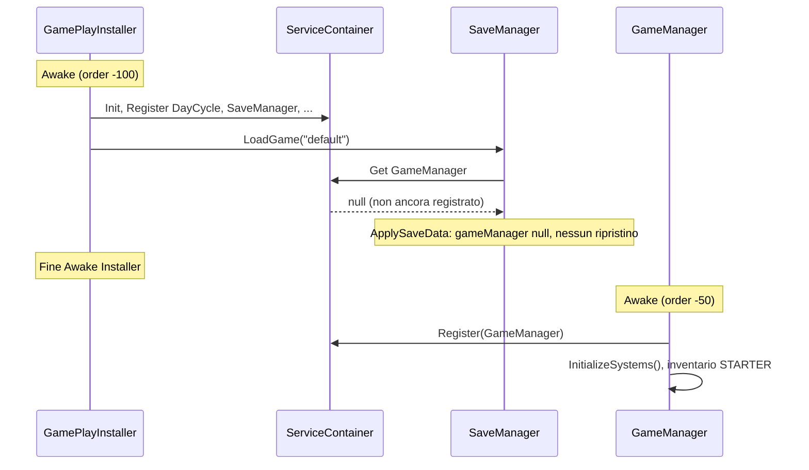

# Piano: Save/Load game solido

## Situazione attuale

Il [SaveManager](Assets/_Project/Scripts/Core/SaveManager.cs) salva e carica: stato gioco (giorno, CRY, azioni, condensazione), inventario (con metadata), vasi (stato completo), modulo staminali. Salvataggio avviene su **file** (`Application.persistentDataPath/Saves/sporium_save.json_{slot}`) e **PlayerPrefs** (backup). Caricamento automatico avviene in [GamePlayInstaller.Awake](Assets/_Project/Scripts/Core/Installers/GamePlayInstaller.cs) se esiste un save `"default"`. Salvataggio automatico in [EndDayButton](Assets/_Project/Scripts/UI/VaultMap/EndDayButton.cs) (pre end-day), [AppRoot](Assets/_Project/Scripts/Core/AppRoot.cs) (pause, focus lost, quit).

---

## Problemi individuati

### 1. Ordine di caricamento (bug critico)

**Conseguenza**: Al avvio con save esistente, `LoadGame` viene eseguito prima che `GameManager` sia registrato (`DefaultExecutionOrder`: Installer -100, GameManager -50). In `ApplySaveData` si ottiene `gameManager == null`, quindi **non vengono mai ripristinati** CRY, azioni, inventario, condensazione. Poi `GameManager.Awake` inizializza l’inventario con i valori **starter** e sovrascrive ogni eventuale stato. Il load risulta inefficace per tutto ciò che passa da GameManager.

### 2. Giorno corrente non ripristinato

In [DayCycleSystem](Assets/_Project/Scripts/Core/DayCycleSystem.cs) la property è `CurrentDay { get; private set; }`. In [SaveManager.ApplySaveData](Assets/_Project/Scripts/Core/SaveManager.cs) (righe 267-271) c’è solo un commento: *"CurrentDay è privato, potrebbe essere necessario aggiungere un setter"* e **nessuna** chiamata che imposti il giorno. Dopo il load il giorno resta 1 (o default).

### 3. Condensazione salvata ma non applicata

`condensationAmount` è incluso in `GameStateData` e scritto in `CollectSaveData`, ma in `ApplySaveData` non c’è alcuna chiamata a `CondensationSystem`. [CondensationSystem](Assets/_Project/Scripts/Core/CondensationSystem.cs) espone già `SetCurrentAccumulation(float)` (riga 194): va usato in fase di load.

### 4. Pulsanti Save/Load nell’inspector non collegati

In [GlobalStateInspector.DrawSaveSystemSection](Assets/_Project/Scripts/DevTools/Inspector/GlobalStateInspector.cs) (righe 566-575) i pulsanti "Save" e "Load" non chiamano il SaveManager; fanno solo log "funzionalità da implementare".

### 5. Dati non persistiti (opzionali per “solido”)

- **Note diario piante**: [PlantDiaryManager](Assets/_Project/Scripts/UI/UIToolkit/PlantCard/Components/PlantDiaryManager.cs) tiene `_notesByPotId` in memoria; `SaveNotes`/`LoadNotes` sono TODO e non integrati con SaveManager.
- **Missioni**: [MissionManager](Assets/_Project/Scripts/Core/MissionSystem/MissionManager.cs) tiene `_currentMissions` (MissionChecker con `MissionConfig` ScriptableObject + `IsCompleted`). SaveManager ha `DiaryStatisticsData`/`MissionsData` vuoti.
- **Extractor / Lab in corso**: [Extractor](Assets/_Project/Scripts/Interactables/Extractor.cs) ha slot, progress, coroutine; Incubator/Fusion/Catalyser hanno stati “in progress”. Persisterli richiede serializzare stato e, al load, riavviare timer o completare; complessità maggiore, da considerare in una fase successiva.

---

## Piano di intervento

### Fase 1 – Correzione bug e ripristino stato core (obbligatoria)

1. **Caricamento dopo GameManager**
  - In [GamePlayInstaller](Assets/_Project/Scripts/Core/Installers/GamePlayInstaller.cs): non chiamare `LoadGame("default")` in `Awake`. Posticipare il load a quando GameManager è disponibile.
  - Opzione A (consigliata): in `GamePlayInstaller`, avviare una coroutine che aspetta 1–2 frame (o che `ServiceContainer.Instance.Get<GameManager>() != null`) e poi chiama `saveManager.LoadGame("default")` se `SaveExists("default")`. In questo modo `ApplySaveData` trova GameManager già registrato e inventario/sistemi non ancora sovrascritti da default.
  - Opzione B: spostare la logica “carica save se esiste” dentro `GameManager` (es. in `Start()` o dopo `InitializeSystems()`), e in Installer non chiamare più Load (evitare doppio load).
  - Documentare l’ordine: prima registrazione GameManager e inizializzazione sistemi, poi un solo punto in cui si chiama `LoadGame` se si vuole “continua partita”.
2. **Ripristino giorno**
  - In [DayCycleSystem](Assets/_Project/Scripts/Core/DayCycleSystem.cs): aggiungere un metodo pubblico o interno per impostare il giorno, es. `SetCurrentDay(int day)` (solo per load), che assegna `CurrentDay = day` e opzionalmente invoca `OnDayChanged?.Invoke(CurrentDay)` se serve notificare la UI.
  - In [SaveManager.ApplySaveData](Assets/_Project/Scripts/Core/SaveManager.cs): dopo aver ottenuto `dayCycleSystem`, se `saveData.gameState?.currentDay > 0` chiamare `dayCycleSystem.SetCurrentDay(saveData.gameState.currentDay)`.
3. **Ripristino condensazione**
  - In [SaveManager.ApplySaveData](Assets/_Project/Scripts/Core/SaveManager.cs): dopo aver ripristinato CRY/azioni su `gameManager`, se `gameManager.CondensationSystem != null` e `saveData.gameState != null`, chiamare `gameManager.CondensationSystem.SetCurrentAccumulation(saveData.gameState.condensationAmount)` (o equivalente esposto da CondensationSystem).
4. **Collegamento pulsanti Save/Load (dev)**
  - In [GlobalStateInspector](Assets/_Project/Scripts/DevTools/Inspector/GlobalStateInspector.cs), nella sezione Save System: al click di "Save" chiamare `_saveManager.SaveGame("default")` e mostrare/esporre esito (log o breve feedback). Al click di "Load" chiamare `_saveManager.LoadGame("default")` (stesso slot). Gestire il caso in cui dopo Load la scena non si ricarica: `ApplySaveData` aggiorna già lo stato in memoria, quindi per uso in Editor può essere sufficiente; se in futuro servisse “reload scena” si potrà aggiungere.

### Fase 2 – Robustezza e UX (consigliata)

1. **Validazione e versioning**
  - In SaveManager: prima di `ApplySaveData`, controllare che `saveData.gameState != null` e che `gameVersion`/`inventoryVersion` siano gestiti (già parzialmente con `inventoryVersion`). In caso di formato sconosciuto o versioni troppo vecchie, log di warning e fallback (es. non applicare blocchi non riconosciuti o abortire load con messaggio chiaro).
  - Opzionale: aggiungere un `saveFormatVersion` (int) nel JSON e in load fare migrazioni esplicite per formato 1, 2, ecc.
2. **Feedback utente**
  - Dove oggi si fa solo `SaveGame("default")` (EndDayButton, AppRoot): opzionalmente mostrare un breve messaggio o icona “Salvataggio in corso…” / “Salvato” (tramite notifiche esistenti o HUD) per evitare che l’utente chiuda pensando di non aver salvato.

### Fase 3 – Contenuti aggiuntivi (opzionale)

1. **Note diario piante**
  - Definire una struttura serializzabile (es. lista di `{ potId, day, text }`) e includerla in `GameSaveData`.
  - In `CollectSaveData`: se `PlantDiaryManager.Instance` esiste, iterare `_notesByPotId` e riempire la struttura.
  - In `ApplySaveData`: ripristinare le note in `PlantDiaryManager` (clear + add). Implementare `SaveNotes`/`LoadNotes` in [PlantDiaryManager](Assets/_Project/Scripts/UI/UIToolkit/PlantCard/Components/PlantDiaryManager.cs) delegando a SaveManager o applicando i dati che SaveManager passa al load.
2. **Missioni**
  - Salvare per ogni missione un identificativo (es. `MissionConfig.name` o path Asset) e `IsCompleted`. In load: risolvere i `MissionConfig` da Assets (es. `Resources.Load` o tramite AssetManager se c’è un registro), ricreare `MissionChecker` e impostare `IsCompleted`. Implementare `SerializeMissions`/deserialize in SaveManager e popolare `MissionsData` / applicare in `ApplySaveData`.
3. **Extractor / Lab “in corso”**
  - Richiede snapshot degli slot (stato, progress 0–1, input item, output attesi). Al load: interrompere coroutine eventuali, ripristinare array di stato e o completare subito l’estrazione o riavviare una coroutine con tempo rimanente. Da valutare come estensione successiva per non dilatare troppo la Fase 1.

---

## Ordine consigliato di implementazione

1. Fase 1.1 – Posticipare `LoadGame` (coroutine o load da GameManager).
2. Fase 1.2 – Aggiungere `SetCurrentDay` in DayCycleSystem e usarlo in ApplySaveData.
3. Fase 1.3 – Ripristinare condensazione in ApplySaveData.
4. Fase 1.4 – Collegare pulsanti Save/Load in GlobalStateInspector.
5. Fase 2 – Versioning/validazione e feedback salvataggio (opzionale ma utile).
6. Fase 3 – Note diario e/o missioni se richiesti dal prodotto.

---

## File toccati (riepilogo)

| File                                                                                          | Modifiche                                                                                     |
| --------------------------------------------------------------------------------------------- | --------------------------------------------------------------------------------------------- |
| [GamePlayInstaller.cs](Assets/_Project/Scripts/Core/Installers/GamePlayInstaller.cs)          | Defer LoadGame dopo GameManager pronto (coroutine o equivalente).                             |
| [DayCycleSystem.cs](Assets/_Project/Scripts/Core/DayCycleSystem.cs)                           | Aggiungere `SetCurrentDay(int)` (o metodo interno per load).                                  |
| [SaveManager.cs](Assets/_Project/Scripts/Core/SaveManager.cs)                                 | In ApplySaveData: chiamare SetCurrentDay; chiamare CondensationSystem.SetCurrentAccumulation. |
| [GlobalStateInspector.cs](Assets/_Project/Scripts/DevTools/Inspector/GlobalStateInspector.cs) | Pulsanti Save/Load: chiamare SaveGame/LoadGame e feedback.                                    |

Opzionali (Fase 2–3): stesso SaveManager per versioning/validazione; PlantDiaryManager + SaveManager per note; MissionManager + SaveManager per missioni; eventuale UI “Continua” se esiste un menu principale.