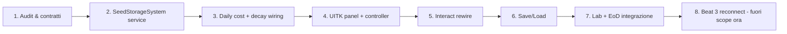
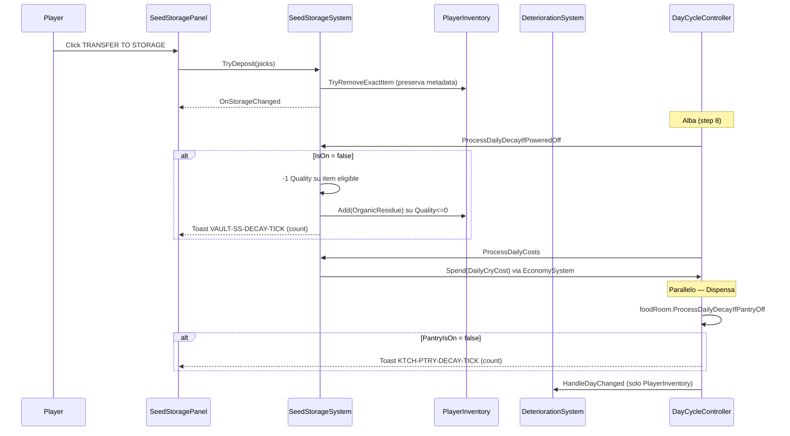

# Seed Storage (EXT-002) — Rework feature v2

## Design consolidato (confermato con l'utente)

### Cosa conserva
Tutti gli **organici botanici** prodotti o raccolti dal giocatore. Niente cibo/acqua (resta alla Dispensa Refrigerata).

- **Botanical**: `WholePlant` (piante uprooted o comprate) + prodotti harvest (`FruitFerricPod`, `FruitArcticPod`, `FruitGlassPod`, eventuali future foglie/fiori).
- **Seeds**: `PreSeed`, `Seed001/002/003`, + qualunque `PlantDatabase.IsRegisteredSeedTypeId(...)` (specie runtime Lab).
- **Spores**: `SporeGeneric` (con metadata `SporeStageValue` Raw/Matured, famiglia, genetic type).

### Operazioni
- **Deposit** multiplo: 1 `Action Point`, N item in un'azione, `EconomySystem` non toccato. Il giocatore può ripetere deposit/withdraw quante volte vuole finché ha AP disponibili.
- **Withdraw** multiplo: 1 `Action Point`, N item in un'azione.
- **Unlock slot 4/5/6**: click gratuito, stato persistente. Da quel momento lo slot diventa utilizzabile e, se occupato, paga il tier alto.
- **Power ON/OFF**: bottone dedicato (pattern `btn-dispensa-power`). Azzera il costo giornaliero; finché è OFF, gli item dentro **decadono come se fossero in inventario** (vedi sezione Decay).

### Capacità e costi
- **Capacità totale massima** in questa versione: **6 slot fissi**, punto (nessuno sblocco modulare / espansione oltre i 6 in v2).
- Default: slot 1-3 attivi, slot 4-6 `LOCKED` fino al click UNLOCK (persistente).

| Range slot | Stato default | Costo giornaliero se occupato (power ON) |
|------------|---------------|------------------------------|
| 1-3 | già attivi | 1 CRY/g per slot occupato |
| 4-6 | `LOCKED` finché il giocatore non clicca UNLOCK | 3 CRY/g per slot occupato |

- Slot **vuoti non costano nulla**, anche se sbloccati.
- **Power OFF** ⇒ `DailyCryCost = 0` indipendentemente dallo stato degli slot.
- Il calcolo avviene all'alba nella stessa fase che gestisce `FoodRoomSystem.ProcessDailyCosts` (vedi [DayCycleController](Assets/_Project/Scripts/Dome/SPOR-BLK-01-03A-DayCycleController.cs) step 8).

### Decay
Il progetto ha già [`DeteriorationSystem`](Assets/_Project/Scripts/Core/DeteriorationSystem.cs): `-1 Quality`/giorno per `SporeGeneric`, `WholePlant`, cibi e tutti i seed registrati. A `Quality<=0` si trasformano in `OrganicResidue`.

Comportamento nello Seed Storage:
- **Power ON**: item **non decadono**. Dato che migrano fuori dal `PlayerInventory`, `DeteriorationSystem.HandleDayChanged` non li vede → tick giornaliero saltato naturalmente.
- **Power OFF**: gli item **decadono come se fossero in inventario**. Implementazione: `SeedStorageSystem.ProcessDailyDecayIfPoweredOff()` chiamato all'alba (stessa fase di `ProcessDailyCosts`) che replica la logica di `DeteriorateInventorySlot`:
  - `-1 Quality` su ogni `Item` eligible (`Items.SporeGeneric`, `Items.WholePlant`, `Items.IsFruitType`, `PlantDatabase.IsRegisteredSeedTypeId`).
  - A `Quality<=0` l'item viene rimosso dalla slot e al suo posto `OrganicResidue` viene aggiunto al `PlayerInventory` (identico al comportamento attuale del decay), così il giocatore "scopre" il residuo nell'inventario alla riapertura del panel.
  - Se la slot resta vuota dopo il consumo, torna stato `Empty` (unlock preservato).

---

## Modello dati

### Slot tipizzato (nuovo)
```csharp
[Serializable]
public class SeedStorageSlot
{
    public int SlotIndex;               // 0..5
    public bool IsUnlocked;             // default true se 0..2, false se 3..5 finché non UNLOCK
    public string StoredTypeId;         // null => vuoto
    public List<Item> StoredItems;      // metadata preservati (Quality, spore stage, genetics...)
    public int CryPerDay => IsUnlocked && StoredItems?.Count > 0
        ? (SlotIndex < 3 ? 1 : 3) : 0;
}
```

Rationale: serve tenere le `Item` istanza (non solo count) perché dobbiamo **preservare i metadata** (qualità, stage spora, famiglia, `CustomPlantName`, ecc.) — cose che il vecchio `DragDropUI` via `Inventory.Consume/Add(typeId,1)` perde.

### Slot snapshot "depositQuality"
Ogni `Item` in storage mantiene la sua `Quality` runtime. La UI mostra la barra **VIABILITY** come:
- `Quality / MaxQuality` corrente dell'item (media se più item nella stessa slot).
- Con power ON, la `Quality` **non scende** mentre è dentro, quindi la barra rappresenta anche lo "stato di conservazione al momento del deposito".
- Con power OFF, la `Quality` scende di giorno in giorno e la barra lo mostra in tempo reale.

### Service (nuovo, registrato in ServiceContainer)
[`SeedStorageSystem`](Assets/_Project/Scripts/Systems/SeedStorage/SeedStorageSystem.cs) (path target):
- `IReadOnlyList<SeedStorageSlot> Slots`
- `bool IsOn { get; }` — power state
- `event Action OnStorageChanged`
- `event Action<bool> OnPowerChanged`
- `bool IsEligibleType(string typeId)` — accetta botanical/seed/spore elencati sopra
- `bool TryDeposit(IEnumerable<(InventorySlot src, int qty)> picks)` — spende 1 AP, sposta dall'`Inventory` player mantenendo `Item` istanze via `Inventory.TryRemoveExactItem`
- `bool TryWithdraw(IEnumerable<(int slotIdx, int qty)> picks)` — spende 1 AP, rientra in player `Inventory`
- `bool TryUnlockSlot(int slotIdx)`
- `bool SetPower(bool isOn)` — toggle + toast `VAULT-SS-ON`/`VAULT-SS-OFF` (nuovi id in NotificationTypeSpecDefaults)
- `int DailyCryCost { get; }` — 0 se OFF; altrimenti somma slot occupati × tier
- `void ProcessDailyCosts()` — chiamata da DayCycleController
- `void ProcessDailyDecayIfPoweredOff()` — chiamata da DayCycleController **prima** di ProcessDailyCosts
- `IEnumerable<Item> GetStoredItems()` — API di lettura usata da Lab/EoD

### Integrazione con DeteriorationSystem
`DeteriorationSystem.HandleDayChanged` resta invariato (itera solo `PlayerInventory`). Il decay "power OFF" vive **interamente dentro** il service di ogni contenitore (`SeedStorageSystem.ProcessDailyDecayIfPoweredOff`, `FoodRoomSystem.ProcessDailyDecayIfPantryOff`), così da mantenere il dominio coeso e non introdurre accoppiamenti bidirezionali.

---

## Allineamento Dispensa Refrigerata (feature parallela)

### Problema attuale
[`FoodRoomSystem.SetPantryPower(false)`](Assets/_Project/Scripts/Systems/FoodRoom/FoodRoomSystem.cs):
- azzera correttamente il costo giornaliero (`ProcessDailyCosts` skip del branch `if (_pantryIsOn)`);
- **ma** i `_pantryByType` (List<Item>) non subiscono decay → bug: spenta la dispensa, il cibo si conserva comunque.

Il toast registry ha già spec coerenti ma non del tutto accurate:
- `KTCH-PTRY-OFF` template attuale: "La dispensa e spenta: nessun costo giornaliero, nessuna refrigerazione." — il messaggio è corretto come avviso di evento ma il codice non rende vero "nessuna refrigerazione".

### Fix
Nuovo metodo in [`FoodRoomSystem`](Assets/_Project/Scripts/Systems/FoodRoom/FoodRoomSystem.cs):

```csharp
public void ProcessDailyDecayIfPantryOff()
{
    if (_pantryIsOn) return;
    foreach (var kvp in _pantryByType)
    {
        for (int i = kvp.Value.Count - 1; i >= 0; i--)
        {
            var item = kvp.Value[i];
            if (item == null) { kvp.Value.RemoveAt(i); continue; }
            item.Quality -= 1;
            if (item.Quality <= 0)
            {
                _inventory.Add(Items.OrganicResidue);
                kvp.Value.RemoveAt(i);
            }
        }
    }
}
```

### Hook in DayCycleController
Nello step 8 (lo stesso dove oggi viene chiamato `ProcessDailyCosts`):

```csharp
// Dispensa refrigerata
foodRoom.ProcessDailyDecayIfPantryOff(); // nuovo, prima dei costi
foodRoom.ProcessDailyProduction(dayIndex);
foodRoom.ProcessDailyCosts();

// Seed Storage
var seedStorage = _gameManager?.SeedStorageSystem;
if (seedStorage != null)
{
    seedStorage.ProcessDailyDecayIfPoweredOff();
    seedStorage.ProcessDailyCosts();
}
```

### Save/Load Dispensa
`FoodRoomSaveData.pantryItems` è già serializzato con `quality` (vedi [`ExportPantryState`](Assets/_Project/Scripts/Systems/FoodRoom/FoodRoomSystem.cs) e `SaveManager.SerializeFoodRoom`). Nessun schema change: il decay ora scrive su quella stessa struttura, i save esistenti rimangono compatibili.

### Nessun altro cambio UI per la Dispensa
Il bottone `btn-dispensa-power` esiste già. Il testo del toast `KTCH-PTRY-OFF` può essere aggiornato a: "La dispensa è spenta: gli alimenti iniziano a deperire." Task minore in `NotificationTypeSpecDefaults`.

---

## Toast "decay in atto" (Seed Storage + Dispensa)

### Spec nuovi (`NotificationTypeSpecDefaults.BuildDefaults()`)

| Id | Severity | Cooldown | Template IT | Template EN |
|----|----------|----------|-------------|-------------|
| `VAULT-SS-ON` | Info | 1f | "Seed Storage attivo (conservazione criogenica)" | "Seed Storage online (cryogenic preservation)" |
| `VAULT-SS-OFF` | Warning | 1f | "Seed Storage spento: i contenuti iniziano a deperire" | "Seed Storage offline: contents starting to decay" |
| `VAULT-SS-DECAY-TICK` | Warning | 0f (gated per day) | "Seed Storage spento: {count} oggetto/i in deperimento" | "Seed Storage offline: {count} item(s) decaying" |
| `KTCH-PTRY-DECAY-TICK` | Warning | 0f (gated per day) | "Dispensa spenta: {count} alimento/i in deperimento" | "Pantry offline: {count} food item(s) decaying" |

### Triggering
All'alba, dopo aver processato il decay:

```csharp
// SeedStorageSystem.ProcessDailyDecayIfPoweredOff()
int decaying = count_of_eligible_items_in_slots;
if (decaying > 0)
    FoundationNotificationServiceAccessor.Get()?
        .PostToastImmediate("VAULT-SS-DECAY-TICK",
            new NotificationPayload().With("count", decaying.ToString()));

// FoodRoomSystem.ProcessDailyDecayIfPantryOff() — stesso pattern con KTCH-PTRY-DECAY-TICK
```

### Regole UX
- Toast **una volta al giorno** per ciascun sistema (chiamato nel coroutine EoD/Dawn, non in loop).
- Se in quel giorno almeno un item è arrivato a `Quality<=0` e si è trasformato in `OrganicResidue`, il template può essere esteso con `{lostCount}` (decisione in audit fase 1).
- Severity **Warning** per attirare attenzione senza bloccare; non è forzato a "must show".

### Riepilogo punti di trigger (parity SS ↔ Dispensa)

| Evento | Seed Storage | Dispensa Refrigerata |
|--------|--------------|----------------------|
| Power ON click | `SeedStorageSystem.SetPower(true)` → `PostToastImmediate("VAULT-SS-ON")` | `FoodRoomSystem.SetPantryPower(true)` → `PostToastImmediate("KTCH-PTRY-ON")` (esistente) |
| Power OFF click | `SeedStorageSystem.SetPower(false)` → `PostToastImmediate("VAULT-SS-OFF")` | `FoodRoomSystem.SetPantryPower(false)` → `PostToastImmediate("KTCH-PTRY-OFF")` (esistente, testo aggiornato) |
| Alba con power OFF + ≥1 item dentro | `SeedStorageSystem.ProcessDailyDecayIfPoweredOff()` → `PostToastImmediate("VAULT-SS-DECAY-TICK", {count})` | `FoodRoomSystem.ProcessDailyDecayIfPantryOff()` → `PostToastImmediate("KTCH-PTRY-DECAY-TICK", {count})` |

Pattern identico a [`FoodRoomSystem.SetPantryPower`](Assets/_Project/Scripts/Systems/FoodRoom/FoodRoomSystem.cs) (righe 67-80): `FoundationNotificationServiceAccessor.Get(suppressWarning: true)` con check `foundation.Enabled` prima di postare.

### Nota System Log pannelli
Le righe di log interno al pannello Seed Storage (`> Power OFF — items exposed to decay` e `> SLOT {n}: {item} degraded to Organic Residue`) restano locali al pannello; non sostituiscono il toast globale.

---

## UI Toolkit (riferimento screenshot "SEED STORAGE INTERFACE")

### Struttura UXML (nuovo pannello)
Path target: `Assets/_Project/UI/UIToolkit/SeedStorage/SeedStoragePanel.uxml` + `.uss`.

Layout root a **due colonne**, identico alla reference:

```mermaid
flowchart LR
  subgraph Left[PLAYER INVENTORY / LOCAL STORAGE]
    LA[Header]
    LB[Category: BOTANICAL]
    LC[Category: SEEDS]
    LD[Category: SPORES]
    LE[Tip: SHIFT for multi-selection]
    LF[Btn: TRANSFER TO STORAGE]
    LG[Btn: RETRIEVE FROM STORAGE]
  end
  subgraph Right[SEED STORAGE INTERFACE]
    RA["Header: VAULT NODE EXT-002 + close"]
    RB["Info: CONNECTION / TEMP / POWER / STATUS"]
    RC["Metrics: OCCUPIED x/6, AVAILABLE, MAX CAPACITY, DAILY COST"]
    RD[Grid 6 slot: Empty | Occupied | Locked]
    RE[System Log]
  end
```

### Slot card (variant USS)
Tre stati mutualmente esclusivi:

- **Occupied**: icona, codice item (es. `SDE-001`), nome leggibile, `Quantity: N`, barra `VIABILITY` (= media `Quality/MaxQuality` degli item nella slot, se `IsPerishable`, altrimenti nascosta).
- **Empty**: icona container tenue + label "EMPTY SLOT" / "Ready for storage".
- **Locked**: lucchetto + label "LOCKED SLOT" + bottone `+ UNLOCK: +3 CRY/day`.

Classi suggerite (allineate al pattern HUD Foundation): `.seedstorage-slot`, `.seedstorage-slot--empty`, `.seedstorage-slot--locked`, `.seedstorage-slot--occupied`.

Regola imposta dalla [ui-hud-foundation-ui-builder-parity](.cursor/rules/ui-hud-foundation-ui-builder-parity.mdc): gli stati sono **sempre presenti in UXML** con placeholder visibili; il controller nasconde/mostra in `OnEnable` coerentemente. Niente "sample" paralleli.

### Metrics top (header destro)
- `Occupied: X/Y` dove Y = numero slot `IsUnlocked`.
- `Available: Y - X`.
- `Max Capacity: 20` = capacità unità totale (decisione di design da ref, non slot count). Prima approssimazione: somma capacità per slot (hardcoded 20 totali / 6 slot; oppure 20 è flavor). **Da confermare nella fase 1** (audit).
- `Daily Cost: DailyCryCost CRY`.

### Header destro — campi dinamici e flavor
- **Power toggle button** (nuovo, rif. `btn-dispensa-power`): label "POWER" con indicator `.seedstorage-power-indicator--on` / `--off` (stesso pattern `dispensa-power-indicator--on/--off` in [`DispensaPanelController`](Assets/_Project/Scripts/UI/UIToolkit/DispensaRefrigerata/DispensaPanelController.cs)). Click chiama `SetPower(!IsOn)`.
- `POWER: 72%` in screenshot diventa **stato dinamico**: "ON" / "OFF" (o icona/badge). Il numero 72% può restare flavor statico per ora se si vuole preservare l'estetica.
- `CONNECTION: STABLE`, `TEMP: -20°C`, `SYSTEM STATUS: NOMINAL`: flavor statici in v2.
- `SYSTEM STATUS` può diventare "OFF / DECAYING" quando power OFF + almeno 1 slot occupato, come feedback UX (da confermare in fase 1).

### Sistema log
Ring buffer di ultime 4-5 righe. Scrivere su `OnStorageChanged` / `OnPowerChanged` / decay event:
- `> Deposited {item} x{qty} into SLOT {n}`
- `> Retrieved {item} x{qty} from SLOT {n}`
- `> SLOT {n} unlocked`
- `> Power ON — cryogenic preservation active`
- `> Power OFF — items exposed to decay`
- `> SLOT {n}: {item} degraded to Organic Residue`

### Colonna PLAYER INVENTORY (sinistra)
Enumera **solo item eligible** via `SeedStorageSystem.IsEligibleType`, raggruppati per categoria (BOTANICAL / SEEDS / SPORES). Selezione multipla con **SHIFT** (come il tip); bottone `TRANSFER TO STORAGE` esegue `TryDeposit` sulle selezioni. `RETRIEVE FROM STORAGE` agisce sulle selezioni nella griglia destra.

Valutare riuso del picker giocatore [`PlayerInventoryPanelController`](Assets/_Project/Scripts/UI/UIToolkit/PlayerInventory/PlayerInventoryPanelController.cs) come lista filtrata vs lista custom dedicata. Per v2 consiglio **lista custom**: il picker attuale è monocolonna ed è pensato per scelta singola (usato dal Lab come "seleziona"). Una lista dedicata con categorie è più aderente alla reference e meno invasiva sul picker esistente.

---

## Save / Load

Aggiungere in [`GameSaveData`](Assets/_Project/Scripts/Core/SaveManager.cs) (v `INVENTORY_VERSION_WITH_METADATA` o nuovo `SEED_STORAGE_VERSION`):

```csharp
public SeedStorageSaveData seedStorage;

[Serializable] private class SeedStorageSaveData
{
    public bool isOn = true;
    public List<SeedStorageSlotSaveData> slots; // 6 entries
}

[Serializable] private class SeedStorageSlotSaveData
{
    public int slotIndex;
    public bool isUnlocked;
    public string storedTypeId;
    public List<InventoryItemData> items; // riusa struttura esistente con metadata
}
```

Serialize in `CollectSaveData`, restore in `ApplyLoadedSaveData`. La struttura `InventoryItemData` già salva `Quality`, `GeneticTypeValue`, `SporeStageValue`, `FamilyMetadata`, `ResolvedPlantCodeMetadata`, ecc. (vedi come viene trattato `SerializeInventory`).

---

## Integrazioni esistenti da aggiornare

### Lab
[`LabTerminalPanelController`](Assets/_Project/Scripts/UI/UIToolkit/Lab/LabTerminalPanelController.cs):
- `BuildAccessibleFruitCounts` / `CountStorageFruitTotal` / `CountAccessibleType`: sostituire `FindObjectsByType<SeedStorage>()` con `ServiceContainer.Instance.Get<SeedStorageSystem>().GetStoredItems()`.
- Rimuove dipendenza da scene scan, migliora performance e testabilità.

### End of Day
[`BuildSeedStorageSummary`](Assets/_Project/Scripts/UI/UIToolkit/EndOfDay/EndOfDaySequenceController.cs): oggi conta semi nel **player inventory**, non nel deposito — incongruenza col nome. Riscrivere leggendo da `SeedStorageSystem` e unificando con eventuale riepilogo player.

### Daily hook (decay off + costs)
[`DayCycleController.AdvanceTurn`](Assets/_Project/Scripts/Dome/SPOR-BLK-01-03A-DayCycleController.cs) step 8, dopo `foodRoom.ProcessDailyCosts()`:

```csharp
var seedStorage = _gameManager?.SeedStorageSystem; // nuovo getter in GameManager
if (seedStorage != null)
{
    seedStorage.ProcessDailyDecayIfPoweredOff(); // prima del costo
    seedStorage.ProcessDailyCosts();             // 0 se IsOn=false
}
```

Ordine: prima decay, poi costo, così il costo del giorno riflette lo stato slot aggiornato (item decaduti = slot potenzialmente liberato = nessun costo).

### Legacy da deprecare
- [`SeedStorageUI.cs`](Assets/_Project/Scripts/UI/VaultMap/SeedStorage/SeedStorageUI.cs), [`DragDropUI.cs`](Assets/_Project/Scripts/UI/VaultMap/DragDropUI.cs), usi di [`HUDItemContainer.cs`](Assets/_Project/Scripts/UI/VaultMap/HUDItemContainer.cs) limitati al deposito → rimuovere o marcare obsoleti dopo migrazione.
- [`SeedStorage.cs`](Assets/_Project/Scripts/Interactables/SeedStorage.cs): `HandleInteract` chiama il nuovo panel via ServiceContainer; non più doppio `Show` (HUDInventory legacy + SeedStorageUI).

---

## Fasi di esecuzione



| Fase | Deliverable | Rischio |
|------|-------------|---------|
| 1 | Audit: confermare categorie eligible, capacità unità per slot (20 totali o per-slot?), flavor header | Basso |
| 2 | `SeedStorageSystem` + slot model + registrazione ServiceContainer | Medio (nuovo dominio) |
| 3 | Hook `ProcessDailyCosts` in DayCycleController, test che decay non tocca storage | Basso |
| 4 | UXML/USS/controller rispettando parity rule; stati Empty/Occupied/Locked | Medio (la UITK richiede attenzione ai PanelSettings come da DEV 0085) |
| 5 | `SeedStorage.HandleInteract` -> `SeedStoragePanelController.Show()` | Basso |
| 6 | Save/Load con metadata preservati | Medio (versioning save) |
| 7 | Lab + EoD + toast "added" via NotificationsFoundation | Basso |
| 8 | **Dispensa Refrigerata**: `ProcessDailyDecayIfPantryOff` + hook DayCycleController + update spec `KTCH-PTRY-OFF` | Basso |
| 9 | Toast giornalieri `VAULT-SS-DECAY-TICK` + `KTCH-PTRY-DECAY-TICK` (registry + call nei due service) | Basso |
| 10 | Beat 3 / missione demo | fuori scope fino a fase 9 chiusa |

---

## Decisioni consolidate (round 2 con l'utente)

1. **Capacità**: **6 slot massimi** in questa versione, niente espansione oltre. `MAX CAPACITY: 20` della screenshot resta flavor o diventa la "capacità unità" per slot (da definire in audit fase 1: ipotesi ragionevole `MAX_PER_SLOT` alto, es. 99, con `Max Capacity` header = somma unità attuali su max).
2. **AP**: il giocatore può fare quanti deposit/withdraw vuole nel turno, ciascuno costa 1 AP.
3. **Viability**: barra = stato di conservazione **corrente** (`Quality/MaxQuality`). Con power ON resta congelata sul valore al deposito, con power OFF scende in tempo reale. Item non `IsPerishable` → barra nascosta.
4. **Demo/Both**: feature identica in demo e full game (niente flag demo-only).
5. **Power ON/OFF**: nuovo bottone pattern `btn-dispensa-power`. OFF ⇒ 0 CRY/g ma decay attivo sugli item dentro.
6. **Dispensa Refrigerata parity**: stessa semantica di power OFF → decay dei food dentro la pantry come fossero in inventario (-1 Quality/g, `Quality<=0` ⇒ `OrganicResidue` nell'inventory). Fix del bug attuale in `FoodRoomSystem`.
7. **Toast decay-tick**: all'alba, se SS o Dispensa sono OFF con almeno 1 item dentro, toast `VAULT-SS-DECAY-TICK` / `KTCH-PTRY-DECAY-TICK` (Warning, una volta al giorno per sistema) con `{count}` item in deperimento.

---

## Fuori scope esplicito

- **Missione demo** `M_Demo_SeedStorage` / VO beat 3 / `DemoSeedStorageMission` (si riallaccia dopo).
- **Moduli acquistabili** per sbloccare slot 4-6 (per ora UNLOCK gratuito) e espansione oltre 6 slot.
- **Integrazione con sistema energia globale del Vault** (il power toggle è locale allo storage, non connesso a un `EnergySystem`).
- **Tutorial onboarding** specifico del deposito.

---

## Mini-roadmap visuale



---

## Pulizia legacy — dettaglio script

Mappa usi attuali (verificata da grep contro `Assets/`):

| Script | Usato da | Decisione |
|--------|----------|-----------|
| [`SeedStorage.cs`](Assets/_Project/Scripts/Interactables/SeedStorage.cs) | Scena `SCN_VaultMap` (GameObject `SeedStorage`) | **Riscritto in place** (stesso path, stesso GUID `.meta` → reference scena preservato). Diventa un thin wrapper che: `Awake` → registra se stesso in `SeedStorageSystem`; `HandleInteract` → apre `SeedStoragePanelController`. Rimossi i serialize field `_inventoryUI` e `_seedStorageUI`. Rimossa la `Inventory _inventory` interna (lo stato vive nel service). |
| [`SeedStorageUI.cs`](Assets/_Project/Scripts/UI/VaultMap/SeedStorage/SeedStorageUI.cs) + `.meta` | Solo il GameObject `UI_SeedStorage` in `SCN_VaultMap` | **Eliminato** insieme all'intera cartella `Assets/_Project/Scripts/UI/VaultMap/SeedStorage/` (+ `SeedStorage.meta` della cartella). |
| [`DragDropUI.cs`](Assets/_Project/Scripts/UI/VaultMap/DragDropUI.cs) | `SeedStorageUI`, `LabPippete`, `LabMicroscope`, `LabCatalizzatore`, `LabMinigameExtractor` | **Mantenuto** (serve ai lab mini-games). Solo scollegato dal SeedStorage lato scena (il GameObject `UI_SeedStorage` viene rimosso interamente). |
| [`HUDInventory.cs`](Assets/_Project/Scripts/UI/VaultMap/HUDInventory.cs) + `HUDInventoryItem.cs` + `HUDItemContainer.cs` | BlackMarket, Lab mini-games, PlayerStatusPanel fallback, Food/Kitchen | **Mantenuti**. Il nuovo SeedStorage non li userà. |
| [`LabTerminalPanelController`](Assets/_Project/Scripts/UI/UIToolkit/Lab/LabTerminalPanelController.cs) | usa `FindObjectsByType<SeedStorage>` | **Aggiornato** (t8): sostituire lookup con `ServiceContainer.Instance.Get<SeedStorageSystem>().CountFruitsByType(...)`. |
| [`EndOfDaySequenceController.BuildSeedStorageSummary`](Assets/_Project/Scripts/UI/UIToolkit/EndOfDay/EndOfDaySequenceController.cs) | oggi legge `PlayerInventory` (bug semantico) | **Corretto** (t8): legge dal `SeedStorageSystem`. |
| [`LabMicroscope.cs`](Assets/_Project/Scripts/UI/VaultMap/MicroscopeMinigame/LabMicroscope.cs) | riferimento a SeedStorage per verifica? | Verificare: [Read prima di esecuzione] confermare che non dipenda dal SeedStorage come contenitore (grep mostra solo utilizzo di `DragDropUI` e `HUDInventory` standalone). |

File di docs/report storici (`Assets/Docs/REPORT/...`, `Assets/_Project/Docs/SceneHierarchy.txt`, `ANALISI_CLEANUP_OBSOLETI.md`, `TOAST_NOTIFICATION_SYSTEM.md`, `NOTIFICATIONS_LINKING_TOAST_PROPOSALS.md`) → **non toccati** (sono storici).

---

## Istruzioni Unity editor (post-merge codice)

Da eseguire a mano una sola volta, nell'ordine indicato. Tutte le azioni sono sulla scena **`Assets/_Project/Scenes/SCN_VaultMap.unity`** salvo dove indicato.

1. **Backup scena**
   - `git status` → committa tutto; apri Unity **dopo** che il working tree è pulito (così Unity normalizza YAML con GUID aggiornati e puoi vedere il diff in scena).

2. **Chiudi tutte le scene in editor**, poi apri solo `SCN_VaultMap`.

3. **Pannello legacy `UI_SeedStorage` → DELETE**
   - In Hierarchy cerca `UI_SeedStorage` (GameObject radice UGUI del pannello vecchio).
   - Tasto destro → **Delete**.
   - Verifica in Project window che non resti niente sotto `Assets/_Project/Scripts/UI/VaultMap/SeedStorage/` (la cartella intera va eliminata via git/Cursor + Refresh). Unity mostrerà eventuali **missing scripts**: è atteso e viene risolto al passo 4.

4. **GameObject `SeedStorage` (interactable) → sanity check**
   - In Hierarchy seleziona `SeedStorage` (il GameObject interagibile nella stanza Vault/Seed Storage).
   - Component `SeedStorage` (script riscritto in place) → dovrebbe già essere collegato perché il GUID del `.meta` è stato preservato.
   - **Rimuovere** i campi inspector `_inventoryUI` e `_seedStorageUI` se appaiono ancora come "Missing" (la riscrittura toglie i serialize field, ma Unity può lasciare il campo in YAML fino al primo save della scena).
   - Save scena (`Ctrl+S`).

5. **RoomZone_SeedStorage → LASCIARE INVARIATO**
   - È un trigger di stanza usato dal RoomTracker / DemoStoryDirector. Non toccare.

6. **UIDocument del nuovo pannello**
   - Assicurarsi che `SeedStoragePanelController` (UI Toolkit) sia registrato sotto l'UIDocument giusto (tipicamente lo stesso `Main Canvas UIDocument` che ospita `DispensaPanelController`). Stesso pattern già usato in [`DispensaPanelController`](Assets/_Project/Scripts/UI/UIToolkit/DispensaRefrigerata/DispensaPanelController.cs).
   - Verifica che il PanelSettings sia il condiviso HUD (rif. DEV REPORT 0085 sui PanelSettings).

7. **ServiceContainer bootstrap**
   - Verificare che `SeedStorageSystem` venga registrato all'avvio scena (installer o `GameManager.Awake`). Pattern identico a `FoodRoomSystem`.

8. **Smoke test in Play mode**
   - Entra in scena, vai nella stanza Seed Storage, interagisci → si apre il nuovo pannello UITK (no UGUI legacy).
   - Deposita 1 Whole Plant, Spora, Seed → 1 AP speso, slot occupato.
   - End turn → verifica CRY scalato del tier corretto.
   - Spegni → toast `VAULT-SS-OFF`. End turn → toast `VAULT-SS-DECAY-TICK`. Quality item -1.
   - Stesso giro sulla Dispensa: spegni, end turn → toast `KTCH-PTRY-DECAY-TICK`, food inside -1 Quality, eventuale trasformazione in `OrganicResidue`.
   - Save & Load: slot, metadata, power state, unlock state preservati.

9. **Commit di scena separato**
   - Dopo i passi 3-4 la scena avrà diff. Committare con messaggio `scene: rimozione UI_SeedStorage legacy + cleanup serialize field SeedStorage`.

10. **Fuori scope (ricorda a futuro)**
    - Re-collegamento missione demo beat 3 al nuovo `SeedStoragePanelController` / `SeedStorageSystem` (vedi todo `t11-beat3-later`).
    - Valutare se il trigger missione resta "enter room" o diventa "first interact with SeedStorage".

---

## Decisioni di chiusura round 3 (confermate)

- **`SeedStorage.cs`** → riscritto **in place** (stesso path, stesso GUID `.meta`): la reference in scena resta valida, nessuna riassegnazione manuale.
- **`UI_SeedStorage` in scena** → eliminazione **manuale in Unity** (nessuna patch YAML automatica). Le istruzioni sono nella sezione "Istruzioni Unity editor" sopra.

---

## Regole Cursor verificate

- [`architecture-runtime-services`](.cursor/rules/architecture-runtime-services.mdc) → rispettata: `SeedStorageSystem` via `ServiceContainer`, niente nuovi `FindObjectOfType`; il vecchio `FindObjectsByType<SeedStorage>()` in `LabTerminalPanelController` viene **eliminato** (t8).
- [`gameplay-runtime-patterns`](.cursor/rules/gameplay-runtime-patterns.mdc) → rispettata: nuovo step day-cycle (`ProcessDailyDecayIfPoweredOff` + `ProcessDailyCosts`) vive nel service dedicato, `DayCycleController` resta **orchestratore**.
- [`new-feature-extension-paths`](.cursor/rules/new-feature-extension-paths.mdc) → rispettata: registro via bootstrap, niente scene scans ad-hoc.
- [`ui-hud-foundation-ui-builder-parity`](.cursor/rules/ui-hud-foundation-ui-builder-parity.mdc) → da applicare in fase 4 (UITK UXML/USS): campioni slot `Empty/Occupied/Locked` visibili in UI Builder con placeholder realistici, niente binari paralleli, stili in USS non inline.
- [`feature-both-demo-full-parity`](.cursor/rules/feature-both-demo-full-parity.mdc) → rispettata: feature unica, niente fork demo-only.
- [`analysis-no-suppositions-fresh-scan`](.cursor/rules/analysis-no-suppositions-fresh-scan.mdc) → applicata in questo round: scope pulizia legacy verificato con grep sul repo corrente (vedi tabella sopra).
