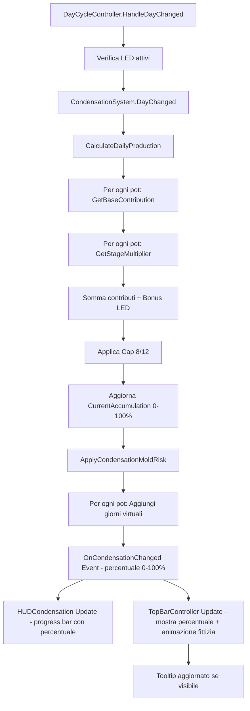

# Piano: Sistema Condensazione Completo (Notion GDD)

## Obiettivo

Trasformare il sistema di condensazione attuale (semplice +3/giorno) nel sistema completo descritto in Notion: calcolo dinamico basato su piante, stage, salute, bonus LED, reward scalato, integrazione Mold Risk. L'UI esistente (progress bar + button) viene mantenuta e adattata al nuovo sistema.

## Architettura del Sistema

### Formula di Produzione (Notion)

```
WAT-RAW raccolta = Σ(contributo singola pianta) + bonus LED
CAP: 8 WAT-RAW/giorno (base), 12 con upgrade
```

### Contributo per Pianta

- Base stato: 2 (sana), 1 (stressata), 0 (morta)
- Moltiplicatore stage: Seed/Sprout ×0, Growth ×1, Flowering ×2, Harvest ×1, Resting ×1
- Contributo finale = base_stato × moltiplicatore_stage

### Bonus LED

- +2 WAT-RAW flat se almeno 1 LED attivo (Blue o Red)

### Reward Scalato

- 0-49%: 5-10 WAT-RAW
- 50-79%: 15-25 WAT-RAW  
- 80-100%: 30-40 WAT-RAW

### Integrazione Mold Risk

- Condensazione accelera contatore overwatering con "giorni virtuali":
  - 0-49%: +0 giorni
  - 50-59%: +0.5 giorni
  - 60-79%: +1 giorno
  - 80-100%: +1.5 giorni
- Al 100%: riduce timer infestazione (2 giorni → 1 giorno → immediata)

## Implementazione

### Fase 1: Ristrutturazione CondensationSystem

**File**: `Assets/_Project/Scripts/Core/CondensationSystem.cs`

**Modifiche**:

1. Rimuovere logica `DayChanged()` attuale (accumulo fisso +3)
2. Aggiungere metodo `CalculateDailyProduction()` che:

   - Riceve lista `PotStateModel` e `DayCycleController` (per verificare LED)
   - Calcola contributo per ogni pianta attiva
   - Applica moltiplicatori stage
   - Aggiunge bonus LED se presente
   - Applica cap (8 base, 12 con upgrade)

3. Modificare `DayChanged()` per chiamare `CalculateDailyProduction()` invece di incremento fisso
4. Aggiungere proprietà `DailyProduction` (calcolata) e `CurrentAccumulation` (accumulo corrente 0-100%)

**Nuova struttura**:

```csharp
public class CondensationSystem
{
    private float _currentAccumulation = 0f; // 0-100% (non più 0-10)
    private float _dailyProduction = 0f;     // Produzione del giorno corrente
    private int _collectionCap = 8;           // Cap base, 12 con upgrade
    
    public float CurrentAccumulation => _currentAccumulation; // 0-100%
    public float DailyProduction => _dailyProduction;
    
    public void DayChanged(List<PotStateModel> activePots, bool hasActiveLed)
    {
        _dailyProduction = CalculateDailyProduction(activePots, hasActiveLed);
        _currentAccumulation += _dailyProduction;
        _currentAccumulation = Mathf.Clamp(_currentAccumulation, 0f, 100f);
    }
    
    private float CalculateDailyProduction(List<PotStateModel> pots, bool hasLed)
    {
        float total = 0f;
        foreach (var pot in pots)
        {
            if (pot == null || !pot.HasPlant) continue;
            
            // Base per stato
            float baseContribution = GetBaseContribution(pot);
            
            // Moltiplicatore stage
            float stageMultiplier = GetStageMultiplier((PlantStage)pot.Stage);
            
            total += baseContribution * stageMultiplier;
        }
        
        // Bonus LED
        if (hasLed) total += 2f;
        
        // Cap
        return Mathf.Min(total, _collectionCap);
    }
}
```

### Fase 2: Calcolo Contributi Pianta

**File**: `Assets/_Project/Scripts/Core/CondensationSystem.cs`

**Metodi da aggiungere**:

1. `GetBaseContribution(PotStateModel pot)`:

   - Sana (ConditionLabel = Rigogliosa/Sana): 2
   - Stressata/Appassita: 1
   - Morta/Critica: 0

2. `GetStageMultiplier(PlantStage stage)`:

   - Seed/Sprout: 0
   - Growth: 1
   - Flowering: 2
   - HarvestReady: 1
   - Resting: 1

### Fase 3: Integrazione con DayCycleController

**File**: `Assets/_Project/Scripts/Dome/SPOR-BLK-01-03A-DayCycleController.cs`

**Modifiche**:

1. In `HandleDayChanged()`:

   - Verificare se ci sono LED attivi (iterare `_registeredPots` e controllare `LedSystemState != Off`)
   - Passare `_registeredPots` e stato LED a `CondensationSystem.DayChanged()`

2. Aggiungere metodo helper `HasAnyActiveLed()` che verifica se almeno un pot ha LED attivo

### Fase 4: Reward Scalato

**File**: `Assets/_Project/Scripts/Core/GameManager.cs`

**Modifiche**:

1. Modificare `CollectCondensation()` per calcolare reward scalato:
   ```csharp
   public int CollectCondensation()
   {
       float percentage = _condensationSystem.CurrentAccumulation;
       int reward = CalculateScaledReward(percentage);
       
       _condensationSystem.Reset();
       OnCondensationChanged?.Invoke(_condensationSystem.CurrentAccumulation);
       
       return reward;
   }
   
   private int CalculateScaledReward(float percentage)
   {
       if (percentage < 50f) return Random.Range(5, 11);      // 5-10
       if (percentage < 80f) return Random.Range(15, 26);     // 15-25
       return Random.Range(30, 41);                          // 30-40
   }
   ```


### Fase 5: Integrazione Mold Risk - Giorni Virtuali

**File**: `Assets/_Project/Scripts/Dome/SPOR-BLK-01-03A-DayCycleController.cs`

**Modifiche**:

1. In `CalculatePlantConditions()` o nuovo metodo `ApplyCondensationMoldRisk()`:

   - Calcolare percentuale condensazione: `condensationAmount / maxCondensation * 100f`
   - Per ogni pot attivo, aggiungere giorni virtuali:
     ```csharp
     float virtualDays = GetVirtualDaysFromCondensation(percentage);
     pot.DaysOverwateringConsecutive += virtualDays; // Aggiunge ai giorni reali
     ```


2. Aggiungere metodo `GetVirtualDaysFromCondensation(float percentage)`:

   - 0-49%: 0
   - 50-59%: 0.5
   - 60-79%: 1.0
   - 80-100%: 1.5

3. Modificare logica infestazione in `DayCycleController` per considerare condensazione 100%:

   - Passare percentuale condensazione quando si verifica infestazione
   - Se condensazione = 100%: ridurre `daysAtLevel3` richiesti (2 → 1 → 0)
   - Se condensazione = 100% per 2+ giorni: infestazione immediata

### Fase 6: Upgrade Bacino di Raccolta

**File**: `Assets/_Project/Scripts/Core/CondensationSystem.cs`

**Modifiche**:

1. Aggiungere proprietà `HasExtendedBasin` (default: false)
2. Modificare `_collectionCap` per essere dinamico: 8 base, 12 se upgrade attivo
3. Aggiungere metodo `SetExtendedBasin(bool enabled)`

**File**: `Assets/_Project/Scripts/Core/CondensationConfig.cs`

**Modifiche**:

1. Aggiungere campo `extendedBasinCap = 12`

### Fase 7: Adattamento HUDCondensation Esistente

**File**: `Assets/_Project/Scripts/UI/VaultMap/HUDCondensation.cs`

**Modifiche MINIME** (mantenere UI esistente - progress bar + button collect):

1. Aggiornare `HandleChangeCondensation()` per ricevere percentuale (0-100%) invece di valore assoluto
2. La progress bar calcola: `_progressBar.Value = percentage / 100f` (max sempre 100)
3. Il button collect funziona come prima (chiama `GameManager.CollectCondensation()`)

**Nota**: L'UI esistente (progress bar + button) viene mantenuta identica, solo adattata al nuovo sistema percentuale.

### Fase 8: Tooltip Dettagliato sulla TopBar

**File**: `Assets/_Project/Scripts/UI/UIToolkit/HUD/TopBarController.cs`

**Modifiche**:

1. Aggiungere campi privati:

   - `private VisualElement _condensationTooltip;`
   - `private Label _condensationTooltipText;`
   - `private VisualElement _condensationDisplay;` (query da `condensation-display`)

2. Creare metodo `SetupCondensationTooltip()` simile a `SetupPhTooltip()`:

   - Creare `VisualElement` tooltip con stile (background nero 0.9f, border blu #5DB6E3, padding 8px, width 320px, minHeight 100px)
   - Aggiungere `Label` per testo tooltip con rich text abilitato, fontSize 16px, colore bianco
   - Aggiungere tooltip al root: `_root.Add(_condensationTooltip)`

3. Aggiungere eventi mouse su `condensation-display`:

   - `RegisterCallback<MouseEnterEvent>(OnCondensationHoverEnter)`
   - `RegisterCallback<MouseLeaveEvent>(OnCondensationHoverExit)`
   - `RegisterCallback<MouseMoveEvent>(OnCondensationHoverMove)`

4. Creare metodo `UpdateCondensationTooltipContent()` che genera contenuto tooltip basato su immagine fornita:

   - **Titolo**: Icona goccia (💧) + `<color=#5DB6E3><b>CONDENSATION</b></color>`
   - **Current Level**: `<b>CURRENT LEVEL</b> <color=#5DB6E3>81%</color>` (valore corrente dinamico)
   - **Definizione**: `Condensation is raw water (WAT-RAW) collected from plant transpiration (0-100%).` ("Condensation" in blu)
   - **Effetto alto**: `Above 50%, ambient humidity adds <color=#FF0000>virtual days</color> to the <color=#FF0000>Mold Risk</color> of all plants (up to +1.5d/day).`
   - **Raccolta**: `Collecting resets the %, removes virtual days, and produces raw water: <color=#FFA500>the longer you wait, the higher the reward but the greater the mold risk</color>.`
   - **TIP**: Icona lightbulb + `<color=#00FF00>TIP: Optimal range is 70-85%. Monitor daily to prevent issues.</color>`
   - **Contributi pianta** (opzionale, se disponibili): lista contributi per ogni vaso attivo
   - **Previsione domani**: stima produzione basata su piante attuali
   - **Mold Risk Impact**: mostra giorni virtuali aggiunti se >50%

5. Usare `StringBuilder` per costruire testo tooltip con rich text
6. Aggiornare tooltip quando cambia condensazione (in `OnCondensationChanged`)
7. Posizionamento tooltip: sotto o a destra di `condensation-display`, evitando uscita dallo schermo
8. Chiamare `SetupCondensationTooltip()` in `InitializeUI()` dopo `SetupPhTooltip()`

### Fase 9: Animazione Fittizia Condensation

**File**: `Assets/_Project/Scripts/UI/UIToolkit/HUD/TopBarController.cs`

**Modifiche**:

1. Modificare `CondensationIdleAnimation()` per animazione fittizia continua (come pH drift):

   - Variazione continua fluida usando `Mathf.Sin()` o `Mathf.PingPong()` invece di step random
   - Oscillazione ±0.5-1.5% attorno al valore reale
   - Animazione sempre attiva (non solo quando cambia valore)
   - Movimento fluido continuo, non step discreti

2. Mantenere valore reale in `_condensation`, ma mostrare valore animato nel label
3. Esempio implementazione:
   ```csharp
   private IEnumerator CondensationIdleAnimation()
   {
       while (true)
       {
           float baseValue = _condensation; // Valore reale
           float time = Time.time;
           float variation = Mathf.Sin(time * 0.5f) * 1.0f; // Oscilla ±1% con frequenza 0.5
           float displayValue = Mathf.Clamp(baseValue + variation, 0f, 100f);
           
           if (_condensationValueLabel != null)
           {
               _condensationValueLabel.text = $"{Mathf.RoundToInt(displayValue)}%";
           }
           yield return null; // Aggiorna ogni frame
       }
   }
   ```

4. L'animazione deve essere sempre attiva (avviata in `StartIdleAnimations()`)

### Fase 10: Fix TopBarController - Sottoscrizione Eventi

**File**: `Assets/_Project/Scripts/UI/UIToolkit/HUD/TopBarController.cs`

**Modifiche**:

1. In `InitializeGameSystems()`, dopo collegamento EconomySystem:

   - Sottoscrivere `_gameManager.OnCondensationChanged += OnCondensationChanged`
   - Aggiornare valore iniziale: `UpdateCondensation(_gameManager.CondensationSystem?.CurrentAccumulation ?? 0f)`

2. Aggiungere metodo handler `OnCondensationChanged(float percentage)`:

   - Riceve già percentuale (0-100%) dal nuovo sistema
   - Chiama `UpdateCondensation(percentage)` direttamente

3. In `UpdateCondensation(float value)`:

   - Il valore è già percentuale (0-100%), non serve conversione
   - Mostra direttamente: `_condensationValueLabel.text = $"{Mathf.RoundToInt(value)}%"`

4. In `OnDestroy()`:

   - Unsubscribe: `_gameManager.OnCondensationChanged -= OnCondensationChanged`

5. Query elemento `condensation-display` in `InitializeUI()` per tooltip

### Fase 11: Toast Notifications

**File**: `Assets/_Project/Scripts/UI/UIToolkit/NotificationsFoundation/NotificationTypeSpecDefaults.cs`

**Aggiungere**:

- `TOAST_COND_001`: Raccolta disponibile
- `TOAST_COND_002`: Cap raggiunto
- `TOAST_COND_003`: Produzione azzerata
- `TOAST_COND_004`: LED boost attivo
- `TOAST_COND_005-008`: Soglie condensazione (50%, 70%, 90%, 100%)

### Fase 12: Aggiornamento CondensationConfig

**File**: `Assets/_Project/Scripts/Core/CondensationConfig.cs`

**Modifiche**:

1. Rimuovere `CondensationGrowthPerDay` (non più usato)
2. Aggiungere campi configurabili:

   - `baseCap = 8`
   - `extendedBasinCap = 12`
   - `baseContributionSana = 2`
   - `baseContributionStressata = 1`
   - `ledBonus = 2`

## Flusso Dati



## Note Tecniche

- Il sistema passa da accumulo fisso (0-10) a percentuale (0-100%)
- La produzione giornaliera è calcolata dinamicamente, non più fissa
- I giorni virtuali si aggiungono al contatore reale (non separato)
- Il reward scalato usa Random.Range per variabilità
- L'upgrade Bacino è booleano semplice (può essere esteso con sistema upgrade futuro)
- **UI esistente mantenuta**: Progress bar e button collect funzionano con percentuale (0-100%) invece di valore assoluto
- HUDCondensation: `_progressBar.Value = percentage / 100f` (max sempre 100)
- TopBarController: mostra percentuale direttamente (già formattata come %)

## Test Scenarios

1. Dome vuota: produzione = 0
2. 2 piante Growth sane: 2×1 + 2×1 = 4 WAT-RAW
3. 1 pianta Flowering sana + LED: 2×2 + 2 = 6 WAT-RAW
4. 4 piante Flowering sane: 2×2×4 = 16 → cap a 8
5. Condensazione 65%: +1 giorno virtuale a tutte le piante
6. Condensazione 100% per 2 giorni: infestazione immediata