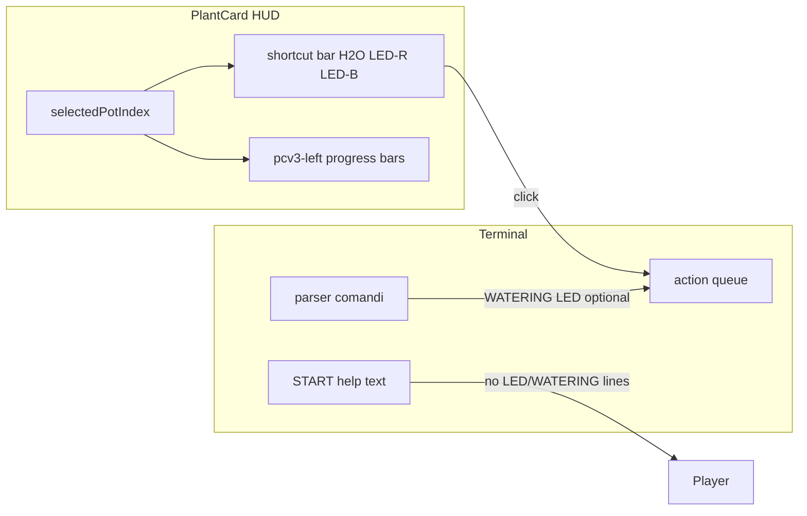

# Terminal Pot + PlantCard v3 — riordino comandi, shortcut H2O/LED, progress bar

## Il ragionamento ti torna: sì

- **Separazione frequenza d’uso**: acqua e LED sono toggle ripetuti; ha senso toglierli dall’help principale e metterli **a portata di mano** sulla card del pot attivo, mentre **PLANT / UPROOT / HARVEST / SPRAY / FERTILIZE / PRUNE** restano flussi più “a intenzione”.
- **Coerenza con il codice attuale**: il terminale già distingue azioni **0 AP** incluse nel flow PLANT da quelle a costo ([commento su ApCost](d:/Sporae_Build_Beta/Assets/_Project/Scripts/UI/UIToolkit/PlantCardV3/PlantCardV3TerminalController.cs) ~1743); i toggle possono **riusare le stesse code/handler** dei comandi oggi esistenti.
- **Pot di riferimento**: esiste già `**_selectedPotIndex`** e `**RefreshHudFromSelectedPot()`** ([stesso file](d:/Sporae_Build_Beta/Assets/_Project/Scripts/UI/UIToolkit/PlantCardV3/PlantCardV3TerminalController.cs) ~2012+): la barra shortcut deve aggiornarsi quando cambia il pot selezionato (POT-001…004), come i mock.

**Scelta confermata**: **mantenere il parsing** di `WATERING` / `LED RED` / `LED BLUE` se digitati; toglierli solo dall’elenco `START` e aggiornare i messaggi guida che oggi citano solo il comando testuale.

---

## 1. Testo `START` e alias LINEE GUIDA

**File principale**: `[PlantCardV3TerminalController.cs](d:/Sporae_Build_Beta/Assets/_Project/Scripts/UI/UIToolkit/PlantCardV3/PlantCardV3TerminalController.cs)` (blocco ~5296–5325).

- Riscrivere le sezioni nell’ordine richiesto:
  - **GESTIONE PIANTE NEL POT**: `LINEE GUIDA` (descrizione: protocollo DOME_02), `PLANT`, `UPROOT`, `HARVEST`
  - **MONITORAGGIO VASI**: `STATUS`, `NOTE`
  - **OPERAZIONI COLTIVAZIONI**: `SPRAY`, `FERTILIZE`, `PRUNE` (nessuna riga `WATERING` / `LED RED` / `LED BLUE`)
  - **CRYO MACHINE (SLOT PASSIVI)**: invariato (testi attuali)
  - **CONTROLLI SISTEMA**: come oggi **senza** riga `PROTOCOL` (spostato sopra come `LINEE GUIDA`)

**Alias comando**: nel parser (dove oggi c’è `PROTOCOL`, es. ~4005 e contesto ~3699), accettare anche `**LINEE GUIDA`** (e opzionalmente `**GUIDA`**) che chiamano lo stesso handler di `PROTOCOL`, così il giocatore può digitare il nome nuovo senza rompere script/automazioni che usano ancora `PROTOCOL`.

**Prompt welcome**: aggiornare la riga che invita a digitare `PROTOCOL` (~2484) per puntare a `**LINEE GUIDA`** (e una riga dim che `PROTOCOL` resta alias).

**Messaggi che oggi citano solo `WATERING` / `LED`**: cercare e aggiornare stringhe tipo ~3491, ~3499, ~5632 (e simili) per dire **“usa la barra sotto la scheda pot / scorciatoie H2O e LED”** e, se utile, **“oppure comando WATERING / LED …”** per power user.

---

## 2. Barra shortcut sotto `pcv3-center`

**Modello interazione** (allineato a `[terminal_pot_plantcard_v3_decisions.plan.md](d:/Sporae_Build_Beta/.cursor/plans/terminal_pot_plantcard_v3_decisions.plan.md)`):

- I tre toggle **non** accodano al click: modificano solo uno **staging** locale (ON/OFF obiettivo per H2O, LED-R, LED-B).
- Il pulsante `**✓ CONFERMA MODIFICHE (1 AP)`** (copy mock EN: `CONFIRM CHANGES`) **accoda in un colpo** il batch **WAT+LED** con **ApCost 1** per quel blocco; esecuzione come oggi **alla chiusura del terminale**. AP **additivi** con altre voci in coda.

**Layout (mock)** — tre fasce verticali nel blocco:

1. **Header** (sfondo verde, testo nero): sinistra **PotId**, destra **nome pianta**.
2. **Area toggle** (sfondo scuro): label ciano `[H2O]`, `[LED-R]`, `[LED-B]`; sotto, chip **ON** (verde) / **OFF** (rosso) per lo staging.
3. **Pulsante conferma** (full width, **ambra/arancio**, testo nero, glow leggero): vedi §6 nel file decisioni.

**UXML**: `[PlantCardV3_Terminal.uxml](d:/Sporae_Build_Beta/Assets/_Project/UI/UIToolkit/PlantCardV3/PlantCardV3_Terminal.uxml)` — contenitore figlio di `pcv3-center` con `name` stabili per header, tre toggle, `Button` conferma (placeholder visibile in UI Builder).

**USS**: `[PlantCardV3_Terminal.uss](d:/Sporae_Build_Beta/Assets/_Project/UI/UIToolkit/PlantCardV3/PlantCardV3_Terminal.uss)` — classi per header verde, toggle ON/OFF, pulsante ambra (niente glow solo inline sul campione).

**Codice**: `[PlantCardV3TerminalController.cs](d:/Sporae_Build_Beta/Assets/_Project/Scripts/UI/UIToolkit/PlantCardV3/PlantCardV3TerminalController.cs)`:

- Staging in memoria per pot selezionato; all’apertura / cambio pot: inizializza staging da `PotStateModel` + eventuale stessa logica vincoli LED famiglia.
- Click conferma: validazioni come `BeginConfirmToggleAction`, poi **enqueue singola voce** (o tipo nuovo) che materializza il delta H2O+LED con **ApCost 1**; messaggio console opzionale eco “in coda” come altre azioni.
- `RefreshHudFromSelectedPot`: aggiorna header, reset/sync staging quando cambia selezione.

**Stati edge**: pot vuoto → barra **visibile disabilitata** + tooltip (decisione congelata); LED non ammesso → toggle disabilitato.

---

## 3. `pcv3-left`: da testo a progress bar

**Obiettivo**: sostituire i “trattini” con **barre di riempimento** per idratazione, stress luce, pH drift (colore banda), growth, ecc., come nei mock.

**Approccio** (allineato a regola UI Builder):

- In **UXML**: righe con `VisualElement` fill + sfondo (struttura stabile con `name` per ogni barra)
- In **USS**: larghezze, altezze, colori “di marca”; eventuali colori **dato-dipendenti** solo da C# (come già fatto per pH altrove)
- In **C#**: in `RefreshVitalBlocks` / metodo dedicato, impostare `width` in `%` o `flexGrow` sulla parte “fill” in base a percentuali già calcolate (idratazione %, stress %, ecc.)

File coinvolti: `[PlantCardV3_Terminal.uxml](d:/Sporae_Build_Beta/Assets/_Project/UI/UIToolkit/PlantCardV3/PlantCardV3_Terminal.uxml)`, `[PlantCardV3_Terminal.uss](d:/Sporae_Build_Beta/Assets/_Project/UI/UIToolkit/PlantCardV3/PlantCardV3_Terminal.uss)`, `[PlantCardV3TerminalController.cs](d:/Sporae_Build_Beta/Assets/_Project/Scripts/UI/UIToolkit/PlantCardV3/PlantCardV3TerminalController.cs)`.

---

## Flusso dati (sintesi)

---

## Verifica manuale suggerita

- `START`: ordine sezioni e assenza di WATERING/LED in elenco; `LINEE GUIDA` e `PROTOCOL` entrambi funzionanti.
- Barra: cambio pot → etichette e stati ON/OFF corretti; click → stesso effetto dei comandi (e stessi messaggi errore).
- Pot vuoto / LED vietato: UI non permette azioni illegali.
- Progress bar: valori coerenti con `STATUS`/stato reale durante Play.

