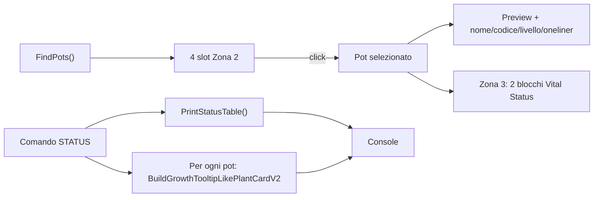

# Piano: TerminalPot HUD Zona 2 e Zona 3 + STATUS conditions + posizionamento

## Contesto attuale

- **Layout**: [PlantCardV3_Terminal.uxml](Assets/_Project/UI/UIToolkit/PlantCardV3/PlantCardV3_Terminal.uxml) ha `pcv3-body` con `pcv3-left` (nascosto) e `pcv3-right` (terminale CRT). Solo la Zona 1 (terminale) è collegata al gioco.
- **Dati**: Il controller [PlantCardV3TerminalController.cs](Assets/_Project/Scripts/UI/UIToolkit/PlantCardV3/PlantCardV3TerminalController.cs) espone già `FindPots()`, `FindPotById()`, popolamento stat (linee 1506–1604), preview da `pot.transform.Find("WindowContent")` / `SpriteRenderer`, e `BuildGrowthTooltipLikePlantCardV2` (equivalente al tooltip `conditions_badge` di PlantCard2v).
- **STATUS**: `PrintStatusTable()` (circa 3566–3608) stampa la tabella ID/Stato/Nome/Stadio/Cond/Idr; non include ancora il testo del tooltip conditions per pot.

---

## 1. Layout a 3 zone (UXML + USS)

- **Zona 1 (destra)**: lasciare `pcv3-right` com’è (terminale + input).
- **Zona 2 (centro)**: aggiungere un nuovo contenitore `pcv3-center` in `pcv3-body` tra `pcv3-left` e `pcv3-right`, contenente:
  - **Preview pianta**: `VisualElement` per l’immagine. Stesso **sistema** di cambio immagine dei pot in Dome Room (stadio + condizione + specie → quale sprite), ma **set di immagini dedicato** stile incubator (vedi sezione 2).
  - **Metadata**: nome pianta, codice (badge famiglia), livello, one-liner (descrizione) — tutti dati già usati in `PopulatePotCard` (titolo, badge, livello, desc).
  - **4 slot POT**: 4 box cliccabili (es. `pcv3-hud-pot-slot-0` … `pcv3-hud-pot-slot-3`) che rappresentano i primi 4 pot restituiti da `FindPots()` (ordinati per PotId).
- **Zona 3 (sinistra)**: riusare `pcv3-left` ma cambiare contenuto: rimuovere la `ScrollView` con la lista di pot card e inserire **due contenitori “Vital Status”** (es. `pcv3-vital-stats-block-1` e `pcv3-vital-stats-block-2`), ognuno con le stesse righe di [pcv3-potcard-stats](Assets/_Project/UI/UIToolkit/PlantCardV3/PlantCardV3_Terminal.uxml) (STADIO, LIVELLO, CONDIZIONE, pH AFFINITY, pH DRIFT, GROWTH, separatore, IDRATAZIONE, STRESS LUMINOSO). Suddivisione suggerita: blocco 1 = prime 4–5 righe (fino al separatore o poco dopo), blocco 2 = righe restanti, in modo da riempire i due spazi del frame dell’allegato.

Risultato: con TerminalPot aperto si vedono le 3 aree come nell’allegato; Zona 2 e Zona 3 sono visibili e utilizzabili.

---

## 2. Logica Zona 2 (controller)

- **Binding 4 POT**: All’apertura (e refresh periodico se necessario) mappare i primi 4 elementi di `FindPots()` agli slot `pcv3-hud-pot-slot-0` … `3`. Per ogni slot: se il pot non c’è o è vuoto, nella **preview** mostrare un’**immagine dedicata “status vuoto”** (sprite/asset), non testo né area vuota; altrimenti indicatore del pot (es. PotId o miniatura) e click handler.
- **POT selezionato**: Mantenere uno stato `_selectedPotIndex` (0–3) o `_selectedPotId`. Al click su uno slot:
  - aggiornare la preview della pianta (stesso criterio di crescita/stadio di PotWindow, estetica “incubator”);
  - aggiornare nome, codice, livello, one-liner;
  - aggiornare Zona 3 (vedi sotto).
- **Sistema cambio immagine (come Dome Room, set diverso)**: La preview in Zona 2 deve usare **lo stesso sistema** di cambio immagine dei pot in vista Dome Room: lo **stadio** (`PotStateModel.Stage`), la **condizione** (es. Morta) e eventualmente la **specie** determinano quale immagine mostrare (stessa logica di [PotGrowthController.ResolveBaseSprite](Assets/_Project/Scripts/Dome/PotSystem/Growth/PotGrowthController.cs): Empty/Seed/Sprout/Growth-Resting/Flowering/HarvestReady + Morta). In Zona 2 si usa però un **set di immagini dedicato** (stile incubator/terminal), non gli stessi sprite della vista Dome Room. Implementazione: introdurre una config o set di asset per gli sprite “incubator” (es. ScriptableObject tipo `TerminalPotPreviewConfig` con empty/seed/sprout/dead + eventuale per-specie adult/flowering per il terminale), e nel controller risolvere lo sprite per la preview con la stessa logica a rami di `ResolveBaseSprite` ma leggendo da questo set. Pot vuoto → immagine “status vuoto” (già in 3b).

---

## 3. Logica Zona 3 (controller)

- **Due blocchi Vital Status**: Popolare `pcv3-vital-stats-block-1` e `pcv3-vital-stats-block-2` con le stesse label/valori e classi colore usate in `PopulatePotCard` per `pcv3-potcard-stats` (linee 1554–1603). La sorgente dati è il pot **selezionato** in Zona 2 (o il primo pot se nessuna selezione).
- **Sincronizzazione**: Ogni volta che si seleziona un pot in Zona 2, richiamare la stessa logica di aggiornamento delle due stat block con lo stato di quel pot (e PlantData). Se il pot è vuoto, mostrare placeholder “---” o “VUOTO” nelle stat (Zona 3); nella preview (Zona 2) si usa l’immagine “status vuoto” (vedi sotto).

---

## 3b. Clarificazioni (pot vuoto)

- **Preview (Zona 2) – pot vuoto**: mostrare sempre un’**immagine “status vuoto”** (sprite/asset dedicato) nella preview, mai area vuota o testo placeholder. Serve un asset referenziabile dal controller (es. `Sprite` o texture in USS).
- **Terminale – comandi su pot vuoto**: **nessun cambiamento**. Quando l’utente lancia un comando che riguarda un pot vuoto (OPEN, FORECAST, ecc.), continuare a mostrare **i messaggi già esistenti** oggi; non introdurre nuovi testi.

---

## 4. Comando STATUS esteso

- **Comportamento**: Dopo l’output attuale di `PrintStatusTable()` (tabella riepilogo), aggiungere una sezione “per pot” con il testo del tooltip **conditions_badge** (stessi dati e testi di PlantCard2v).
- **Implementazione**: Per ogni pot (o almeno per i 4 pot della HUD) stampare un’intestazione tipo `--- POT-001 ---` e poi il risultato di `BuildGrowthTooltipLikePlantCardV2(state, plantData)`. Il metodo esiste già in [PlantCardV3TerminalController.cs](Assets/_Project/Scripts/UI/UIToolkit/PlantCardV3/PlantCardV3TerminalController.cs) (2274–2392 circa); va solo invocato per ogni pot e aggiunto al buffer della console (gestendo i tag colore/rich text già usati dal terminale).
- **Formato**: Mantenere gli stessi paragrafi e righe (Condizione, Effetti sulla pianta, Acqua/Luce/Fertilizzante, giorni mancanti, ecc.) come nel tooltip; adattare se necessario i tag §TITLE§/§DATA§/§ERROR§ del terminale per coerenza visiva.

---

## 5. Posizionamento trascinabile e persistente (Zona 2 e Zona 3)

- **Requisito**: Ogni “gruppo” di elementi in Zona 2 e Zona 3 deve essere spostabile sulla HUD per centrarlo nello spazio, come fatto per l’area 3 del terminal pot.
- **Gruppi da rendere trascinabili**:
  - **Zona 2**: (1) blocco preview + metadata + 4 slot POT come un unico gruppo, oppure sottogruppi (es. “preview + metadata” e “4 slot”) se preferisci granularità.
  - **Zona 3**: i due blocchi Vital Status (blocco 1 e blocco 2) come due gruppi indipendenti.
- **Meccanica**: Per ogni gruppo, usare un contenitore con `position: absolute` e trascinamento tramite mouse (MouseDown su un “handle” o sul bordo del gruppo, MouseMove per aggiornare `left`/`top`, MouseUp per rilasciare). Salvataggio posizioni in **PlayerPrefs** (es. chiavi `Sporium_TerminalPot_Zona2_Group`_*, `Sporium_TerminalPot_Zona3_Block1`, `_Zona3_Block2`) con coordinate relative al contenitore padre o alla finestra, e caricamento all’apertura del TerminalPot.
- **Riferimento “area 3”**: Se nel progetto esiste già un sistema di posizionamento per “area 3” del terminal (es. `pcv3-inner` con left/top/right/bottom modificabili o salvate), riusare lo stesso pattern (load/save + coordinate) per i nuovi gruppi; altrimenti implementare drag + PlayerPrefs come sopra.

---

## 6. File da modificare / toccare

| File                                                                                                                  | Modifiche                                                                                                                                                                                                                                                                                            |
| --------------------------------------------------------------------------------------------------------------------- | ---------------------------------------------------------------------------------------------------------------------------------------------------------------------------------------------------------------------------------------------------------------------------------------------------- |
| [PlantCardV3_Terminal.uxml](Assets/_Project/UI/UIToolkit/PlantCardV3/PlantCardV3_Terminal.uxml)                       | Aggiungere `pcv3-center` con preview, metadata, 4 slot; sostituire contenuto di `pcv3-left` con i due blocchi Vital Status.                                                                                                                                                                          |
| [PlantCardV3_Terminal.uss](Assets/_Project/UI/UIToolkit/PlantCardV3/PlantCardV3_Terminal.uss)                         | Stili per center, slot POT, due vital blocks; stile “incubator” per preview; classi per gruppi trascinabili.                                                                                                                                                                                         |
| [PlantCardV3TerminalController.cs](Assets/_Project/Scripts/UI/UIToolkit/PlantCardV3/PlantCardV3TerminalController.cs) | Mostrare `pcv3-left` e `pcv3-center`; binding 4 POT, selezione, refresh preview (stesso sistema Dome: stage/condizione/specie → sprite da set incubator) + metadata e Zona 3; estensione `PrintStatusTable` con tooltip conditions per pot; load/save posizioni + drag per i gruppi Zona 2 e Zona 3. |
| Config/asset set incubator (nuovo, es. `TerminalPotPreviewConfig` o simile)                                           | ScriptableObject (o asset) con sprite per Empty/Seed/Sprout/Dead + opzionale per-specie adult/flowering per la preview Zona 2; referenziato dal controller per risolvere l’immagine come in `PotGrowthController.ResolveBaseSprite` ma dal set incubator.                                            |

---

## 7. Diagramma flusso dati (sintetico)

---

## 8. Ordine di implementazione suggerito

1. UXML/USS: layout a 3 zone, center con 4 box e due blocchi Vital Status.
2. Controller: binding 4 POT, stato “pot selezionato”, refresh preview + metadata + Zona 3 al click.
3. STATUS: append del tooltip conditions per ogni pot dopo la tabella.
4. Posizionamento: drag dei gruppi + salvataggio/caricamento PlayerPrefs per Zona 2 e Zona 3.

Tutto quanto descritto è allineato a quanto richiesto: Zona 2 come HUD con 4 POT cliccabili e preview/metadata, Zona 3 con dati pcv3-potcard-stats in due parent, aggiornamento Zona 3 al click su un POT, STATUS con condizioni divise per pot, e elementi spostabili e persistenti.