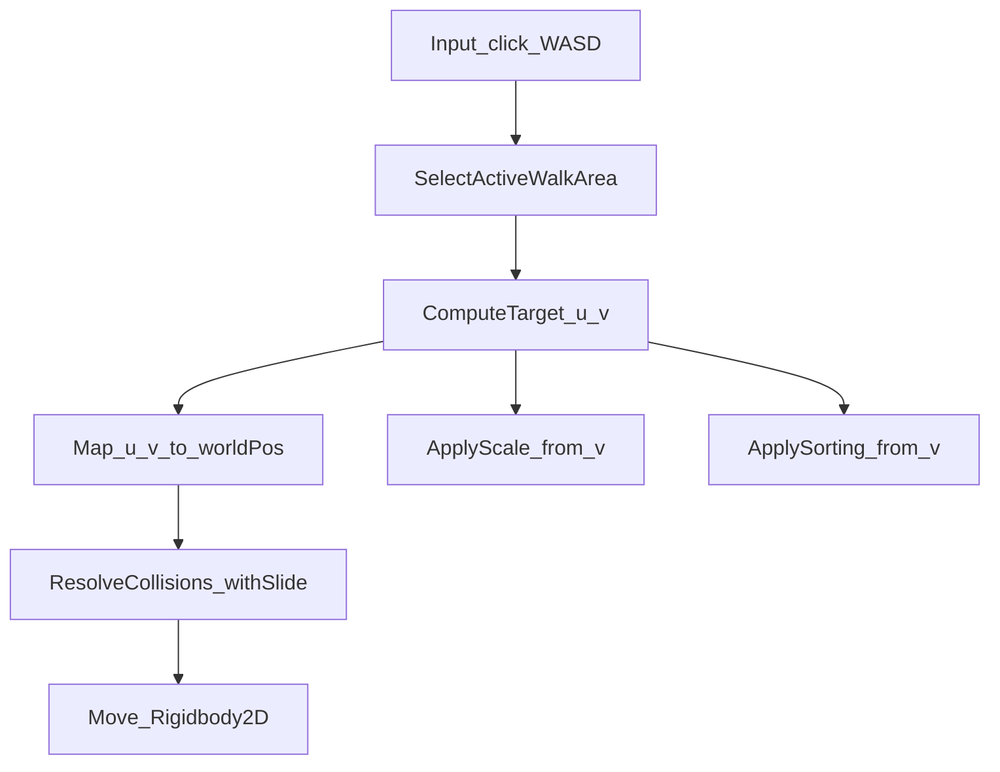

# Piano: VaultMap 2.5D (Opzione B Trapezio + Colliders + Slide)

## Obiettivo
- Consentire al **player** di muoversi “in profondità” dentro stanze con prospettiva **senza passare a una mappa 3D**, restando su **camera ortografica + fisica 2D**.
- Aggiungere **limitazioni fisiche** con collider: 
  - **muri/wall** (es. linee verticali come nel tuo screenshot)
  - **oggetti non calpestabili** (es. letto)
  - con comportamento **slide lungo il bordo**.
- Target: scena `Assets/_Project/Scenes/SCN_VaultMap.unity`.

## Vincoli/Assunzioni del setup attuale (da rispettare)
- Camera gestita da Cinemachine (Virtual Camera) in ortografico.
- Player: `PLY_Player` ha già `Rigidbody2D` + `CapsuleCollider2D` (da `Assets/_Project/Docs/SceneHierarchy.txt`).
- Movimento attuale: `Assets/_Project/Scripts/Player/PlayerClickMover2D.cs`.
- Approccio **non distruttivo**: aggiungere componenti/oggetti nuovi; evitare refactor ampi.

## Architettura (workaround 2.5D)
- **WalkArea trapezoidale** definita da 4 corner (NearLeft, NearRight, FarLeft, FarRight).
- Movimento del player in coordinate logiche:
  - \(u\) = sinistra/destra (0..1)
  - \(v\) = vicino/lontano (0..1)
- Mappatura \((u,v)\) → world position tramite interpolazione bilineare dei 4 corner.
- **Scala dinamica** del player in funzione di \(v\) (lontano più piccolo).
- **Sorting dinamico** del player in funzione di \(v\) (o Y) per simulare occlusione.
- **Collisioni**: dopo la mappatura in world, applicare un passo di **collision + slide** contro collider solidi (wall + blocker arredi).

## WalkArea: per stanza (richiesta)
- In VaultMap ci sono più “room” (es. `ROOM_Bed`, `ROOM_Dome`, ecc.).
- Ogni stanza avrà la sua WalkArea trapezoidale.
- Il player userà la WalkArea “attiva”:
  - **automatica** quando entra nella stanza (trigger/collider di area)
  - e/o **in base al click** (se clicchi dentro un’altra stanza, selezioniamo la WalkArea relativa al punto cliccato).

## Componenti da aggiungere (nuovi script)
### `Assets/_Project/Scripts/World/VaultMap/PerspectiveWalkArea2D.cs`
- Serializza 4 `Transform` corner.
- (Opzionale ma consigliato) Un `Collider2D` “AreaBounds” in trigger per aiutare a scegliere la walkarea.
- API:
  - `Vector2 MapToWorld(float u, float v)`
  - `bool TryProjectWorldToUV(Vector2 world, out Vector2 uv)` (per click-to-move e per riallineare UV dopo slide)
  - `bool ContainsUV(Vector2 uv)` (clamp/validazione)
- Gizmos: disegna trapezio e griglia per debug.

### `Assets/_Project/Scripts/Player/PlayerPerspectiveMover2D.cs`
- Dipendenze: `Rigidbody2D`, `CapsuleCollider2D` (o comunque `Collider2D`), riferimento a `PerspectiveWalkArea2D`.
- Input:
  - Click: sceglie walkarea in base al punto click e converte punto click in \(u,v\).
  - WASD/analog: modifica \(u,v\) con velocità costanti.
- Movimento:
  - Calcola `desiredWorld = MapToWorld(u,v)`.
  - Applica `ResolveCollisions_withSlide(desiredWorld)` contro layer dei blocker/wall.
  - Muove con `Rigidbody2D.MovePosition`.
- Compatibilità:
  - Opzioni per disabilitare input click e/o input WASD.

### `Assets/_Project/Scripts/Player/PlayerDepthScaleAndSort.cs`
- Applica:
  - `transform.localScale = Mathf.Lerp(scaleNear, scaleFar, v)`
  - `spriteRenderer.sortingOrder = baseOrder + Mathf.RoundToInt(v * range)`
- Supporta `SpriteRenderer` sul child `Sprite`.

### `Assets/_Project/Scripts/Player/PlayerMoverRouter2D.cs`
- Scopo: evitare conflitti tra mover.
- In scena VaultMap:
  - se `PlayerPerspectiveMover2D` è presente/attivo, chiama `PlayerClickMover2D.SuspendMovement(true)`.
  - altrimenti `SuspendMovement(false)`.
- Così **non serve** rimuovere/disabilitare manualmente `PlayerClickMover2D`.

### Nota: `PlayerAnimator`
- `Assets/_Project/Scripts/Player/PlayerAnimator.cs` oggi ha `[RequireComponent(typeof(PlayerClickMover2D))]`.
- Per evitare accoppiamento, nel rollout aggiorneremo `PlayerAnimator` a richiedere solo `Rigidbody2D` (o nessun mover), perché l’animazione usa già `Rigidbody2D.velocity`.

## Collider (muri + blocker arredi)
- Layer consigliati:
  - `Walkable` (opzionale) per validare i click a terra
  - `WalkBlocker` per muri e ostacoli solidi (letto)
- Muri (come le linee gialle): usare `EdgeCollider2D` (due punti) per linee semplici e veloci.
- Ostacoli volumetrici (letto): usare `PolygonCollider2D` o `BoxCollider2D` sagomato sull’ingombro “a terra”.

## Operazioni manuali (beginner, COMPLETE)
### A) Setup WalkArea per stanza
1. Apri la scena `Assets/_Project/Scenes/SCN_VaultMap.unity`.
2. Per ogni stanza (es. `ROOM_Bed`, `ROOM_Dome`, `ROOM_Refrigerated`, `ROOM_Visitor`):
   - Crea un GameObject vuoto sotto la stanza chiamato `WalkAreaPerspective`.
   - Crea 4 child (solo Transform):
     - `NearLeft`, `NearRight`, `FarLeft`, `FarRight`.
   - Posiziona i 4 corner sugli angoli del pavimento della stanza:
     - `Near*` verso la camera (parte bassa della stanza)
     - `Far*` verso il fondo (parte alta della stanza)
   - Aggiungi lo script `PerspectiveWalkArea2D` su `WalkAreaPerspective`.
   - Assegna i 4 Transform nei campi dello script.
   - (Consigliato) Aggiungi un `BoxCollider2D` o `PolygonCollider2D` su `WalkAreaPerspective` e imposta **Is Trigger = ON**:
     - questo collider definisce “l’area della stanza” per scegliere la walkarea su click/ingresso.

### B) Setup collider per limitare il player (wall + letto)
1. Crea un GameObject vuoto `WalkColliders` (può essere globale in root, oppure per stanza).
2. **Muri verticali** (come segnato in giallo nello screenshot):
   - Crea child tipo `WALL_Left`, `WALL_Right`, `WALL_Split_01`.
   - Aggiungi `EdgeCollider2D`.
   - Modifica i 2 punti dell’EdgeCollider2D per farli coincidere con la linea gialla (alto/basso).
   - Metti **Is Trigger = OFF**.
   - Assegna il layer `WalkBlocker`.
3. **Letto / oggetti non calpestabili**:
   - Crea child `BLK_Bed`.
   - Aggiungi `PolygonCollider2D` (o `BoxCollider2D`).
   - Sagoma il collider seguendo l’ingombro “a terra” del letto.
   - Metti **Is Trigger = OFF**.
   - Assegna il layer `WalkBlocker`.
4. Project Settings → Physics 2D:
   - Verifica che il layer del player collida con `WalkBlocker`.

### C) Setup player
1. Seleziona `PLY_Player`.
2. Verifica che abbia già:
   - `Rigidbody2D`
   - `CapsuleCollider2D`
3. Aggiungi componenti:
   - `PlayerPerspectiveMover2D`
   - `PlayerDepthScaleAndSort`
   - `PlayerMoverRouter2D`
4. In `PlayerDepthScaleAndSort`:
   - assegna lo `SpriteRenderer` corretto (tipicamente sul child `Sprite`).
   - imposta `scaleNear/scaleFar`, `baseOrder/range`.
5. In `PlayerPerspectiveMover2D`:
   - assegna la walkarea iniziale (es. quella della stanza di spawn) oppure lascia vuoto se implementiamo selezione automatica su trigger.
   - imposta il `LayerMask` per `WalkBlocker`.

### D) Test & tuning
1. Premi Play.
2. Prova:
   - WASD/analog: micro-movimento laterale + profondità.
   - Click: movimento verso punto calpestabile nella stanza.
3. Se il player “entra” nel letto: aumenta/aggiusta il collider `BLK_Bed`.
4. Se il player si blocca “brutto” contro il muro: controlla che i collider siano **Trigger OFF** e che il layer `WalkBlocker` collida col player.
5. Tuning prospettiva:
   - sposta i corner `Near/Far` finché il movimento in profondità sembra naturale.
   - ritocca `scaleNear/scaleFar` e sorting.

## Occlusioni con arredi (fase 2 opzionale)
- Se serve che il player vada dietro “front layer” (scrivania, letto):
  - separare sprite in layer `Front` (sorting più alto) e `Back`, oppure
  - trigger 2D che modifica lo `sortingOrder` del player.

## Validazione / Criteri di Done
- Il player può avanzare e arretrare (asse \(v\)) in modo credibile nelle stanze.
- La scala del player varia coerentemente con la profondità.
- Il player **non attraversa** muri e ostacoli (letto) e **scivola lungo i bordi**.
- Nessuna regressione evidente su camera Cinemachine e UI.

## Rischi e rollback
- **Rischio**: conflitto con `PlayerClickMover2D` (due mover attivi).
  - **Mitigazione**: `PlayerMoverRouter2D` che sospende `PlayerClickMover2D` in VaultMap.
- **Rischio**: `PlayerAnimator` richiede `PlayerClickMover2D`.
  - **Mitigazione**: aggiornare `PlayerAnimator` per non dipendere dal mover.